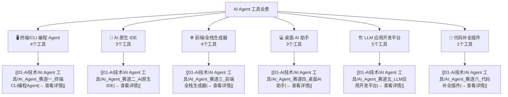
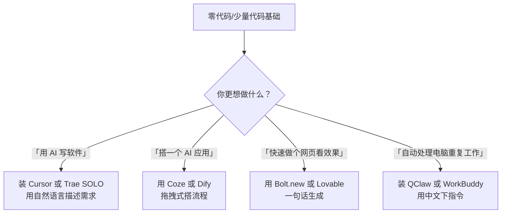
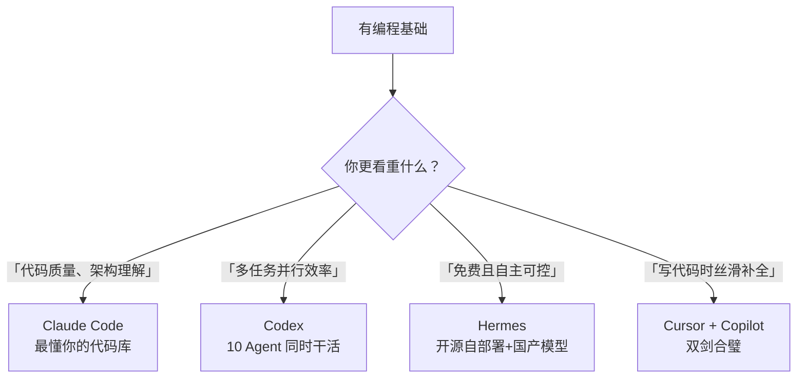
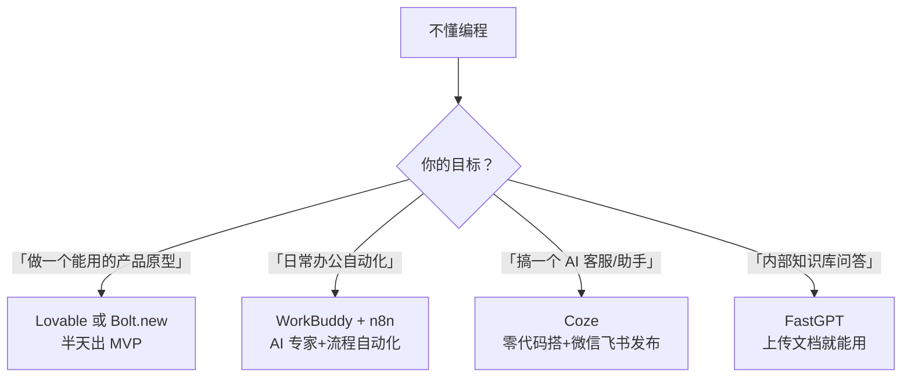

# AI Agent 工具全景对比 — MOC（中枢索引）

> [!abstract] 怎么用这篇笔记
> 这是 AI Agent 工具的 **MOC（Map of Content，内容地图）**。总览、对比、决策都在这；每个工具的详细拆解在子笔记里，点击链接即可跳转。Obsidian 图谱视图能看到完整的网状结构。**零代码基础也能看懂——每个陌生词汇都会用大白话解释。**

---

## 一、六大赛道速览

| 赛道 | 核心问题 | 涉及工具 | 详情 |
|---|---|---|---|
| 🖥️ **命令行工具（在黑色窗口里打字操作）** | AI 自己规划、写代码、跑测试 | Claude Code、Codex、Hermes、Devin | [[01-AI技术/AI Agent 工具/AI_Agent_赛道一_终端CLI编程Agent|→]] |
| 🧩 **写代码的软件（IDE，类似程序员专用的 Word）** | 用 AI 增强的开发环境写项目 | Cursor、Windsurf、Trae SOLO | [[01-AI技术/AI Agent 工具/AI_Agent_赛道二_AI原生IDE|→]] |
| 🌐 **前端/全栈生成器** | 一句话/一张图生成完整应用 | v0.dev、Bolt.new、Lovable、Replit Agent | [[01-AI技术/AI Agent 工具/AI_Agent_赛道三_前端全栈生成器|→]] |
| 💻 **桌面 AI 助手** | AI 操控电脑、处理文件 | QClaw、WorkBuddy、Marvis | [[01-AI技术/AI Agent 工具/AI_Agent_赛道四_桌面AI助手|→]] |
| 🏗️ **LLM 应用开发平台** | 搭 AI 应用/工作流给别人用 | Dify、Coze、n8n、FastGPT、RAGFlow | [[01-AI技术/AI Agent 工具/AI_Agent_赛道五_LLM应用开发平台|→]] |
| 🔌 **代码补全插件** | 写代码时自动补全建议 | GitHub Copilot | [[01-AI技术/AI Agent 工具/AI_Agent_赛道六_代码补全插件|→]] |

---

## 二、核心差异对比总表

### 编程类：CLI Agent & AI IDE & 插件

| 维度 | Claude Code | Codex | Hermes | Devin | Cursor | Windsurf | Trae SOLO | Copilot |
|---|---|---|---|---|---|---|---|---|
| 🔧 子类型 | CLI | CLI | CLI | CLI | IDE | IDE | IDE | 插件 |
| 🏢 厂商 | Anthropic | OpenAI | Nous | Cognition | Anysphere | Codeium | 字节 | GitHub/MS |
| 💰 入门价 | \$100/月 | \$20/月 | 免费 | 企业询价 | 免费+\$20 | 免费+付费 | ==免费== | \$10/月 |
| 🌍 国内直连 | ✗ | ✗ | 可配国产 | ✗ | 可配代理 | 可配代理 | ==✅== | 可配代理 |
| 📈 上手难度 | ★★★★ | ★★ | ★★★★ | ★★★ | ★★★ | ★★★ | ★★★ | ★★ |
| 🔓 开源 | ✅ | ❌ | ✅ | ❌ | ❌ | ❌ | ❌ | ❌ |
| 🔀 多 Agent | ❌ | ✅ 10 | ✅ MoA | ✅ | ✅ | ✅ | ✅ | ✅ |
| 📝 记忆 | ★★★★★ | ★★★ | ★★★★★ | ★★★ | ★★★ | ★★★ | ★★★ | ★★ |
| 🎯 卖点 | 深度理解 | 10 Agent 并行 | 自进化开源 | 端到端自主 | Vibe Coding 标配 | 最流畅体验 | 免费+中文 | 补全鼻祖 |

### 生成器类

| 维度 | v0.dev | Bolt.new | Lovable | Replit Agent |
|---|---|---|---|---|
| 🎨 强项 | React 组件 | 全栈应用 | UI 美观 | 云端全栈 |
| 🖥️ 运行 | 浏览器 | 浏览器（内置 Node） | 浏览器 | 云端 IDE |
| 💰 入门 | 免费额度 | 免费额度 | 免费额度 | 免费+\$25/月 |
| 🎯 最适合 | 前端组件 | 全栈原型 | MVP | 零环境配置 |

### 平台类

| 维度 | Dify | Coze | n8n | FastGPT | RAGFlow |
|---|---|---|---|---|---|
| 🎨 强项 | 工作流+Agent | 零代码+多平台 | 自动化+400连接器 | 知识库问答 | 复杂文档理解 |
| 🔓 开源 | ✅ | ❌ | ✅ | ✅ | ✅ |
| 📈 低代码度 | ★★★ | ★★★★★ | ★★★ | ★★★ | ★★ |
| 🎯 最适合 | 灵活搭AI应用 | 零代码发布 | 自动化流程 | 智能客服 | 合同/财报解析 |

---

## 三、按身份决策

> 如果你刚接触 AI 工具，直接看 3.1「零基础学习者」。点工具名可以跳转看详细介绍。

### 🎓 零基础学习者

### 👨‍💻 专业程序员

### 🧑‍💼 非技术职场人 / 创业者

---

## 四、场景速查

### 4.1 零基础 Vibe Coder

| 需求 | 推荐 | 理由 |
|---|---|---|
| 装 IDE 开始写代码 | **Trae SOLO** / **Cursor** | Trae 免费+中文；Cursor 最成熟 |
| 浏览器直接开始 | **Codex**（\$20/月）/ **Bolt.new** | 零安装 |
| 免费开源方案 | **Hermes** + 国产模型 | 零成本 |
| 快速做产品原型 | **Lovable** / **Bolt.new** | 一句话出应用 |
| 长期项目 | **Claude Code** / **Cursor** | 持久记忆 |

### 4.2 搭 AI 应用（不写代码）

| 需求 | 推荐 |
|---|---|
| 完全零代码搭聊天机器人 | **Coze** |
| 灵活编排复杂 AI 工作流 | **Dify** |
| 打通各种在线办公软件（飞书、钉钉等） | **n8n** |
| 做私有知识库问答 | **FastGPT** |
| 复杂文档（合同/财报）解析 | **RAGFlow** |

### 4.3 HR+AI 探索

| HR 场景 | 推荐工具/方式 |
|---|---|
| 智能简历筛选+自动回复 | **Dify**（简历解析→匹配打分→邮件） |
| HR 知识库（政策问答、标准操作流程（SOP）） | **FastGPT** / **Dify RAG** |
| HR 流程自动化（入职→审批→通知） | **n8n**（OA+飞书+邮件+HR 系统） |
| 合同/JD 风险条款分析 | **RAGFlow** |
| 自己写 HR 工具 | **Cursor** / **Trae SOLO**（Vibe Coding） |
| 日常办公 AI 提效 | **WorkBuddy** / **Marvis** |

---

## 五、全工具速记卡

> 下面是快速复习卡，建议先看完对应子笔记再回来刷。每个工具都标注了「在哪用」（网页/桌面软件/命令行窗口）。

| 工具 | 一句话 | 记忆密码 |
|---|---|---|
| **Claude Code** | 最懂你代码库的 AI 工程师 | 🔑 深度 |
| **Codex** | 最多线程的 AI 编程团队 | 🔑 并行 |
| **Hermes** | 开源界的 Claude Code，越用越聪明 | 🔑 进化 |
| **Devin** | 第一个会自己学新技术的 AI 程序员 | 🔑 自主 |
| **Cursor** | Vibe Coder 人手一个的 AI IDE | 🔑 标配 |
| **Windsurf** | 体验最流畅的 AI IDE | 🔑 流畅 |
| **Trae SOLO** | 字节出品，免费+中文，国内直连 | 🔑 免费 |
| **v0.dev** | Vercel 出品，生成 React 组件一键部署 | 🔑 组件 |
| **Bolt.new** | 浏览器里跑全栈，后端也能搞 | 🔑 全栈 |
| **Lovable** | 做出来的最好看，MVP 神器 | 🔑 颜值 |
| **Replit Agent** | 云 IDE+AI，零环境配置 | 🔑 云端 |
| **QClaw** | 微信遥控电脑，20 秒安装 | 🔑 遥控 |
| **WorkBuddy** | 150 个 AI 行业专家任你召唤 | 🔑 专家 |
| **Marvis** | OS 级 AI 管家，像 JARVIS | 🔑 系统 |
| **Dify** | 开源 LLM 应用开发的事实标准 | 🔑 工作流 |
| **Coze** | 零代码搭 AI，发到微信/飞书/抖音 | 🔑 发布 |
| **n8n** | 400+ 连接器，打通全公司 SaaS | 🔑 连接 |
| **FastGPT** | 上传文档就能做智能问答 | 🔑 问答 |
| **RAGFlow** | 能看懂合同表格的文档引擎 | 🔑 文档 |
| **GitHub Copilot** | 写代码时的「读心术」 | 🔑 补全 |

---

## 六、最容易混淆的几组

| 对比组 | 核心区别 |
|---|---|
| Cursor vs Claude Code | Cursor=写代码的软件（类似 Word 但用来写代码，你看着界面写），Claude Code=黑色的命令窗口（你给任务它全干） |
| Dify vs Coze | Dify=给开发者用的灵活平台，Coze=给零代码用户的发布平台 |
| Dify vs n8n | Dify=做 AI 应用，n8n=做自动化流程（AI 只是其中一步） |
| FastGPT vs RAGFlow | FastGPT=搭知识库问答产品，RAGFlow=深度解析复杂文档 |
| Bolt.new vs Lovable vs v0 | Bolt=全栈，Lovable=好看，v0=组件 |
| Devin vs Codex | Devin=一个独立 AI 程序员（自己学新东西），Codex=你有 GitHub 仓库它帮你管 |
| Trae SOLO vs Cursor | Trae=免费+国内直连+中文友好，Cursor=生态最成熟+模型最自由 |

---

## 关联笔记

- [[05-产品与开发/Vibe Coder/Vibe Coder 常见问题全景图]]
- [[05-产品与开发/Vibe Coder/Vibe Coding 产品经理法则]]
- [[05-产品与开发/Vibe Coder/Vibe Coding 软件瘦身指南]]
- [[05-产品与开发/Vibe Coder/05-思想与思维/人机协作的边界]]
- [[05-产品与开发/Vibe Coder/05-思想与思维/面试回答_人与AI协作的边界]]
