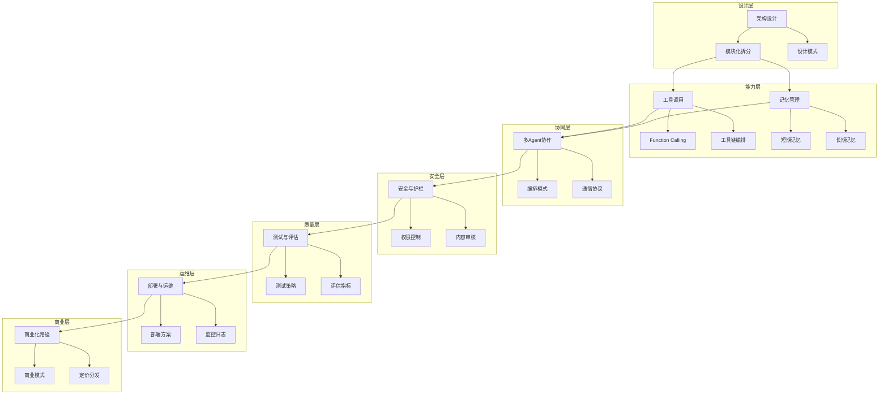
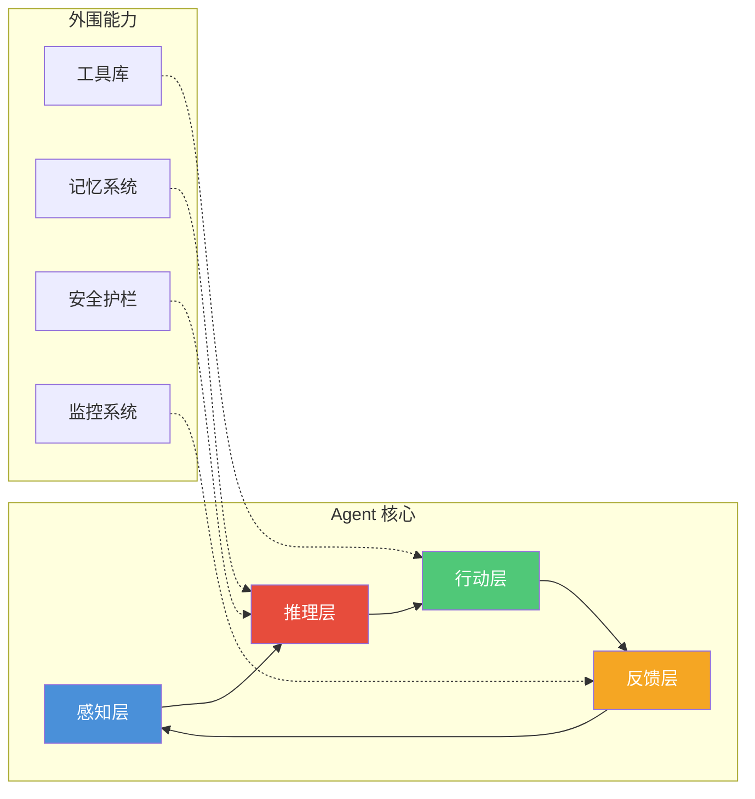

# AI Agent 开发实战中枢

> [!key] 核心主张
> AI Agent 不是简单的 API 调用，而是**一个完整的智能系统**——它需要架构设计、工具编排、记忆管理、安全护栏和商业化路径。本知识库系统地拆解了从设计到变现的全过程。

---

## 全景图：AI Agent 开发完整体系

---

## 文档索引

| 序号 | 文档名称 | 核心主题 | 难度 |
|:---:|:---|:---|:---:|
| 00 | 本文件 | 全景图与索引 | 入门 |
| 01 | [[01-AI技术/AI Agent开发实战/01_Agent架构设计：从单体到模块化|Agent架构设计]] | 架构模式与设计原则 | 核心 |
| 02 | [[01-AI技术/AI Agent开发实战/02_工具调用与编排：让Agent能干实事|工具调用与编排]] | Function Calling | 核心 |
| 03 | [[01-AI技术/AI Agent开发实战/03_记忆与上下文管理：让Agent记住你是谁|记忆与上下文管理]] | 记忆机制 | 进阶 |
| 04 | [[01-AI技术/AI Agent开发实战/04_多Agent协作：多个Agent一起干活|多Agent协作]] | 协作模式 | 进阶 |
| 05 | [[01-AI技术/AI Agent开发实战/05_安全与护栏：防止Agent干坏事|安全与护栏]] | 安全机制 | 核心 |
| 06 | [[01-AI技术/AI Agent开发实战/06_测试与评估：Agent的质量怎么保证|测试与评估]] | 质量保障 | 进阶 |
| 07 | [[01-AI技术/AI Agent开发实战/07_部署与运维：让Agent稳定运行|部署与运维]] | 运维实践 | 进阶 |
| 08 | [[01-AI技术/AI Agent开发实战/08_商业化路径：AI Agent如何赚钱|商业化路径]] | 商业变现 | 高阶 |

---

## AI Agent 的核心架构

---

## 与其他知识库的关联

- [[02-AI趋势与素养/AI应用发展阶段演进/00_MOC_AI应用发展阶段演进中枢|AI应用发展阶段演进]] — 了解 AI Agent 在 AI 发展历程中的位置
- [[04-商业与战略/内容营销与个人品牌/00_MOC_内容营销与个人品牌中枢|内容营销与个人品牌]] — Agent 可以作为内容营销的自动化工具
- [[03-HR人事/劳动法与合规/00_MOC_劳动法与合规中枢|劳动法与合规]] — Agent 的商业化涉及法律合规问题

---

## 使用指引

> [!warning] 建议阅读顺序
> 如果你是新手开发者，建议按 01 → 02 → 03 → 04 → 05 → 06 → 07 → 08 的顺序阅读。
> 如果你有 LLM 开发经验，可以从 02 开始，然后根据兴趣跳转。

> [!example] 实践建议
> 每读完一章，完成以下动作：
> 1. 用 Python 或 TypeScript 实现一个小的 demo
> 2. 在 GitHub 上创建一个项目，把代码提交上去
> 3. 记录遇到的问题和解决方案

---

## AI Agent 开发的七大原则

1. **最小可行原则** — 从最简单的架构开始，逐步迭代
2. **模块化设计** — 每个组件独立可替换，降低耦合
3. **安全优先** — 在设计阶段就考虑安全，而不是事后打补丁
4. **可观测性** — 每个 Agent 的行为都应该能被追踪和审计
5. **容错设计** — 假设所有外部调用都可能失败，设计优雅降级
6. **渐进增强** — 先实现核心功能，再逐步添加高级能力
7. **商业导向** — 技术决策最终要服务于商业目标

---

*创建于 2026-07-31 | 最后更新: 2026-07-31*