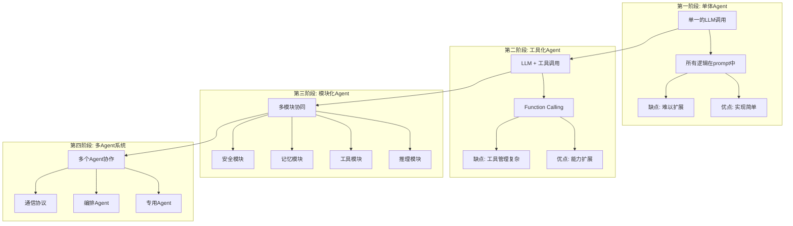
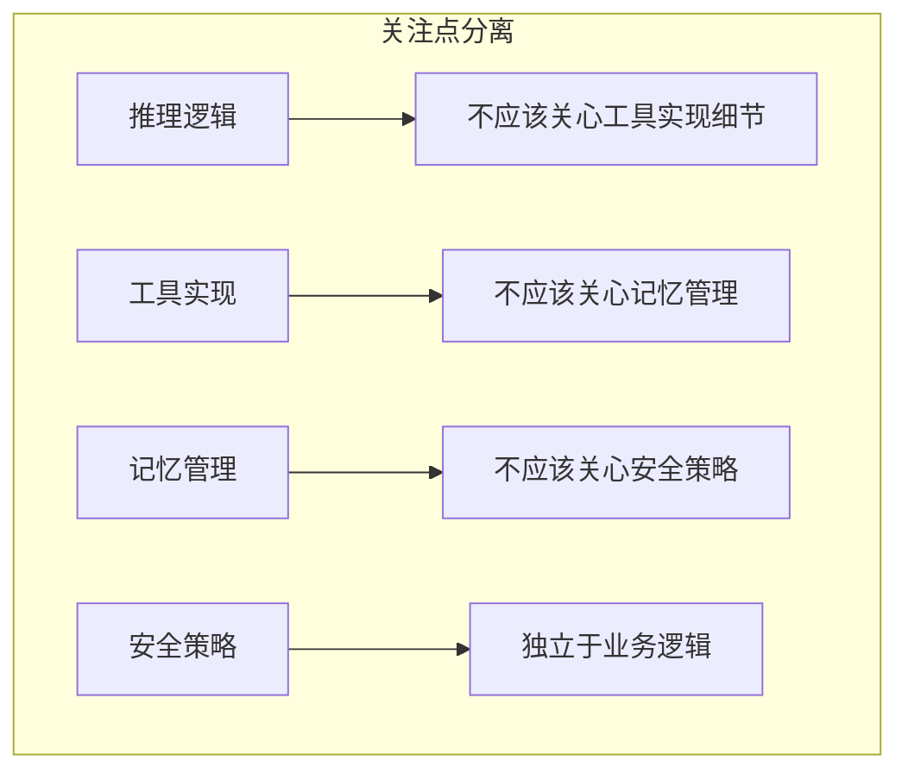

# Agent 架构设计：从单体到模块化

## 为什么架构设计是 Agent 开发的基石？

> [!key] 架构设计的核心价值
> 一个好的 Agent 架构决定了系统的可扩展性、可维护性和可靠性。**从单体到模块化的演进不是"炫技"，而是应对复杂性的必然选择。** 一个设计不当的 Agent 在功能简单时还能工作，一旦需要添加新能力，就会变得难以维护。

---

## Agent 架构的演进路径



---

## 模块化架构的核心组件

### 1. 推理引擎（Reasoning Engine）

推理引擎是 Agent 的"大脑"，负责决策和规划：

- **ReAct 模式**：思考（Thought）→ 行动（Action）→ 观察（Observation）循环
- **Plan-and-Execute**：先制定计划，再逐步执行
- **Tree-of-Thoughts**：探索多条推理路径，选择最优方案

### 2. 工具抽象层（Tool Abstraction Layer）

> [!tip] 工具抽象层的作用
> 工具抽象层是 Agent 的"手脚"，让 Agent 能够与外部世界交互。**好的工具抽象层应该让添加新工具像注册一个函数一样简单。**

```python
# 工具注册的伪代码示例
@tool_registry.register("search_web")
def search_web(query: str) -> str:
    """搜索网络并返回结果"""
    return web_search_api(query)

@tool_registry.register("read_file")
def read_file(path: str) -> str:
    """读取文件内容"""
    return file_system.read(path)
```

### 3. 记忆系统（Memory System）

记忆系统是 Agent 的"记忆"，详见 [[01-AI技术/AI Agent开发实战/03_记忆与上下文管理：让Agent记住你是谁|记忆管理]]。

### 4. 安全护栏（Guardrails）

安全护栏是 Agent 的"刹车"，详见 [[01-AI技术/AI Agent开发实战/05_安全与护栏：防止Agent干坏事|安全与护栏]]。

---

## 架构设计原则

### 关注点分离（Separation of Concerns）



### 依赖倒置（Dependency Inversion）

- 高层模块（推理引擎）不应该依赖底层模块（具体工具实现）
- 两者都应该依赖抽象接口
- 这使得替换任何组件都不会影响其他组件

### 可观测性设计

- **日志**：每个决策和行动都要有日志记录
- **追踪**：能够追踪一个请求的完整处理链路
- **度量**：关键性能指标（响应时间、成功率、token消耗）

> [!warning] 常见的架构错误
> 最常见的错误是**把 Agent 逻辑写死在 prompt 中**。当 prompt 超过 2000 字时，维护成本会急剧上升。应该把 prompt 视为代码，用版本控制、模块化和测试来管理。

---

## 实战：从单体到模块化的迁移

### 单体 Agent 的典型问题

1. **prompt 膨胀**：所有逻辑都在一个 prompt 中，> 3000 tokens
2. **工具耦合**：工具定义和调用逻辑混杂
3. **难以测试**：无法单独测试某个模块
4. **迭代困难**：改一个功能可能影响其他功能

### 模块化重构步骤

1. **拆分推理逻辑**：将 prompt 中的决策逻辑提取为独立模块
2. **抽象工具接口**：定义统一的工具注册和调用接口
3. **引入记忆管理**：将上下文管理从 prompt 中抽离
4. **添加安全层**：在工具调用前后添加安全检查
5. **建立监控**：添加日志和追踪系统

---

## 与后续章节的衔接

- [[01-AI技术/AI Agent开发实战/02_工具调用与编排：让Agent能干实事|工具调用与编排]] — 工具抽象层的具体实现
- [[01-AI技术/AI Agent开发实战/03_记忆与上下文管理：让Agent记住你是谁|记忆与上下文管理]] — 记忆系统的设计
- [[01-AI技术/AI Agent开发实战/04_多Agent协作：多个Agent一起干活|多Agent协作]] — 从单体到多Agent的演进
- [[01-AI技术/AI Agent开发实战/05_安全与护栏：防止Agent干坏事|安全与护栏]] — 安全层的设计

---

## 关键要点总结

1. **架构演进是渐进过程**，不要一开始就追求完美架构
2. **模块化是应对复杂性的唯一选择**
3. **关注点分离**让每个组件职责清晰
4. **可观测性**是运维的基础
5. **从单体到模块化**需要分步骤进行，不要一次性重构

---

*创建于 2026-07-31 | 字数: ~800 字*