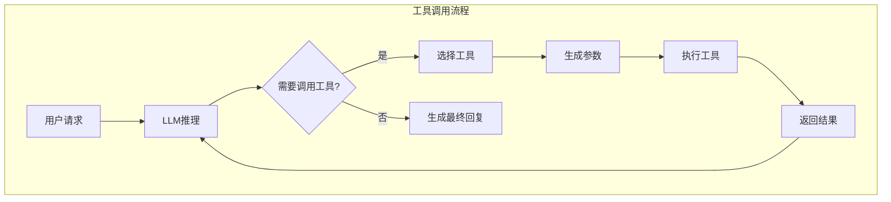
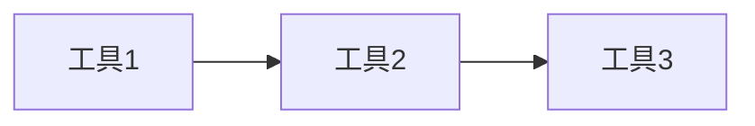
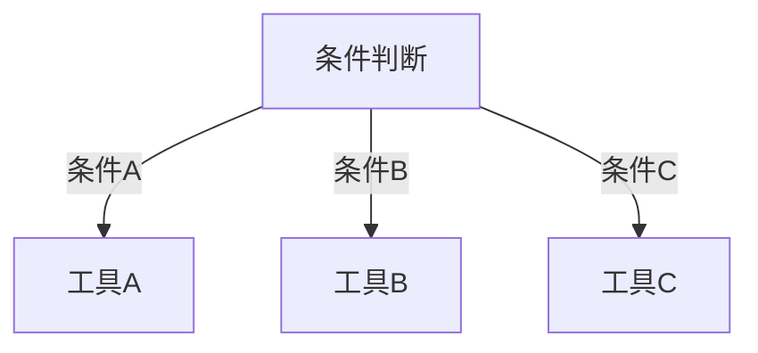
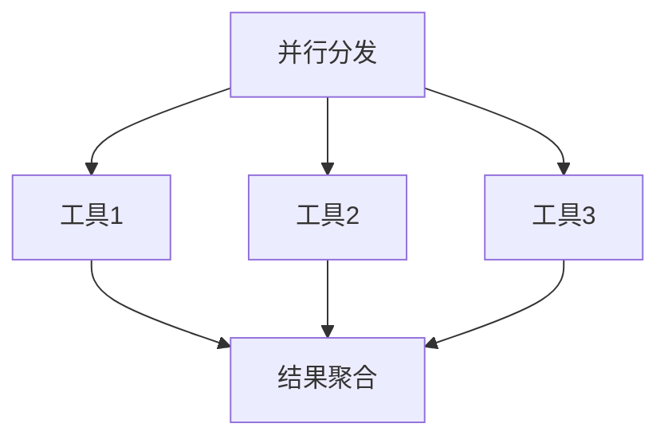

# 工具调用与编排：让 Agent 能干实事

## 没有工具的 Agent 只是一个聊天机器人

> [!key] 工具调用的核心价值
> 工具调用是 Agent 从"纸上谈兵"到"干实事"的关键桥梁。**一个没有工具调用的 Agent 只是一个高级聊天机器人；有了工具调用，Agent 才能查询数据库、调用 API、操作文件系统、执行代码。** 工具系统设计的质量，直接决定了 Agent 的能力边界。

---

## 工具调用的架构



---

## Function Calling 的核心机制

### 什么是 Function Calling？

Function Calling 是 LLM 的一种能力——模型能够根据用户输入，决定是否需要调用某个预定义的函数，并生成符合函数签名的参数。

### 工具定义的最佳实践

```json
{
  "name": "search_database",
  "description": "根据用户查询搜索数据库，返回匹配的结果",
  "parameters": {
    "type": "object",
    "properties": {
      "query": {
        "type": "string",
        "description": "搜索查询语句"
      },
      "limit": {
        "type": "integer",
        "description": "返回结果的最大数量",
        "default": 10
      }
    },
    "required": ["query"]
  }
}
```

> [!tip] 工具描述的关键
> 工具描述（description）是 LLM 选择工具的依据。**描述要清晰、准确，包含"什么情况下调用这个工具"的信息。** 模糊的描述会导致 LLM 选择错误的工具。

### 工具设计的五个原则

| 原则 | 说明 | 反例 | 正例 |
|:---|:---|---:|:---|
| 单一职责 | 每个工具只做一件事 | "search_and_update" | "search_records" |
| 明确输入 | 参数定义清晰 | query: "string" | query: "搜索关键词，支持模糊匹配" |
| 可预期输出 | 返回格式标准化 | 返回任意格式 | 返回 JSON 格式 |
| 错误处理 | 优雅处理异常 | 直接抛异常 | 返回错误信息 + 建议 |
| 幂等性 | 重复调用结果一致 | 每次调用都创建新记录 | 检查是否存在再创建 |

---

## 工具编排模式

### 1. 顺序编排（Sequential）



**适用场景**：数据流有明确的先后依赖关系。
**示例**：先搜索用户信息 → 再查询订单 → 最后生成推荐。

### 2. 条件编排（Conditional）



**适用场景**：根据不同的输入条件执行不同的工具。
**示例**：判断用户意图 → 选择对应的工具执行。

### 3. 并行编排（Parallel）



**适用场景**：多个独立任务可以同时执行。
**示例**：同时查询天气、股票价格和新闻头条。

---

## 工具链的安全考量

> [!warning] 工具调用的安全风险
> 工具调用是 Agent 最大的安全风险点——**一个恶意的 prompt 注入可能导致 Agent 调用危险工具**。详见 [[01-AI技术/AI Agent开发实战/05_安全与护栏：防止Agent干坏事|安全与护栏]]。

### 安全措施

- **权限最小化**：每个工具只授予最小必要权限
- **输入验证**：对工具参数进行严格验证
- **操作确认**：高危操作需要用户确认
- **速率限制**：防止滥用
- **审计日志**：记录所有工具调用

---

## 与架构设计的衔接

工具调用是 [[01-AI技术/AI Agent开发实战/01_Agent架构设计：从单体到模块化|模块化架构]] 中"工具抽象层"的核心实现。好的工具系统需要：

- 统一的注册机制
- 标准化的调用接口
- 完善的错误处理
- 灵活的组合编排

---

## 关键要点总结

1. **Function Calling 是 Agent 能力的核心**，决定 Agent 能做什么
2. **工具定义要清晰**，描述决定了 LLM 能否正确选择工具
3. **编排模式**决定了工具组合的灵活性
4. **安全是工具调用的底线**，每个工具调用都需要安全检查
5. **工具抽象层**是模块化架构的关键组件

---

*创建于 2026-07-31 | 字数: ~800 字*