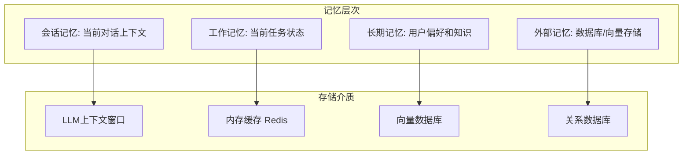
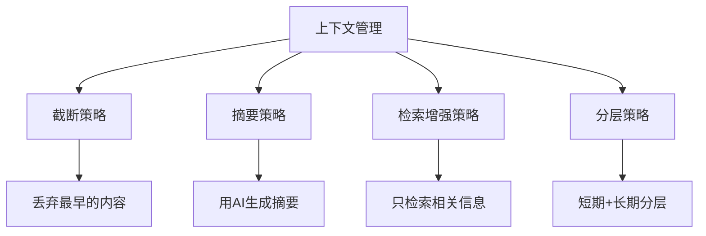

# 记忆与上下文管理：让 Agent 记住你是谁

## 没有记忆的 Agent 永远是一个"陌生人"

> [!key] 记忆的核心价值
> 记忆是 Agent 从"无状态工具"进化为"个性化助手"的关键。**一个没有记忆的 Agent 每次对话都是从零开始，无法提供个性化服务。** 记忆系统设计的好坏，直接决定了用户体验的连续性。

---

## 记忆系统的层次结构



---

## 三种记忆类型详解

### 1. 短期记忆（会话上下文）

短期记忆是当前对话的上下文信息，存储在 LLM 的上下文窗口中。

**特点：**
- 容量有限（受 LLM 上下文窗口限制）
- 生命周期短（会话结束后消失）
- 访问速度快

**管理策略：**
- **滑动窗口**：保留最近的 N 轮对话
- **摘要压缩**：当上下文过长时，压缩历史对话为摘要
- **关键信息提取**：只保留与当前任务相关的历史信息

### 2. 工作记忆（任务状态）

工作记忆是当前正在执行的任务的状态信息。

> [!tip] 工作记忆的设计
> 工作记忆类似于编程中的"函数调用栈"。**每个任务在执行过程中产生的中间状态需要被保存，以便在工具调用返回后继续执行。** 这在 [[01-AI技术/AI Agent开发实战/02_工具调用与编排：让Agent能干实事|工具编排]] 中尤其重要。

```python
# 工作记忆的伪代码
class WorkingMemory:
    def __init__(self):
        self.task_stack = []  # 任务栈
        self.context = {}     # 上下文变量
        
    def push_task(self, task):
        self.task_stack.append(task)
        
    def pop_task(self):
        return self.task_stack.pop()
        
    def set_variable(self, key, value):
        self.context[key] = value
```

### 3. 长期记忆（用户知识）

长期记忆是跨会话的持久化信息，包括用户偏好、历史行为、领域知识等。

**存储方式：**
- **向量数据库**：存储信息的语义嵌入，支持相似度检索
- **知识图谱**：存储实体关系，支持结构化查询
- **关系数据库**：存储结构化数据，支持精确查询

**检索策略：**
- **语义检索**：根据用户输入检索最相关的记忆
- **时间衰减**：越近的记忆权重越高
- **重要性排序**：根据记忆的重要性进行排序

---

## 上下文窗口管理

> [!warning] 上下文窗口的约束
> 上下文窗口是 Agent 开发中最常见的瓶颈之一。**当上下文超出窗口限制时，要么截断，要么丢失信息。** 这是每个 Agent 开发者都必须面对的问题。

### 上下文管理策略



| 策略 | 优点 | 缺点 | 适用场景 |
|:---|:---|:---|:---|
| 截断 | 简单快速 | 丢失信息 | 简单对话 |
| 摘要 | 保留关键信息 | 计算成本高 | 长对话 |
| 检索增强 | 精准高效 | 实现复杂 | 知识密集型 |
| 分层 | 灵活性高 | 架构复杂 | 企业级应用 |

---

## 记忆系统的实现建议

### 向量数据库的选择

| 数据库 | 特点 | 适用场景 |
|:---|:---|:---|
| Pinecone | 托管服务，易用 | 快速原型 |
| Weaviate | 开源，可自托管 | 生产环境 |
| Milvus | 高性能，大规模 | 企业级 |
| Chroma | 轻量级，嵌入式 | 本地开发 |

### 记忆的隐私与合规

> [!warning] 隐私合规
> 记忆系统必须考虑数据隐私和合规问题。**用户的个人数据需要得到保护，尤其是在 GDPR 和《个人信息保护法》的监管下。** 详见 [[03-HR人事/劳动法与合规/00_MOC_劳动法与合规中枢|劳动法与合规]]。

---

## 与多Agent协作的衔接

在多 Agent 系统中，[[01-AI技术/AI Agent开发实战/04_多Agent协作：多个Agent一起干活|Agent 之间的状态共享]] 需要更复杂的记忆管理机制——包括共享记忆、隔离记忆和记忆同步。

---

## 关键要点总结

1. **记忆是 Agent 个性化的基础**，没有记忆就没有个性化
2. **短期记忆**管理上下文窗口，**长期记忆**提供持久化能力
3. **上下文窗口管理**是 Agent 开发中最常见的挑战之一
4. **向量数据库**是长期记忆的核心技术
5. **隐私合规**是记忆系统不可忽视的问题

---

*创建于 2026-07-31 | 字数: ~800 字*