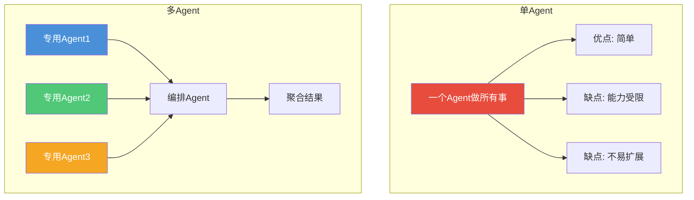
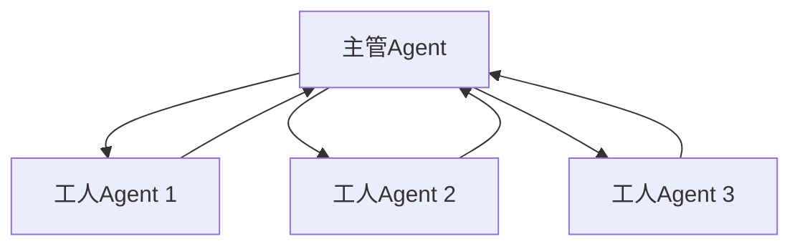
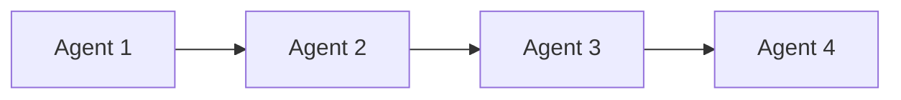
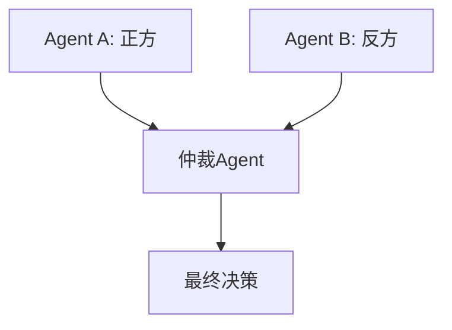

# 多Agent协作：多个 Agent 一起干活

## 为什么需要多 Agent？

> [!key] 多Agent的核心价值
> 单个 Agent 的能力是有限的。**一个 Agent 无法同时精通所有领域，但多个专业 Agent 协作可以构建一个远超单个 Agent 能力的系统。** 就像软件开发中从单体架构演进到微服务架构一样，多 Agent 系统是 Agent 开发的必然演进方向。

---

## 单 Agent vs 多 Agent



| 维度 | 单 Agent | 多 Agent |
|:---|:---|:---|
| 能力边界 | 受限于单一模型 | 可组合多种能力 |
| 可扩展性 | 难扩展 | 易扩展（添加新 Agent） |
| 维护成本 | 低 | 高（需要编排） |
| 容错性 | 单点故障 | 可设计容错 |
| 开发复杂度 | 低 | 高 |
| 适用场景 | 简单任务 | 复杂任务 |

---

## 多 Agent 编排模式

### 1. 主管/工人模式（Orchestrator/Worker）



- **主管 Agent**：负责任务分解、分配和结果聚合
- **工人 Agent**：负责执行具体子任务
- **适用场景**：复杂任务需要分解为多个子任务

### 2. 流水线模式（Pipeline）



- 每个 Agent 处理一个阶段，输出传递给下一个 Agent
- **适用场景**：有明确阶段划分的任务（如：数据清洗 → 分析 → 报告生成）

### 3. 辩论模式（Debate）



- 多个 Agent 从不同角度分析问题，通过辩论达成共识
- **适用场景**：需要多角度分析的决策任务

### 4. 市场模式（Marketplace）

- 多个 Agent 作为独立的服务提供者
- 通过"招标-投标-中标"机制分配任务
- **适用场景**：开放式的任务分配，如自动化工作流

---

## 通信协议设计

> [!warning] 通信协议的重要性
> 多 Agent 系统的核心挑战是**Agent 之间的通信**。如果通信协议设计不好，Agent 之间会互相误解、重复工作或产生冲突。

### 通信协议的关键要素

| 要素 | 说明 | 示例 |
|:---|:---|:---|
| 消息格式 | 数据交换格式 | JSON / Protocol Buffers |
| 消息类型 | 请求、响应、通知、错误 | request / response / event |
| 路由机制 | 消息如何到达目标 Agent | 基于主题的路由 |
| 状态管理 | 如何追踪任务状态 | 分布式追踪 |
| 错误处理 | 通信失败的处理 | 重试、超时、降级 |

### 消息格式示例

```json
{
  "message_id": "msg_12345",
  "sender": "orchestrator_agent",
  "receiver": "search_agent",
  "message_type": "request",
  "timestamp": "2026-07-31T10:00:00Z",
  "payload": {
    "task_id": "task_67890",
    "action": "search",
    "parameters": {
      "query": "AI Agent 商业化案例",
      "limit": 5
    }
  },
  "metadata": {
    "trace_id": "trace_abc",
    "priority": "high"
  }
}
```

---

## 多 Agent 系统的最佳实践

### 1. 明确职责边界

每个 Agent 都应该有明确的职责范围，避免职责重叠。参考 [[01-AI技术/AI Agent开发实战/01_Agent架构设计：从单体到模块化|关注点分离原则]]。

### 2. 设计优雅降级

当某个 Agent 不可用时，系统应该能够优雅降级，而不是完全崩溃。

### 3. 共享记忆机制

多 Agent 系统需要共享记忆机制。[[01-AI技术/AI Agent开发实战/03_记忆与上下文管理：让Agent记住你是谁|记忆管理]] 中的知识需要在 Agent 之间共享。

### 4. 安全隔离

> [!tip] 安全隔离
> 每个 Agent 应该运行在独立的沙箱环境中，一个 Agent 被攻破不应该影响其他 Agent。详见 [[01-AI技术/AI Agent开发实战/05_安全与护栏：防止Agent干坏事|安全与护栏]]。

---

## 关键要点总结

1. **多 Agent 系统是应对复杂任务的最佳方案**
2. **编排模式**决定了 Agent 之间的协作方式
3. **通信协议**是多 Agent 系统的核心基础设施
4. **职责边界清晰**避免 Agent 之间的冲突
5. **容错设计**确保系统稳定性
6. **安全隔离**防止单点攻击扩散

---

*创建于 2026-07-31 | 字数: ~800 字*