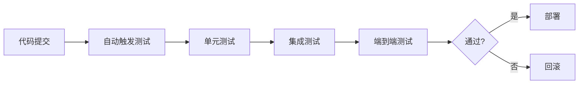

# 测试与评估：Agent 的质量怎么保证

## Agent 测试为什么比传统软件测试更难？

> [!key] 测试的核心挑战
> 传统软件测试是"确定性"的——给定输入，预期输出是确定的。**Agent 测试是"非确定性"的——LLM 的输出不是确定的，同样的问题可能得到不同的答案。** 这使得 Agent 测试需要全新的方法论。

---

## Agent 测试的分层策略


---

## 各层测试详解

### 1. 单元测试：测试确定性组件

单元测试适用于 Agent 系统中的确定性组件：

- **工具函数**：测试工具函数的输入输出是否正确
- **数据解析**：测试 JSON 解析、数据清洗等函数
- **状态管理**：测试记忆管理模块的正确性
- **权限检查**：测试权限控制逻辑

```python
# 单元测试示例
def test_search_tool():
    """测试搜索工具的正确性"""
    result = search_tool("AI Agent 测试")
    assert result.status == "success"
    assert len(result.data) > 0
    assert "AI" in result.data[0].title
```

### 2. 集成测试：测试工具调用

集成测试验证 Agent 与工具之间的交互是否正确：

- **工具选择**：Agent 是否选择了正确的工具
- **参数生成**：Agent 生成的工具参数是否正确
- **结果处理**：Agent 是否正确处理了工具返回的结果
- **错误处理**：工具调用失败时 Agent 是否优雅处理

### 3. 端到端测试：测试完整流程

> [!tip] 端到端测试的策略
> 由于 LLM 输出是非确定性的，端到端测试不能使用"精确匹配"，而应该使用**语义匹配**——检查输出是否包含关键信息，而不是完全一致。

**测试方法：**
- **黄金数据集**：准备一组标准化的测试用例
- **语义评估**：使用 LLM 评估输出质量
- **关键指标检查**：检查是否包含必要元素
- **边界测试**：测试极端情况

### 4. 评估测试：量化质量指标

> [!warning] 评估指标的重要性
> 没有量化指标，就无法评估 Agent 是否在改进。**评估指标是 Agent 开发的"北极星"。**

#### 核心评估指标

| 指标 | 定义 | 测量方法 |
|:---|:---|:---|
| 任务完成率 | 成功完成任务的比率 | 人工/自动评估 |
| 工具选择准确率 | 选择正确工具的比率 | 自动化对比 |
| 响应时间 | 从输入到输出的时间 | 自动记录 |
| Token 消耗 | 每次任务消耗的 token 数 | 自动记录 |
| 用户满意度 | 用户对输出的满意度 | 用户反馈 |
| 错误率 | 产生错误输出的比率 | 自动检测 |

### 5. 安全测试

安全测试在 [[01-AI技术/AI Agent开发实战/05_安全与护栏：防止Agent干坏事|安全与护栏]] 中有详细讨论，包括：

- Prompt 注入测试
- 权限越界测试
- 数据泄露测试

---

## 测试自动化的最佳实践

### 持续测试流水线



### 测试数据集管理

- **版本控制**：测试数据集纳入版本管理
- **多样性**：覆盖正常、边界、异常场景
- **定期更新**：随着 Agent 能力提升更新测试集
- **人工标注**：关键测试用例需要人工标注

---

## 评估框架的选择

| 框架 | 特点 | 适用场景 |
|:---|:---|:---|
| LangSmith | LangChain 生态 | 与 LangChain 配合使用 |
| Weights & Biases | 实验追踪 | 模型对比实验 |
| DeepEval | 开源评估框架 | 自定义评估 |
| RAGAS | RAG 系统评估 | 检索增强型 Agent |

---

## 与部署的衔接

测试通过后，Agent 进入 [[01-AI技术/AI Agent开发实战/07_部署与运维：让Agent稳定运行|部署与运维]] 阶段。在线上环境中，还需要持续监控和评估，形成一个"测试 → 部署 → 监控 → 改进"的闭环。

---

## 关键要点总结

1. **Agent 测试比传统软件测试更难**，因为输出是非确定性的
2. **分层测试策略**覆盖从单元到端到端的各个层面
3. **语义匹配**替代精确匹配进行端到端测试
4. **量化评估指标**是质量保证的基础
5. **测试自动化**是持续交付的关键
6. **安全测试**是 Agent 测试中不可忽视的一环

---

*创建于 2026-07-31 | 字数: ~800 字*