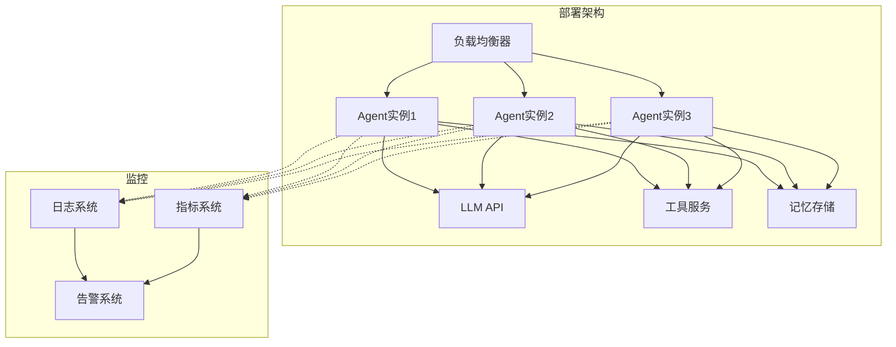
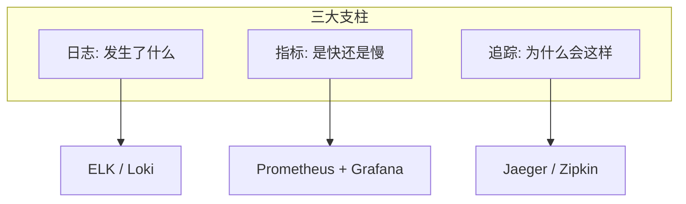

# 部署与运维：让 Agent 稳定运行

## 从"能用"到"稳定运行"的鸿沟

> [!key] 运维的核心价值
> 开发一个能用的 Agent 只需要几天，但让一个 Agent 稳定运行几个月需要**系统化的部署和运维体系**。**生产环境的 Agent 面临流量波动、模型更新、工具不可用、安全攻击等挑战，这些都需要在部署和运维阶段解决。**

---

## 部署架构

---

## 部署方案对比

| 部署方案 | 优点 | 缺点 | 适用场景 |
|:---|:---|:---|:---|
| Serverless (AWS Lambda) | 自动扩缩，按量付费 | 冷启动，超时限制 | 低延迟敏感场景 |
| 容器化 (Kubernetes) | 灵活，可定制 | 运维成本高 | 企业级应用 |
| 托管服务 (Modal / Replicate) | 简单，快速 | 供应商锁定 | 快速原型 |
| 自建服务器 | 完全控制 | 运维成本最高 | 特殊合规要求 |

### 推荐方案：Kubernetes + 容器化

> [!tip] 生产环境部署建议
> 对于生产环境的 Agent，推荐使用 **Kubernetes + 容器化** 方案：
> - 水平扩展能力强
> - 支持滚动更新
> - 内置健康检查
> - 资源管理灵活

---

## 监控体系

### 三大监控支柱

### 关键监控指标

| 指标类别 | 具体指标 | 告警阈值 | 说明 |
|:---|:---|:---:|:---|
| 性能 | P50/P95/P99 响应时间 | P95 > 5s | 用户体验 |
| 性能 | Token 消耗/请求 | 异常增长 > 50% | 成本控制 |
| 可用性 | 请求成功率 | < 99% | 服务质量 |
| 可用性 | LLM API 错误率 | > 1% | 上游依赖 |
| 业务 | 任务完成率 | < 90% | 业务效果 |
| 业务 | 工具调用成功率 | < 95% | 工具质量 |
| 安全 | 异常输入检测 | 任何异常 | 安全事件 |

---

## 日志管理

### 需要记录的内容

- **输入日志**：每次用户的输入内容
- **推理日志**：Agent 的推理过程（思考链）
- **工具调用日志**：调用了哪些工具、参数和结果
- **输出日志**：Agent 的最终输出
- **错误日志**：所有异常和错误
- **性能日志**：响应时间、Token 消耗

### 日志管理最佳实践

> [!warning] 日志的隐私合规
> 日志中可能包含用户敏感信息，需要注意：
> - 对敏感字段进行脱敏处理
> - 设置日志保留期限
> - 控制日志的访问权限
> - 参考 [[03-HR人事/劳动法与合规/00_MOC_劳动法与合规中枢|劳动法与合规]] 中的隐私保护要求

---

## 常见的运维挑战

### 1. LLM API 不稳定

- **问题**：LLM API 可能出现延迟、超时或错误
- **解决方案**：多模型切换、重试机制、降级策略

### 2. 工具服务不可用

- **问题**：Agent 依赖的外部工具可能宕机
- **解决方案**：健康检查、熔断机制、备用工具

### 3. 上下文窗口溢出

- **问题**：长对话导致上下文窗口溢出
- **解决方案**：[[01-AI技术/AI Agent开发实战/03_记忆与上下文管理：让Agent记住你是谁|上下文管理策略]] 中的压缩和截断

### 4. 成本失控

- **问题**：Token 消耗超出预期
- **解决方案**：设置 Token 预算、优化 prompt、缓存

---

## 灰度发布与回滚

### 发布策略

1. **金丝雀发布**：先让 5% 的流量走新版本，观察 24 小时
2. **逐步放量**：如果稳定，逐步增加到 25%、50%、100%
3. **自动回滚**：如果错误率上升，自动回滚到上一个版本

### 回滚策略

- **版本标记**：每个部署版本都有唯一标记
- **数据库兼容**：新版本的数据格式要兼容旧版本
- **快速回滚**：回滚时间控制在 5 分钟以内

---

## 与商业化的衔接

稳定运维是 [[01-AI技术/AI Agent开发实战/08_商业化路径：AI Agent如何赚钱|商业化]] 的基础。没有稳定的系统，付费用户不会买单。

---

## 关键要点总结

1. **部署架构**选择需要权衡成本、灵活性和运维复杂度
2. **监控体系**是运维的"眼睛"，没有监控就没有运维
3. **日志记录**是调试和审计的基础
4. **灰度发布**降低上线风险
5. **成本控制**是运维不可忽视的问题
6. **稳定性**直接决定商业化成败

---

*创建于 2026-07-31 | 字数: ~800 字*