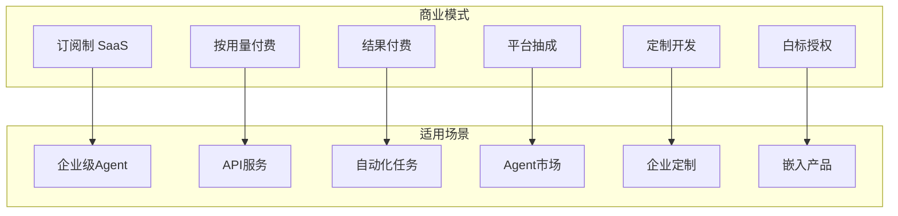
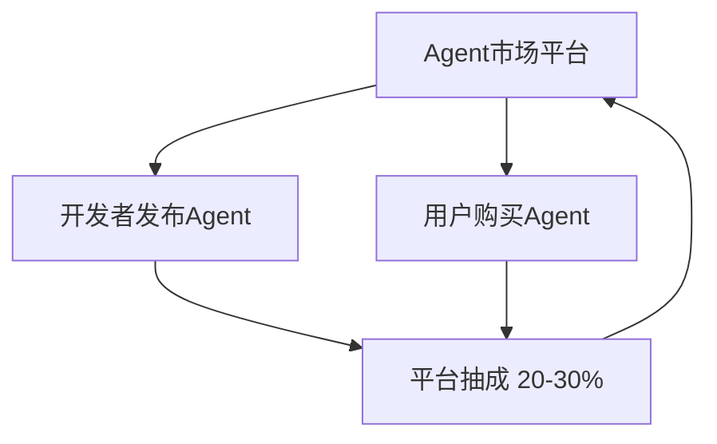
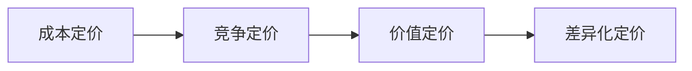

# 商业化路径：AI Agent 如何赚钱

## 技术是手段，商业是目的

> [!key] 商业化的核心认知
> 技术能力再强，如果不能变现，它只是一个"玩具"。**AI Agent 的商业化不是"技术变现"的问题，而是"价值创造"的问题——你解决了什么问题？用户愿意为这个解决方案付多少钱？**

---

## AI Agent 的商业模式图谱

---

## 主流商业模式详解

### 1. 订阅制 SaaS（最成熟的模式）

| 定价层级 | 月费 | 功能 | 目标用户 |
|:---|:---:|:---|:---|
| 免费版 | $0 | 基础功能，有限次数 | 个人体验 |
| 专业版 | $29/月 | 全部功能，更高额度 | 个人用户 |
| 团队版 | $99/月 | 团队协作，管理后台 | 小团队 |
| 企业版 | 定制 | 私有部署，SLA 保障 | 大企业 |

### 2. 按用量付费

> [!tip] 按用量付费的优势
> 按用量付费对用户门槛最低——用户只需要为实际使用付费。**这种模式适合 Token 消耗量不固定的场景。**

**示例：**
- 每次对话 $0.01
- 每千次工具调用 $0.50
- 每 MB 数据处理 $0.10

### 3. 结果付费

> [!warning] 结果付费的风险
> 结果付费是用户最喜欢但开发者最需要谨慎的模式。**"结果"的定义可能很模糊，用户可能对"结果"有不同的预期。**

**适用场景：**
- 客服 Agent：按成功解决的工单付费
- 内容生成 Agent：按生成的文章数量付费
- 数据分析 Agent：按生成的报告数量付费

### 4. Agent 市场（平台模式）

**类似 App Store 的模式：**
- 开发者发布专用 Agent
- 用户按需购买
- 平台抽成 20-30%

---

## 定价策略

### 定价锚定

| 策略 | 方法 | 示例 |
|:---|:---|:---|
| 成本定价 | 成本 + 利润 | Token 成本 × 3 |
| 竞争定价 | 参考竞品 | 比竞品便宜 20% |
| 价值定价 | 用户价值 | 帮用户省了 1000 元/月，定价 200 元/月 |
| 差异化定价 | 按功能分层 | 基础版 $29，专业版 $99，企业版 定制 |

### 定价心理学

> [!tip] 定价的三个关键
> 1. **锚定效应**：先展示高价版本，让中等价格看起来更合理
> 2. **免费试用**：降低用户决策门槛，让用户先体验价值
> 3. **年付折扣**：年付比月付便宜 20%，提高用户留存

---

## 分发渠道

### 直接分发

- **官方网站**：自建 Landing Page，直接销售
- **邮件营销**：[[04-商业与战略/内容营销与个人品牌/07_邮件营销：最被低估的变现渠道|邮件营销]] 是 B2B 产品最有效的分发渠道
- **内容营销**：通过 [[04-商业与战略/内容营销与个人品牌/00_MOC_内容营销与个人品牌中枢|内容营销]] 建立信任，吸引用户

### 平台分发

- **Agent 市场**：OpenAI GPTs、Replicate、Hugging Face
- **SaaS 市场**：Salesforce AppExchange、Shopify App Store
- **云市场**：AWS Marketplace、Azure Marketplace

### 合作分发

- **OEM 合作**：将 Agent 嵌入到其他产品中
- **渠道合作**：与咨询公司、代理商合作
- **联盟营销**：通过 affiliate 推广

---

## 商业化的关键指标

| 指标 | 定义 | 健康值 | 说明 |
|:---|:---|:---:|:---|
| MRR | 月经常性收入 | 持续增长 | 核心收入指标 |
| Churn Rate | 用户流失率 | < 5%/月 | 产品粘性 |
| CAC | 获客成本 | < LTV/3 | 获客效率 |
| LTV | 用户生命周期价值 | > CAC × 3 | 用户价值 |
| NPS | 净推荐值 | > 50 | 用户满意度 |
| 毛利率 | (收入 - 成本)/收入 | > 70% | 盈利能力 |

---

## 与技术和运维的衔接

- [[01-AI技术/AI Agent开发实战/07_部署与运维：让Agent稳定运行|部署与运维]] 是商业模式落地的基础
- [[01-AI技术/AI Agent开发实战/06_测试与评估：Agent的质量怎么保证|质量保证]] 直接影响用户满意度和留存率
- [[01-AI技术/AI Agent开发实战/05_安全与护栏：防止Agent干坏事|安全护栏]] 是企业客户采购的前提条件

---

## 关键要点总结

1. **商业模式选择**取决于你的目标用户和价值主张
2. **定价策略**需要综合考虑成本、竞争和用户价值
3. **分发渠道**决定了你的产品能被多少人看到
4. **关键指标**是衡量商业化健康度的仪表盘
5. **技术与商业的衔接**决定了产品能否持续盈利
6. **从第一天就考虑商业化**，而不是等技术成熟了再想

---

*创建于 2026-07-31 | 字数: ~800 字*