# LOOP Engineering知识库 🔄

> 覆盖"认知→模式→架构→方法→工具→实战→进化"全链路，系统掌握如何设计、构建并持续优化AI Agent的反馈循环，将LLM从"单次问答机"升级为"持续决策循环"。

---

## 模块速览

```mermaid
flowchart TD
    START[🔄 LOOP Engineering] --> A[认知篇]
    START --> B[模式篇]
    START --> C[架构篇]
    START --> D[方法篇]
    START --> E[工具篇]
    START --> F[实战篇]
    START --> G[进阶篇]

    A --> A1["[[01-AI技术/LOOP Engineering/01-认知篇/01_从Prompt到Loop]] ⭐先看"]
    A --> A2["[[01-AI技术/LOOP Engineering/01-认知篇/02_核心概念与价值]]"]
    A --> A3["[[01-AI技术/LOOP Engineering/01-认知篇/03_四层工程体系的关系]]"]

    B --> B1["[[01-AI技术/LOOP Engineering/02-模式篇/01_ReAct Loop]]"]
    B --> B2["[[01-AI技术/LOOP Engineering/02-模式篇/02_Plan-Execute Loop]]"]
    B --> B3["[[01-AI技术/LOOP Engineering/02-模式篇/03_Reflection Loop]]"]
    B --> B4["[[01-AI技术/LOOP Engineering/02-模式篇/04_Ralph Loop]] ⭐高可靠性"]
    B --> B5["[[01-AI技术/LOOP Engineering/02-模式篇/05_高级循环模式]]"]

    C --> C1["[[01-AI技术/LOOP Engineering/03-架构篇/01_Inner Outer Loop]] ⭐双循环"]
    C --> C2["[[01-AI技术/LOOP Engineering/03-架构篇/02_DPEV-I五阶段闭环]] ⭐核心"]
    C --> C3["[[01-AI技术/LOOP Engineering/03-架构篇/03_Hook Loop Harness范式]] ⭐工程化"]
    C --> C4["[[01-AI技术/LOOP Engineering/03-架构篇/04_Open Loop vs Closed Loop]]"]
    C --> C5["[[01-AI技术/LOOP Engineering/03-架构篇/05_状态管理与上下文优化]]"]

    D --> D1["[[01-AI技术/LOOP Engineering/04-方法篇/01_循环设计八步法]] ⭐必读"]
    D --> D2["[[01-AI技术/LOOP Engineering/04-方法篇/02_验证机制设计]]"]
    D --> D3["[[01-AI技术/LOOP Engineering/04-方法篇/03_安全护栏体系]]"]
    D --> D4["[[01-AI技术/LOOP Engineering/04-方法篇/04_终止条件设计]]"]
    D --> D5["[[01-AI技术/LOOP Engineering/04-方法篇/05_成本控制策略]]"]
    D --> D6["[[01-AI技术/LOOP Engineering/04-方法篇/06_棘轮机制]]"]

    E --> E1["[[01-AI技术/LOOP Engineering/05-工具篇/01_工具全景图]]"]
    E --> E2["[[01-AI技术/LOOP Engineering/05-工具篇/02_LangChain四层架构]]"]
    E --> E3["[[01-AI技术/LOOP Engineering/05-工具篇/03_Claude Code与Agent运行时]]"]
    E --> E4["[[01-AI技术/LOOP Engineering/05-工具篇/04_可观测性工具]]"]

    F --> F1["[[01-AI技术/LOOP Engineering/06-实战篇/01_CI失败自动修复]] ⭐经典"]
    F --> F2["[[01-AI技术/LOOP Engineering/06-实战篇/02_PR Babysitter]]"]
    F --> F3["[[01-AI技术/LOOP Engineering/06-实战篇/03_代码库迁移]]"]
    F --> F4["[[01-AI技术/LOOP Engineering/06-实战篇/04_依赖升级]]"]
    F --> F5["[[01-AI技术/LOOP Engineering/06-实战篇/05_最小可行Loop落地法]] ⭐入门"]

    G --> G1["[[01-AI技术/LOOP Engineering/07-进阶篇/01_多Agent协作循环]]"]
    G --> G2["[[01-AI技术/LOOP Engineering/07-进阶篇/02_自适应Loop]]"]
    G --> G3["[[01-AI技术/LOOP Engineering/07-进阶篇/03_跨会话Loop]]"]
    G --> G4["[[01-AI技术/LOOP Engineering/07-进阶篇/04_终局形态]]"]
```

| 模块 | 笔记数 | 核心定位 | 建设进度 |
|------|--------|---------|---------|
| 🧠 认知篇 | 3 篇 | 理解LOOP Engineering的本质，从Prompt到Loop的演进 | ✅ 已完成 |
| 🔄 模式篇 | 5 篇 | 五大核心循环模式详解与选型 | ✅ 已完成 |
| 🏗️ 架构篇 | 5 篇 | 双循环驱动、五阶段闭环、Hook+Loop+Harness | ✅ 已完成 |
| ⚙️ 方法篇 | 6 篇 | 循环设计八步法、验证、安全、成本控制 | ✅ 已完成 |
| 🔧 工具篇 | 4 篇 | 工具全景图、LangChain、Agent运行时、可观测性 | ✅ 已完成 |
| 🎯 实战篇 | 5 篇 | CI修复、PR审查、代码迁移、依赖升级、落地法 | ✅ 已完成 |
| 🚀 进阶篇 | 4 篇 | 多Agent协作、自适应循环、跨会话、终局展望 | ✅ 已完成 |

---

## 使用指南

| 你的状态 | 打开什么 |
|---------|---------|
| 刚接触LOOP Engineering，想知道它是什么 | 认知篇 → [[01-AI技术/LOOP Engineering/01-认知篇/01_从Prompt到Loop]] |
| 想了解有哪些循环模式、怎么选 | 模式篇 → 五种模式对比表，从[[01-AI技术/LOOP Engineering/02-模式篇/01_ReAct Loop]]开始 |
| 想设计一个高效的Agent循环系统 | 架构篇 → [[01-AI技术/LOOP Engineering/03-架构篇/02_DPEV-I五阶段闭环]] + [[01-AI技术/LOOP Engineering/03-架构篇/03_Hook Loop Harness范式]] |
| 想开始落地第一个Loop | 方法篇 → [[01-AI技术/LOOP Engineering/04-方法篇/01_循环设计八步法]] + 实战篇 → [[01-AI技术/LOOP Engineering/06-实战篇/05_最小可行Loop落地法]] |
| 想知道怎么保障Agent安全可控 | 方法篇 → [[01-AI技术/LOOP Engineering/04-方法篇/03_安全护栏体系]] + [[01-AI技术/LOOP Engineering/04-方法篇/04_终止条件设计]] |
| 想了解2026年有哪些工具 | 工具篇 → [[01-AI技术/LOOP Engineering/05-工具篇/01_工具全景图]] |
| 想让Agent系统持续进化 | 方法篇 → [[01-AI技术/LOOP Engineering/04-方法篇/06_棘轮机制]] + 进阶篇 → [[01-AI技术/LOOP Engineering/07-进阶篇/02_自适应Loop]] |

---

## 关键原则

> [!tip] LOOP Engineering的四条黄金法则
> 1. **结果可自动验证** — 上Loop的前提：如果结果好坏全靠人看diff，循环只是把review压力往后推
> 2. **可观测性是1，其他是0** — 没有回放能力的Agent系统是黑盒，坏了修不了就上不了线
> 3. **简单优先** — 能单轮解决的不要做两轮，能单Agent解决的不要做多个。每多一层循环，状态空间翻倍
> 4. **棘轮永不后退** — 每次Agent犯错→转化为规则→下次自动生效，系统越跑越准

---

## 关联知识库

- [[01-AI技术/AI Agent开发实战/00_MOC_AI Agent开发实战中枢]] — Agent创建与部署（互补关系）
- [[06-数据分析/AI数据分析/13_方法_多LLM协作架构]] — 多LLM协作是Loop Engineering的具体实现案例
- [[06-数据分析/AI数据分析/00_MOC_AI数据分析中枢]] — 数据分析中的循环方法论
- [[06-数据分析/AI数据分析/27_进阶_决策智能体]] — 决策智能体与循环工程的关系