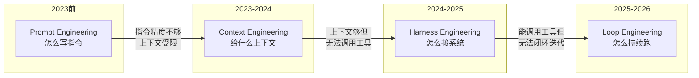
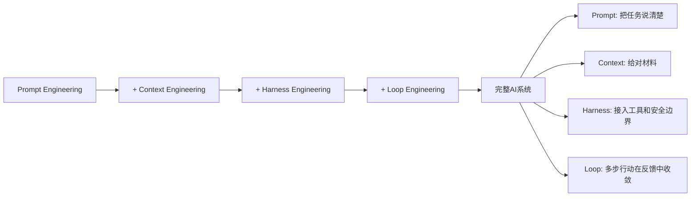

# 从Prompt到Loop — AI工程化的四次进化

> [!abstract] 核心观点
> AI工程化经历了四次进化：Prompt Engineering → Context Engineering → Harness Engineering → Loop Engineering。每次进化都解决上一阶段解决不了的问题，但并不是替代关系，而是层层叠加。2026年，LOOP Engineering正在成为AI Agent生产落地的关键瓶颈。

---

## 一、四次进化的全景

### 1.1 第一阶段：Prompt Engineering（提示词工程）

**时间**：2023年之前

**核心问题**：怎么问模型，才能得到好答案？

**代表技术**：
- Few-shot prompting（少样本提示）
- Chain-of-Thought（思维链）
- Role prompting（角色设定）
- 结构化输出约束（JSON/XML格式）

**能力边界**：
- 优化的是"单次调用的输出质量"
- 无法处理需要多步推理的复杂任务
- 上下文窗口有限，无法承载长流程

**最大的认知转变**：Prompt Engineering不是"魔法"，它是把任务说清楚的能力。但说清楚≠能做成。

### 1.2 第二阶段：Context Engineering（上下文工程）

**时间**：2023-2024年

**核心问题**：给模型看什么材料，才能让回答更准确？

**代表技术**：
- RAG（检索增强生成）
- 向量数据库与语义搜索
- 动态上下文组装
- 知识图谱增强

**能力边界**：
- 上下文够用了，但模型只能"回答问题"，不能"执行任务"
- 没有工具调用能力，无法改变外部世界
- 仍然是"一次问答"模式

**关键突破**：让AI从"凭记忆回答"变成"查资料再回答"，大幅降低了事实性幻觉。

### 1.3 第三阶段：Harness Engineering（框架工程）

**时间**：2024-2025年

**核心问题**：怎么把模型接入系统，让它能调用工具、执行操作？

**代表技术**：
- Function Calling（工具调用）
- MCP（Model Context Protocol）
- 沙箱执行环境
- 安全护栏（Hook机制）

**能力边界**：
- 能调用工具了，但"工具调用一次就结束"，无法形成闭环
- 没有迭代机制，一次错了就全错了
- 缺乏状态管理和进度追踪

**关键突破**：让AI从"说话"变成"做事"，能操作文件、调用API、执行代码。

### 1.4 第四阶段：Loop Engineering（循环工程）— 我们在这里

**时间**：2025-2026年

**核心问题**：怎么让AI持续行动、自我校验、直到目标达成？

**代表技术**：
- Agent Loop（ReAct / Plan-Execute / Reflection）
- Verifier Loop（测试驱动/审查驱动验证）
- Stop Hook + Ralph Loop
- 棘轮机制（Ratcheting）
- 可观测性与回放系统

**核心命题**：把LLM从"单次问答机"改造为"持续决策循环" [$TRAE_REF](https://cloud.tencent.com/developer/article/2711282)

---

## 二、为什么2026年是Loop Engineering的爆发年？

### 2.1 模型能力已到位

2025-2026年，前沿模型（Claude 4、GPT-5、DeepSeek-R1）的推理能力、指令遵循能力、工具调用能力已经足够支撑复杂的多步循环。**瓶颈从"模型不够聪明"变成了"系统设计不够好"** [$TRAE_REF](https://www.ibm.com/think/topics/loop-engineering)。

### 2.2 Terminal Bench 2.0的启示

在Terminal Bench 2.0基准测试中，**同样的模型在不同工具链中排名差异达28位**——Claude Opus 4.6在官方工具里排名第33，但被第三方团队放到定制工具链后冲到第5名 [$TRAE_REF](https://cloud.tencent.com/developer/article/2711282)。

这说明：**模型外部的系统设计（即Loop + Hook + Harness）比模型本身更关键**。

### 2.3 生产环境的需求驱动

| 需求 | 单次问答 | 循环系统 |
|------|---------|---------|
| CI失败自动修复 | 需要人分析错误，再问AI怎么写修复 | AI自动分析→修复→验证→提交 |
| 代码库迁移 | 人拆成小任务，一步步做 | AI自动规划→执行→验证→迭代 |
| PR审查与修复 | 人看Review Comment，再改代码 | AI自动分析Comment→改代码→验证 |
| 依赖升级 | 人手动升级→跑测试→修Bug | AI自动升级→测试→修复→循环 |

这些场景的共同特点是：**不是一次问答能解决的，需要多轮"行动→检查→调整"的闭环**。

---

## 三、四次进化的关系

### 3.1 不是替代，而是叠加

### 3.2 各阶段的能力对比

| 维度 | Prompt | Context | Harness | Loop |
|------|--------|---------|---------|------|
| 核心关注 | 单次指令怎么写 | 上下文怎么组织 | 工具怎么接入 | 循环怎么收敛 |
| 典型形态 | 人问AI答 | 带RAG的问答 | 能调用工具的Agent | 持续迭代的Agent |
| 成功标准 | 回答是否好 | 回答是否准 | 执行是否正确 | 目标是否达成 |
| 最大风险 | 回答不准 | 检索不相关 | 工具调用错误 | 循环发散 |
| 最适合 | 草稿/问答/解释 | 知识密集型问答 | 单步自动化任务 | 多步复杂任务 |

---

## 四、核心公式

> **Agent = Model + Harness** [$TRAE_REF](https://cloud.tencent.com/developer/article/2711282)

更完整的公式：

> **可靠Agent = (好模型 + 好Prompt + 好Context + 好Harness) × 好Loop**

Loop是乘数因子——如果Loop设计得好，其他要素的价值被放大；如果Loop设计得不好，其他要素再好也白费。

---

## 关联笔记

- [[01-AI技术/LOOP Engineering/01-认知篇/02_核心概念与价值]] — LOOP Engineering的核心概念
- [[01-AI技术/LOOP Engineering/01-认知篇/03_四层工程体系的关系]] — 四层工程概念的深度对比
- [[01-AI技术/LOOP Engineering/00_MOC_LOOP_Engineering中枢]] — 返回中枢索引