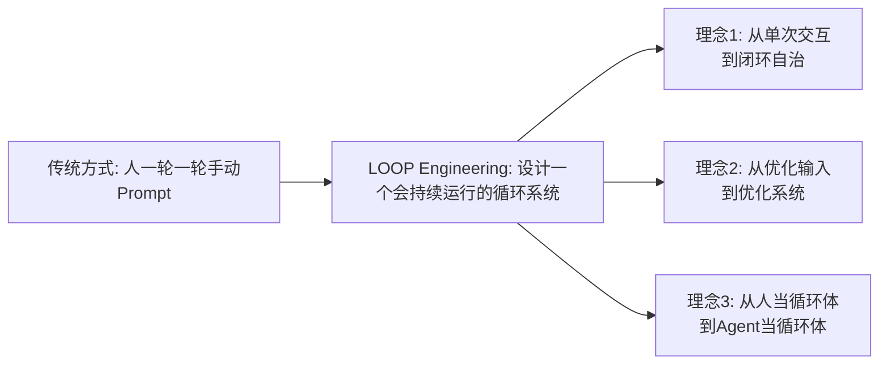

# LOOP Engineering的核心概念与价值

> [!abstract] 核心观点
> LOOP Engineering的核心命题是：**把LLM从"单次问答机"改造为"持续决策循环"**。它不是一个新算法，也不是一个新模型，而是一种运行范式——让现有AI模型从"一次性对话"升级为"持续迭代工作者"的方法论。

---

## 一、核心定义

### 1.1 什么是LOOP Engineering？

**Loop Engineering（循环工程）** 是设计、运行并持续改进AI Agent内部反馈循环的工程实践 [$TRAE_REF](https://www.ibm.com/think/topics/loop-engineering)。

更简洁地说：**设计代理工作流（Agentic Workflows）或循环（Loops）的实践，这些循环迭代地引导AI Agent完成用户定义的目标，且只需最少的人工干预** [$TRAE_REF](https://www.ibm.com/think/topics/loop-engineering)。

### 1.2 三大核心理念



**理念1：从"单次交互"到"闭环自治"**

不再由人一轮一轮手动prompt AI，而是设计一个会持续提示、执行、观察、校验和改进的系统。人只需在开头把目标（验收标准）说清楚，然后在关键节点做决策。

**理念2：从"优化输入"到"优化系统"**

Prompt Engineering优化的是"单次调用的输出质量"，LOOP Engineering优化的是"多次调用的整体成功率"。即使单次输出质量一般，只要循环设计得好，系统也能通过迭代收敛到正确答案。

**理念3：从"人当循环体"到"Agent当循环体"**

原本由人亲自跑的"发现问题→想办法→动手→检查"循环，现在交给Agent去跑。测试失败不是错误，而是关于某个假设被推翻的信号 [$TRAE_REF](https://cloud.tencent.com/developer/article/2711282)。

---

## 二、核心公式

### 2.1 Agent = Model + Harness

这是2026年AI Agent工程化的核心公式 [$TRAE_REF](https://cloud.tencent.com/developer/article/2711282)：

```
Agent = Model（模型能力） + Harness（框架能力）
```

其中Harness包含：
- **Loop**：定义Agent"怎么动"——循环模式、迭代策略
- **Hook**：定义Agent"不能做什么"——安全护栏、强制执行
- **Harness本身**：定义Agent"在什么里面动"——运行时环境、工具集

### 2.2 可靠Agent的完整公式

```
可靠Agent = (好模型 + 好Prompt + 好Context + 好Harness) × 好Loop
```

Loop是乘数因子——如果Loop设计得好，其他要素的价值被放大；如果Loop设计得不好，其他要素再好也白费。

---

## 三、核心价值

### 3.1 LOOP Engineering解决了什么？

| 问题 | 传统方式 | LOOP Engineering方式 |
|------|---------|-------------------|
| **Agent跑偏** | 人需要全程监控，不断纠正 | 循环控制+验证机制自动纠正 |
| **成本不可控** | 不知道Agent会跑多久 | 硬终止条件+Token预算自动截停 |
| **出错难回溯** | 不知道错在哪一步 | 状态记录+回放系统精确定位 |
| **经验不沉淀** | 每次犯错下次还会再犯 | 棘轮机制将错误转化为规则 |
| **人机协作低效** | 人需要全程盯着 | 分层验证机制，人只在关键节点介入 |

### 3.2 适用性矩阵

| 场景 | 适用程度 | 原因 |
|------|---------|------|
| CI失败分析与小修复 | 高 | 有测试、有日志、有停止条件 |
| 依赖升级 | 高 | 可隔离、可验证、可回滚 |
| 大规模代码迁移 | 中高 | 吞吐量高，但最后需人工收尾 |
| PR审查与自动修复 | 高 | 状态清楚，人工合并闸门 |
| 客户发现/画像补全 | 高 | 可批量、可抽样审核 |
| 自动群发客户消息 | 低 | 风控、品牌和合规风险高 |
| 开放式战略判断 | 低 | 成功标准不清晰 |
| 生产权限/支付/删除数据 | 很低 | 必须强人工闸门 |

---

## 四、核心判断

### 4.1 Loop比模型更值钱

在很多生产场景下，**中等模型 + 精心设计的5轮循环，表现优于最强模型的单次输出，而且更便宜** [$TRAE_REF](https://developer.aliyun.com/article/1747820)。

### 4.2 可观测性是1，其他是0

没有回放能力的Agent系统是黑盒，坏了修不了就上不了线 [$TRAE_REF](https://developer.aliyun.com/article/1747820)。

### 4.3 简单优先

能单轮解决的不要做两轮，能单Agent解决的不要做多个。每多一层循环，状态空间翻倍、调试成本翻倍 [$TRAE_REF](https://developer.aliyun.com/article/1747820)。

---

## 五、LOOP Engineering的最终建议

> **让AI Loop做批量生产、检查、分类和复盘；让人负责审核、承诺、上线、触达和最终决策** [$TRAE_REF](https://blog.csdn.net/weixin_74809706/article/details/162579639)

| AI负责 | 人负责 |
|--------|--------|
| 批量生产代码 | 代码审核与上线 |
| 自动化测试与验证 | 测试策略设计 |
| 数据分类与标签 | 分类标准制定 |
| 方案起草与迭代 | 方案决策与承诺 |
| 异常检测与预警 | 异常处置与恢复 |

---

## 关联笔记

- [[01-AI技术/LOOP Engineering/01-认知篇/01_从Prompt到Loop]] — AI工程化的四次进化
- [[01-AI技术/LOOP Engineering/01-认知篇/03_四层工程体系的关系]] — 四层工程概念的深度对比
- [[01-AI技术/LOOP Engineering/00_MOC_LOOP_Engineering中枢]] — 返回中枢索引