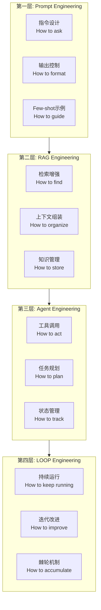
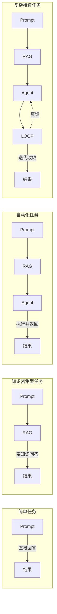
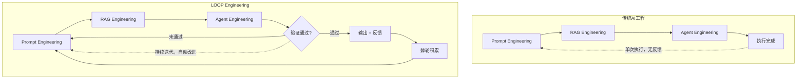
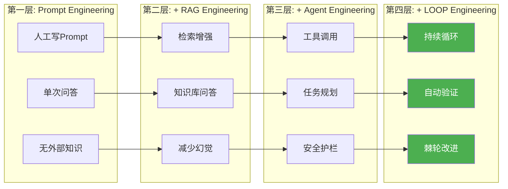

# AI工程四层体系的关系 — Prompt → RAG → Agent → LOOP

> [!abstract] 核心观点
> AI工程并非只有一层，而是由Prompt Engineering、RAG Engineering、Agent Engineering、LOOP Engineering四层叠加构成的体系。每一层解决不同层次的问题，**不是替代关系，而是层层叠加**。LOOP Engineering位于最上层，解决的是"持续运行、持续改进"的问题，但它的可靠性依赖于下面三层的成熟度。

---

## 一、AI工程的四层体系

### 1.1 四层全景



### 1.2 各层定义

| 层级 | 工程领域 | 核心问题 | 代表技术 |
|------|---------|---------|---------|
| **第一层** | Prompt Engineering | 怎么写指令让模型给出好答案？ | Chain-of-Thought, Role Prompting, 结构化输出 |
| **第二层** | RAG Engineering | 怎么组织上下文让答案更准确？ | 向量检索, 知识图谱, 动态上下文组装 |
| **第三层** | Agent Engineering | 怎么让模型调用工具、执行任务？ | Function Calling, MCP, 任务规划, 安全护栏 |
| **第四层** | LOOP Engineering | 怎么让系统持续运行、自我改进？ | 循环模式, 验证机制, 棘轮机制, 可观测性 |

---

## 二、四层的关系不是替代，而是叠加

### 2.1 叠加关系

每一层都建立在前一层的基础之上，并解决前一层无法解决的问题：

```
最终AI系统 = Prompt Engineering 层
            + RAG Engineering 层
            + Agent Engineering 层
            + LOOP Engineering 层
```

### 2.2 每层解决不同层次的问题

| 维度 | Prompt Engineering | RAG Engineering | Agent Engineering | LOOP Engineering |
|------|-------------------|-----------------|-------------------|------------------|
| **关注点** | 指令质量 | 知识质量 | 执行质量 | 迭代质量 |
| **单次 vs 多次** | 单次交互 | 单次检索+生成 | 多步执行 | 持续循环 |
| **有无状态** | 无状态 | 无状态 | 有状态（任务级） | 有状态（跨会话） |
| **有无反馈** | 无反馈 | 无反馈 | 有限反馈 | 完整反馈闭环 |
| **失败模式** | 回答不准 | 检索不相关 | 执行错误 | 循环发散 |
| **改进方式** | 手动调Prompt | 优化检索策略 | 调整工具集 | 自动积累规则 |

### 2.3 不是替代，而是扩展



**关键理解**：四层的关系不是"用Agent就不用RAG"，也不是"有LOOP就不需要Prompt"。恰恰相反——**LOOP Engineering做得越好，对下面三层的要求越高**，因为循环会放大每一层的缺陷。

---

## 三、各层之间的依赖关系

### 3.1 上层依赖下层的可靠性

```
LOOP Engineering 依赖 Agent Engineering 的可靠性
    └── 如果Agent连工具都调不对，LOOP再怎么循环也修不好
Agent Engineering 依赖 RAG Engineering 的准确性
    └── 如果RAG检索到的上下文是错的，Agent的执行方向就偏了
RAG Engineering 依赖 Prompt Engineering 的基础能力
    └── 如果连指令都说不清楚，再好的检索结果也浪费
```

### 3.2 依赖关系矩阵

| 下层 \\ 上层 | Prompt Engineering | RAG Engineering | Agent Engineering | LOOP Engineering |
|-------------|-------------------|-----------------|-------------------|------------------|
| **Prompt Engineering** | — | 指令清晰度影响检索质量 | 指令清晰度影响工具调用 | 指令清晰度影响循环控制 |
| **RAG Engineering** | 不依赖 | — | 上下文质量影响执行准确性 | 检索质量影响循环收敛速度 |
| **Agent Engineering** | 不依赖 | 不依赖 | — | 工具调用可靠性决定循环能否收敛 |
| **LOOP Engineering** | 不依赖 | 不依赖 | 不依赖 | — |

### 3.3 依赖链断裂的后果

| 断裂点 | 现象 | 影响范围 |
|--------|------|---------|
| Prompt层薄弱 | 模型理解错意图，后续所有层都白费 | 全局 |
| RAG层薄弱 | Agent拿到错误上下文，执行方向偏离 | Agent + LOOP |
| Agent层薄弱 | 工具调用不稳定，LOOP无法收敛 | LOOP |
| LOOP层薄弱 | 没有迭代机制，复杂任务一次失败就全盘失败 | 仅LOOP |

---

## 四、从四层体系看LOOP Engineering的定位

### 4.1 LOOP Engineering解决的核心问题

在四层体系中，LOOP Engineering的独特定位是解决两个问题：

1. **持续运行（Continuous Operation）**：让AI系统不止执行一次，而是持续运行直到目标达成
2. **持续改进（Continuous Improvement）**：让AI系统从每次运行中学习，下次做得更好

### 4.2 与其他三层的关键区别

| 维度 | 前三层 | LOOP Engineering |
|------|--------|-----------------|
| **时间维度** | 关注"单次"或"单次任务" | 关注"持续运行" |
| **改进方式** | 人工优化（调Prompt、调检索、调工具） | 自动改进（棘轮机制） |
| **失败处理** | 失败就结束，人工介入 | 失败后自动重试、降级、回滚 |
| **状态管理** | 无状态或少状态 | 完整的状态管理 + 回放系统 |
| **衡量标准** | 单次质量（准确率、召回率） | 持续质量（收敛率、改进速度） |

### 4.3 LOOP Engineering在四层中的位置



---

## 五、实际项目中如何选择层组合

### 5.1 层组合决策树

```
任务需要AI吗？
├── 不需要 → 不用AI
└── 需要AI →
    ├── 简单问答/生成 →
    │   └── Prompt Engineering 即可
    ├── 需要专业知识 →
    │   └── Prompt Engineering + RAG Engineering
    ├── 需要执行操作 →
    │   └── Prompt Engineering + RAG Engineering + Agent Engineering
    └── 需要持续运行/迭代改进 →
        └── 四层全用（Prompt + RAG + Agent + LOOP）
```

### 5.2 场景与层组合对照表

| 场景 | 层组合 | 理由 |
|------|--------|------|
| 写一封邮件草稿 | Prompt | 一次生成，人直接改 |
| 基于知识库回答客户问题 | Prompt + RAG | 需要检索知识，但不需要执行 |
| 自动创建Jira Ticket | Prompt + RAG + Agent | 需要调用Jira API |
| CI失败自动修复 | 四层全用 | 需要持续迭代直到修复成功 |
| 代码库迁移 | 四层全用 | 需要持续运行数千次迁移任务 |
| PR自动审查 | 四层全用 | 需要每次审查+学习积累 |
| 自动数据分析 | Prompt + RAG + Agent | 单次分析，不需要持续运行 |

### 5.3 层组合的成本考量

| 层组合 | 单次成本 | 调试复杂度 | 维护成本 | 适用任务规模 |
|--------|---------|-----------|---------|------------|
| 仅Prompt | 低 | 低 | 低 | 简单任务 |
| Prompt + RAG | 中低 | 中 | 中 | 知识密集型 |
| Prompt + RAG + Agent | 中 | 高 | 中高 | 自动化任务 |
| 四层全用 | 中高 | 很高 | 高 | 复杂持续任务 |

---

## 六、一张图总结四层体系的演进路径



### 6.1 演进的核心驱动力

| 阶段 | 驱动力 | 关键突破 |
|------|--------|---------|
| Prompt → RAG | 模型知识有限，需要外部知识补充 | 向量数据库 + 语义检索 |
| RAG → Agent | 只回答问题不够，需要执行任务 | Function Calling + MCP |
| Agent → LOOP | 单次执行不够，需要持续运行 | 循环模式 + 验证机制 + 棘轮 |

### 6.2 2026年的关键判断

> **四层体系不是可选项，而是必选项。如果你的AI系统只用了前三层，它就只能在"单次执行"场景下工作。要让AI真正成为"持续工作者"，必须加上LOOP Engineering这一层。**

### 6.3 对团队的启示

| 团队现状 | 建议 |
|---------|------|
| 只做Prompt Engineering | 尽快补上RAG和Agent能力 |
| 有Prompt+RAG能力 | 开始构建Agent Engineering能力 |
| 已有Agent系统 | 加入LOOP Engineering，让系统持续改进 |
| 四层都具备 | 重点优化各层之间的接口和依赖关系 |

---

## 关联笔记

- [[01-AI技术/LOOP Engineering/01-认知篇/01_从Prompt到Loop]] — AI工程化的四次进化历史
- [[01-AI技术/LOOP Engineering/01-认知篇/02_核心概念与价值]] — LOOP Engineering的核心概念
- [[01-AI技术/LOOP Engineering/02-模式篇/01_ReAct Loop]] — 最基础的循环模式
- [[01-AI技术/LOOP Engineering/03-架构篇/04_Open Loop vs Closed Loop]] — 开环与闭环架构
- [[01-AI技术/LOOP Engineering/00_MOC_LOOP_Engineering中枢]] — 返回中枢索引