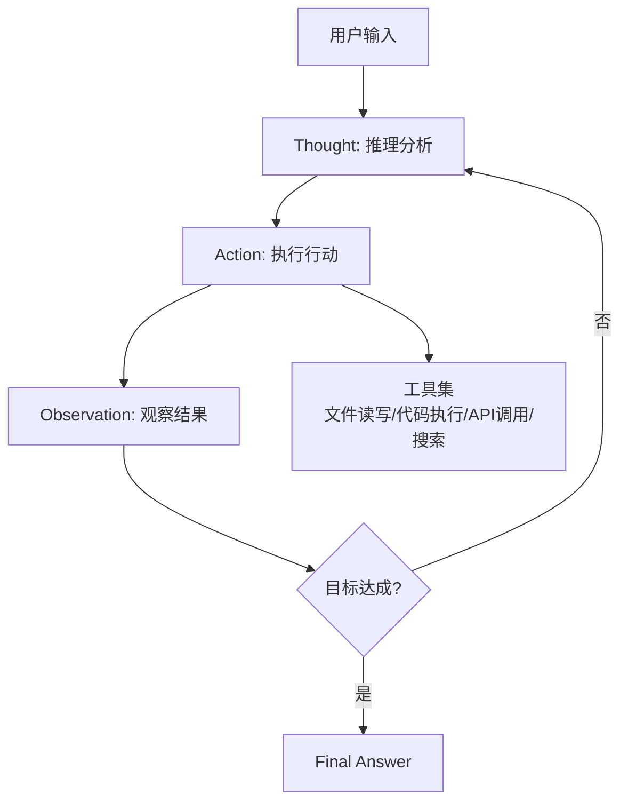

# ReAct Loop — 推理-行动-观察的基础循环

> [!abstract] 核心观点
> ReAct（推理+行动，Reasoning + Acting）是AI Agent最基础的循环模式。它让LLM在每一步输出"推理-行动-观察"三段式文本，通过交替推理和行动来完成任务。简单、易实现，但依赖模型自我评估，长任务容易跑偏。

---

## 一、起源与核心思想

### 1.1 起源

ReAct于2022年由Yao等人提出，论文标题为《ReAct: Synergizing Reasoning and Acting in Language Models》[$TRAE_REF](https://datasciencedojo.com/blog/agentic-loops-explained-from-react-to-loop-engineering-2026-guide/)。

核心思想很简单：**让LLM在推理（Reasoning）和行动（Acting）之间交替进行**，而不是只做推理或只做行动。

### 1.2 核心流程

```
Question → Thought → Action → Observation → Thought → Action → ... → Final Answer
```

每个步骤的含义：

| 步骤 | 含义 | 示例 |
|------|------|------|
| **Thought（推理）** | 分析当前状态，决定下一步做什么 | "当前目录下没有找到配置文件，我需要检查一下父目录" |
| **Action（行动）** | 调用工具或执行操作 | `ls ../` 或 `read_file('config.json')` |
| **Observation（观察）** | 观察行动结果，为下一步推理提供依据 | "父目录下有一个config.json文件" |

---

## 二、架构图



---

## 三、优缺点分析

### 3.1 优点

| 优点 | 说明 |
|------|------|
| **实现简单** | 只需要一个LLM调用循环，不需要复杂的架构设计 |
| **上下文自然保留** | 每一步的Thought-Action-Observation都保留在对话历史中 |
| **容易调试** | 每步推理过程可见，便于定位问题 |
| **通用性强** | 适用于各类任务，不需要预先定义任务结构 |

### 3.2 缺点

| 缺点 | 说明 |
|------|------|
| **依赖LLM自我评估** | 模型说"完成"循环就停，但任务可能远未达标 |
| **长任务易跑偏** | 每轮都要重新看历史，随着上下文增长，模型容易迷失 |
| **上下文窗口膨胀** | 迭代轮数越多，Token消耗越大，成本越高 |
| **无外部验证** | 没有独立校验机制，错误可能逐轮放大 |

---

## 四、适用场景

| 场景 | 推荐度 | 说明 |
|------|--------|------|
| 简单问答 | ⭐⭐⭐⭐⭐ | 单步或少量步骤即可完成 |
| 单步工具调用 | ⭐⭐⭐⭐⭐ | 如"帮我查一下今天的天气" |
| 信息检索 | ⭐⭐⭐⭐ | 如"搜索并总结XXX的最新进展" |
| 代码生成 | ⭐⭐⭐ | 如果代码需要多步调试，推荐用Reflection Loop |
| 复杂任务（>10步） | ⭐⭐ | 容易跑偏，推荐Plan-Execute或Ralph Loop |

---

## 五、实现示例

### 5.1 伪代码

```python
def react_loop(task, tools, max_steps=10):
    messages = [{"role": "user", "content": task}]
    
    for step in range(max_steps):
        # 1. LLM推理 → 决定下一步行动
        response = llm.invoke(messages)
        thought = extract_thought(response)
        action = extract_action(response)
        
        # 2. 执行行动
        observation = execute_action(action, tools)
        
        # 3. 将结果加入上下文
        messages.append({"role": "assistant", "content": response})
        messages.append({"role": "system", "content": f"观察结果: {observation}"})
        
        # 4. 检查是否完成（依赖LLM自我评估）
        if is_final_answer(response):
            return response
    
    return "达到最大步数，任务未完成"
```

### 5.2 关键设计决策

| 决策 | 选项 | 推荐 |
|------|------|------|
| 最大迭代步数 | 5/10/20/无限制 | 根据任务复杂度设定，建议不超过20 |
| 终止条件 | LLM自我评估 / 外部检查 | 至少设定最大步数，有条件时加外部验证 |
| 上下文管理 | 保留全部 / 摘要压缩 | 超过10步建议做摘要压缩 |

---

## 六、常见陷阱与应对

| 陷阱 | 表现 | 应对 |
|------|------|------|
| **过早停止** | Agent说"完成"但任务没做完 | 加入外部验证机制，升级为Ralph Loop |
| **循环振荡** | Agent在同一个问题上反复绕圈 | 设定"连续N轮无变化"终止条件 |
| **工具滥用** | Agent不断调用同样的工具 | 限制同一工具调用频率 |
| **上下文迷失** | 长任务中Agent忘记初始目标 | 定期注入目标摘要作为reminder |

---

## 七、核心总结

```
ReAct = 推理 + 行动 + 观察
├── 优点：简单、通用、易调试
├── 缺点：依赖自我评估、长任务易跑偏
├── 适合：简单任务、单步工具调用
└── 升级路径：→ Reflection Loop（加验证）→ Ralph Loop（外部Stop Hook）
```

---

## 关联笔记

- [[01-AI技术/LOOP Engineering/02-模式篇/02_Plan-Execute Loop]] — 适合结构化任务的分解循环
- [[01-AI技术/LOOP Engineering/02-模式篇/03_Reflection Loop]] — 在ReAct基础上加入Review步骤
- [[01-AI技术/LOOP Engineering/02-模式篇/04_Ralph Loop]] — 外部Stop Hook驱动的高可靠性循环
- [[01-AI技术/LOOP Engineering/00_MOC_LOOP_Engineering中枢]] — 返回中枢索引