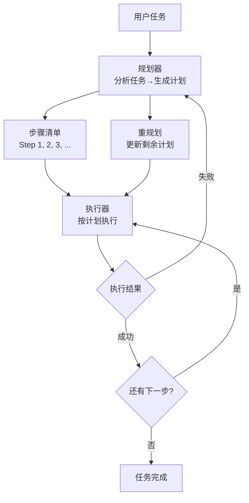

# Plan-Execute Loop — 计划-执行-重计划的分解循环

> [!abstract] 核心观点
> Plan-Execute Loop把循环拆成两层——外层规划器输出步骤清单，内层执行器按计划逐项执行。遇到失败时，外层规划器重新规划。自主完成率约75%，适合任务结构相对明确的场景 [$TRAE_REF](https://blog.csdn.net/Jane_Smart/article/details/161286456)。

---

## 一、核心思想

与ReAct"边想边做"不同，Plan-Execute采取"先计划再执行"的策略：

1. **先规划**：分析任务，拆解为可执行的步骤清单
2. **再执行**：按计划逐项执行
3. **遇错重规划**：某一步执行失败时，更新剩余计划

这种模式更适合**任务结构相对明确**的场景——虽然无法预知所有细节，但大致路径是清晰的。

---

## 二、架构图



### 2.1 规划器 vs 执行器的分工

| 角色 | 职责 | 能力要求 |
|------|------|---------|
| **规划器（Planner）** | 分析任务、生成计划、失败时重规划 | 需要较强的推理能力和全局视角 |
| **执行器（Executor）** | 按计划逐项执行、报告结果 | 需要较强的执行能力和工具调用能力 |

---

## 三、工作流程

### 3.1 标准流程

```
用户: "把这个项目从Python 3.9迁移到3.12"

规划器:
  Plan:
    1. 检查当前项目结构
    2. 更新requirements.txt中的依赖版本
    3. 运行测试，记录失败项
    4. 逐一修复语法兼容性问题
    5. 运行测试确认全部通过

执行器:
  → Step 1: 检查项目结构... ✅ 完成
  → Step 2: 更新requirements.txt... ✅ 完成
  → Step 3: 运行测试... ❌ 发现3个失败
  → 通知规划器失败

规划器（重规划）:
  Plan:
    4.1. 修复test_db.py中的async语法问题
    4.2. 修复test_api.py中的类型注解问题
    4.3. 修复test_utils.py中的废弃API调用
    5. 运行测试确认全部通过
```

### 3.2 与ReAct的关键区别

| 维度 | ReAct | Plan-Execute |
|------|-------|-------------|
| 规划时机 | 边做边想 | 先规划再执行 |
| 计划形式 | 隐式（在Thought中） | 显式（输出步骤清单） |
| 失败处理 | 在当前步修正 | 通知规划器重规划 |
| 适合任务 | 路径不明确的任务 | 结构相对明确的任务 |
| 自主完成率 | ~60% | ~75% |

---

## 四、优缺点分析

### 4.1 优点

| 优点 | 说明 |
|------|------|
| **任务可见性高** | 执行前就能看到完整计划，便于人工审核 |
| **失败恢复能力强** | 某一步失败后，规划器可以重新规划，而非从头开始 |
| **适合结构化任务** | 代码生成、数据分析、文档整理等任务表现良好 |
| **可并行执行** | 独立的步骤可以Fan-out并行执行 |

### 4.2 缺点

| 缺点 | 说明 |
|------|------|
| **计划可能过时** | 静态计划在动态环境中容易失效 |
| **规划本身有成本** | 复杂任务的规划可能消耗大量Token |
| **过度规划** | 规划器可能花费过多精力在"完美计划"上 |
| **不适合探索性任务** | 如果路径完全不明确，规划本身就很困难 |

---

## 五、适用场景

| 场景 | 推荐度 | 说明 |
|------|--------|------|
| 代码生成 | ⭐⭐⭐⭐⭐ | 结构清晰，可拆解为文件级任务 |
| 数据分析 | ⭐⭐⭐⭐⭐ | 可规划：数据清洗→探索→建模→可视化 |
| 文档整理 | ⭐⭐⭐⭐ | 可规划：分类→重命名→归档 |
| 依赖升级 | ⭐⭐⭐⭐⭐ | 升级→测试→修复→再测试，可预测 |
| 探索性研究 | ⭐⭐ | 路径不明确，ReAct更合适 |
| 创意写作 | ⭐⭐⭐ | 规划框架 + 灵活执行 |

---

## 六、实现要点

### 6.1 规划器Prompt设计要点

```
你是一位任务规划专家。请将以下任务拆解为可执行的步骤清单。

要求：
1. 每个步骤应该是独立的、可验证的
2. 步骤之间应有明确的依赖关系
3. 如果某步骤失败，应说明如何影响后续步骤
4. 输出格式：JSON步骤清单

任务：[用户任务描述]
```

### 6.2 执行器设计要点

- 执行器应该**忠实地执行计划**，而不是自作主张修改计划
- 如果执行中发现计划不合理，应该**报告给规划器**而不是自己改
- 每个步骤执行后，应该**输出明确的成功/失败状态**

### 6.3 重规划策略

| 策略 | 说明 | 适合场景 |
|------|------|---------|
| **完全重规划** | 从头生成新的计划 | 原计划严重偏离实际 |
| **增量重规划** | 只更新失败步骤之后的部分 | 大部分步骤顺利执行 |
| **局部重规划** | 只替换失败的那一步 | 单步失败，不影响其他步骤 |

---

## 七、常见陷阱与应对

| 陷阱 | 表现 | 应对 |
|------|------|------|
| **过度规划** | 规划器花长时间生成"完美计划"，实际执行时发现计划没用 | 设定规划时间/Token上限 |
| **计划僵化** | 执行器发现计划不合理但仍然执行 | 允许执行器标记"计划不合理"状态 |
| **重规划循环** | 重规划后再次失败→再次重规划，无限循环 | 设定最大重规划次数 |
| **步骤粒度不当** | 步骤太细→规划成本高；步骤太粗→执行困难 | 根据任务复杂度自动调整粒度 |

---

## 关联笔记

- [[01-AI技术/LOOP Engineering/02-模式篇/01_ReAct Loop]] — 基础循环模式
- [[01-AI技术/LOOP Engineering/02-模式篇/03_Reflection Loop]] — 加入Review步骤的迭代循环
- [[01-AI技术/LOOP Engineering/02-模式篇/04_Ralph Loop]] — 外部Stop Hook驱动的高可靠性循环
- [[01-AI技术/LOOP Engineering/00_MOC_LOOP_Engineering中枢]] — 返回中枢索引