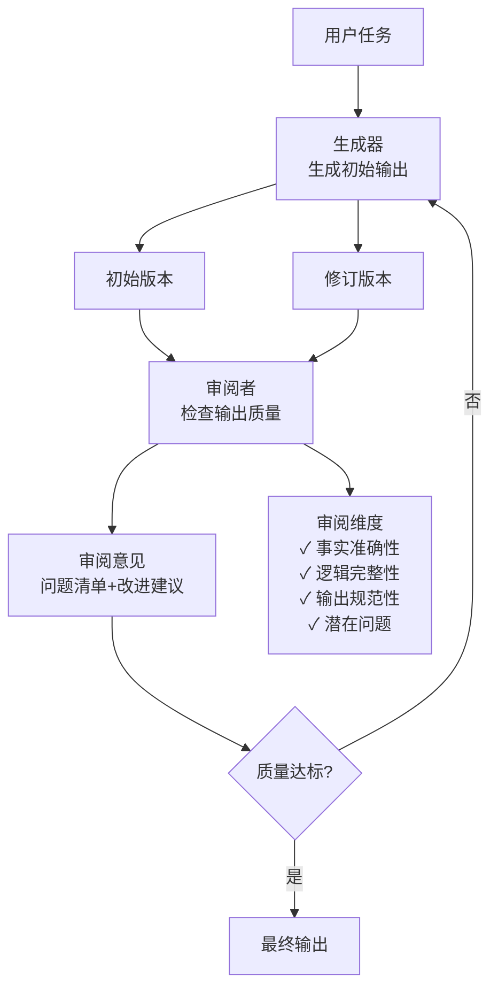

# Reflection Loop — 生成-反思-修订的迭代循环

> [!abstract] 核心观点
> Reflection Loop在Action之后加入Review步骤，让模型对自己的产出打分、提意见，然后塞回循环重做。2-3轮反思循环往往比更强模型的单次输出效果更好，而且成本更低。这是"用时间换质量"的经典模式。

---

## 一、核心思想

Reflection Loop的核心洞察是：**LLM在"一次生成"中很难做到完美，但如果给它一个"自己检查自己"的机会，质量会显著提升**。

流程很简单：
```
Draft → Review(critique) → Revise → Review(critique) → Final
```

这就像写文章：先写草稿，再自己审阅修改，反复几次，质量越来越好。

---

## 二、架构图



---

## 三、三种Reflection模式

### 3.1 自我反思（Self-Reflection）

**用一个模型同时扮演生成者和审阅者**。

```
流程: Draft → 同一模型Review → Revise → 同一模型Review → Final
优点: 实现简单，不需要两个模型
缺点: 模型可能"太爱自己的产出"，找不出真问题
```

### 3.2 交叉反思（Cross-Reflection）

**用不同的模型或Prompt担任生成者和审阅者**。

```
流程: 模型A Draft → 模型B Review → 模型A Revise → 模型B Review → Final
优点: 审阅者更客观，能发现更多问题
缺点: 成本翻倍，需要协调两个模型
```

### 3.3 对抗反思（Adversarial Reflection）

**审阅者被指示"尽可能挑剔"，专门找问题**。

```
流程: 模型A Draft → 模型B（挑剔模式）Review → 模型A Revise → 模型B Review → Final
优点: 能发现最隐蔽的问题，质量最高
缺点: 审阅者可能"过度挑剔"，导致无谓的修改
```

**三种模式对比**：

| 模式 | 成本 | 质量提升 | 实现复杂度 | 推荐场景 |
|------|------|---------|-----------|---------|
| 自我反思 | 低 | 中 | 低 | 日常写作、简单代码 |
| 交叉反思 | 中 | 高 | 中 | 代码修复、报告输出 |
| 对抗反思 | 高 | 最高 | 中 | 重要文档、关键代码 |

---

## 四、优缺点分析

### 4.1 优点

| 优点 | 说明 |
|------|------|
| **质量提升显著** | 2-3轮反思后，输出质量接近更强模型的一次性输出 |
| **成本效益高** | 弱模型+3轮反思 < 强模型×1次调用，成本更低 |
| **自带迭代闭环** | 可以叠加在ReAct / Plan-Execute之上使用 |
| **审阅标准可定制** | 可以根据任务定制审阅维度和检查清单 |

### 4.2 缺点

| 缺点 | 说明 |
|------|------|
| **依赖审阅质量** | 如果审阅者不够"挑剔"，反思流于形式 |
| **可能过度修改** | 审阅者提出的修改意见可能并不必要，导致"越改越差" |
| **迭代次数难确定** | 何时停止迭代？需要设定最大迭代次数 |
| **成本线性增长** | 每轮反思成本≈一次完整调用 |

---

## 五、适用场景

| 场景 | 推荐度 | 说明 |
|------|--------|------|
| 写作与内容生成 | ⭐⭐⭐⭐⭐ | 反思对写作质量提升最明显 |
| 代码修复 | ⭐⭐⭐⭐⭐ | 先写修复→审阅发现Bug→修正 |
| 长文档摘要 | ⭐⭐⭐⭐ | 一次生成的摘要可能遗漏关键点 |
| 数据分析报告 | ⭐⭐⭐⭐ | 检查数据准确性、逻辑完整性 |
| 翻译 | ⭐⭐⭐⭐ | 初译→审阅→修订，显著提升质量 |

---

## 六、实现示例

### 6.1 审阅Prompt设计

```
你是一位严格的质量审阅专家。请对以下内容进行审阅，给出具体改进建议。

审阅维度：
1. 事实准确性：是否有事实错误、数据不准确？
2. 逻辑完整性：推理链条是否完整？有无逻辑断裂？
3. 输出规范性：格式是否符合要求？
4. 潜在问题：是否存在遗漏或误解？

输出格式：
- 问题1：[描述] | 严重程度：高/中/低
- 问题2：[描述] | 严重程度：高/中/低
- ...

总体评价：✅通过 / ⚠️有条件通过 / ❌不通过
```

### 6.2 迭代控制策略

| 策略 | 说明 | 推荐值 |
|------|------|--------|
| 最大迭代次数 | 超过此次数强制终止 | 3轮 |
| 连续无变化 | 连续N轮没有实质性修改 | 2轮 |
| 质量评分阈值 | 审阅评分超过阈值即可终止 | 根据任务自定义 |
| 成本预算 | Token消耗达到上限终止 | 任务预算的80% |

---

## 七、常见陷阱与应对

| 陷阱 | 表现 | 应对 |
|------|------|------|
| **审阅流于形式** | 审阅者总说"很好"，没有实质反馈 | 审阅Prompt中加入"必须找出至少3个问题" |
| **过度修改** | 修改后反而变差 | 保留每次版本，最终选择评分最高的 |
| **审阅者偏见** | 审阅者对某些风格有偏好 | 使用交叉反思，生成者和审阅者用不同模型 |
| **迭代不收敛** | 每次修改都引入新问题 | 限定修改范围，只改被指出的问题 |

---

## 八、核心总结

```
Reflection = 生成 + 审阅 + 修订
├── 自我反思：一个模型，简单但可能不够客观
├── 交叉反思：两个模型，更客观但成本更高
├── 对抗反思：最挑剔的审阅，质量最高
├── 适合：写作、代码修复、长文档摘要
└── 升级路径：叠加在ReAct/Plan-Execute之上
```

---

## 关联笔记

- [[01-AI技术/LOOP Engineering/02-模式篇/01_ReAct Loop]] — 基础循环模式
- [[01-AI技术/LOOP Engineering/02-模式篇/02_Plan-Execute Loop]] — 计划-执行循环，可与Reflection叠加
- [[01-AI技术/LOOP Engineering/02-模式篇/04_Ralph Loop]] — 外部Stop Hook驱动的高可靠性循环
- [[01-AI技术/LOOP Engineering/00_MOC_LOOP_Engineering中枢]] — 返回中枢索引