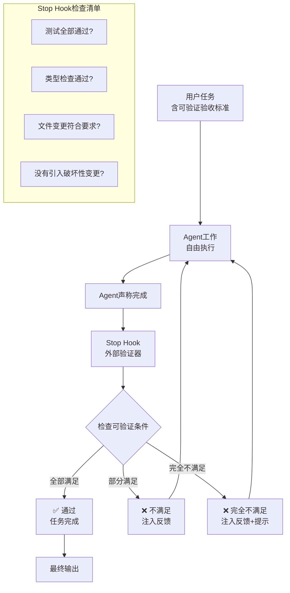

# Ralph Loop — 外部Stop Hook驱动的可靠性循环

> [!abstract] 核心观点
> Ralph Loop是2025年底由Claude Code社区提出的高可靠性循环模式。它的核心创新是不信任模型的自我评估，用**外部Stop Hook**来强制判断任务是否真正完成。自主完成率约90%，远高于ReAct（~60%）和Plan-Execute（~75%），但成本也更高 [$TRAE_REF](https://cloud.tencent.com/developer/article/2711282)。

---

## 一、背景与命名

### 1.1 为什么需要Ralph Loop？

ReAct和Plan-Execute的共性问题：**循环的终止是由模型自己决定的**。

- ReAct：模型说"完成"→循环停（但任务可能远未达标）
- Plan-Execute：计划执行完毕→循环停（但输出质量可能不合格）

Ralph Loop的解决方案：**不让模型决定"什么时候做完"，而是用外部可验证的标准来判断**。

### 1.2 命名由来

Ralph Loop以《辛普森一家》中"永不放弃"的角色命名。寓意：**Agent可以声称"我完成了"，但Stop Hook会像一个永不放弃的检查者，反复确认直到真正的目标达成** [$TRAE_REF](https://cloud.tencent.com/developer/article/2711282)。

---

## 二、架构图



---

## 三、与其他模式的对比

| 维度 | ReAct | Plan-Execute | Ralph |
|------|-------|-------------|-------|
| **循环控制** | LLM自我评估 | 静态计划驱动 | 外部Stop Hook |
| **终止条件** | 模型说"完成" | 计划执行完毕 | 可验证的客观标准 |
| **自主完成率** | ~60% | ~75% | ~90% |
| **平均迭代轮数** | 3-5轮 | 5-10轮 | 5-15轮 |
| **单任务成本** | $5-15 | $15-50 | $50-200 |
| **适用复杂度** | 低 | 中 | 高 |
| **可靠性** | 低 | 中 | 高 |

数据来源：Terminal Bench 2.0及社区实践统计 [$TRAE_REF](https://cloud.tencent.com/developer/article/2711282)

---

## 四、Stop Hook的设计

### 4.1 Stop Hook的核心职责

```python
def stop_hook(agent_state):
    """
    Stop Hook：Agent声称完成时调用
    返回：True（通过）/ False（不通过，附反馈）
    """
    checks = []
    
    # 1. 测试检查
    checks.append(check_tests_passed())
    
    # 2. 类型检查
    checks.append(check_type_errors())
    
    # 3. 文件变更检查
    checks.append(check_file_changes())
    
    # 4. 目标达成检查
    checks.append(check_acceptance_criteria())
    
    # 5. 副作用检查
    checks.append(check_no_side_effects())
    
    failed = [c for c in checks if not c.passed]
    if failed:
        return False, format_feedback(failed)
    return True, "全部通过"
```

### 4.2 可验证的完成条件

Ralph Loop要求**所有验收标准必须是可自动验证的**：

| 条件类型 | 可验证方式 | 示例 |
|---------|-----------|------|
| 测试通过 | 运行测试套件 | "pytest全部通过" |
| 类型检查 | 运行类型检查器 | "mypy零错误" |
| 代码规范 | 运行Linter | "eslint零错误" |
| 文件变更 | Diff检查 | "只修改了指定文件" |
| 输出格式 | Schema验证 | "输出符合JSON Schema" |
| 性能指标 | 基准测试 | "API响应时间<200ms" |

---

## 五、优缺点分析

### 5.1 优点

| 优点 | 说明 |
|------|------|
| **最高可靠性** | 自主完成率~90%，是当前最可靠的循环模式 |
| **客观终止** | 不依赖模型自我评估，基于可验证标准 |
| **防止过早停止** | Agent无法通过"声称完成"来逃避困难任务 |
| **可审计** | 每轮验证结果可记录，便于追溯 |

### 5.2 缺点

| 缺点 | 说明 |
|------|------|
| **成本高** | 单任务$50-200，是ReAct的10倍以上 |
| **需要可验证标准** | 不是所有任务都有可自动验证的验收标准 |
| **实现复杂** | 需要设计Stop Hook、验证器、反馈注入机制 |
| **可能过度迭代** | 验证标准过于严格时，Agent可能陷入不断修改 |

---

## 六、适用场景

| 场景 | 推荐度 | 说明 |
|------|--------|------|
| CI失败自动修复 | ⭐⭐⭐⭐⭐ | 有测试、有lint、有类型检查，天然适合 |
| 代码库迁移 | ⭐⭐⭐⭐ | 可验证编译通过、测试通过 |
| 依赖升级 | ⭐⭐⭐⭐⭐ | 可验证升级后测试通过 |
| 安全审计修复 | ⭐⭐⭐⭐ | 可验证安全扫描通过 |
| 文档生成 | ⭐⭐⭐ | 验证标准较难定义 |
| 创意任务 | ⭐⭐ | 质量主观，难以自动验证 |

> **核心原则**：任务的可验证性越高，Ralph Loop的性价比越高。

---

## 七、实现要点

### 7.1 验收标准定义

Ralph Loop最关键的一步：**把任务目标转化为可验证的验收标准**。

```
❌ 模糊目标："优化这个函数的性能"
✅ 可验证目标："优化这个函数，使1000次调用耗时从500ms降至200ms以下"

❌ 模糊目标："修复这个Bug"
✅ 可验证目标："修复这个Bug，使所有现有测试通过，并新增一个覆盖该Bug场景的测试"
```

### 7.2 反馈注入策略

当Stop Hook判定不通过时，如何向Agent反馈？

| 策略 | 说明 | 推荐 |
|------|------|------|
| **直接反馈** | 告诉Agent哪些条件不满足 | 默认策略 |
| **带提示反馈** | 除了告诉不满足外，给出修改方向 | 提高效率 |
| **分级反馈** | 按严重程度排序反馈问题 | 避免Agent被过多信息淹没 |

### 7.3 终止保护

即使有Stop Hook，也需要防止无限循环：

```
硬终止条件（必须全部配置）：
1. 最大迭代次数：15轮
2. 连续N轮无变化：3轮
3. Token预算耗尽：任务预算上限
4. 目标达成：Stop Hook通过
5. 人工干预：用户手动终止
```

---

## 八、常见陷阱与应对

| 陷阱 | 表现 | 应对 |
|------|------|------|
| **验证标准过松** | Stop Hook容易通过，但质量不达标 | 严格定义验收标准，宁可过严 |
| **验证标准过严** | Agent永远无法满足，陷入无限循环 | 设定最大迭代次数保护 |
| **反馈不够具体** | Agent知道不满足但不知道如何改 | 反馈中明确"差在哪里+如何改进" |
| **成本失控** | 迭代轮数过多，Token消耗巨大 | 设定Token预算上限和轮数上限 |

---

## 九、核心总结

```
Ralph = ReAct/Plan-Execute + 外部Stop Hook
├── 核心创新：不信任模型自我评估，用外部验证器
├── 自主完成率：~90%（vs ReAct ~60%，Plan-Execute ~75%）
├── 成本：$50-200/任务（vs ReAct $5-15）
├── 适合：高可靠性场景、有可验证验收标准的任务
└── 关键前提：验收标准必须是可自动验证的
```

---

## 关联笔记

- [[01-AI技术/LOOP Engineering/02-模式篇/01_ReAct Loop]] — 基础循环模式，Ralph的底层引擎
- [[01-AI技术/LOOP Engineering/02-模式篇/02_Plan-Execute Loop]] — 计划-执行循环
- [[01-AI技术/LOOP Engineering/02-模式篇/03_Reflection Loop]] — 反思循环，可与Ralph叠加
- [[01-AI技术/LOOP Engineering/03-架构篇/03_Hook Loop Harness范式]] — Stop Hook的完整理论框架
- [[01-AI技术/LOOP Engineering/00_MOC_LOOP_Engineering中枢]] — 返回中枢索引