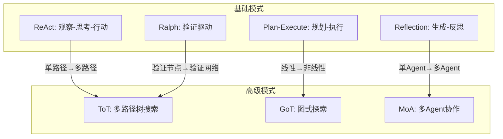
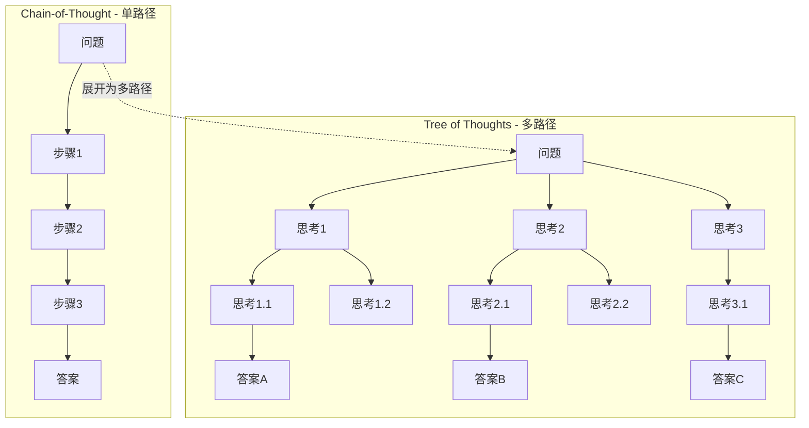
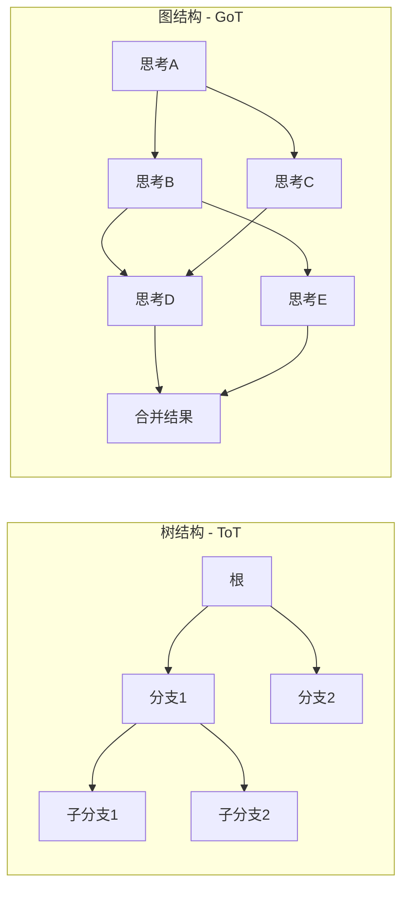
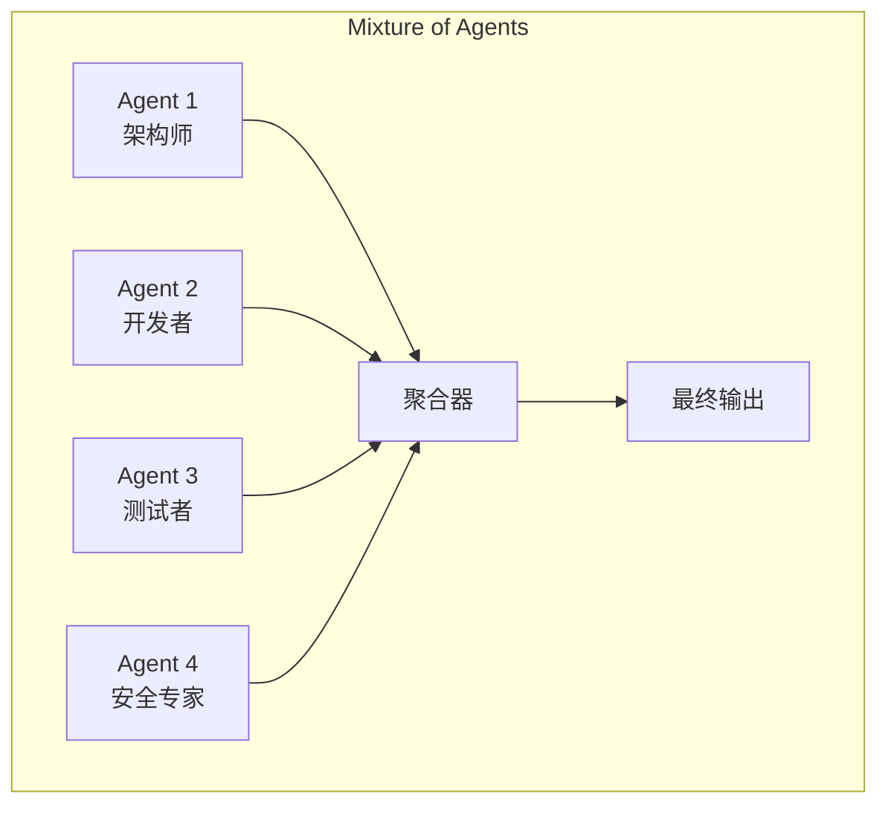
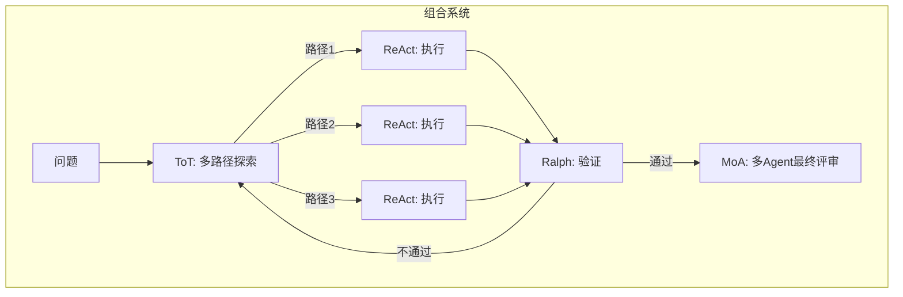

# 高级循环模式 — Tree of Thoughts / Graph of Thoughts / Mixture of Agents

> [!abstract] 核心观点
> 基础循环模式（ReAct、Plan-Execute、Reflection、Ralph）解决的是"单路径迭代"问题，而高级循环模式解决的是"多路径探索"和"多Agent协作"问题。Tree of Thoughts（ToT）通过多路径推理提升决策质量，Graph of Thoughts（GoT）通过非结构化图实现灵活探索，Mixture of Agents（MoA）通过多Agent协作汇聚群体智慧。三者各有适用场景，也可在同一个系统中组合使用。

---

## 一、高级模式概览

### 1.1 三种高级模式的核心特征

| 模式 | 核心思想 | 数据结构 | 并行度 | 适用场景 |
|------|---------|---------|--------|---------|
| **Tree of Thoughts (ToT)** | 多路径推理，剪枝回溯 | 树 | 中 | 需要深度推理的复杂问题 |
| **Graph of Thoughts (GoT)** | 非结构化推理图，节点合并 | 有向图 | 高 | 需要灵活探索的开放性问题 |
| **Mixture of Agents (MoA)** | 多Agent投票、辩论、协作 | 网络 | 高 | 需要多方视角的综合判断 |

### 1.2 与基础模式的关系



**关键理解**：高级模式不是替代基础模式，而是在基础模式之上增加"多路径"和"多Agent"两个维度。

---

## 二、Tree of Thoughts（ToT）

### 2.1 核心概念

Tree of Thoughts（ToT）由Princeton的Yao等人于2023年提出，将Chain-of-Thought的"单条推理链"扩展为"多路径推理树" [$TRAE_REF](https://arxiv.org/abs/2305.10601)。



### 2.2 多路径推理

ToT的核心机制分为三个步骤：

**Step 1: 思维生成（Thought Generation）**
在每一步从当前节点生成多个候选思维：

```
输入: 当前状态 S
输出: 候选思维列表 [T₁, T₂, ..., Tₙ]

方法:
  - 采样法: 多次调用LLM获取不同输出
  - 序列法: 让LLM生成"接下来n步可能的方案"
```

**Step 2: 状态评估（State Evaluation）**
对每个候选思维进行评估，决定哪些值得继续探索：

```
评估方式:
  - 评分法: 让LLM给每个候选打分（1-10分）
  - 投票法: 多次调用LLM投票选出最佳候选
  - 启发式: 基于规则筛选（如"是否包含关键步骤"）
```

**Step 3: 搜索策略（Search Strategy）**

| 策略 | 方法 | 适用场景 |
|------|------|---------|
| **BFS（广度优先）** | 每层保留top-k个节点 | 层次较浅、分支较多的问题 |
| **DFS（深度优先）** | 沿着一条路径深入，不行再回溯 | 路径较深、需要深度探索的问题 |
| **Best-First** | 优先扩展评分最高的节点 | 评分函数可靠时 |

### 2.3 剪枝策略

剪枝是ToT的关键——不剪枝的话，分支数会指数级爆炸：

```
剪枝策略示例:
  1. 评分阈值: 只保留评分 > 7 的节点
  2. 数量限制: 每层最多保留 k=5 个节点
  3. 语义去重: 合并语义相似的候选
  4. 提前终止: 如果某路径连续3步评分下降，剪掉

伪代码:
  function prune(candidates, k=5, threshold=7):
      # 1. 评分过滤
      candidates = [c for c in candidates if c.score >= threshold]
      # 2. 按评分排序，取top-k
      candidates = sorted(candidates, key=lambda c: c.score, reverse=True)[:k]
      # 3. 语义去重
      candidates = deduplicate(candidates)
      return candidates
```

### 2.4 回溯机制

当一条路径走不通时，ToT需要回溯到上一个决策点：

```
回溯触发条件:
  - 评分连续下降（如连续3步评分 < 5）
  - 达到最大深度（如超过10层）
  - 当前路径产生矛盾（如逻辑不一致）

回溯策略:
  - 完全回溯: 回到根节点，走另一条完全不同的路径
  - 部分回溯: 回到上一个分支点，尝试其他分支
  - 自适应回溯: 根据失败原因选择回溯层级
```

---

## 三、Graph of Thoughts（GoT）

### 3.1 核心概念

Graph of Thoughts（GoT）由Besta等人于2023年提出，将ToT的树结构扩展为更灵活的有向图结构 [$TRAE_REF](https://arxiv.org/abs/2308.09687)。GoT允许节点之间任意连接，支持合并、拆分和循环。



### 3.2 图操作

GoT定义了五种基本图操作：

| 操作 | 描述 | 示例 |
|------|------|------|
| **创建** | 创建一个新节点 | 从问题生成初始思考 |
| **连接** | 在两个节点之间建立边 | 将思考A连接到思考B |
| **合并** | 将多个节点合并为一个 | 将多个子结论合并为最终结论 |
| **拆分** | 将一个节点拆分为多个 | 将一个复杂问题拆分为子问题 |
| **循环** | 形成反馈回路 | 让思考B的输出作为思考A的输入 |

### 3.3 节点合并

节点合并是GoT最强大的能力之一：

```
类型1: 聚合合并（Aggregation Merge）
  将多个子问题的结论合并为整体结论
  输入: [子结论1, 子结论2, 子结论3]
  输出: 综合分析后的整体结论

类型2: 增强合并（Enhancement Merge）
  用新的信息增强已有结论
  输入: [已有结论, 新信息]
  输出: 增强后的结论

类型3: 冲突合并（Conflict Merge）
  当多个结论矛盾时，解决冲突
  输入: [结论A, 结论B] 且 A ≠ B
  输出: 消除矛盾后的结论
```

### 3.4 并行探索

GoT的图结构天然支持并行探索：

```
并行策略:
  1. 分支并行: 多个分支同时探索
  2. 分层并行: 不同深度的节点同时处理
  3. 合并并行: 多个合并操作同时进行

示例 - 论文写作:
  节点1: 写引言（并行）
  节点2: 写相关工作（并行）
  节点3: 写方法（并行）
  节点4: 合并 节点1+节点2+节点3 → 完整论文
```

---

## 四、Mixture of Agents（MoA）

### 4.1 核心概念

Mixture of Agents（MoA）由Wang等人于2024年提出，核心思想是"多个Agent协作比单个Agent更强" [$TRAE_REF](https://arxiv.org/abs/2406.04692)。MoA借鉴了集成学习的思想，通过多个Agent的投票、辩论和角色轮换来提升整体表现。



### 4.2 多Agent投票

投票机制是MoA最基础也最有效的协作方式：

```
投票策略:
  1. 简单多数投票: 每个Agent投一票，得票最多的方案胜出
  2. 加权投票: 不同Agent有不同的权重（历史准确率）
  3. 分层投票: 先小组投票，再综合各小组结果

示例 - 代码审查投票:
  Agent 1（架构师）: "代码存在设计问题，得重构" → 权重 0.4
  Agent 2（开发者）: "代码逻辑正确，可以合并" → 权重 0.3
  Agent 3（测试者）: "测试覆盖不足，需要补充" → 权重 0.2
  Agent 4（安全专家）: "存在安全隐患" → 权重 0.1

  加权结果: 需要重构 (0.4) + 补充测试 (0.2) + 安全修复 (0.1) = 0.7 建议修改
```

### 4.3 角色轮换

角色轮换是MoA的高级模式，让Agent在不同角色间切换，获得多视角审视：

```
Round 1: 角色分配
  Agent A → 架构师: 设计系统架构
  Agent B → 开发者: 实现具体功能
  Agent C → 审查者: 审查代码质量

Round 2: 角色轮换
  Agent A → 审查者: 从审查视角看Agent B的代码
  Agent B → 架构师: 评估Agent A的架构设计
  Agent C → 开发者: 重新实现Agent B的代码

Round 3: 角色再轮换
  Agent A → 开发者: 根据反馈修改
  Agent B → 审查者: 审查Agent C的重新实现
  Agent C → 架构师: 综合评估
```

### 4.4 辩论机制

辩论机制让多个Agent围绕一个议题展开辩论，通过碰撞产生更好的结论：

```
辩论流程:
  1. 问题陈述: 清晰定义要辩论的问题
  2. 立场分配: 每个Agent获得一个立场（支持/反对/中立）
  3. 第一轮陈述: 每个Agent基于立场提出论据
  4. 交叉质询: Agent之间互相挑战对方的论据
  5. 立场调整: Agent可以基于辩论调整立场
  6. 综合结论: 聚合所有Agent的最终意见

适用场景:
  - 技术方案选型
  - 风险分析与决策
  - 复杂问题的多角度分析
```

---

## 五、高级模式 vs 基础模式

### 5.1 何时使用高级模式

| 判断标准 | 使用基础模式 | 使用高级模式 |
|---------|------------|------------|
| **问题复杂度** | 简单到中等 | 复杂、开放 |
| **正确答案** | 唯一确定 | 多个可能 |
| **路径数量** | 单一路径 | 多路径探索 |
| **容错要求** | 低 | 高 |
| **时间约束** | 严格 | 宽松 |
| **成本预算** | 有限 | 充足 |

### 5.2 性能开销权衡

| 维度 | ReAct | ToT | GoT | MoA |
|------|-------|-----|-----|-----|
| **LLM调用次数** | 2-5次 | 10-50次 | 20-100次 | 10-30次/Agent |
| **Token消耗** | 低 | 中高 | 高 | 高 |
| **延迟** | 秒级 | 分钟级 | 分钟级 | 分钟级 |
| **实现复杂度** | 简单 | 中等 | 复杂 | 中等 |
| **调试难度** | 低 | 中 | 高 | 中高 |

### 5.3 选型导则

```
任务评估:
├── 简单问答 → 单次Prompt（不需要循环）
├── 确定性任务 → ReAct Loop
├── 需要规划 → Plan-Execute Loop
├── 需要反思 → Reflection Loop
├── 需要验证 → Ralph Loop
├── 需要多路径探索 → ToT
├── 需要灵活重组 → GoT
└── 需要多方视角 → MoA
```

---

## 六、模式组合策略

### 6.1 组合模式

在实际系统中，高级模式和基础模式可以组合使用：



### 6.2 常见组合模式

| 组合 | 适用场景 | 说明 |
|------|---------|------|
| **ToT + ReAct** | 复杂问题求解 | ToT探索路径，ReAct执行每条路径 |
| **GoT + Ralph** | 大规模代码重构 | GoT管理重构图，Ralph验证每个节点 |
| **MoA + Reflection** | 高质量内容生成 | 多Agent辩论后，Reflection循环精炼 |
| **ToT + MoA + Ralph** | 关键决策 | ToT探索方案，MoA投票选择，Ralph验证执行 |

### 6.3 组合的工程考量

```
组合设计原则:
  1. 分层控制: 高级模式做"探索"，基础模式做"执行"
  2. 成本预算: 为每种模式设定独立的Token预算
  3. 超时降级: 高级模式超时时，降级为基础模式
  4. 结果缓存: 避免重复探索相同的路径
  5. 渐进增强: 先从基础模式开始，效果不够再启用高级模式

示例配置:
  steps:
    - mode: ToT
      max_branches: 3
      max_depth: 5
      budget_tokens: 10000
      timeout: 120s
      fallback: Plan-Execute
    - mode: ReAct
      max_iterations: 5
      budget_tokens: 5000
```

---

## 关联笔记

- [[01-AI技术/LOOP Engineering/02-模式篇/01_ReAct Loop]] — 最基础的循环模式
- [[01-AI技术/LOOP Engineering/02-模式篇/02_Plan-Execute Loop]] — 规划-执行模式
- [[01-AI技术/LOOP Engineering/02-模式篇/03_Reflection Loop]] — 反思模式
- [[01-AI技术/LOOP Engineering/02-模式篇/04_Ralph Loop]] — 验证驱动模式
- [[01-AI技术/LOOP Engineering/03-架构篇/01_Inner Outer Loop]] — 双循环架构
- [[01-AI技术/LOOP Engineering/00_MOC_LOOP_Engineering中枢]] — 返回中枢索引