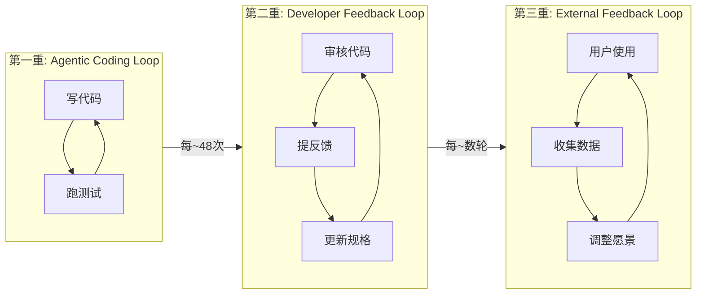

# Inner Loop / Outer Loop — 双循环驱动架构

> [!abstract] 核心观点
> 把Agent的循环分为两层：内循环（Inner Loop）负责高频执行，速度快；外循环（Outer Loop）负责吸收反馈、持续改进，频率慢。Andrew Ng在此基础上提出了三重回路框架，进一步明确了"内循环每跑约48次，中间循环才跑1次"的比例关系 [$TRAE_REF](https://juejin.cn/post/7655530849447493642)。

---

## 一、核心思想

### 1.1 为什么要分层？

如果一个Agent只有一个循环，它会面临两个矛盾的需求：

| 需求 | 矛盾 |
|------|------|
| **执行要快** | 需要轻量、自动、无需人工干预 |
| **改进要准** | 需要分析、反思、需要人工反馈 |

解决方案：**把"执行"和"改进"拆成两个独立的循环**。

### 1.2 双循环架构概览

```mermaid
flowchart TD
    subgraph Outer Loop[外循环 - 改进层]
        O1[收集反馈] --> O2[分析模式]
        O2 --> O3[提炼规则]
        O3 --> O4[更新技能文件]
        O4 --> O1
    end
    
    subgraph Inner Loop[内循环 - 执行层]
        I1[接收任务] --> I2[执行]
        I2 --> I3[验证]
        I3 -->|不通过| I2
        I3 -->|通过| I4[输出结果]
    end
    
    Outer Loop -->|更新规则| Inner Loop
    Inner Loop -->|产生反馈| Outer Loop
```

---

## 二、Warp团队的实践

### 2.1 架构设计

Warp团队在构建AI Agent时，将系统分为两个循环 [$TRAE_REF](https://developer.aliyun.com/article/1743297)：

**Inner Loop（内循环）**：
- 职责：自动分诊和执行任务
- 典型场景：自动处理GitHub Issue
- 频率：分钟级
- 核心：快速执行、自动验证

**Outer Loop（外循环）**：
- 职责：从人类反馈中提炼规则
- 典型场景：生成PR更新技能文件（SKILL.md）
- 频率：小时~天级
- 核心：模式识别、规则沉淀

### 2.2 关键设计

```
Inner Loop工作流程：
  1. 接收新Issue
  2. 根据当前SKILL.md中的规则进行分类
  3. 自动处理或分配给对应Handler
  4. 执行后验证结果
  5. 标记处理状态

Outer Loop工作流程：
  1. 收集近期Inner Loop的处理记录
  2. 分析失败模式（哪些类型的Issue处理不好？）
  3. 提炼新规则
  4. 生成PR更新SKILL.md
  5. 人工审核合并
```

---

## 三、Andrew Ng的三重回路框架

Andrew Ng将双循环扩展为三重回路 [$TRAE_REF](https://juejin.cn/post/7655530849447493642)：

| 循环 | 执行者 | 频率 | 核心输入 | 核心输出 |
|------|--------|------|---------|---------|
| **Agentic Coding Loop** | AI Agent | ~5分钟/轮 | 产品规格+评估集 | 可运行代码 |
| **Developer Feedback Loop** | 开发者+Agent | ~30分钟~数小时/轮 | 当前产品状态 | 改进方向 |
| **External Feedback Loop** | 用户/市场 | 数小时~数周/轮 | 真实用户行为 | 愿景修正 |

### 3.1 三重要比例

> **内循环每跑约48次，中间循环才跑1次。如果开发者反馈循环被内循环淹没，系统就退化成"代码写了但没人审"** [$TRAE_REF](https://juejin.cn/post/7655530849447493642)。

这意味着：
- 内循环要快，但不能快过外循环的消化能力
- 外循环要准，但不能慢到让内循环"野蛮生长"
- 内外循环之间需要明确的**反馈阈值**——什么时候需要触发外循环？

### 3.2 三重回路的关系



---

## 四、设计要点

### 4.1 内循环设计原则

| 原则 | 说明 |
|------|------|
| **快速失败** | 内循环应该快速试错，不要在单次循环中花太多时间 |
| **自动验证** | 每次循环输出必须有自动验证机制 |
| **有限范围** | 内循环的决策范围应该被严格限制 |
| **日志完整** | 每次循环都记录完整状态，供外循环分析 |

### 4.2 外循环设计原则

| 原则 | 说明 |
|------|------|
| **模式优先** | 不要为单一失败案例改规则，先看模式 |
| **人工审核** | 外循环的规则变更必须经过人工审核 |
| **渐进改进** | 一次只改少量规则，避免"规则地震" |
| **可回滚** | 任何规则变更都要能回滚 |

### 4.3 内外循环的接口设计

```
Inner Loop → Outer Loop：状态报告
  ├── 执行结果（成功/失败/异常）
  ├── 失败模式分类
  ├── 耗时和Token消耗
  └── Agent的自我评估

Outer Loop → Inner Loop：规则更新
  ├── 更新的SKILL.md
  ├── 新增的规则/约束
  ├── 更新的Prompt模板
  └── 工具使用策略调整
```

---

## 五、适用场景

| 场景 | 内循环频率 | 外循环频率 | 推荐度 |
|------|-----------|-----------|--------|
| CI失败自动修复 | 分钟级 | 天级 | ⭐⭐⭐⭐⭐ |
| PR审查与修复 | 分钟级 | 小时级 | ⭐⭐⭐⭐⭐ |
| 代码库迁移 | 分钟级 | 小时级 | ⭐⭐⭐⭐ |
| 客户支持 | 分钟级 | 日级 | ⭐⭐⭐⭐ |
| 数据分析 | 分钟级 | 日级 | ⭐⭐⭐⭐ |

---

## 六、常见陷阱与应对

| 陷阱 | 表现 | 应对 |
|------|------|------|
| **内循环失控** | Agent在没人看的情况下做了大量错误操作 | 设定内循环的安全边界和权限 |
| **外循环过慢** | 规则更新太慢，内循环一直在犯同样的错误 | 设定外循环的最小频率，即使没有新规则也要"零报告" |
| **反馈过载** | 内循环产生太多反馈，外循环处理不过来 | 对反馈做优先级排序和聚合 |
| **规则膨胀** | 外循环不断添加规则，规则越来越多，内循环越来越慢 | 定期清理规则，合并同类项 |

---

## 关联笔记

- [[01-AI技术/LOOP Engineering/03-架构篇/02_DPEV-I五阶段闭环]] — 五阶段闭环设计
- [[01-AI技术/LOOP Engineering/03-架构篇/03_Hook Loop Harness范式]] — Agent工程化范式
- [[01-AI技术/LOOP Engineering/04-方法篇/06_棘轮机制]] — 从错误到规则的持续进化（外循环的核心）
- [[01-AI技术/LOOP Engineering/00_MOC_LOOP_Engineering中枢]] — 返回中枢索引