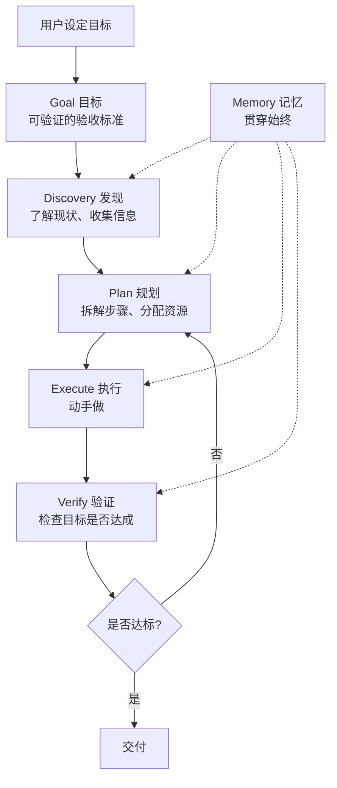

# Discover-Plan-Execute-Verify-Improve — 五阶段闭环

> [!abstract] 核心观点
> DPEV-I是LOOP Engineering最核心的五阶段闭环，几乎所有Agent循环实现都遵循这个模式。核心是：目标驱动、发现先于规划、验证保障质量、记忆贯穿始终 [$TRAE_REF](https://blog.csdn.net/weixin_74809706/article/details/162579639)。

---

## 一、五阶段全景



---

## 二、每个阶段详解

### 2.1 Goal（目标）

**做什么**：把用户模糊的需求转化为可验证的验收标准。

**关键问题**：
- 怎么知道任务完成了？
- 成功的标准是什么？可量化吗？
- 哪些事情不能做（边界条件）？

**示例**：
```
❌ 模糊目标："优化这个项目"
✅ 可验证目标："1. 所有测试通过；2. 类型检查零错误；3. 不破坏现有功能；4. 性能不下降"
```

**输出**：验收标准清单（Checklist）

### 2.2 Discovery（发现）

**做什么**：在动手之前，Agent先去了解现状、收集信息、分析问题。

**关键问题**：
- 当前状态是什么？
- 有哪些已知问题？
- 需要什么资源/工具？
- 有哪些约束条件？

**示例**：
```
Agent要做的事情：
- 读取代码库结构
- 分析CI日志
- 定位具体问题
- 评估影响范围
```

**输出**：现状分析报告

### 2.3 Plan（规划）

**做什么**：把任务拆解为清晰可执行的步骤。

**关键问题**：
- 任务的依赖关系是什么？
- 哪些步骤可以并行执行？
- 每步的预期输出是什么？
- 风险最高的步骤是哪一步？

**示例**：
```
Plan:
  1. 修改module_a.py（修复函数签名）
  2. 修改module_b.py（更新调用方）
  3. 运行测试（验证修复）
  4. 运行lint（检查代码规范）
```

**输出**：步骤清单（含依赖关系和执行顺序）

### 2.4 Execute（执行）

**做什么**：按计划动手做。

**关键设计**：
- 可Fan-out并行：多个Agent同时干独立的活儿
- 每步执行后输出明确的状态（成功/失败/部分成功）
- 执行过程中记录所有变更

**输出**：执行结果（含变更记录）

### 2.5 Verify（验证）

**做什么**：检查目标是否达成。这是五阶段中最关键的一环。

**验证层次**：
| 层次 | 验证内容 | 自动化程度 |
|------|---------|-----------|
| L1 | 语法正确性 | 全自动（编译器/Linter） |
| L2 | 功能正确性 | 全自动（测试） |
| L3 | 逻辑正确性 | 半自动（Reviewer） |
| L4 | 目标达成度 | 全自动（验收标准检查） |

**输出**：验证结果（通过/不通过 + 详细报告）

---

## 三、Iterate（迭代）策略

当Verify不通过时，有两种迭代路径：

### 3.1 Plan级迭代（推荐）

```
Verify不通过 → 回到Plan → 调整剩余计划 → 重新执行
```

**优点**：保留已完成的步骤，只调整失败的部分
**适合**：大部分步骤成功，少量步骤失败

### 3.2 Discovery级迭代（罕见）

```
Verify不通过 → 回到Discovery → 重新分析问题 → 重新规划 → 执行
```

**优点**：当初始分析有误时，彻底重新来
**适合**：初始假设完全错误，需要重新理解问题

### 3.3 迭代终止条件

```
必须全部配置的终止条件：
1. 最大迭代次数：5轮（Plan级）+ 2轮（Discovery级）
2. 连续N轮无变化：2轮
3. Token预算：任务预算的120%
4. 目标达成：Verify全部通过
5. 人工干预：用户手动终止
```

---

## 四、Memory（记忆）贯穿始终

记忆是五阶段闭环的横切关注点，在每个阶段都有作用：

| 阶段 | 记忆的作用 | 存储内容 |
|------|-----------|---------|
| Goal | 记录目标定义 | 验收标准、约束条件 |
| Discovery | 记录发现的信息 | 代码库结构、问题分析 |
| Plan | 记录规划过程 | 步骤清单、依赖关系 |
| Execute | 记录执行过程 | 变更记录、执行日志 |
| Verify | 记录验证结果 | 测试结果、验证报告 |

**推荐实现方式**：
- 轻量级：STATE.md文件（随项目一起版本控制）
- 中量级：SQLite数据库
- 重量级：GitHub Issue/Task

---

## 五、五阶段的应用模板

### 5.1 通用模板

```
## Stage 1: Goal
  验收标准：
  - [ ] 标准1
  - [ ] 标准2

## Stage 2: Discovery
  现状分析：
  - 发现1
  - 发现2

## Stage 3: Plan
  步骤清单：
  - [ ] 步骤1（依赖：无）
  - [ ] 步骤2（依赖：步骤1）
  - [ ] 步骤3（依赖：步骤1, 步骤2）

## Stage 4: Execute
  - 步骤1: ✅ 完成
  - 步骤2: ✅ 完成
  - 步骤3: ❌ 失败，原因：...

## Stage 5: Verify
  - 标准1: ✅ 通过
  - 标准2: ❌ 不通过
  - 迭代决定：回到Plan → 调整步骤3

## Memory
  - 当前状态：第2次迭代中
  - 累计Token消耗：12,345
  - 迭代次数：2/5
```

---

## 六、常见陷阱与应对

| 陷阱 | 表现 | 应对 |
|------|------|------|
| **跳过Discovery** | Agent直接开始规划，忽略了对现状的了解 | 强制Discovery阶段必须有输出 |
| **Plan过于详细** | 规划阶段消耗大量Token，实际执行时发现计划没用 | 设定规划时间/Token上限 |
| **Verify不充分** | 只验证了表面，没发现深层问题 | 设计多层次的验证策略 |
| **记忆丢失** | Agent在迭代过程中忘记之前的发现 | 使用外部存储（STATE.md/SQLite） |
| **过早迭代** | 轻微不达标就触发重规划，导致效率低下 | 设定"不达标阈值"，低于阈值的不触发重规划 |

---

## 七、核心总结

```
DPEV-I = Goal + Discovery + Plan + Execute + Verify + Iterate + Memory
├── Goal：把模糊需求转化为可验证标准
├── Discovery：动手前先了解现状
├── Plan：拆解为可执行的步骤
├── Execute：按计划执行，记录变更
├── Verify：多层次验证，确保目标达成
├── Iterate：Plan级优先，Discovery级备用
└── Memory：贯穿始终，用外部存储
```

---

## 关联笔记

- [[01-AI技术/LOOP Engineering/03-架构篇/01_Inner Outer Loop]] — 双循环驱动架构
- [[01-AI技术/LOOP Engineering/03-架构篇/03_Hook Loop Harness范式]] — Agent工程化范式
- [[01-AI技术/LOOP Engineering/04-方法篇/01_循环设计八步法]] — 从需求到Loop的完整流程
- [[01-AI技术/LOOP Engineering/00_MOC_LOOP_Engineering中枢]] — 返回中枢索引