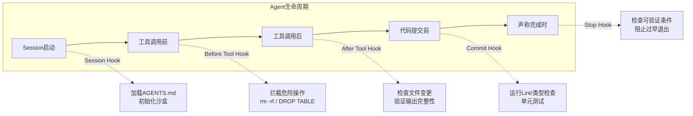

# Hook + Loop + Harness — Agent工程化范式

> [!abstract] 核心观点
> Hook + Loop + Harness是2026年AI Agent工程化最重要的认知转向。Loop定义Agent"怎么动"，Hook定义Agent"不能做什么"（强制执行层），Harness定义Agent"在什么里面动"（完整运行时环境）。三者缺一不可，共同构成生产级Agent的工程化基础 [$TRAE_REF](https://cloud.tencent.com/developer/article/2711282)。

---

## 一、三者关系

```mermaid
flowchart TD
    subgraph Harness[Harness 框架 - 运行时环境]
        subgraph Loop[Loop 循环 - 行动逻辑]
            L1[ReAct/Plan-Execute/Reflection/Ralph]
        end
        
        subgraph Hook[Hook 钩子 - 安全护栏]
            H1[Session Hook]
            H2[Before Tool Hook]
            H3[After Tool Hook]
            H4[Commit Hook]
            H5[Stop Hook]
        end
        
        Harness --> Loop
        Harness --> Hook
        Hook -->|强制执行| Loop
    end
    
    subgraph 外部
        Tools[工具集]
        Env[沙箱环境]
        Rules[规则库]
    end
    
    Harness --> Tools
    Harness --> Env
    Harness --> Rules
```

### 1.1 各自职责

| 要素 | 职责 | 类比 | 核心问题 |
|------|------|------|---------|
| **Loop** | 定义Agent的行动逻辑 | 汽车的引擎 | Agent怎么动？ |
| **Hook** | 强制执行安全边界 | 汽车的安全气囊 | Agent不能做什么？ |
| **Harness** | 提供完整的运行时环境 | 汽车的底盘 | Agent在什么里面动？ |

---

## 二、Loop（循环）

Loop定义Agent的核心行动逻辑。详见模式篇的详细拆解：

| 模式 | 核心逻辑 | 适合场景 | 可靠性 |
|------|---------|---------|--------|
| ReAct Loop | 推理→行动→观察 | 简单任务、探索 | ~60% |
| Plan-Execute | 先规划再执行 | 结构化任务 | ~75% |
| Reflection | 生成→审阅→修订 | 质量优先任务 | ~70% |
| Ralph Loop | 外部Stop Hook驱动 | 高可靠性任务 | ~90% |

---

## 三、Hook（钩子）

### 3.1 五大Hook类型

Hook是Agent安全护栏的执行层，在Agent生命周期的关键节点强制执行 [$TRAE_REF](https://cloud.tencent.com/developer/article/2711282)：



| Hook类型 | 触发时机 | 典型逻辑 | 风险等级 |
|---------|---------|---------|---------|
| **Session Hook** | 会话启动时 | 加载AGENTS.md、初始化沙盒、加载工具配置 | 🟢 低 |
| **Before Tool Hook** | 工具调用前 | 拦截rm -rf、DROP TABLE等危险操作，检查参数合法性 | 🔴 高 |
| **After Tool Hook** | 工具调用后 | 检查文件变更、验证输出完整性、监控副作用 | 🟡 中 |
| **Commit Hook** | 代码提交前 | 运行Lint、类型检查、单元测试，确保不破坏现有功能 | 🟡 中 |
| **Stop Hook** | Agent声称完成时 | 检查可验证的完成条件，阻止过早退出 | 🟢 低 |

### 3.2 Hook的实现原则

```
1. 强制执行：Hook不能是"建议"，必须是"强制执行"
   - Before Tool Hook：拦截=Agent不能调用
   - Stop Hook：拦截=Agent不能结束

2. 快速失败：Hook应该尽快判定，不要拖慢主循环
   - 超时机制：Hook执行时间超过500ms直接拒绝

3. 可审计：所有Hook的拦截记录必须可追溯
   - 记录：谁触发了、拦截了什么、为什么拦截、时间戳

4. 可配置：Hook的严格程度应该可调节
   - 开发模式：宽松，只记录不拦截
   - 生产模式：严格，该拦截就拦截
```

### 3.3 Hook示例：Before Tool Hook

```python
def before_tool_hook(tool_name, args):
    """
    在工具调用前执行安全检查
    返回：True（允许）/ False（拦截）
    """
    # 危险操作白名单
    blocked_commands = [
        "rm -rf", "DROP TABLE", "TRUNCATE",
        "shutdown", "reboot", "chmod 777"
    ]
    
    for cmd in blocked_commands:
        if cmd in str(args):
            log_interception(tool_name, args, f"危险操作被拦截: {cmd}")
            return False
    
    # 文件写入范围限制
    if tool_name == "write_file":
        allowed_paths = get_allowed_paths()
        if not is_path_allowed(args["path"], allowed_paths):
            log_interception(tool_name, args, "文件路径不在白名单")
            return False
    
    return True
```

---

## 四、Harness（框架）

Harness是Agent的完整运行时环境，决定了Agent能做什么、不能做什么、在什么环境下运行。

### 4.1 Harness的核心组件

| 组件 | 职责 | 示例 |
|------|------|------|
| **工具集** | Agent可以调用的工具 | 文件读写、代码执行、API调用、搜索 |
| **沙箱环境** | Agent的运行环境 | 容器、VM、安全执行环境 |
| **规则库** | Agent的行为约束 | AGENTS.md、SKILL.md、权限配置 |
| **状态管理** | Agent的状态持久化 | STATE.md、SQLite、GitHub Issue |
| **可观测性** | Agent的监控和日志 | Trace、日志、回放系统 |

### 4.2 Harness设计原则

| 原则 | 说明 |
|------|------|
| **环境沙箱化** | Agent不能访问未授权的资源 |
| **工具白名单** | Agent只能调用白名单中的工具 |
| **权限最小化** | Agent只拥有完成任务所需的最小权限 |
| **操作可审计** | 所有操作都有完整记录 |
| **可回滚** | 任何变更都能回滚到之前的状态 |

### 4.3 Harness模板化

2026年的趋势是**Harness Templates** —— 把针对某种技术栈的引导层和传感器层打包成模板 [$TRAE_REF](https://cloud.tencent.com/developer/article/2711282)：

```
Node.js Harness模板：
├── tools/         # 工具定义（文件读写、npm、git）
├── hooks/         # Hook配置（安全规则、代码规范）
├── rules/         # 行为规则（AGENTS.md）
├── sandbox/       # 沙箱环境配置
└── observability/ # 监控配置（Trace、日志）
```

---

## 五、三者协作的工作流

```mermaid
sequenceDiagram
    participant User as 用户
    participant Harness as Harness框架
    participant Hook as Hook安全层
    participant Loop as Agent循环
    participant Tools as 外部工具
    
    User->>Harness: 下达任务
    Harness->>Harness: 初始化沙箱环境
    Harness->>Hook: Session Hook: 加载规则
    
    loop Agent循环
        Loop->>Hook: Before Tool Hook: 检查Tool调用
        Hook->>Hook: 安全检查
        Hook->>Loop: 通过/拦截
        Loop->>Tools: 调用工具
        Tools->>Loop: 返回结果
        Loop->>Hook: After Tool Hook: 检查结果
        Hook->>Loop: 通过/警告
    end
    
    Loop->>Hook: Stop Hook: 声称完成
    Hook->>Hook: 验证验收标准
    Hook->>Harness: 通过/不通过
    Harness->>User: 返回结果
```

---

## 六、核心公式

> **Agent = Model + Harness** [$TRAE_REF](https://cloud.tencent.com/developer/article/2711282)

更完整的分解：

```
Agent = Model + (Loop + Hook + Harness)
         ↑        ↑
      模型能力    工程化能力
```

- **Loop** 决定 Agent 的行动效率
- **Hook** 决定 Agent 的安全边界
- **Harness** 决定 Agent 的适用范围

---

## 关联笔记

- [[01-AI技术/LOOP Engineering/03-架构篇/01_Inner Outer Loop]] — 双循环驱动架构
- [[01-AI技术/LOOP Engineering/03-架构篇/02_DPEV-I五阶段闭环]] — 五阶段闭环
- [[01-AI技术/LOOP Engineering/04-方法篇/03_安全护栏体系]] — Hook的完整实现指南
- [[01-AI技术/LOOP Engineering/04-方法篇/04_终止条件设计]] — 终止条件与Stop Hook
- [[01-AI技术/LOOP Engineering/00_MOC_LOOP_Engineering中枢]] — 返回中枢索引