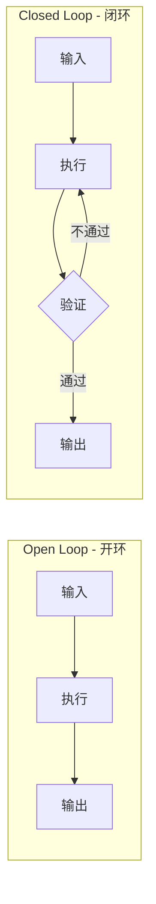
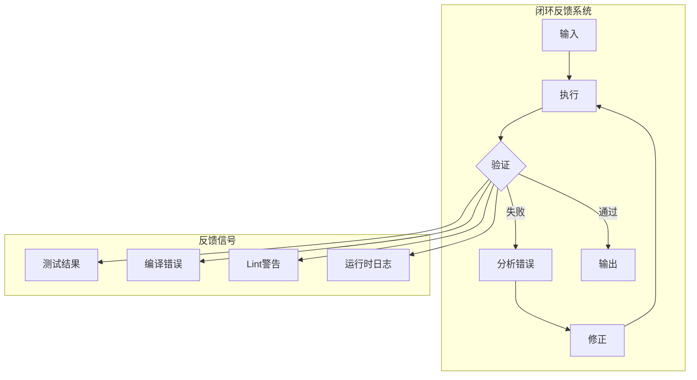
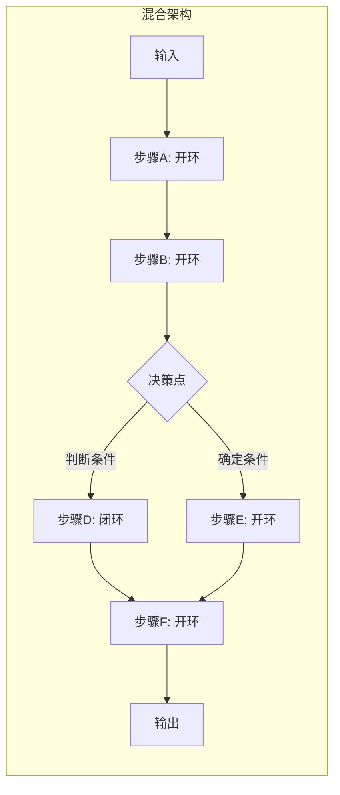

# Open Loop vs Closed Loop — 开环与闭环架构设计

> [!abstract] 核心观点
> Open Loop（开环）和Closed Loop（闭环）是LOOP Engineering中最基础的架构决策。开环模式适合确定性任务，执行速度快、成本低但无纠错能力；闭环模式适合不确定性任务，能通过反馈迭代提升质量但成本更高。在实际系统中，**混合架构**往往是最佳选择——将确定的步骤设为开环，不确定的步骤设为闭环。

---

## 一、Open Loop vs Closed Loop：核心区别

### 1.1 定义

| 维度 | Open Loop（开环） | Closed Loop（闭环） |
|------|------------------|-------------------|
| **定义** | 一次性执行，无反馈回路 | 有反馈机制，迭代修正 |
| **控制方式** | 前馈控制（预先设定） | 反馈控制（基于结果调整） |
| **执行流程** | 输入 → 处理 → 输出 | 输入 → 处理 → 验证 → 反馈 → 修正 |
| **纠错能力** | 无 | 有 |
| **适用场景** | 确定性任务 | 不确定性任务 |

### 1.2 核心区别图示



### 1.3 各自适用场景

| 场景 | 推荐模式 | 理由 |
|------|---------|------|
| 文件格式转换（JSON→CSV） | 开环 | 确定性规则，不需要验证循环 |
| 生成邮件草稿 | 开环 | 人直接审查修改，不需要Agent循环 |
| 自动数据清洗 | 开环 | 规则明确，一次执行即可 |
| CI失败自动修复 | 闭环 | 需要测试驱动验证，修复可能不准确 |
| 代码库迁移 | 闭环 | 迁移后的代码需要编译+测试验证 |
| PR审查 | 闭环 | 需要多次审查-修改循环 |
| 依赖升级 | 闭环 | 升级后需要测试验证兼容性 |

---

## 二、Open Loop模式

### 2.1 一次性执行

Open Loop的核心特征是"一次执行，不做反馈修正"：

```
执行流程:
  1. 接收输入
  2. 执行既定操作
  3. 输出结果
  4. 结束（不考虑结果的正确性）

适用前提:
  - 操作的结果是确定性的
  - 错误率极低
  - 即使出错，影响可控
```

### 2.2 无反馈修正

Open Loop不包含反馈回路，意味着：

```
优点:
  - 执行速度快（没有迭代开销）
  - 成本低（只有一次LLM调用）
  - 实现简单
  - 延迟确定

缺点:
  - 无法自动纠错
  - 对输入质量要求高
  - 不适用于复杂任务
  - 失败后需要人工介入
```

### 2.3 适合确定性任务

| 特征 | 确定性任务 | 不确定性任务 |
|------|-----------|------------|
| 输出范围 | 有限的、已知的 | 开放的、未知的 |
| 正确标准 | 明确定义 | 需要判断 |
| 错误影响 | 可控 | 可能严重 |
| 示例 | 格式转换、批量重命名 | 代码重构、Bug修复 |

---

## 三、Closed Loop模式

### 3.1 有反馈机制

Closed Loop的核心特征是"反馈驱动修正"：



### 3.2 迭代修正流程

Closed Loop的迭代修正遵循以下流程：

```
每次迭代:
  1. 执行当前操作
  2. 收集反馈（测试结果、编译错误、运行时日志）
  3. 分析反馈，定位根因
  4. 制定修正方案
  5. 执行修正
  6. 再次验证

迭代终止条件:
  - 验证通过 → 成功退出
  - 达到最大迭代次数 → 失败退出
  - 连续无进展 → 超时退出
  - 检测到无法修复的错误 → 上报退出
```

### 3.3 适合不确定性任务

| 不确定性来源 | 闭环如何应对 |
|------------|------------|
| LLM输出不稳定 | 通过验证循环过滤不良输出 |
| 问题定义不清晰 | 通过迭代逐步明确 |
| 外部依赖变化 | 通过反馈检测变化并适应 |
| 边界情况 | 通过测试覆盖发现并处理 |

---

## 四、混合架构

### 4.1 在同一个系统中混合使用

实际系统中，很少有纯粹的Open Loop或Closed Loop。更常见的是混合架构——在同一个系统中，不同的步骤采用不同的模式：



### 4.2 混合架构设计原则

| 原则 | 说明 | 示例 |
|------|------|------|
| **确定性步骤开环** | 不会出错的操作走开环 | 文件读写、格式转换 |
| **不确定性步骤闭环** | 可能出错的操作走闭环 | 代码生成、Bug修复 |
| **关键路径闭环** | 对结果质量要求高的步骤走闭环 | 测试验证、安全检查 |
| **非关键路径开环** | 边缘步骤走开环加快速度 | 日志记录、通知发送 |
| **渐进增强** | 先从开环开始，发现不稳定再改为闭环 | 先开环跑，出错率>5%后改闭环 |

### 4.3 混合架构配置示例

```yaml
# 混合架构配置示例
pipeline:
  - step: 代码格式化
    mode: open_loop            # 开环：格式化工具确定性强
    tool: prettier

  - step: 代码生成
    mode: closed_loop          # 闭环：LLM生成可能需要修正
    max_iterations: 3
    verifier: compiler

  - step: 依赖分析
    mode: open_loop            # 开环：分析工具结果确定
    tool: npm-check

  - step: 测试
    mode: closed_loop          # 闭环：测试失败需要修复
    max_iterations: 5
    verifier: jest

  - step: 提交PR
    mode: open_loop            # 开环：提交操作确定
    tool: gh
```

---

## 五、选型决策树

### 5.1 如何判断任务应该用开环还是闭环

```
任务模式选型决策树:

任务能否被完全自动化？
├── 否 → 开环（生成草案，人工完成）
└── 是 →
    ├── 任务结果是否可自动验证？
    │   ├── 否 → 开环（人工验证）
    │   └── 是 →
    │       ├── 单次执行出错率是否可接受？
    │       │   ├── 是 → 开环
    │       │   └── 否 →
    │       │       ├── 迭代修正是否可能收敛？
    │       │       │   ├── 否 → 开环 + 人工审核
    │       │       │   └── 是 →
    │       │       │           ├── 成本预算是否充足？
    │       │       │           │   ├── 否 → 开环
    │       │       │           │   └── 是 → 闭环
    │       │       └──
    │       └──
    └──
```

### 5.2 决策因素权重

| 决策因素 | 权重 | 说明 |
|---------|------|------|
| **可验证性** | 高 | 如果没有验证手段，闭环无意义 |
| **出错成本** | 高 | 出错代价高时必须闭环 |
| **执行速度** | 中 | 对速度敏感的场景偏向开环 |
| **成本预算** | 中 | 闭环消耗更多Token |
| **实现复杂度** | 低 | 开环实现简单，但不应成为决策主导 |

### 5.3 决策矩阵

| 可验证性 | 出错成本 | 执行速度要求 | 推荐模式 |
|---------|---------|------------|---------|
| 高 | 低 | 高 | 开环 |
| 高 | 高 | 低 | 闭环 |
| 高 | 高 | 高 | 开环（但需要强前置验证） |
| 低 | 低 | 不限 | 开环 + 人工审核 |
| 低 | 高 | 不限 | 不推荐自动化，强人工 |

---

## 六、实际案例：同一个任务的开环vs闭环实现对比

### 6.1 案例：代码审查

**Open Loop实现：**

```
流程:
  1. LLM分析代码变更
  2. 输出审查意见
  3. 结束（审查意见直接给开发者）

结果:
  - 审查意见质量不稳定
  - 可能漏掉严重问题
  - 不需要额外LLM调用
  - 执行时间：10秒
  - Token消耗：2K
```

**Closed Loop实现：**

```
流程:
  1. LLM分析代码变更，输出初步审查意见
  2. 对每条意见进行"审查意见的审查"（Reflection）
  3. 补充遗漏的问题
  4. 运行安全扫描和代码风格检查
  5. 综合所有结果生成最终审查报告
  6. 结束

结果:
  - 审查意见质量更高
  - 安全问题95%以上被检出
  - 需要多次LLM调用
  - 执行时间：60秒
  - Token消耗：10K
```

### 6.2 案例对比表

| 维度 | 开环实现 | 闭环实现 | 差距 |
|------|---------|---------|------|
| **执行时间** | 10秒 | 60秒 | 闭环慢6倍 |
| **Token消耗** | 2K | 10K | 闭环多5倍 |
| **问题检出率** | 70% | 95% | 闭环高25% |
| **误报率** | 15% | 8% | 闭环低一半 |
| **实现复杂度** | 简单 | 中等 | 闭环更复杂 |

### 6.3 选择建议

```
选择建议:
  - 如果审查结果的准确率要求 > 90% → 选闭环
  - 如果审查需要在30秒内完成 → 选开环
  - 如果审查的是高风险的代码变更 → 选闭环
  - 如果审查的是低风险的日常变更 → 选开环
  - 最佳实践: 先开环运行，收集准确率数据，不达标再改闭环
```

### 6.4 渐进式采用策略

```
第1周: 开环运行
  ├── 收集准确率数据
  └── 建立基线（当前准确率70%）

第2周: 关键部分改闭环
  ├── 安全相关审查改为闭环
  └── 准确率提升到85%

第3周: 全面闭环
  ├── 所有审查改闭环
  └── 准确率提升到95%

第4周: 优化和微调
  ├── 减少不必要的迭代
  └── 在保证质量的前提下降低成本
```

---

## 关联笔记

- [[01-AI技术/LOOP Engineering/03-架构篇/01_Inner Outer Loop]] — 双循环架构
- [[01-AI技术/LOOP Engineering/03-架构篇/02_DPEV-I五阶段闭环]] — 五阶段闭环设计
- [[01-AI技术/LOOP Engineering/03-架构篇/03_Hook Loop Harness范式]] — Agent工程化范式
- [[01-AI技术/LOOP Engineering/04-方法篇/04_终止条件设计]] — 循环终止条件
- [[01-AI技术/LOOP Engineering/00_MOC_LOOP_Engineering中枢]] — 返回中枢索引