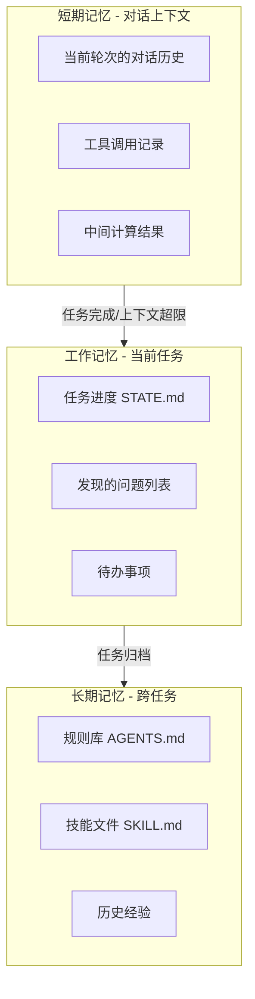

# 状态管理与上下文窗口优化

> [!abstract] 核心观点
> 状态管理是Agent循环的"记忆系统"。没有好的状态管理，Agent在长任务中会迷失方向，上下文窗口越积越多，Token消耗爆炸。核心策略是"分层记忆+动态修剪"——让Agent记住该记住的，忘掉该忘掉的 [$TRAE_REF](https://cloud.tencent.com/developer/article/2711282)。

---

## 一、状态管理的三个层次



| 层次 | 存储位置 | 生命周期 | 容量 | 访问速度 |
|------|---------|---------|------|---------|
| **短期记忆** | 对话上下文 | 当前会话 | 有限（~128K tokens） | 最快 |
| **工作记忆** | 外部文件（STATE.md） | 当前任务 | 较大 | 快 |
| **长期记忆** | 规则库/知识库 | 永久 | 无限 | 慢（需检索） |

---

## 二、上下文窗口的挑战

### 2.1 问题本质

Agent在长任务中，上下文会不断累积：

```
第1轮：系统Prompt + 用户输入 → 2K tokens
第10轮：+ 9轮对话历史 → 20K tokens
第50轮：+ 49轮对话历史 → 100K tokens
第100轮：+ 99轮对话历史 → 200K+ tokens
```

**三个核心问题**：

| 问题 | 表现 | 后果 |
|------|------|------|
| **Token消耗爆炸** | 上下文越长，每次调用成本越高 | 成本线性增长，甚至超线性 |
| **信息淹没** | 早期的关键信息被大量无关信息掩盖 | Agent"忘记"初始目标 |
| **推理退化** | 长上下文中模型的注意力分散 | 推理质量下降 |

### 2.2 临界点

研究表明，当上下文超过一定长度后，模型的表现会显著下降：

- **~32K tokens**：大多数模型表现稳定
- **~64K tokens**：部分模型开始出现注意力分散
- **~128K tokens**：大多数模型召回率显著下降
- **>128K tokens**：即使是长上下文模型，表现也不稳定

---

## 三、四种优化策略

### 策略1：压缩历史

**核心思想**：把冗长的对话历史压缩为摘要。

```python
def compress_history(history, max_tokens=4000):
    """压缩对话历史为摘要"""
    if count_tokens(history) <= max_tokens:
        return history
    
    # 1. 提取关键信息
    summary_prompt = f"""
    将以下对话历史压缩为摘要，保留：
    - 已经完成的任务和结果
    - 当前任务状态
    - 重要发现和决策
    - 未解决的问题
    
    对话历史：
    {history}
    """
    
    compressed = llm.summarize(summary_prompt)
    return compressed
```

**优点**：大幅减少Token消耗
**缺点**：摘要可能丢失细节信息

### 策略2：优先级排序

**核心思想**：保留重要信息，丢弃噪声。

**信息优先级分级**：
```
P0 - 必须保留：
  ├── 初始任务目标
  ├── 当前验收标准
  ├── 关键发现和决策
  └── 未完成的任务状态

P1 - 尽量保留：
  ├── 工具调用结果摘要
  ├── 错误信息和修复方案
  └── 重要的中间输出

P2 - 可丢弃：
  ├── 成功的工具调用细节
  ├── 重复的确认信息
  └── 无关的探索路径
```

### 策略3：窗口监控

**核心思想**：滑动窗口，只保留最近N轮对话。

```python
def sliding_window(history, window_size=20):
    """滑动窗口策略：保留最近N轮对话 + 关键信息摘要"""
    if len(history) <= window_size:
        return history
    
    # 保留开头（系统Prompt + 任务目标）
    header = history[:3]  # 系统Prompt + 任务目标
    
    # 保留最近N轮
    recent = history[-window_size:]
    
    return header + recent
```

**优点**：实现简单，效果稳定
**缺点**：早期信息可能丢失

### 策略4：分层记忆

**核心思想**：把信息按重要性分层存储，各层使用不同的访问策略。

```
Layer 1: 当前上下文（对话中）
  ├── 内容：当前轮次的对话
  ├── 容量：10轮对话
  └── 访问：直接访问

Layer 2: 工作记忆（外部文件）
  ├── 内容：STATE.md（任务状态）
  ├── 容量：无限制
  └── 访问：每次迭代读取

Layer 3: 长期记忆（知识库）
  ├── 内容：AGENTS.md, SKILL.md, 历史经验
  ├── 容量：无限制
  └── 访问：按需检索
```

---

## 四、状态管理实现方案

### 4.1 轻量方案：STATE.md

适合小型项目，最简单：

```markdown
# STATE.md — 任务状态文件

## 当前任务
贷后管理OCR功能Bug修复

## 进度
- 阶段: 修复验证中
- 当前步骤: 3/5
- 迭代次数: 2/5

## 完成
- [x] 步骤1: 定位Bug在OCR识别模块
- [x] 步骤2: 修复文字识别逻辑
- [ ] 步骤3: 验证修复 ← 当前
- [ ] 步骤4: 回归测试
- [ ] 步骤5: 提交PR

## 关键发现
1. Bug根因: 图像预处理时分辨率缩放比例错误
2. 影响范围: 仅影响特定分辨率(1080p以上)的图片
3. 修复方案: 调整缩放比例从0.5到0.8

## 备注
- 测试覆盖率: 当前85%
- 已知风险: 低分辨率图片不受影响
```

### 4.2 中量方案：SQLite

适合中型项目，需要结构化查询：

```sql
-- 状态表
CREATE TABLE task_state (
    task_id TEXT PRIMARY KEY,
    status TEXT,
    phase TEXT,
    current_step INTEGER,
    total_steps INTEGER,
    iteration INTEGER,
    tokens_used INTEGER,
    started_at TIMESTAMP,
    updated_at TIMESTAMP
);

-- 发现记录表
CREATE TABLE discoveries (
    id INTEGER PRIMARY KEY AUTOINCREMENT,
    task_id TEXT,
    content TEXT,
    severity TEXT,
    created_at TIMESTAMP
);

-- 执行日志表
CREATE TABLE execution_log (
    id INTEGER PRIMARY KEY AUTOINCREMENT,
    task_id TEXT,
    iteration INTEGER,
    step TEXT,
    action TEXT,
    result TEXT,
    tokens_used INTEGER,
    duration_ms INTEGER,
    error TEXT
);
```

### 4.3 重量方案：GitHub Issue

适合大型项目，天然支持协作和版本控制：

```
GitHub Issue 作为状态管理：
- Issue Body: 任务目标和验收标准
- Issue Comments: 执行日志和发现
- Labels: 状态标签（进行中/待验证/已完成）
- Assignees: 负责人
- Projects: 项目进度看板
```

---

## 五、策略组合建议

| 任务类型 | 推荐策略组合 | 说明 |
|---------|------------|------|
| 短任务（<10轮） | 不压缩 | 直接对话上下文就够了 |
| 中任务（10-50轮） | 窗口监控 + 优先级排序 | 保留最近20轮 + 关键信息 |
| 长任务（50-200轮） | 压缩历史 + 分层记忆 + 窗口监控 | 每10轮压缩一次 + STATE.md |
| 超长任务（跨会话） | 全策略组合 | 需要外部存储（SQLite/GitHub） |

---

## 关联笔记

- [[01-AI技术/LOOP Engineering/03-架构篇/02_DPEV-I五阶段闭环]] — 五阶段闭环中的记忆管理
- [[01-AI技术/LOOP Engineering/04-方法篇/05_成本控制策略]] — Token消耗与成本控制
- [[01-AI技术/LOOP Engineering/00_MOC_LOOP_Engineering中枢]] — 返回中枢索引