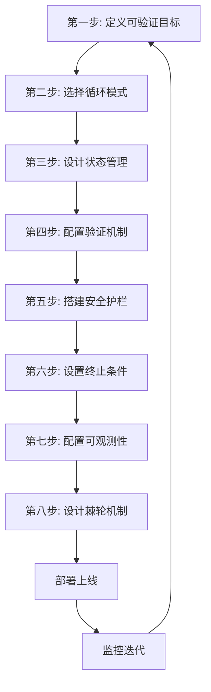

# 循环设计八步法 — 从需求到Loop的完整流程

> [!abstract] 核心观点
> 设计一个可靠的Agent循环不是"找个模式套上去"那么简单，需要从目标定义到持续改进的完整流程。八步法提供了一套可复用的设计方法论，每一步都有明确的决策树和检查清单。

---

## 一、八步法全景



---

## 二、八步详解

### 第一步：定义可验证目标

**核心问题**：怎么知道Agent的任务完成了？

**决策树**：
```
目标是否可以自动验证？
├── 是 → 继续（Ralph Loop的最优选择）
└── 否 → 是否可以转化为可验证的代理指标？
    ├── 是 → 使用代理指标（如"测试全部通过"作为"代码正确"的代理指标）
    └── 否 → 需要人工审核，选择Reflection或Plan-Execute
```

**检查清单**：
- [ ] 每个验收标准都是可自动验证的？
- [ ] 验收标准覆盖了"必须做"和"不能做"？
- [ ] 验收标准之间没有冲突？
- [ ] 如果目标无法自动验证，是否有替代的验证方式？

**示例**：
```
任务：修复CI失败
验收标准：
  ✅ 所有测试通过（可自动验证：pytest）
  ✅ 类型检查零错误（可自动验证：mypy）
  ✅ 不破坏现有功能（可自动验证：对比测试结果）
  ✅ 代码规范达标（可自动验证：eslint）
```

---

### 第二步：选择循环模式

**核心问题**：哪种循环模式最适合当前任务？

**决策树**：
```
任务复杂度如何？
├── 低（1-3步，路径明确）→ ReAct Loop
├── 中（4-10步，可规划）→ Plan-Execute Loop
└── 高（10+步，可能有意外）→ Ralph Loop

质量要求如何？
├── 高 → 叠加Reflection Loop
└── 中 → 基础模式即可

目标可验证性如何？
├── 高（有测试、lint等）→ Ralph Loop优先
└── 低（需要人工判断）→ Reflection Loop优先
```

**模式选择矩阵**：

| 任务特征 | 推荐模式 | 备选模式 |
|---------|---------|---------|
| 简单、路径明确 | ReAct | - |
| 结构化、可分解 | Plan-Execute | ReAct |
| 质量要求高 | Reflection | ReAct+Reflection |
| 高可靠性、可验证 | Ralph | Plan-Execute+Stop Hook |
| 探索性、路径不明确 | ReAct | Tree of Thoughts |

---

### 第三步：设计状态管理

**核心问题**：Agent怎么记住"已经做了什么"和"当前进度"？

**决策树**：
```
任务时长如何？
├── 短（<1分钟）→ 对话上下文就够了
├── 中（1-30分钟）→ STATE.md文件
└── 长（>30分钟，跨会话）→ SQLite/GitHub Issue

状态复杂度如何？
├── 低（只有几个状态变量）→ 文件存储
├── 中（需要结构化数据）→ SQLite/JSON文件
└── 高（需要关系型数据）→ 数据库
```

**状态管理模板**：
```markdown
# STATE.md

## 当前任务
[任务描述]

## 当前状态
- 阶段: Execute（第3步/共5步）
- 迭代次数: 2/5
- Token消耗: 12,345/50,000

## 已完成步骤
- [x] 步骤1: 检查项目结构 ✅
- [x] 步骤2: 更新配置文件 ✅
- [ ] 步骤3: 修复依赖冲突 ← 当前
- [ ] 步骤4: 运行测试
- [ ] 步骤5: 验证修复

## 关键发现
- 发现1: 项目使用Python 3.12
- 发现2: 冲突主要在async库版本

## 已知问题
- 步骤3中遇到两个依赖版本冲突，已解决一个
```

---

### 第四步：配置验证机制

**核心问题**：怎么确保Agent每一步的输出是正确的？

**决策树**：
```
有自动化测试吗？
├── 是 → 测试驱动循环（最可靠的验证方式）
└── 否 → 有类型检查/编译器吗？
    ├── 是 → 编译器驱动循环
    └── 否 → 需要人工审查吗？
        ├── 是 → 审查驱动循环
        └── 否 → 运行时调试循环
```

**验证层次配置**：
| 层次 | 验证方式 | 自动化 | 配置示例 |
|------|---------|--------|---------|
| L1 | 语法/格式检查 | 全自动 | eslint, prettier, mypy |
| L2 | 功能测试 | 全自动 | pytest, jest, vitest |
| L3 | 逻辑审查 | 半自动 | AI Reviewer |
| L4 | 业务验证 | 人工 | 人工审核 |

---

### 第五步：搭建安全护栏

**核心问题**：Agent不能做什么？

**安全护栏配置清单**：
- [ ] Session Hook：加载行为规则和权限配置
- [ ] Before Tool Hook：拦截危险操作
- [ ] After Tool Hook：检查输出完整性
- [ ] Commit Hook：运行预提交检查
- [ ] Stop Hook：验证完成条件

**具体配置示例**：
```yaml
# harness-config.yaml
hooks:
  before_tool:
    - name: "block-dangerous-commands"
      block: ["rm -rf", "DROP TABLE", "shutdown"]
    - name: "path-restriction"
      allow_paths: ["/workspace/project", "/workspace/temp"]
      
  commit:
    - name: "lint-check"
      command: "eslint ."
    - name: "type-check"
      command: "mypy ."
    - name: "test"
      command: "pytest"
```

---

### 第六步：设置终止条件

**核心问题**：什么时候停止循环？

**必须全部配置的五种终止条件**：
```
1. 最大迭代次数：____轮（建议：5-15轮）
2. 连续N轮无变化：____轮（建议：2-3轮）
3. Token预算耗尽：____Token（建议：任务预算的120%）
4. 目标达成：Stop Hook通过
5. 人工干预：用户手动终止
```

**不同场景的配置模板**：

| 场景 | 最大迭代 | 无变化阈值 | Token预算 | 说明 |
|------|---------|-----------|----------|------|
| CI失败修复 | 10轮 | 3轮 | 50K | 任务明确，预算可控 |
| 代码迁移 | 20轮 | 5轮 | 200K | 任务复杂，需要更多迭代 |
| 文档生成 | 5轮 | 2轮 | 30K | 质量优先，但不要无限循环 |
| 探索性分析 | 15轮 | 3轮 | 100K | 需要探索空间 |

---

### 第七步：配置可观测性

**核心问题**：怎么监控Agent的运行状态和排查问题？

**核心指标**：
```
必监控指标：
  - 循环迭代次数
  - 各阶段耗时
  - Token消耗
  - 成功率（单步成功率 + 整体成功率）
  - 失败模式分布

选监控指标：
  - 工具调用频率分布
  - 上下文窗口占用率
  - 重规划次数
  - 人工介入频率
```

**日志记录模板**：
```json
{
  "task_id": "task-001",
  "iteration": 3,
  "phase": "execute",
  "step": "step-3",
  "action": "write_file",
  "result": "success",
  "tokens_used": 1234,
  "duration_ms": 2345,
  "error": null
}
```

---

### 第八步：设计棘轮机制

**核心问题**：怎么让Agent越跑越准？

**棘轮机制设计**：
```
每次Agent犯错，应该：
1. 记录错误模式和上下文
2. 分析根因（是知识不足？工具使用不当？推理错误？）
3. 提炼为规则（在AGENTS.md/SKILL.md中新增规则）
4. 下次自动生效

避免"棘轮过紧"：
- 定期审查规则库，删除不再适用的规则
- 规则优先级：新规则不能覆盖所有情况时，保留旧规则
- 规则可回滚：任何规则变更都能回滚
```

---

## 三、八步法检查清单（完整版）

```
[ ] 第一步：定义可验证目标
    ├── 验收标准可自动验证
    ├── 覆盖"必须做"和"不能做"
    └── 标准之间无冲突

[ ] 第二步：选择循环模式
    ├── 根据任务复杂度选择
    ├── 根据质量要求确定是否叠加Reflection
    └── 根据可验证性确定是否用Ralph

[ ] 第三步：设计状态管理
    ├── 选择合适的状态存储方式
    ├── 定义状态数据结构
    └── 确保状态可恢复

[ ] 第四步：配置验证机制
    ├── 至少配置L1+L2验证
    ├── L3+验证可选
    └── 验证结果可追溯

[ ] 第五步：搭建安全护栏
    ├── 配置5种Hook
    ├── 定义危险操作清单
    └── 配置权限白名单

[ ] 第六步：设置终止条件
    └── 配置全部5种终止条件

[ ] 第七步：配置可观测性
    ├── 监控核心指标
    └── 记录完整日志

[ ] 第八步：设计棘轮机制
    ├── 定义错误→规则的转化流程
    └── 配置规则审查和回滚机制
```

---

## 关联笔记

- [[01-AI技术/LOOP Engineering/03-架构篇/02_DPEV-I五阶段闭环]] — 五阶段闭环设计
- [[01-AI技术/LOOP Engineering/04-方法篇/02_验证机制设计]] — 验证机制的详细设计
- [[01-AI技术/LOOP Engineering/04-方法篇/03_安全护栏体系]] — Hook的完整实现
- [[01-AI技术/LOOP Engineering/04-方法篇/04_终止条件设计]] — 终止条件配置
- [[01-AI技术/LOOP Engineering/04-方法篇/06_棘轮机制]] — 从错误到规则的持续进化
- [[01-AI技术/LOOP Engineering/06-实战篇/05_最小可行Loop落地法]] — 从最小可用Loop开始
- [[01-AI技术/LOOP Engineering/00_MOC_LOOP_Engineering中枢]] — 返回中枢索引