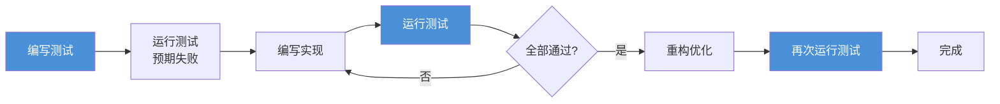
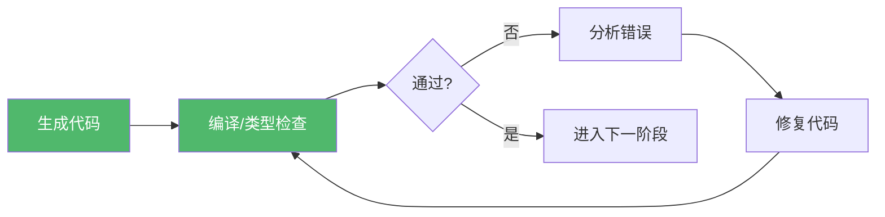
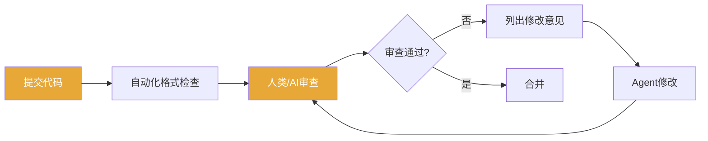
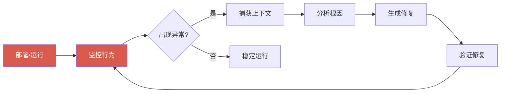
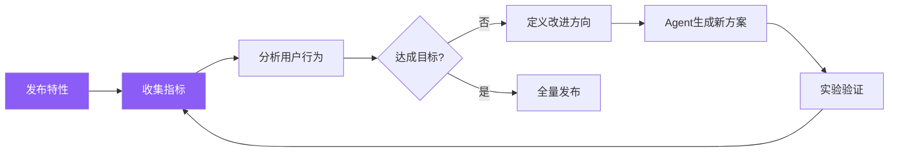
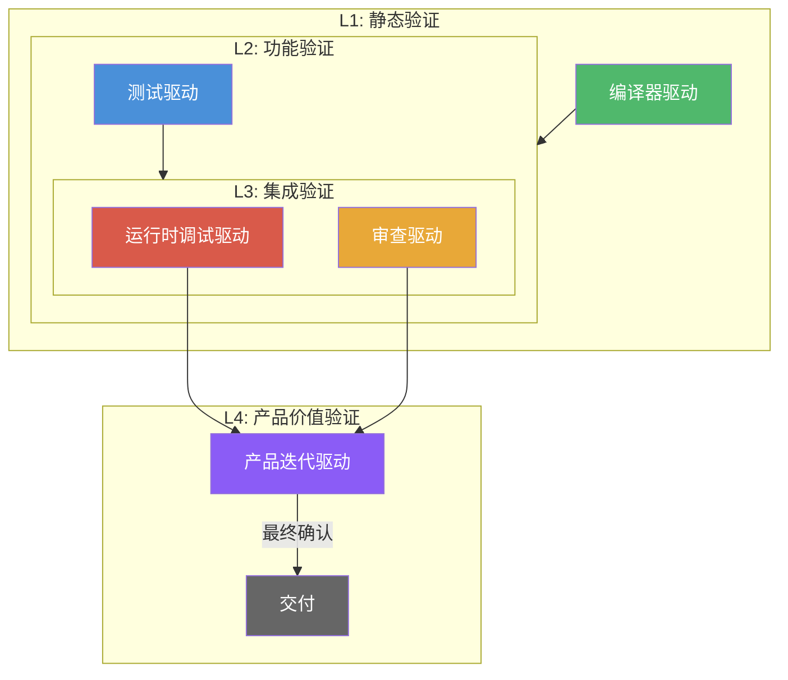

> [!abstract] 核心观点
> 验证机制的核心思想是：**让Agent不依赖自我评估，而是依赖外部验证信号**。在LOOP Engineering中，Agent的每一次生成结果都必须经过可重复、可量化的外部验证，而非依赖模型自身的"感觉正确"。这种"外部验证优先"的设计哲学，是保障循环质量、防止Agent陷入确认偏误的根本手段。

---

## 一、为什么需要验证机制

在LLM驱动的工程循环中，Agent天然面临三个根本困境：

| 困境 | 表现 | 后果 |
|------|------|------|
| **自我评估偏差** | Agent无法可靠判断自己的输出是否正确 | 产生"看起来正确但实际错误"的代码 |
| **确认偏误** | 倾向于寻找支持自身结论的证据 | 忽略边缘情况与异常路径 |
| **缺乏确定性** | 同一问题多次输出可能不一致 | 不可复现的行为 |

**解决方案**：建立独立于Agent的外部验证信号体系，让反馈信号（而非Agent的自我感觉）驱动循环的继续或终止。

---

## 二、五种反馈信号模式

验证机制的核心是五种反馈信号模式，它们覆盖了从代码生成到产品交付的完整生命周期。


### 2.1 测试驱动循环（Test-driven）

**核心思想**：先编写测试，再编写实现。测试是唯一的"通过/不通过"判据。Agent不得自行判断实现是否正确，而应运行测试获取客观结果。

**工作流程**：



**优缺点**：

| 维度 | 说明 |
|------|------|
| 优点 | 确定性最高；可自动化；可回归；文档即测试 |
| 缺点 | 测试编写成本高；难以覆盖所有边界；不适用于探索性任务 |
| 适用场景 | 业务逻辑、API接口、数据处理、算法实现 |

**示例**：Agent接收到任务"实现一个用户注册函数"，首先应生成测试用例（包含正常注册、重复邮箱、密码强度不足等场景），然后在测试通过前不得提交实现代码。

### 2.2 编译器驱动循环（Compiler-driven）

**核心思想**：利用编译器/类型系统的静态检查作为第一道验证防线。在运行任何测试之前，确保代码通过编译检查。

**工作流程**：



**优缺点**：

| 维度 | 说明 |
|------|------|
| 优点 | 反馈极快；零运行时成本；确定性高；适合大型代码库 |
| 缺点 | 只能检查语法/类型错误；不能验证逻辑正确性；依赖语言类型系统强弱 |
| 适用场景 | 强类型语言项目、类型重构、API契约验证、接口对齐 |

> 编译器驱动循环是验证层次中的**L1屏障**，应在所有其他验证之前执行。它过滤掉最简单的错误，为后续验证节省时间。

### 2.3 审查驱动循环（Review-driven）

**核心思想**：引入人工或AI审查者作为验证信号源，对代码的正确性、可维护性、风格一致性进行评估。

**工作流程**：



**优缺点**：

| 维度 | 说明 |
|------|------|
| 优点 | 能发现逻辑漏洞；评估代码可读性；传递团队知识 |
| 缺点 | 速度慢；一致性依赖于审查者水平；人工成本高 |
| 适用场景 | 关键代码变更、公共API设计、架构决策、安全敏感代码 |

**AI审查自动化**：在LOOP Engineering中，审查驱动循环可以部分自动化——使用AI审查器检查代码风格、文档完整性、测试覆盖率等维度，人工审查者只需关注核心逻辑正确性。

### 2.4 运行时调试循环（Runtime-debug-driven）

**核心思想**：通过实际运行代码并观察行为来验证正确性。当测试通过但行为异常时，运行时调试循环介入。

**工作流程**：



**优缺点**：

| 维度 | 说明 |
|------|------|
| 优点 | 发现真实环境问题；覆盖集成场景；发现非功能性缺陷 |
| 缺点 | 反馈周期长；环境依赖；难以复现偶发问题 |
| 适用场景 | 性能调优、并发问题、集成测试、线上故障排查 |

### 2.5 产品迭代循环（Product-iteration-driven）

**核心思想**：以产品反馈（用户行为、指标变化、A/B测试结果）作为最终的验证信号，驱动产品层面的迭代。

**工作流程**：



**优缺点**：

| 维度 | 说明 |
|------|------|
| 优点 | 验证真实用户价值；数据驱动决策；发现需求偏差 |
| 缺点 | 反馈周期最长；受多种因素干扰；需要足够样本量 |
| 适用场景 | 产品功能迭代、用户体验优化、增长策略、A/B测试 |

---

## 三、五种信号模式对比总览


| 模式 | 反馈速度 | 确定性 | 自动化程度 | 验证范围 |
|------|---------|--------|-----------|---------|
| 编译器驱动 | 秒级 | 100% | 全自动 | 语法/类型 |
| 测试驱动 | 分钟级 | 高 | 全自动 | 功能正确性 |
| 审查驱动 | 小时级 | 中低 | 半自动 | 可维护性/设计 |
| 运行时调试 | 天级 | 中 | 半自动 | 集成/性能 |
| 产品迭代 | 周级 | 统计性 | 手动 | 用户价值 |

---

## 四、验证机制的层次叠加策略（L1~L4）

五种信号模式并非独立使用，而是按照**层次叠加**的方式协同工作。



### L1 - 静态验证层

- **主要信号**：编译器驱动循环
- **目标**：消除语法错误、类型不匹配、接口不一致
- **工具**：TypeScript、ESLint、Rustc、MyPy、Go vet
- **通过标准**：零错误编译通过

### L2 - 功能验证层

- **主要信号**：测试驱动循环
- **目标**：验证功能正确性、边界条件、异常处理
- **工具**：Jest、PyTest、Go Test、JUnit + Coverage
- **通过标准**：测试覆盖率 >= 80%；所有测试通过

### L3 - 集成验证层

- **主要信号**：审查驱动循环 + 运行时调试循环
- **目标**：验证设计合理性、代码可维护性、集成正确性、性能指标
- **工具**：Code Review Checklist、Profiler、APM、集成测试
- **通过标准**：审查通过；性能指标在阈值内；集成测试通过

### L4 - 产品价值验证层

- **主要信号**：产品迭代驱动循环
- **目标**：验证用户价值、业务指标达成
- **工具**：A/B测试平台、分析仪表盘、用户调研
- **通过标准**：核心指标显著提升或达到目标值

---

## 五、验证器设计原则

验证器（Verifier）是验证机制的具体实现。设计验证器时应遵循三项核心原则：

### 5.1 独立性（Independence）

**验证器必须独立于被验证的Agent**。

- 验证器与Agent不应共享相同的模型、提示词或上下文
- 验证逻辑不应由生成代码的Agent自行编写
- 推荐使用不同类型/版本的模型进行验证

```yaml
# 错误示例：Agent自行验证自身输出
agent:
  generate: true
  verify: true  # 不可靠

# 正确示例：独立验证器
agent:
  generate: true
  verify: false

verifier:
  type: independent
  model: "different-model"  # 使用不同模型
  rules: "pre-defined-ruleset"
```

### 5.2 确定性（Determinism）

**同一个输入应始终产生相同的验证结果**。

- 避免使用有随机性的验证方法
- 测试用例必须固定种子（seed）
- 验证结果应可复现、可审计

### 5.3 可追溯性（Traceability）

**每个验证结果必须可追溯到具体的验证规则和输入**。

- 记录每次验证的完整上下文
- 验证失败时应提供具体的失败原因和位置
- 维护验证历史，支持回放分析

```yaml
# 验证记录格式示例
verification_record:
  id: "verif-20260802-001"
  timestamp: "2026-08-02T10:30:00Z"
  target: "src/user/register.ts"
  verifier: "jest-runner-v3"
  rules:
    - "tests/unit/user/register.test.ts"
  result: "FAILED"
  failures:
    - test: "should reject duplicate email"
      reason: "Expected 409, got 200"
      line: 42
  agent_output_hash: "a3f2b8c1..."
```

---

## 六、常见陷阱与应对

### 陷阱1：自我验证循环

**表现**：Agent编写代码，同时Agent编写测试，两个都用同一个模型，导致测试和实现犯同样的错误。

**应对**：
- 强制使用独立验证器（不同模型或不同prompt模板）
- 测试用例库应由人工维护，Agent只追加不修改
- 引入变异测试（Mutation Testing）检测测试质量

### 陷阱2：反馈过载

**表现**：验证层次过多，每次循环产生大量反馈，Agent无从下手。

**应对**：
- 反馈分级：将错误分为阻塞级、警告级、建议级
- 优先处理L1+L2的失败，再处理L3的审查意见
- 使用反馈聚合器，将多条同类反馈合并为一条行动指令

### 陷阱3：绕过验证

**表现**：Agent在生成代码时有意绕过验证（如注释掉测试、忽略编译警告）。

**应对**：
- 验证器与代码仓库集成，在CI/CD层面强制执行
- 使用git hooks阻止未通过验证的提交
- 验证结果计入循环质量评分

### 陷阱4：过度自动化

**表现**：试图自动化所有验证，包括需要人类判断的审查和产品验证。

**应对**：
- 明确哪些验证必须人工参与（架构决策、安全审计）
- 自动化验证只做"筛选"，不做"决策"
- 保持L3和L4层的人工环节

---

## 七、验证机制设计检查清单

- [ ] 是否至少覆盖L1 + L2两个验证层次？
- [ ] 验证器是否与被验证Agent独立？
- [ ] 验证结果是否具有确定性（可复现）？
- [ ] 每次验证是否记录了完整的可追溯信息？
- [ ] 是否避免了自我验证循环？
- [ ] 反馈是否经过分级和聚合处理？
- [ ] 是否有机制防止Agent绕过验证？
- [ ] 是否明确了必须人工参与的验证环节？
- [ ] 验证失败后的Agent重试是否有上限和退避策略？
- [ ] 验证规则本身是否定期审查和更新？

---

## 八、引用与延伸阅读

- 验证机制设计思想参考：[$TRAE_REF](https://cloud.tencent.com/developer/article/2711282)
- 推荐阅读：[[01-AI技术/LOOP Engineering/04-方法篇/01_循环设计八步法]] —— 了解如何将验证机制嵌入循环设计
- 推荐阅读：[[01-AI技术/LOOP Engineering/04-方法篇/03_安全护栏体系]] —— 了解验证机制与安全护栏的协同
- 推荐阅读：[[01-AI技术/LOOP Engineering/00_MOC_LOOP_Engineering中枢]] —— LOOP Engineering完整知识体系