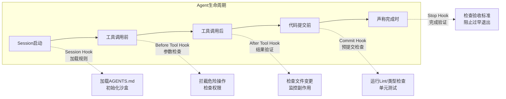

# 安全护栏体系 — Hook的五种类型与实现

> [!abstract] 核心观点
> 安全护栏不是"可选项"，而是Agent上生产环境的"门票"。Hook作为强制执行层，在Agent生命周期的关键节点拦截危险操作，确保Agent在安全边界内行动。五种Hook类型必须全部配置，缺一不可 [$TRAE_REF](https://cloud.tencent.com/developer/article/2711282)。

---

## 一、为什么需要安全护栏？

### 1.1 Agent的"不可预测性"

即使是最先进的模型，在复杂循环中也可能做出危险操作：

| 风险场景 | 后果 | 概率 |
|---------|------|------|
| Agent调用 `rm -rf /` | 数据丢失 | 低但不可接受 |
| Agent修改了不该改的文件 | 破坏现有功能 | 中 |
| Agent泄露敏感信息 | 安全合规风险 | 中 |
| Agent无限循环 | 成本失控 | 高 |
| Agent过早声称完成 | 任务未达标 | 高 |

### 1.2 安全护栏的设计哲学

```
安全护栏不是"锁住Agent"，而是"给Agent一个安全的运动场"。
```

- **强制执行**：Hook不是"建议"，是"强制"——Agent不能绕过
- **快速失败**：拦截要快，不影响正常循环
- **可审计**：所有拦截记录可追溯
- **可配置**：开发模式宽松，生产模式严格

---

## 二、五种Hook类型详解

### 2.1 Hook生命周期



---

### 2.2 Session Hook（会话钩子）

**触发时机**：Agent会话启动时

**职责**：初始化Agent的运行环境，加载行为规则

**配置示例**：
```yaml
session_hook:
  on_start:
    # 加载行为规则
    - action: load_rules
      source: "AGENTS.md"
    
    # 初始化沙箱环境
    - action: init_sandbox
      type: "container"
      image: "node:20-alpine"
    
    # 加载工具白名单
    - action: load_tool_whitelist
      source: "tools-config.yaml"
    
    # 加载权限配置
    - action: load_permissions
      level: "minimal"  # minimal / standard / full
```

**检查清单**：
```
[ ] 行为规则已加载（AGENTS.md）
[ ] 沙箱环境已初始化
[ ] 工具白名单已加载
[ ] 权限配置已加载
[ ] 会话ID已生成
[ ] 审计日志已开启
```

---

### 2.3 Before Tool Hook（工具调用前）

**触发时机**：Agent调用任何工具之前

**职责**：拦截危险操作，检查参数合法性

**这是最重要的一道防线**——防止Agent在"动手"之前就做错事。

**危险操作拦截**：
```python
def before_tool_hook(tool_name, args):
    """
    在工具调用前执行安全检查
    返回：True（允许）/ False（拦截，附原因）
    """
    # 1. 危险命令拦截
    DANGEROUS_PATTERNS = [
        r"rm\s+-rf\s+/",      # 删除根目录
        r"DROP\s+TABLE",       # 删除数据库表
        r"TRUNCATE\s+TABLE",   # 清空数据库表
        r"chmod\s+777",        # 开放所有权限
        r"shutdown\s+-h",      # 关机
        r"reboot",             # 重启
        r">\s*/dev/sda",       # 覆盖磁盘设备
        r"dd\s+if=.*of=/dev",  # 写入磁盘设备
    ]
    
    for pattern in DANGEROUS_PATTERNS:
        if re.search(pattern, str(args), re.IGNORECASE):
            return False, f"危险操作被拦截: {pattern}"
    
    # 2. 文件路径检查
    if tool_name in ["write_file", "delete_file", "edit_file"]:
        if not is_path_allowed(args["path"], ALLOWED_PATHS):
            return False, f"路径不在白名单: {args['path']}"
    
    # 3. 工具调用频率限制
    if not check_rate_limit(tool_name):
        return False, f"工具调用过于频繁: {tool_name}"
    
    return True, "允许"
```

**配置模板**：
```yaml
before_tool_hook:
  # 危险操作拦截
  block_dangerous_commands:
    enabled: true
    patterns:
      - "rm -rf /"
      - "DROP TABLE"
      - "chmod 777"
  
  # 路径白名单
  path_restriction:
    enabled: true
    allow_paths:
      - "/workspace/project"
      - "/workspace/temp"
    deny_paths:
      - "/etc"
      - "/usr"
  
  # 频率限制
  rate_limit:
    enabled: true
    max_calls_per_minute: 30
    cooldown_seconds: 2
```

---

### 2.4 After Tool Hook（工具调用后）

**触发时机**：Agent调用工具之后

**职责**：检查工具调用结果，验证输出完整性，监控副作用

**检查示例**：
```python
def after_tool_hook(tool_name, args, result):
    """
    在工具调用后执行检查
    """
    checks = []
    
    # 1. 文件变更检查
    if tool_name in ["write_file", "edit_file"]:
        # 检查文件大小
        if get_file_size(args["path"]) > MAX_FILE_SIZE:
            checks.append(f"文件过大: {args['path']}")
        
        # 检查是否包含敏感信息
        if contains_sensitive_data(result):
            checks.append("输出包含敏感信息")
    
    # 2. 执行结果检查
    if tool_name == "execute_command":
        if result.exit_code != 0:
            checks.append(f"命令执行失败: {result.stderr[:200]}")
    
    # 3. 副作用检查
    if has_unexpected_side_effects(tool_name, args):
        checks.append("检测到意外的副作用")
    
    if checks:
        return False, checks
    return True, "通过"
```

**配置模板**：
```yaml
after_tool_hook:
  # 文件变更检查
  file_change_check:
    enabled: true
    max_file_size: "1MB"
    check_sensitive_data: true
    sensitive_patterns:
      - "API_KEY"
      - "PASSWORD"
      - "TOKEN"
  
  # 执行结果检查
  result_check:
    enabled: true
    max_stderr_length: 500
    alert_on_failure: true
```

---

### 2.5 Commit Hook（提交钩子）

**触发时机**：Agent准备提交代码/输出时

**职责**：确保提交的质量达标

**检查示例**：
```yaml
commit_hook:
  # 代码质量检查
  lint:
    enabled: true
    command: "eslint ."
    fail_on_error: true
  
  # 类型检查
  type_check:
    enabled: true
    command: "mypy ."
    fail_on_error: true
  
  # 单元测试
  unit_test:
    enabled: true
    command: "pytest"
    min_pass_rate: 100
  
  # 安全扫描
  security_scan:
    enabled: true
    command: "npm audit"
    fail_on_high: true
```

---

### 2.6 Stop Hook（停止钩子）

**触发时机**：Agent声称任务完成时

**职责**：验证任务是否真正完成，阻止Agent过早退出

**这是Ralph Loop的核心创新**——不让Agent自己决定"什么时候做完"。

```python
def stop_hook(task, agent_output):
    """
    Agent声称完成时调用
    返回：True（通过）/ False（不通过，附反馈）
    """
    # 读取验收标准
    criteria = task.acceptance_criteria
    
    results = []
    for criterion in criteria:
        result = verify_criterion(criterion, agent_output)
        results.append(result)
    
    failed = [r for r in results if not r.passed]
    if failed:
        feedback = format_feedback(failed)
        return False, feedback
    
    return True, "全部验收标准通过"
```

---

## 三、Hook的配置策略

### 3.1 开发模式 vs 生产模式

| 配置项 | 开发模式 | 生产模式 |
|--------|---------|---------|
| Before Tool Hook | 记录+警告 | 拦截 |
| After Tool Hook | 记录 | 记录+告警 |
| Commit Hook | 建议运行 | 强制运行 |
| Stop Hook | 建议 | 强制 |
| 拦截记录 | 日志 | 日志+告警 |

### 3.2 Hook的优先级

当多个Hook同时触发时，执行顺序：

```
1. Session Hook（最高优先级，会话级别）
2. Before Tool Hook（次高，保护工具调用）
3. After Tool Hook（检查结果）
4. Commit Hook（提交前检查）
5. Stop Hook（任务完成时）
```

---

## 四、常见陷阱与应对

| 陷阱 | 表现 | 应对 |
|------|------|------|
| **Hook过于宽松** | 危险操作未被拦截 | 生产模式从严，宁可多拦截 |
| **Hook过于严格** | 正常操作被拦截，降低效率 | 开发模式宽松，逐步收紧 |
| **Hook影响性能** | 每次Hook检查耗时过长 | 设置Hook超时时间（建议500ms） |
| **Hook被绕过** | Agent找到绕过Hook的方法 | 所有Hook在Harness层面强制执行 |
| **忽略After Hook** | 只关注"不让做坏事"，不关注"做对了没" | 五种Hook全部配置 |

---

## 五、安全护栏检查清单

```
[ ] Session Hook
    ├── 行为规则已加载
    ├── 沙箱环境已初始化
    └── 工具白名单已加载

[ ] Before Tool Hook
    ├── 危险操作拦截
    ├── 路径白名单
    └── 频率限制

[ ] After Tool Hook
    ├── 文件变更检查
    ├── 敏感信息检查
    └── 执行结果检查

[ ] Commit Hook
    ├── Lint检查
    ├── 类型检查
    ├── 单元测试
    └── 安全扫描

[ ] Stop Hook
    ├── 验收标准定义
    └── 验证逻辑实现
```

---

## 关联笔记

- [[01-AI技术/LOOP Engineering/03-架构篇/03_Hook Loop Harness范式]] — Hook的完整理论框架
- [[01-AI技术/LOOP Engineering/04-方法篇/01_循环设计八步法]] — 循环设计中的安全护栏配置
- [[01-AI技术/LOOP Engineering/04-方法篇/04_终止条件设计]] — 终止条件与Stop Hook的关系
- [[01-AI技术/LOOP Engineering/00_MOC_LOOP_Engineering中枢]] — 返回中枢索引