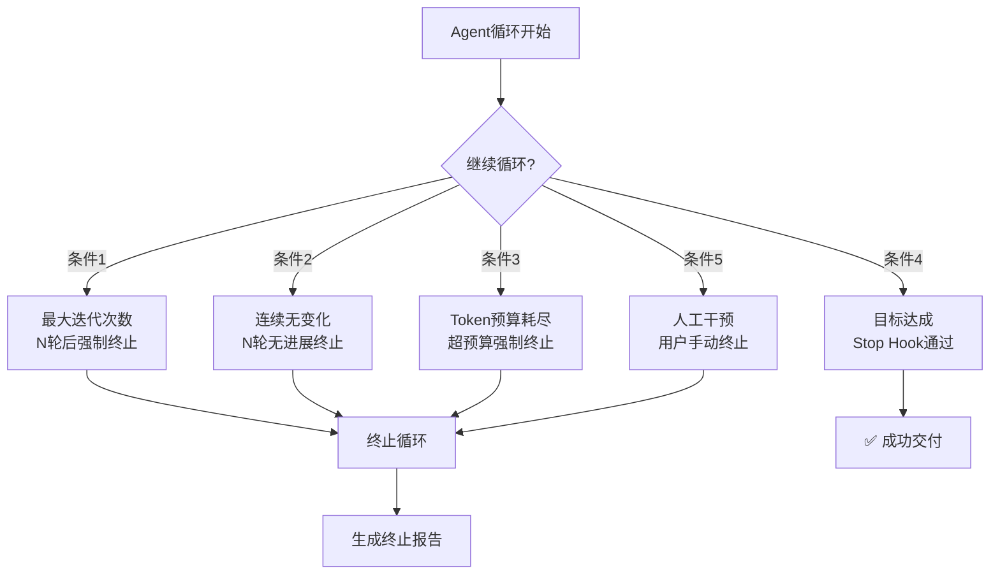
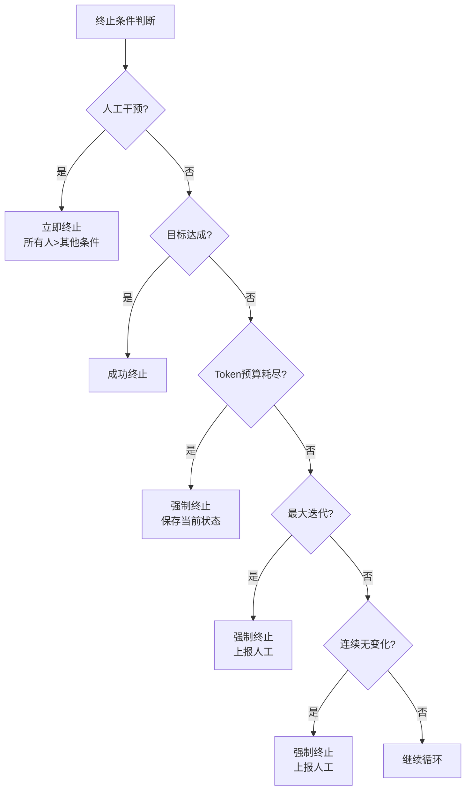

# 终止条件设计 — 五种硬终止条件与配置策略

> [!abstract] 核心观点
> 没有硬终止条件的Agent循环是"失控的循环"。五种终止条件（最大迭代次数、连续无变化、Token预算耗尽、目标达成、人工干预）必须全部配置，缺一不可。它们不是"保底方案"，而是"设计必需品" [$TRAE_REF](https://blog.csdn.net/weixin_74809706/article/details/162579639)。

---

## 一、为什么需要硬终止条件？

### 1.1 Agent的"自我评估"不可靠

| 问题 | 表现 | 后果 |
|------|------|------|
| **过早停止** | Agent觉得"完成了"，但任务远未达标 | 输出质量不达标 |
| **无限循环** | Agent在同一个问题上反复绕圈 | Token消耗爆炸 |
| **偏离目标** | Agent越跑越偏，但自己不知道 | 产出完全偏离需求 |
| **成本失控** | 没有预算限制，Token消耗无上限 | 单任务成本超预期 |

### 1.2 终止条件的设计哲学

```
终止条件不是"限制Agent"，而是"给Agent一个明确的边界"。
好的终止条件让Agent跑得更快，因为Agent知道边界在哪里。
```

---

## 二、五种终止条件详解

### 2.1 终止条件全景



---

### 2.2 条件1：最大迭代次数

**用途**：防止Agent在无法完成的任务上无限循环

**配置方式**：设定Agent最多可以循环多少轮

**配置示例**：
```yaml
max_iterations:
  enabled: true
  max_rounds: 15
  action_on_reach: "stop_and_report"  # stop_and_report / escalate_to_human / save_partial
  warning_at: 10  # 在达到10轮时发出警告
```

**不同场景的推荐值**：

| 场景 | 推荐值 | 说明 |
|------|--------|------|
| CI失败修复 | 10轮 | 任务明确，通常3-5轮就能解决 |
| 代码迁移 | 20轮 | 任务复杂，需要更多迭代 |
| 文档生成 | 5轮 | 质量优先，但不要无限循环 |
| 探索性分析 | 15轮 | 需要探索空间 |
| 简单问答 | 3轮 | 简单任务，不需要多次迭代 |

---

### 2.3 条件2：连续N轮无变化

**用途**：检测Agent是否"卡住"——在同一个问题上反复绕圈

**配置方式**：设定连续多少轮输出没有实质性变化

**"无变化"的判断标准**：
```
1. 输出内容没有实质性变化
   - 代码：diff为0或只有空格/注释变化
   - 文本：语义相似度超过阈值（如95%）
   - 文件：文件内容没有变化

2. 工具调用模式没有变化
   - 反复调用同一个工具，参数相同或相似
   - 反复读取同一个文件
   - 反复执行同一个命令
```

**配置示例**：
```yaml
no_progress_stop:
  enabled: true
  consecutive_no_change: 3  # 连续3轮无变化
  comparison_method: "semantic"  # exact / diff / semantic
  similarity_threshold: 0.95  # 语义相似度阈值
  action_on_trigger: "stop_and_escalate"  # 停止并上报人工
```

---

### 2.4 条件3：Token预算耗尽

**用途**：确保单任务成本可控

**配置方式**：设定单任务的最大Token消耗

**为什么需要Token预算**：
```
单次LLM调用成本：$0.01-0.10
10轮循环成本：$0.10-1.00
100轮循环成本：$1.00-10.00
1000轮循环成本：$10.00-100.00+

如果没有Token预算，一个失控的循环可能在几小时内消耗$1000+
```

**配置示例**：
```yaml
token_budget:
  enabled: true
  max_tokens: 50000  # 单任务最大Token消耗
  warning_threshold: 0.8  # 使用80%时发出警告
  action_on_exceed: "stop_and_save"  # stop_and_save / stop_and_discard / ask_human
  
  # 可选：分阶段预算
  stages:
    discovery: 5000
    planning: 5000
    execution: 30000
    verification: 10000
```

**不同场景的预算推荐**：

| 场景 | Token预算 | 预估成本 | 说明 |
|------|----------|---------|------|
| CI失败修复 | 50K | ~$1-2 | 任务明确，成本可控 |
| 代码迁移 | 200K | ~$5-10 | 任务复杂，预算较高 |
| 文档生成 | 30K | ~$0.5-1 | 质量优先，中等预算 |
| 数据分析 | 100K | ~$2-5 | 数据处理量大 |
| 依赖升级 | 50K | ~$1-2 | 升级+测试+修复 |

---

### 2.5 条件4：目标达成

**用途**：正常终止——任务目标已经达成

**这是唯一一种"成功"的终止方式**，通过Stop Hook验证。

**配置示例**：
```yaml
goal_achieved:
  enabled: true
  verification: "stop_hook"  # 使用Stop Hook验证
  require_all: true  # 所有验收标准必须全部通过
  partial_acceptance: false  # 是否接受部分完成
  
  # 验收标准示例
  criteria:
    - "所有测试通过"
    - "类型检查零错误"
    - "Lint零错误"
    - "不破坏现有功能"
```

---

### 2.6 条件5：人工干预

**用途**：用户随时可以手动终止循环

**这是最高优先级的终止条件**——无论其他条件如何，人工干预必须立即生效。

**触发方式**：
```
1. 用户直接终止（最高优先级）
   - 在Agent运行时点击"停止"按钮
   - 发送"STOP"指令

2. 自动升级
   - Agent达到最大迭代次数后升级到人工
   - Agent检测到无法处理的异常时升级到人工
   - Token预算耗尽后升级到人工
```

**配置示例**：
```yaml
human_intervention:
  enabled: true
  priority: "highest"  # 最高优先级，可覆盖其他所有条件
  
  # 自动升级条件
  auto_escalate:
    - max_iterations_reached
    - token_budget_exceeded
    - consecutive_no_change
    - unhandled_error
  
  # 通知方式
  notification:
    - type: "console"
    - type: "email"
    - type: "webhook"
```

---

## 三、终止条件的优先级



**优先级顺序**：
```
1. 人工干预（最高优先级）—— 用户说了算
2. 目标达成 —— 正常终止
3. Token预算耗尽 —— 成本控制
4. 最大迭代次数 —— 防止无限循环
5. 连续无变化 —— 防止卡住
```

---

## 四、不同场景的终止条件配置模板

### 4.1 CI失败修复模板

```yaml
termination:
  max_iterations: 10
  no_progress: 3
  token_budget: 50000
  goal_achieved: true
  human_intervention: true
  action_on_failure: "escalate_to_human"
```

### 4.2 代码迁移模板

```yaml
termination:
  max_iterations: 20
  no_progress: 5
  token_budget: 200000
  goal_achieved: true
  human_intervention: true
  action_on_failure: "save_partial_and_escalate"
```

### 4.3 探索性分析模板

```yaml
termination:
  max_iterations: 15
  no_progress: 3
  token_budget: 100000
  goal_achieved: true
  human_intervention: true
  action_on_failure: "save_partial_results"
```

---

## 五、终止后的处理策略

当循环被终止时，需要决定如何处理当前状态：

| 策略 | 说明 | 适用场景 |
|------|------|---------|
| **save_and_report** | 保存当前状态，生成终止报告 | 默认策略 |
| **escalate_to_human** | 上报人工处理 | 需要人工判断的场景 |
| **save_partial** | 保存部分完成的结果 | 代码迁移等 |
| **discard** | 放弃当前结果 | 简单任务，从头开始更划算 |
| **rollback** | 回滚到任务开始前的状态 | 有回滚机制的场景 |

---

## 六、常见陷阱与应对

| 陷阱 | 表现 | 应对 |
|------|------|------|
| **只配了最大迭代** | Agent在迭代上限内烧了大量Token | 必须同时配置Token预算 |
| **轮数设置太大** | 设置了50轮，但Agent在10轮内就卡住了 | 设置连续无变化检测 |
| **忽略人工干预通道** | Agent跑偏了但无法手动停止 | 确保人工干预通道畅通 |
| **终止后没保存状态** | 终止后不知道Agent做了什么 | 配置save_and_report策略 |
| **预算设置不合理** | 预算太少导致频繁中断，预算太多导致成本失控 | 先用小预算试跑，根据数据调整 |

---

## 七、检查清单

```
[ ] 最大迭代次数
    ├── 已设定合理的轮数上限
    └── 达到上限后的处理策略已配置

[ ] 连续N轮无变化
    ├── 已设定无变化判定标准
    ├── 已设定连续轮数阈值
    └── 触发后的处理策略已配置

[ ] Token预算耗尽
    ├── 已设定单任务预算上限
    ├── 已设定预警阈值
    └── 超预算后的处理策略已配置

[ ] 目标达成
    ├── 验收标准已定义
    ├── Stop Hook已实现
    └── 验证逻辑已测试

[ ] 人工干预
    ├── 手动终止通道已开通
    ├── 自动升级条件已配置
    └── 通知方式已配置
```

---

## 关联笔记

- [[01-AI技术/LOOP Engineering/04-方法篇/01_循环设计八步法]] — 循环设计中的终止条件配置
- [[01-AI技术/LOOP Engineering/04-方法篇/03_安全护栏体系]] — Stop Hook的完整实现
- [[01-AI技术/LOOP Engineering/04-方法篇/05_成本控制策略]] — Token预算与成本控制
- [[01-AI技术/LOOP Engineering/00_MOC_LOOP_Engineering中枢]] — 返回中枢索引