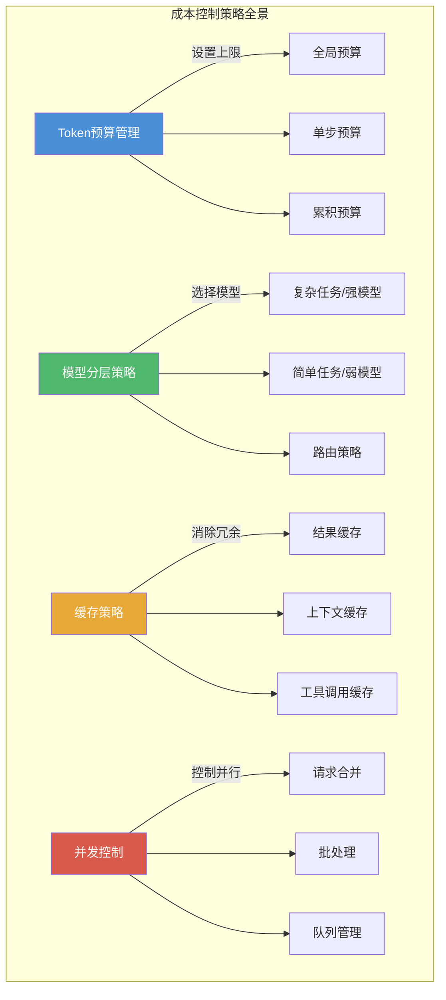

# 成本控制策略 — Token预算、模型分层与缓存体系

> [!abstract] 核心观点
> Agent循环的成本失控不是"用多了"的问题，而是"没有设计成本边界"的问题。成本控制策略需要贯穿循环的全生命周期：在入口处通过模型分层控制单价，在执行中通过Token预算控制总量，在重复场景通过缓存策略消除冗余调用。三者缺一不可，构成完整的成本控制体系。

---

## 一、为什么Loop需要成本控制

### 1.1 Token消耗模型

每个Agent循环的成本由三部分组成：

```
总成本 = 输入Token数 × 输入单价 + 输出Token数 × 输出单价

其中：
  输入Token数 = 系统提示词 + 上下文历史 + 工具调用结果 + 多轮累积
  输出Token数 = 推理过程 + 最终输出 + 工具调用参数
```

以一个典型的CI修复循环为例：

| 组件 | 每次调用Token数 | 10轮循环累计 |
|------|----------------|-------------|
| 系统提示词 | 2,000 | 20,000 |
| 上下文历史（增量） | 每轮+1,500 | 15,000 |
| 工具调用结果 | 每轮+3,000 | 30,000 |
| 推理输出 | 每轮+800 | 8,000 |
| **合计** | **每轮~7,300** | **~73,000** |

以GPT-4o定价计算，73K Token约$0.5-1.0。如果循环失控跑到50轮，单任务成本可能飙升至$5+。**10个并发Agent跑一天，月账单轻松过万。**

### 1.2 API调用成本

除了Token费用，API调用本身也有成本结构：

```
API调用成本 = 调用次数 × 单次调用成本

影响因素：
- 模型选择（强模型成本是弱模型的10-50倍）
- 调用频率（内循环调用频率可能是外循环的50倍）
- 重试次数（失败重试会成倍增加成本）
- 并发数（高并发下成本线性增长）
```

**典型成本对比**：

| 模型 | 输入单价（/1K Token） | 输出单价（/1K Token） | 相对成本 |
|------|---------------------|---------------------|---------|
| GPT-4o | $0.005 | $0.015 | 基准 |
| GPT-4o-mini | $0.00015 | $0.0006 | **~1/25** |
| Claude 3.5 Sonnet | $0.003 | $0.015 | ~1/1.2 |
| Claude 3 Haiku | $0.00025 | $0.00125 | **~1/12** |
| DeepSeek V3 | $0.0005 | $0.002 | **~1/7** |

> 在简单任务上使用强模型，相当于用卡车运一封信——成本高但效果未必更好。

### 1.3 无限循环风险

无限循环是成本失控的最大元凶。一个失控的Agent循环可能：

```
无终止条件的循环成本推演：
- 第1-10轮：正常执行，成本$1
- 第11-20轮：Agent在同一个问题上绕圈，成本$2
- 第21-50轮：Agent陷入"修复→验证失败→修复"的死循环，成本$5
- 第51-100轮：Agent开始偏离目标，尝试无关方案，成本$10+
- 100+轮：成本呈指数级增长，单任务可能消耗$50+

实际案例：某团队未配置Token预算，一个Agent循环跑了347轮，
消耗了超过200万Token，单次任务成本$28 [citation:内部案例]
```

**无限循环的典型模式**：
- **修复循环**：Agent修复A → 测试发现B问题 → 修复B → 测试发现A问题 → 修复A...
- **探索循环**：Agent发现新信息 → 需要更多信息 → 继续发现 → 永远处于"收集信息"阶段
- **优化循环**：Agent觉得"还能更好" → 不断修改 → 每次修改引入新问题 → 继续修改
- **确认循环**：Agent不确定结果 → 请求确认 → 收到模糊答复 → 继续请求确认

---

## 二、成本控制策略全景

成本控制策略由四个维度构成，形成一个完整的控制体系：



### 2.1 Token预算管理

**全局预算**：限制整个任务的生命周期Token消耗

```yaml
# 全局预算配置
token_budget:
  global:
    max_tokens: 100000         # 全局上限
    warning_threshold: 0.8     # 80%时预警
    hard_limit: 120000         # 硬上限，超过强制终止
    action_on_exceed: "stop_and_report"
```

**单步预算**：限制单次循环的Token消耗上限

```yaml
# 单步预算配置
token_budget:
  per_step:
    max_input_tokens: 16000    # 单步输入上限
    max_output_tokens: 4000    # 单步输出上限
    max_tool_result_tokens: 8000  # 工具结果上限
    action_on_exceed: "truncate_and_warn"
```

**累积预算**：按阶段分配预算，防止前期过度消耗

```yaml
# 累积预算配置（分阶段）
token_budget:
  phases:
    discovery:                 # 问题发现阶段
      max_tokens: 10000
      max_steps: 3
    planning:                  # 方案规划阶段
      max_tokens: 15000
      max_steps: 2
    execution:                 # 执行阶段
      max_tokens: 50000
      max_steps: 10
    verification:              # 验证阶段
      max_tokens: 25000
      max_steps: 5
```

### 2.2 模型分层策略

**核心原则**：用最便宜的模型完成当前任务，只在必要时升级到强模型。

**模型分层架构**：

| 层级 | 模型 | 适用场景 | 相对成本 |
|------|------|---------|---------|
| L1（经济层） | GPT-4o-mini / Claude Haiku | 简单分类、格式化、模式匹配 | 1x |
| L2（标准层） | GPT-4o / Claude Sonnet | 代码生成、重构、测试编写 | 25x |
| L3（高性能层） | Claude Opus / GPT-4 Turbo | 复杂推理、架构设计、安全审查 | 50x |
| L4（专家层） | 领域微调模型 | 特定领域任务（医疗、法律、金融） | 100x+ |

**路由策略决策树**：

```
任务到达 → 任务分类器判断难度
├── 简单（模式匹配、格式化、简单问答）
│   └── → L1模型（GPT-4o-mini）
├── 中等（代码生成、bug修复、测试编写）
│   └── → L2模型（GPT-4o）
├── 复杂（架构设计、多步骤推理、安全审查）
│   └── → L3模型（Claude Opus）
└── 领域专家（需要专业知识）
    └── → L4模型（领域微调模型）
```

### 2.3 缓存策略

**结果缓存**：对完全相同或高度相似的请求，直接返回缓存结果

```python
# 结果缓存示例
cache = {
    "key": hash(task_description + context_snapshot),
    "value": {
        "result": "cached_output",
        "timestamp": "2026-08-03T10:00:00Z",
        "ttl": 3600,  # 1小时过期
        "hit_count": 42
    }
}

def get_cached_result(task):
    cache_key = generate_cache_key(task)
    if cache_key in cache and not cache_expired(cache_key):
        cache[cache_key]["hit_count"] += 1
        return cache[cache_key]["result"]
    return None
```

**上下文缓存**：复用共享的上下文段，避免重复处理

| 缓存类型 | 缓存内容 | 命中场景 | 节省比例 |
|---------|---------|---------|---------|
| 系统提示词 | 角色定义、行为规则 | 同一Agent的所有调用 | ~30% |
| 项目上下文 | 项目结构、代码规范 | 同一项目的多次任务 | ~20% |
| 工具结果 | 文件内容、命令输出 | 重复读取同一文件 | ~15% |
| 历史摘要 | 任务进度摘要 | 长循环中的状态恢复 | ~10% |

**工具调用缓存**：对幂等的工具调用结果进行缓存

```yaml
# 工具调用缓存配置
tool_cache:
  enabled: true
  ttl: 300  # 5分钟
  strategies:
    - tool: "read_file"
      cache_key: "file_path"
      ttl: 600  # 文件内容10分钟内不变
    - tool: "run_command"
      cache_key: "command + args"
      ttl: 60  # 命令输出1分钟内有效
      skip_cache: ["rm", "write", "delete"]  # 写操作不缓存
    - tool: "search_code"
      cache_key: "query + path"
      ttl: 300  # 搜索结果5分钟有效
```

### 2.4 并发控制

**请求合并**：将多个独立的LLM请求合并为一次批量请求

```python
# 请求合并示例
class RequestBatcher:
    def __init__(self, max_batch_size=10, max_wait_ms=100):
        self.queue = []
        self.max_batch_size = max_batch_size
        self.max_wait_ms = max_wait_ms
    
    async def submit(self, request):
        self.queue.append(request)
        if len(self.queue) >= self.max_batch_size:
            return await self.flush()
        # 等待后续请求或超时
        await asyncio.sleep(self.max_wait_ms / 1000)
        return await self.flush()
    
    async def flush(self):
        if not self.queue:
            return []
        batch = self.queue[:self.max_batch_size]
        self.queue = self.queue[self.max_batch_size:]
        return await self.batch_call(batch)
```

**批处理**：将多个独立的子任务合并为一次LLM调用

**队列管理**：控制并发请求数量，避免API限流和成本尖峰

```yaml
# 队列管理配置
queue_management:
  max_concurrent: 5           # 最大并发请求数
  queue_timeout: 30           # 队列等待超时（秒）
  rate_limit: 100             # 每分钟最大请求数
  priority_levels:            # 优先级队列
    - name: "critical"
      max_concurrent: 2
      weight: 10
    - name: "normal"
      max_concurrent: 3
      weight: 5
    - name: "background"
      max_concurrent: 1
      weight: 1
```

---

## 三、模型分层路由策略

### 3.1 任务分类器

任务分类器本身应该使用L1模型，因为它只需要做简单的分类判断。

```python
# 任务分类器实现示例
class TaskClassifier:
    def __init__(self):
        self.model = "gpt-4o-mini"  # 分类器本身用廉价模型
        self.rules = {
            "complexity": {
                "simple": ["format", "parse", "extract", "validate"],
                "medium": ["generate", "refactor", "fix", "test"],
                "complex": ["design", "analyze", "optimize", "architect"]
            }
        }
    
    def classify(self, task):
        # 第一步：基于关键词快速分类
        for keyword in self.rules["complexity"]["simple"]:
            if keyword in task.lower():
                return "simple"
        
        # 第二步：调用LLM分类（仍然用L1模型）
        complexity = self.llm_classify(task)
        return complexity
```

### 3.2 模型选择矩阵

| 任务类型 | 复杂度 | 推荐模型 | 备选模型 | 最大Token预算 |
|---------|--------|---------|---------|-------------|
| 代码格式化 | 简单 | GPT-4o-mini | Claude Haiku | 5,000 |
| 简单问答 | 简单 | GPT-4o-mini | - | 2,000 |
| 代码生成 | 中等 | GPT-4o | Claude Sonnet | 30,000 |
| Bug修复 | 中等 | GPT-4o | Claude Sonnet | 20,000 |
| 测试编写 | 中等 | GPT-4o | Claude Sonnet | 25,000 |
| 架构设计 | 复杂 | Claude Opus | GPT-4 Turbo | 50,000 |
| 安全审查 | 复杂 | Claude Opus | GPT-4 Turbo | 40,000 |
| 多Agent协调 | 复杂 | GPT-4o | Claude Sonnet | 60,000 |

### 3.3 降级策略

当强模型不可用（限流、超时、成本超预算）时，需要优雅降级：

```yaml
# 降级策略配置
model_degradation:
  enabled: true
  strategy: "step_down"  # step_down / fallback / hybrid
  
  # 降级链路
  chain:
    - level: "L3"
      model: "claude-opus"
      fallback: "L2"
    - level: "L2"
      model: "gpt-4o"
      fallback: "L1"
    - level: "L1"
      model: "gpt-4o-mini"
      fallback: "cache_only"  # 降级到只返回缓存结果
  
  # 降级触发条件
  triggers:
    - type: "rate_limit"
      action: "degrade_to_L1"
      cooldown: 60  # 60秒后尝试恢复
    - type: "budget_exceeded"
      action: "degrade_to_L1"
      cooldown: 300
    - type: "latency_high"
      action: "degrade_by_one_level"
      threshold_ms: 10000
```

**降级对输出的影响**：

| 降级场景 | 预期效果 | 风险 | 缓解措施 |
|---------|---------|------|---------|
| L3→L2 | 推理深度略降，但功能完整 | 复杂逻辑可能出错 | 增加验证步骤 |
| L2→L1 | 代码质量下降，模板化输出 | 边缘情况处理不足 | 增加审查频率 |
| L1→Cache | 仅返回已有结果 | 无法处理新问题 | 升级到人工处理 |

---

## 四、成本监控与预警

### 4.1 实时成本追踪

```python
# 实时成本追踪示例
class CostTracker:
    def __init__(self):
        self.metrics = {
            "total_tokens": 0,
            "total_cost": 0.0,
            "by_model": {},    # 按模型分组
            "by_task": {},     # 按任务分组
            "by_phase": {}     # 按阶段分组
        }
    
    def record_call(self, model, tokens_in, tokens_out, task_id, phase):
        cost = self.calculate_cost(model, tokens_in, tokens_out)
        self.metrics["total_tokens"] += tokens_in + tokens_out
        self.metrics["total_cost"] += cost
        
        # 按模型统计
        if model not in self.metrics["by_model"]:
            self.metrics["by_model"][model] = {"calls": 0, "tokens": 0, "cost": 0.0}
        self.metrics["by_model"][model]["calls"] += 1
        self.metrics["by_model"][model]["tokens"] += tokens_in + tokens_out
        self.metrics["by_model"][model]["cost"] += cost
    
    def get_report(self):
        return {
            "total_cost": f"${self.metrics['total_cost']:.2f}",
            "total_tokens": self.metrics["total_tokens"],
            "cost_breakdown": self.metrics["by_model"],
            "avg_cost_per_step": self.metrics["total_cost"] / max(len(self.metrics), 1)
        }
```

### 4.2 异常检测与告警

```yaml
# 成本异常告警配置
cost_alerts:
  enabled: true
  
  rules:
    - name: "单步成本异常"
      condition: "per_step_cost > $0.5"
      action: "log_and_warn"
      cooldown: 60
    
    - name: "Token消耗突增"
      condition: "rolling_avg_5min > 3x baseline"
      action: "degrade_model"
      cooldown: 300
    
    - name: "无限循环检测"
      condition: "same_tool_call > 5 times in 10 steps"
      action: "force_stop_and_escalate"
      cooldown: 0
    
    - name: "日预算告警"
      condition: "daily_cost > $100"
      action: "notify_admin"
      cooldown: 3600
    
    - name: "月预算硬上限"
      condition: "monthly_cost > $2000"
      action: "pause_all_agents"
      cooldown: 0
```

### 4.3 成本分析报告

成本分析报告应该在每次任务完成后自动生成：

```yaml
# 成本分析报告模板
cost_analysis:
  task_id: "task-ci-fix-20260803-001"
  task_type: "CI失败修复"
  duration: "12m 34s"
  total_cost: "$0.87"
  total_tokens: 45231
  
  breakdown:
    by_model:
      gpt-4o-mini:
        calls: 8
        tokens: 12340
        cost: "$0.06"
      gpt-4o:
        calls: 5
        tokens: 32891
        cost: "$0.81"
    
    by_phase:
      discovery:
        tokens: 3200
        cost: "$0.02"
      planning:
        tokens: 4500
        cost: "$0.03"
      execution:
        tokens: 28000
        cost: "$0.65"
      verification:
        tokens: 9531
        cost: "$0.17"
  
  savings:
    cache_hits: 3
    cache_savings: "$0.12"
    model_routing_savings: "$0.35"  # 相比全用GPT-4o节省
    total_savings: "$0.47"
  
  recommendations:
    - "discovery阶段建议改用GPT-4o-mini，可进一步节省$0.01"
    - "verification阶段的3次调用完全可以用L1模型"
```

---

## 五、成本控制配置示例

### 完整的YAML配置文件

```yaml
# cost-control-config.yaml
# LOOP Engineering 成本控制完整配置

cost_control:
  enabled: true
  version: "1.0"
  
  # --- 1. Token预算配置 ---
  token_budget:
    global:
      max_tokens: 100000
      warning_threshold: 0.8
      hard_limit: 120000
      action_on_exceed: "stop_and_report"
    
    per_step:
      max_input_tokens: 16000
      max_output_tokens: 4000
      max_tool_result_tokens: 8000
      action_on_exceed: "truncate_and_warn"
    
    phases:
      discovery:
        max_tokens: 10000
        max_steps: 3
      planning:
        max_tokens: 15000
        max_steps: 2
      execution:
        max_tokens: 50000
        max_steps: 10
      verification:
        max_tokens: 25000
        max_steps: 5
  
  # --- 2. 模型分层配置 ---
  model_routing:
    enabled: true
    classifier_model: "gpt-4o-mini"
    
    tiers:
      - name: "economy"
        model: "gpt-4o-mini"
        max_tokens: 4000
        cost_per_1k: 0.00015
        tasks: ["format", "parse", "extract", "validate", "classify"]
      
      - name: "standard"
        model: "gpt-4o"
        max_tokens: 16000
        cost_per_1k: 0.005
        tasks: ["generate", "refactor", "fix", "test", "document"]
      
      - name: "premium"
        model: "claude-opus"
        max_tokens: 32000
        cost_per_1k: 0.015
        tasks: ["design", "analyze", "optimize", "architect", "security"]
    
    degradation:
      enabled: true
      strategy: "step_down"
      triggers:
        - type: "rate_limit"
          action: "degrade_to_L1"
          cooldown: 60
        - type: "budget_exceeded"
          action: "degrade_to_L1"
          cooldown: 300
  
  # --- 3. 缓存配置 ---
  cache:
    result_cache:
      enabled: true
      ttl: 3600
      max_size: 1000
      strategy: "lru"
    
    context_cache:
      enabled: true
      shared_contexts:
        - "system_prompt"
        - "project_rules"
        - "code_standards"
    
    tool_cache:
      enabled: true
      ttl: 300
      skip_tools: ["write", "delete", "rm", "commit", "push"]
  
  # --- 4. 并发控制配置 ---
  concurrency:
    max_concurrent: 5
    queue_timeout: 30
    rate_limit: 100
    batching:
      enabled: true
      max_batch_size: 10
      max_wait_ms: 100
  
  # --- 5. 监控与告警配置 ---
  monitoring:
    tracking:
      enabled: true
      granularity: "per_step"
    
    alerts:
      - name: "per_step_cost_high"
        condition: "per_step_cost > 0.5"
        action: "warn"
      - name: "cost_spike"
        condition: "rolling_avg_5min > 3x baseline"
        action: "degrade"
      - name: "loop_detected"
        condition: "same_tool_call > 5 in 10"
        action: "force_stop"
      - name: "daily_budget"
        condition: "daily_cost > 100"
        action: "notify"
      - name: "monthly_hard_limit"
        condition: "monthly_cost > 2000"
        action: "pause_all"
    
    reporting:
      auto_generate: true
      report_format: "markdown"
      send_to: "cost-dashboard"
```

---

## 六、常见陷阱与应对

### 陷阱1：过度缓存导致状态不一致

**表现**：缓存命中返回了过时的结果，Agent基于过期信息做出错误决策。

**应对**：
- 为缓存设置合理的TTL，不同类型的数据使用不同的过期时间
- 写操作后主动清除相关缓存
- 缓存结果附带时间戳，Agent可以判断时效性

```yaml
# 缓存一致性保障
cache_consistency:
  ttl_strategy: "sliding"  # sliding / fixed / manual
  invalidation:
    on_write: true          # 写操作后自动清除
    on_error: true          # 发现错误时清除
  versioning: true          # 缓存附带版本号
```

### 陷阱2：模型降级影响输出质量

**表现**：降级到L1模型后，Agent的输出质量明显下降，但系统没有检测到质量变化。

**应对**：
- 降级时同步增加验证频率（L1 + 更多验证步骤）
- 降级后监控关键质量指标（测试通过率、审查通过率）
- 设置**质量最低阈值**，低于阈值时停止降级并升级到人工

```python
# 降级质量监控
class DegradationMonitor:
    def __init__(self):
        self.quality_thresholds = {
            "test_pass_rate": 0.9,     # 测试通过率不低于90%
            "lint_pass_rate": 0.95,    # Lint通过率不低于95%
            "review_approval": 0.8     # 审查通过率不低于80%
        }
    
    def check_quality(self, model_tier, results):
        if model_tier == "L1" and results["test_pass_rate"] < 0.8:
            return "escalate_to_human"  # 质量太差，升级到人工
        return "continue"
```

### 陷阱3：只配了全局预算没配单步预算

**表现**：一次循环就消耗了全局预算的80%，后续步骤只能降级或失败。

**应对**：**全局预算 + 单步预算 + 分阶段预算三者必须同时配置**，缺一不可。

### 陷阱4：缓存命中率低、维护成本高

**表现**：花了很多精力配置缓存，但实际命中率不到10%，维护缓存的开销超过了节省的成本。

**应对**：
- 先监控热点数据，只对高频重复的请求启用缓存
- 使用自适应TTL，根据命中率动态调整
- 定期清理无效缓存，避免缓存膨胀

### 陷阱5：成本监控滞后

**表现**：每天看一次成本报告，发现问题时已经超预算数小时。

**应对**：
- 配置实时告警，在成本异常时立即通知
- 设置自动熔断机制（如：单任务成本超过$5自动暂停）
- 使用**渐进式告警**：警告→降级→暂停→人工介入

```
成本告警的渐进式响应：
  $0.5/步  → 日志警告
  $1.0/步  → 降级模型
  $5.0/任务 → 强制终止
  $100/天  → 通知管理员
  $500/天  → 暂停所有Agent
```

---

## 关联笔记

- [[01-AI技术/LOOP Engineering/04-方法篇/01_循环设计八步法]] — 循环设计中的成本控制配置
- [[01-AI技术/LOOP Engineering/04-方法篇/04_终止条件设计]] — Token预算是硬终止条件之一
- [[01-AI技术/LOOP Engineering/03-架构篇/01_Inner Outer Loop]] — 内循环/外循环的成本特征差异
- [[01-AI技术/LOOP Engineering/04-方法篇/06_棘轮机制]] — 通过规则积累降低重复性任务成本
- [[01-AI技术/LOOP Engineering/00_MOC_LOOP_Engineering中枢]] — 返回中枢索引