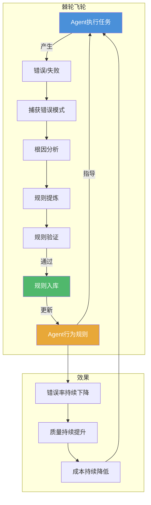
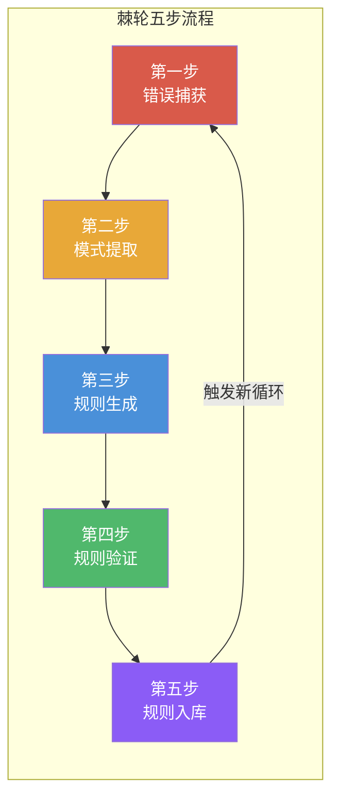
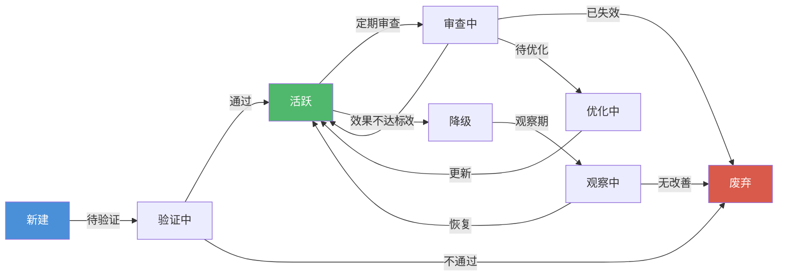

# 棘轮机制 — 从错误到规则的持续进化

> [!abstract] 核心观点
> 棘轮机制是LOOP Engineering中"持续改进"的工程化实现。它的核心思想是：**每次Agent犯错，不是简单地修复错误，而是把错误转化为规则——下次同样的错误不会再犯。** 棘轮永不后退，系统越跑越准。这是Agent系统从"可用"进化到"可靠"的关键机制。

---

## 一、为什么需要棘轮机制

### 1.1 Agent如何从错误中学习

传统的LLM使用方式中，Agent的"学习"是静态的：

```
传统模式：犯错 → 修复 → 下次还可能犯同样的错误
```

这是因为LLM本身不具备记忆能力——每次对话都是独立的。即使Agent刚刚修复了一个bug，在新的对话中，如果没有正确的上下文提示，它仍然可能犯同样的错误。

**棘轮机制改变了这一点**：

```
棘轮模式：犯错 → 分析根因 → 提炼规则 → 规则入库 → 下次自动生效
```

| 对比维度 | 传统模式 | 棘轮模式 |
|---------|---------|---------|
| 错误处理 | 修复即结束 | 修复+提炼规则 |
| 知识传承 | 依赖开发者记忆 | 规则库自动生效 |
| 团队扩展 | 新人需要重新积累经验 | 规则库就是团队记忆 |
| 改进速度 | 线性 | 指数级（每次改进叠加） |
| 可复制性 | 低（依赖个人经验） | 高（规则可复用） |

### 1.2 构建持续改进的反馈循环

棘轮机制是外循环（Outer Loop）的核心驱动力。它把"收集反馈→分析模式→提炼规则→更新技能文件"这个循环变成了一个自动化的改进飞轮：



**每转一圈，系统就变好一点。** 这就是棘轮机制的本质——一个永不后退的改进飞轮。

---

## 二、棘轮机制的核心原理

### 2.1 定义

> **棘轮机制**：每次Agent发生错误或失败时，系统自动捕获错误模式，分析根因，提炼为可执行的规则，并将规则注入Agent的行为约束中，使同样的错误不再重复发生。

**三个关键特征**：

1. **单向前进**：规则一旦生效，不会自动回退（除非显式审查删除）
2. **错误即输入**：每个错误都是改进系统的原材料，而非需要掩盖的"事故"
3. **自动化闭环**：从错误发生到规则生效，尽可能自动化，减少人工干预

### 2.2 与传统反馈循环的区别

棘轮机制不是简单的"反馈→修正"循环，它与传统反馈循环有本质区别：

| 维度 | 传统反馈循环 | 棘轮机制 |
|------|------------|---------|
| **反馈粒度** | 针对当前错误的修正 | 提炼可复用的抽象规则 |
| **生效范围** | 当前任务 | 所有后续任务（全局生效） |
| **知识形态** | 存在于对话上下文中 | 独立存储于规则库 |
| **持久性** | 对话结束即失效 | 永久有效（直到被删除） |
| **改进模式** | 线性修复 | 叠加式积累 |
| **人工参与** | 每次都需要人工判断 | 规则验证可能需要人工，但提炼过程可自动化 |

**类比**：

```
传统反馈循环 ≈ 每次漏水都去擦地板
棘轮机制     ≈ 每次漏水都修好水管，并在水管上贴标签"这个地方容易漏"
```

---

## 三、棘轮实现架构

### 3.1 五步流程全景

棘轮机制由五个步骤构成一个完整的闭环：



### 3.2 第一步：错误捕获

**目标**：在Agent执行过程中，自动检测并捕获错误，记录完整的错误上下文。

**捕获方式**：

| 捕获方式 | 检测机制 | 示例 |
|---------|---------|------|
| 验证失败捕获 | 测试失败、Lint错误、编译错误 | `pytest failed: test_user_registration` |
| 工具调用异常 | 工具返回错误码、超时、异常 | `git push rejected: merge conflict` |
| 终止条件触发 | 达到最大迭代次数、Token预算耗尽 | `max_iterations reached: 10 rounds` |
| 行为异常检测 | 同一工具反复调用、输出无变化 | `same file read 5 times in a row` |
| 人工标记 | 用户主动标记错误 | `human: "this approach is wrong"` |

**错误记录格式**：

```yaml
# 错误捕获记录
error_capture:
  id: "err-20260803-001"
  timestamp: "2026-08-03T10:30:00Z"
  task_id: "task-ci-fix-001"
  task_type: "CI修复"
  
  error:
    type: "test_failure"
    summary: "测试期望返回409，实际返回200"
    location: "tests/test_user_api.py:42"
    severity: "high"
    
  context:
    agent_intent: "实现用户注册接口的重复邮箱检查"
    tool_sequence:
      - "read_file: src/user/register.py"
      - "read_file: tests/test_user_api.py"
      - "write_file: src/user/register.py"  # 修改了实现
      - "run_command: pytest"  # 测试失败
    state_snapshot: "src/user/register.py 第15行缺少重复检查"
    
  frequency:
    first_seen: "2026-08-03T09:15:00Z"
    count_in_24h: 3
    similar_errors: ["err-20260802-015", "err-20260802-022"]
```

### 3.3 第二步：模式提取

**目标**：从错误记录中提取出可复用的错误模式，识别出"这是特例还是趋势"。

**模式分类**：

```
模式分类维度：
├── 错误类型
│   ├── 语法错误 → 需要语法规则
│   ├── 逻辑错误 → 需要逻辑规则
│   ├── 安全漏洞 → 需要安全规则
│   └── 风格问题 → 需要风格规则
│
├── 发生频率
│   ├── 首次出现 → 标记为"观察中"
│   ├── 重复出现（>3次） → 提升为"确认模式"
│   └── 高频出现（>10次） → 提升为"关键模式"
│
└── 影响范围
    ├── 局部（单个文件） → 文件级规则
    ├── 模块（多个文件） → 模块级规则
    └── 全局（所有任务） → 全局规则
```

**模式提取示例**：

```python
# 模式提取逻辑
class PatternExtractor:
    def __init__(self):
        self.patterns = []
    
    def extract(self, error_record):
        patterns = []
        
        # 1. 基于错误类型的模式匹配
        if error_record["error"]["type"] == "test_failure":
            patterns.append({
                "type": "logical",
                "pattern": "缺少边界条件检查",
                "confidence": 0.8
            })
        
        # 2. 基于工具调用序列的模式匹配
        if self.is_edit_without_test(error_record):
            patterns.append({
                "type": "process",
                "pattern": "修改代码后未先运行已有测试",
                "confidence": 0.9
            })
        
        # 3. 基于频率的模式提升
        similar_count = self.count_similar_errors(error_record)
        if similar_count >= 3:
            patterns[0]["confidence"] = min(1.0, patterns[0]["confidence"] + 0.1)
            patterns[0]["priority"] = "high"
        
        return patterns
```

### 3.4 第三步：规则生成

**目标**：将提炼出的模式转化为可执行的规则，规则应该清晰、具体、可验证。

**规则生成原则**：

```
好规则的标准：
1. 具体：规则必须针对具体的错误模式，不能太抽象
   ❌ "代码要写得好"
   ✅ "所有API接口必须实现输入参数校验"
   
2. 可验证：规则必须能通过自动化手段验证
   ❌ "代码要有好的设计"
   ✅ "新增public方法必须有对应的单元测试"
   
3. 无歧义：规则只能有一种理解方式
   ❌ "尽量使用异步"
   ✅ "所有IO操作必须使用async/await"
   
4. 可执行：规则必须能被Agent执行
   ❌ "注意性能"
   ✅ "数据库查询必须加索引，否则mypy会报错"
```

**规则生成示例**：

```yaml
# 生成的规则
rule:
  id: "rule-logic-001"
  version: 1
  title: "API重复检查必须处理409冲突"
  
  trigger:
    conditions:
      - "task_type == 'api_implementation'"
      - "api_endpoint == 'POST /api/users/register'"
    priority: "high"
  
  rule_content: |
    当实现POST注册接口时，必须：
    1. 先查询数据库是否已存在相同邮箱的用户
    2. 如果存在，返回HTTP 409 Conflict
    3. 如果不存在，才创建新用户并返回201
    
  verification:
    method: "test"
    test_pattern: "test_*_duplicate*"
    expected: "返回409"
  
  source:
    error_id: "err-20260803-001"
    created_by: "ratchet_engine_v1"
    created_at: "2026-08-03T10:35:00Z"
```

### 3.5 第四步：规则验证

**目标**：确保新生成的规则是正确的、有效的，不会产生副作用。

**验证流程**：

```mermaid
flowchart TD
    A[新规则生成] --> B{规则冲突检测?}
    B -->|无冲突| C[规则有效性测试]
    B -->|有冲突| D[冲突解决]
    D --> C
    
    C --> E{通过测试?}
    E -->|是| F[规则入库]
    E -->|否| G[规则修复]
    G --> C
    
    C --> H{需要人工审核?}
    H -->|是| I[标记为"待审核"]
    I --> J[人工审核]
    J -->|通过| F
    J -->|拒绝| K[规则废弃]
    
    style A fill:#4A90D9,color:#fff
    style F fill:#50B86C,color:#fff
    style K fill:#D95A4A,color:#fff
```

**验证标准**：

| 验证项 | 说明 | 通过标准 |
|-------|------|---------|
| 规则冲突检测 | 检查是否与已有规则矛盾 | 无冲突 或 冲突已解决 |
| 语法正确性 | 规则格式是否正确 | 解析通过 |
| 可执行性 | Agent能否理解并执行 | 模拟执行通过 |
| 效果评估 | 应用规则后错误是否减少 | 测试集上错误率降低>50% |
| 副作用检测 | 规则是否导致其他问题 | 回归测试通过 |

### 3.6 第五步：规则入库

**目标**：将验证通过的规则写入规则库，使其对Agent生效。

```yaml
# 规则入库操作
rule_ingestion:
  rule_id: "rule-logic-001"
  action: "insert"
  
  # 写入位置
  target:
    - file: "AGENTS.md"
      section: "behavior-rules"
      priority: "high"
    - file: "SKILL.md"
      section: "api-implementation"
      priority: "medium"
  
  # 生效策略
  activation:
    strategy: "immediate"  # immediate / scheduled / conditional
    conditions: []
    rollback_plan: "如果7天内无正面效果，自动回滚"
  
  # 效果追踪
  tracking:
    enabled: true
    metrics:
      - "同类错误发生率"
      - "任务成功率"
      - "Agent执行时间"
    review_date: "2026-08-10"  # 7天后审查
```

---

## 四、规则库设计

### 4.1 规则分类

规则库中的规则按性质和用途分为四大类：

| 规则类型 | 范围 | 示例 | 验证方式 | 优先级 |
|---------|------|------|---------|--------|
| **语法规则** | 代码格式、命名规范、导入顺序 | "所有Python文件必须使用ruff格式化" | 自动化（Lint） | P0 |
| **逻辑规则** | 业务逻辑、边界条件、错误处理 | "API必须校验输入参数" | 自动化（测试） | P0 |
| **安全规则** | 注入防护、权限检查、数据保护 | "不允许在SQL查询中拼接用户输入" | 自动化+人工 | P0 |
| **风格规则** | 代码风格、文档注释、提交信息 | "Commit message必须遵循Conventional Commits" | 自动化 | P1 |

### 4.2 规则生命周期管理

每条规则从创建到废弃，经历完整的生命周期：



**生命周期状态说明**：

| 状态 | 含义 | 对Agent的影响 | 持续时间 |
|------|------|-------------|---------|
| 新建 | 刚生成，尚未验证 | 不生效 | 通常<1小时 |
| 验证中 | 正在验证有效性 | 部分生效（测试环境） | 1-24小时 |
| 活跃 | 通过验证，正式生效 | 完全生效 | 不确定 |
| 审查中 | 定期审查，评估是否有效 | 继续生效 | 按计划 |
| 观察中 | 效果不达标，降级观察 | 半生效（仅警告） | 7天 |
| 废弃 | 不再适用 | 不生效 | 永久 |

### 4.3 规则优先级与冲突解决

当多条规则同时适用时，需要明确的优先级规则和冲突解决机制：

```yaml
# 规则优先级配置
rule_priority:
  # 优先级排序（数字越小优先级越高）
  levels:
    P0: 0   # 安全规则，强制执行
    P1: 1   # 语法/逻辑规则，强制
    P2: 2   # 风格规则，建议
    P3: 3   # 优化建议，仅供参考
  
  # 冲突解决策略
  conflict_resolution:
    strategy: "highest_priority_wins"  # 最高优先级获胜
    tie_breaker: "newest_wins"         # 同等优先级按最新规则
    override: "manual_override"        # 人工可覆盖
    
    # 冲突记录
    logging: true
    escalation: "如果自动解决无法处理，升级到人工"
```

**冲突解决示例**：

```
规则A: "所有API必须返回JSON格式" (P0, 安全规则)
规则B: "文件上传API返回文件ID" (P1, 逻辑规则)

冲突场景：文件上传API，规则A要求返回JSON，规则B要求返回文件ID
解决方案：两者不冲突——返回 {"file_id": "abc123"} 同时满足两条规则

规则C: "所有异常必须返回500" (P0, 安全规则)
规则D: "参数校验失败返回400" (P0, 安全规则)

冲突场景：参数校验失败时，规则C要求500，规则D要求400
解决方案：规则D更具体（参数校验属于特定场景），按"具体优先"原则，返回400
```

---

## 五、棘轮与循环的集成

### 5.1 Inline Hook集成

棘轮机制通过Inline Hook直接嵌入到Agent的执行循环中，在每次工具调用前后进行规则检查：

```python
# Inline Hook中的棘轮集成
class RatchetHook:
    def __init__(self, rule_engine):
        self.rule_engine = rule_engine
    
    def before_tool(self, tool_call, context):
        """在工具调用前检查规则"""
        violations = self.rule_engine.check_before(tool_call, context)
        for v in violations:
            if v["severity"] == "block":  # 阻塞性规则
                return {"action": "block", "reason": v["message"]}
            elif v["severity"] == "warn":  # 警告性规则
                context.add_warning(v["message"])
        return {"action": "allow"}
    
    def after_tool(self, tool_result, context):
        """在工具调用后检查结果"""
        violations = self.rule_engine.check_after(tool_result, context)
        for v in violations:
            if v["severity"] == "error":
                # 触发棘轮：记录错误，开始规则提取
                context.trigger_ratchet(v)
        return tool_result
```

**Hook集成的规则检查点**：

| Hook点 | 检查内容 | 典型规则 |
|-------|---------|---------|
| Before Tool | 工具调用参数是否合法 | "禁止删除非临时文件" |
| After Tool | 工具调用结果是否符合预期 | "返回结果必须包含data字段" |
| Pre-commit | 代码提交前检查 | "提交前必须通过所有测试" |
| Stop Hook | 循环终止条件检查 | "必须满足所有验收标准" |

### 5.2 Outer Loop定期优化

棘轮机制的外循环（Outer Loop）负责定期对规则库进行优化：

```yaml
# Outer Loop棘轮优化计划
outer_loop_ratchet:
  frequency: "daily"  # 每天运行一次
  trigger: "cron: 0 2 * * *"  # 凌晨2点
  
  tasks:
    # 1. 规则效果评估
    - name: "evaluate_rules"
      description: "评估每条规则在过去24小时的效果"
      metrics:
        - "prevention_count: 规则阻止了多少次错误"
        - "false_positive_count: 误报次数"
        - "agent_overhead_ms: 规则检查增加的时间开销"
    
    # 2. 规则清理
    - name: "cleanup_rules"
      description: "清理效果不佳的规则"
      threshold:
        min_prevention_count: 3  # 24小时内阻止少于3次错误的规则降级
        max_false_positive_rate: 0.2  # 误报率超过20%的规则降级
      action: "degrade_to_observing"
    
    # 3. 规则合并
    - name: "merge_rules"
      description: "合并相似规则"
      similarity_threshold: 0.85
      strategy: "merge_and_keep_reference"
    
    # 4. 规则推荐
    - name: "recommend_rules"
      description: "基于高频错误模式推荐新规则"
      threshold:
        min_error_count: 5
      action: "generate_rule_draft"
```

### 5.3 规则效果评估

规则的最终价值体现在它是否真正减少了错误。需要建立量化的效果评估体系：

| 指标 | 计算公式 | 目标值 | 说明 |
|------|---------|-------|------|
| 错误阻止率 | 规则阻止的错误数 / 总错误数 | >60% | 规则有效性的核心指标 |
| 误报率 | 误报次数 / 规则触发总次数 | <10% | 规则精度 |
| 规则覆盖率 | 有对应规则的错误类型 / 总错误类型 | >80% | 规则库的完整性 |
| 规则衰减率 | 过去30天失效的规则 / 总规则数 | <5% | 规则库的健康度 |
| 平均预防成本 | 规则检查消耗的Token / 阻止的错误数 | <500 Token | 规则的性价比 |

---

## 六、实践案例

### 6.1 代码审查Agent的棘轮机制

**场景**：一个自动审查PR的Agent，最初只能做基本的格式检查。

**棘轮进化过程**：

```
第1周：初始状态
- 规则：5条基础规则（Lint、类型检查、测试通过）
- 错误率：30%的PR需要人工重新审查

第2周：第一个棘轮迭代
- 捕获：Agent发现PR中频繁出现"未处理的异常"
- 规则：新增"所有非平凡函数必须处理或声明异常"
- 效果：错误率降至22%

第4周：持续积累
- 规则积累到23条
- 覆盖：语法规则8条、逻辑规则10条、安全规则3条、风格规则2条
- 效果：错误率降至12%

第8周：稳定期
- 规则积累到47条
- 每月自动清理3-5条无效规则
- 效果：错误率稳定在5%以下
- 人工介入率：从最初的70%降至15%
```

**棘轮效果数据**：

```yaml
# 8周棘轮效果统计
ratchet_effectiveness:
  duration: "8周"
  total_rules: 47
  active_rules: 42
  deprecated_rules: 5
  
  weekly_metrics:
    week_1:
      error_rate: 0.30
      human_review_rate: 0.70
      avg_review_time: "45min"
    week_4:
      error_rate: 0.12
      human_review_rate: 0.35
      avg_review_time: "15min"
    week_8:
      error_rate: 0.05
      human_review_rate: 0.15
      avg_review_time: "8min"
  
  savings:
    human_time_saved: "每周节省35小时"
    quality_improvement: "漏检率降低83%"
```

### 6.2 CI修复Agent的规则积累

**场景**：一个自动修复CI失败的Agent，需要处理各种CI失败模式。

**规则积累过程**：

```python
# CI修复Agent的规则积累示例
class CIFixRatchet:
    def __init__(self):
        self.rules = {
            "dependency_conflict": {
                "pattern": "pip install failed with dependency conflict",
                "rule": "先检查requirements.txt的版本约束，使用pip-compile解决冲突",
                "effectiveness": 0.92,
                "count": 47
            },
            "test_flaky": {
                "pattern": "test failed intermittently (timeout/race condition)",
                "rule": "增加测试超时时间到30s，添加@pytest.mark.flaky重试3次",
                "effectiveness": 0.88,
                "count": 23
            },
            "lint_fix": {
                "pattern": "pre-commit hook failed on formatting",
                "rule": "运行ruff --fix自动修复，不要手动修改格式",
                "effectiveness": 0.99,
                "count": 156
            },
            "missing_env": {
                "pattern": "环境变量未设置导致测试失败",
                "rule": "检查.env.example是否有新变量，如有则更新CI配置",
                "effectiveness": 0.85,
                "count": 12
            }
        }
    
    def get_recommendation(self, error_pattern):
        """根据错误模式返回最佳修复规则"""
        best_rule = None
        best_score = 0
        
        for rule_id, rule in self.rules.items():
            similarity = self.calculate_similarity(error_pattern, rule["pattern"])
            score = similarity * rule["effectiveness"]
            if score > best_score:
                best_score = score
                best_rule = rule
        
        return best_rule["rule"] if best_rule else "unknown"
```

**CI修复Agent的棘轮效果**：

```
运行3个月后：
- 总规则数：28条
- 覆盖的CI失败模式：85%
- 自动修复成功率：78%
- 平均修复时间：从35分钟降至8分钟
- 人工介入率：从60%降至22%
```

---

## 七、常见陷阱

### 陷阱1：过度泛化

**表现**：把一个特例错误变成一条全局规则，导致大量误报。

**示例**：
```
错误：某次修复中，Agent在docstring中写错了参数名
规则：❌ "所有docstring必须和代码完全一致，逐一检查每个参数"

问题：这条规则过于严格，导致每次提交都要做大量无意义的docstring校对
正确做法：✅ "新增参数必须在docstring中有对应的:param标签"
```

**应对**：
- 规则必须具体到"什么条件下触发"，而不是"永远不能做什么"
- 特例出现少于3次，不生成规则，只记录观察
- 规则生成后先设为"观察模式"（只警告不阻止），确认有效后再升级

### 陷阱2：规则膨胀

**表现**：规则越来越多，Agent的执行越来越慢，甚至出现规则互相矛盾。

**数据**：
```
规则数量与Agent性能的关系：
- 0-20条：Agent执行效率不变，错误率快速下降
- 20-50条：Agent执行效率下降10%，错误率继续下降
- 50-100条：Agent执行效率下降30%，错误率下降趋缓
- 100+条：Agent执行效率下降50%+，错误率不再下降甚至反弹
```

**应对**：
- 设置**规则上限**（建议不超过50条活跃规则）
- 定期清理：每月审查一次规则库，删除效果不佳的规则
- 规则合并：将多条相似规则合并为一条通用规则
- 规则分级：高频规则放在前面检查，低频规则放在后面

```yaml
# 规则库健康检查
rule_base_health:
  max_active_rules: 50
  cleanup_frequency: "monthly"
  
  cleanup_criteria:
    - "过去30天触发次数 < 3次"
    - "误报率 > 20%"
    - "与5条以上其他规则重叠"
    - "Agent执行时间增加 > 5%"
  
  merge_criteria:
    - "语义相似度 > 0.8"
    - "触发条件有80%以上重叠"
    - "建议的修正动作相同"
```

### 陷阱3：规则冲突

**表现**：两条规则同时适用但给出相反的建议，Agent无所适从。

**示例**：
```
规则A: "所有异常必须返回HTTP 500"（安全规则，P0）
规则B: "参数校验失败时返回HTTP 400"（逻辑规则，P0）

冲突：参数校验失败时，规则A说返回500，规则B说返回400
结果：Agent陷入矛盾，有时返回500有时返回400，行为不一致
```

**应对**：
- 规则入库时必须经过冲突检测
- 明确优先级规则（安全规则 > 逻辑规则 > 风格规则）
- 同等优先级下，"具体规则"优先于"通用规则"
- 冲突无法自动解决时，升级到人工处理

### 陷阱4：棘轮"空转"

**表现**：棘轮机制一直在运行，但规则质量没有提升，甚至产生大量无用规则。

**原因**：
- 错误捕获过于敏感，把正常行为也当作错误
- 模式提取缺乏判断力，把随机事件当作规律
- 规则生成没有质量控制，产出大量低质量规则

**应对**：
- 错误捕获设置**置信度阈值**（如：同类型错误出现3次以上才触发）
- 模式提取后经过**统计验证**（p-value < 0.05才算有效模式）
- 规则生成后经过**A/B测试**（应用规则后错误率是否显著下降）

### 陷阱5：规则沦为"摆设"

**表现**：规则入库了，但Agent并没有遵守，规则形同虚设。

**原因**：
- 规则与Agent的行为约束没有集成
- 规则描述不够具体，Agent无法理解
- 没有强制执行机制，Agent可以绕过规则

**应对**：
- 规则必须通过Hook机制强制执行，而非仅作为"建议"
- 规则描述必须包含具体的触发条件和执行动作
- 每次规则违反必须有记录，并反馈到棘轮系统

---

## 关联笔记

- [[01-AI技术/LOOP Engineering/04-方法篇/01_循环设计八步法]] — 第八步"设计棘轮机制"的详细展开
- [[01-AI技术/LOOP Engineering/03-架构篇/01_Inner Outer Loop]] — 棘轮机制是Outer Loop的核心驱动力
- [[01-AI技术/LOOP Engineering/03-架构篇/03_Hook Loop Harness范式]] — 棘轮通过Hook集成到Agent执行循环
- [[01-AI技术/LOOP Engineering/04-方法篇/05_成本控制策略]] — 棘轮机制通过减少重复错误降低长期成本
- [[01-AI技术/LOOP Engineering/06-实战篇/01_CI失败自动修复]] — CI修复Agent的棘轮机制实践案例
- [[01-AI技术/LOOP Engineering/00_MOC_LOOP_Engineering中枢]] — 返回中枢索引