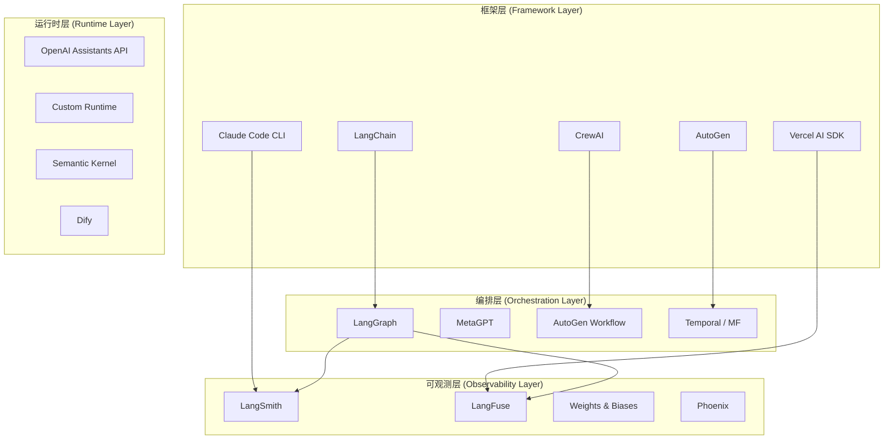
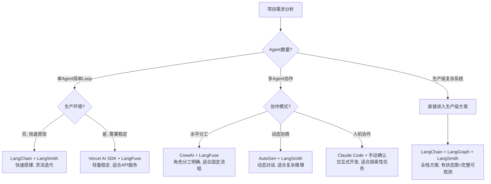
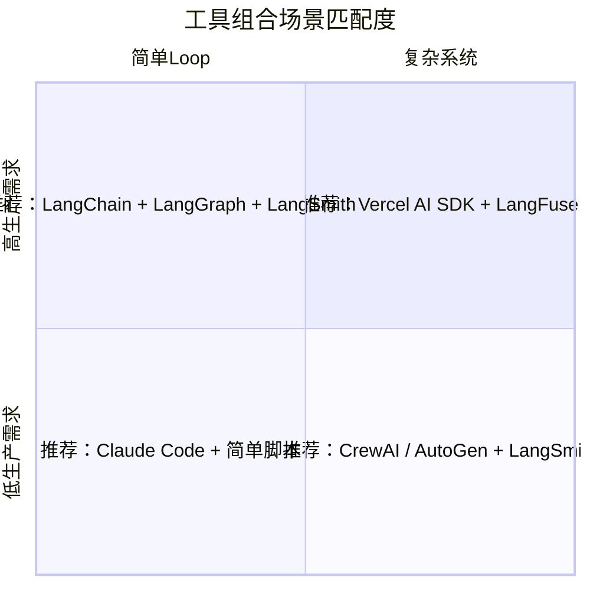
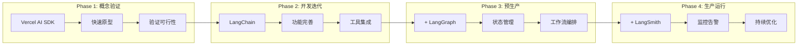

> [!abstract] 核心观点
> LOOP Engineering的工具生态不是"一刀切"的单一框架选择，而是一个分层协作的工具体系。2026年的工具格局已从"框架之争"演变为"生态整合"——没有哪个框架能独立覆盖从简单Loop到生产级多Agent系统的全部需求。核心策略是：**按场景选型、按层组合、按演进路径升级**。本文提供完整的工具分类图谱、选型决策树、主流框架对比以及从概念验证到生产的演进路径，帮助团队在工具选择上做出有依据的决策。

---

## 一、LOOP Engineering工具生态全景

### 1.1 2026年工具分类图谱

LOOP Engineering的工具生态可分为四个核心层次，每一层解决不同粒度的工程问题：



**各层职责说明：**

| 层次 | 核心职责 | 典型问题 | 代表工具 |
|------|---------|---------|---------|
| **框架层** | 提供Agent构建的基础抽象 | 如何定义Tool、如何管理Prompt、如何调用LLM | LangChain, CrewAI, AutoGen, Claude Code, Vercel AI SDK |
| **运行时层** | 提供Agent执行环境 | 如何管理会话、如何调度任务、如何处理并发 | OpenAI Assistants API, Custom Runtime, Semantic Kernel, Dify |
| **编排层** | 协调多Agent/多步骤工作流 | 如何定义状态图、如何处理循环、如何做条件路由 | LangGraph, MetaGPT, AutoGen Workflow, Temporal |
| **可观测层** | 监控、调试和评估Agent行为 | 如何追踪Token消耗、如何评估输出质量、如何回放Session | LangSmith, LangFuse, W&B, Phoenix |

### 1.2 工具生态的演进趋势

2024-2026年工具生态经历了三个关键转变：

1. **从单体框架到分层组合**：2024年以LangChain为代表的单体框架试图包揽一切；2025年起，社区转向"按层选最优"的组合策略；2026年，分层组合已成为事实标准。
2. **从代码驱动到配置驱动**：YAML/JSON配置驱动的Agent定义方式正在取代纯代码方式，使得非开发人员也能参与Agent构建。
3. **从单一模型到多模型路由**：工具层开始原生支持多模型路由、成本优化和fallback策略，不再是"绑定一个模型"。

---

## 二、工具选型决策树

### 2.1 按需求场景分类



### 2.2 场景推荐矩阵

| 场景 | 推荐组合 | 理由 | 参考案例 |
|------|---------|------|---------|
| **简单问答Loop** | Vercel AI SDK + LangFuse | 极简API，流式响应原生支持，部署成本低 | 客服机器人、文档助手 |
| **单Agent复杂任务** | LangChain + LangSmith | 丰富的Tool生态，成熟的Chain抽象，调试便利 | 代码生成、数据分析 |
| **多Agent固定流程** | CrewAI + LangFuse | 角色定义清晰，顺序/层级流程成熟 | 报告生成、内容审核 |
| **多Agent动态协商** | AutoGen + LangSmith | 多轮对话能力强，Agent间消息传递灵活 | 研究分析、辩论系统 |
| **交互式探索** | Claude Code CLI | 终端原生，人机确认机制，适合开发辅助 | 代码审查、架构分析 |
| **生产级全栈系统** | LangChain + LangGraph + LangSmith | 状态图工作流+完整可观测性+生产监控 | 金融交易、医疗诊断 |

---

## 三、主流框架对比

### 3.1 五框架核心对比

| 维度 | LangChain | CrewAI | AutoGen | Claude Code | Vercel AI SDK |
|------|-----------|--------|---------|-------------|---------------|
| **发布年份** | 2022 | 2023 | 2023 | 2024 | 2024 |
| **当前版本** | 0.3.x | 0.9.x | 0.8.x | 2.x | 4.x |
| **核心抽象** | Chain / Agent / Tool | Agent / Task / Crew | Agent / Chat / Workflow | CLI / Loop / Tool | AI SDK / Stream |
| **编程语言** | Python / JS | Python | Python | TypeScript | TypeScript |
| **多Agent原生** | 需LangGraph | 原生 | 原生 | 否 | 否 |
| **状态管理** | 外部(LangGraph) | 内置流程 | 内置对话 | 上下文窗口 | 无状态 |
| **流式响应** | 支持 | 有限 | 支持 | 原生 | 原生 |
| **工具生态** | 极丰富(数百个) | 中等(社区) | 中等(社区) | 有限(内置) | 丰富(集成) |
| **生产就绪度** | 高 | 中 | 中 | 高 | 高 |
| **学习曲线** | 陡峭 | 中等 | 中等 | 平缓 | 平缓 |
| **GitHub Stars** | 100k+ | 25k+ | 40k+ | 20k+ | 30k+ |
| **社区活跃度** | 极高 | 高 | 高 | 高 | 极高 |

### 3.2 功能维度深度对比

#### 模型I/O能力

```python
# 各框架的模型调用对比

# LangChain - 最丰富的模型抽象
from langchain.chat_models import ChatOpenAI
from langchain_core.prompts import ChatPromptTemplate

prompt = ChatPromptTemplate.from_messages([
    ("system", "你是一个{role}"),
    ("human", "{input}")
])
llm = ChatOpenAI(model="gpt-4o", temperature=0)
chain = prompt | llm

# Vercel AI SDK - 最简洁的流式接口
import { streamText } from 'ai';
const result = streamText({
  model: openai('gpt-4o'),
  system: '你是一个{role}',
  messages: [{ role: 'user', content: input }]
});
```

#### 工具调用能力

| 框架 | 工具定义方式 | 自动工具选择 | 并行工具调用 | 错误处理 |
|------|------------|------------|------------|---------|
| LangChain | @tool装饰器/BaseTool | 支持(ReAct/OpenAI) | 支持 | 内置重试+fallback |
| CrewAI | @tool装饰器 | 支持(基于角色) | 有限 | 重试机制 |
| AutoGen | 函数注册 | 支持(对话驱动) | 支持 | 对话恢复 |
| Claude Code | 内置工具集 | 固定工具集 | 有限 | 用户确认 |
| Vercel AI SDK | tool定义对象 | 支持(OpenAI格式) | 支持 | try-catch |

---

## 四、各工具优劣势分析表

### 4.1 综合评估

| 工具 | 优势 | 劣势 | 最适合 | 最不适合 |
|------|------|------|-------|---------|
| **LangChain** | 工具生态最丰富、抽象层次完整、社区资源极多、生产案例最丰富 | 学习曲线陡峭、抽象泄漏严重、版本升级破坏性大、过度工程化倾向 | 复杂Agent系统、需要丰富工具集的项目 | 简单API服务、快速原型 |
| **CrewAI** | 角色定义直观、多Agent流程简洁、适合固定流程自动化 | 灵活性不足、复杂状态管理弱、定制化能力有限 | 固定流程的多Agent协作、内容生产流水线 | 动态复杂的多Agent协商 |
| **AutoGen** | 多Agent对话能力强、消息传递灵活、支持人类介入 | 工作流定义不够直观、调试难度大、社区文档分散 | 研究型多Agent系统、辩论/分析场景 | 生产级稳定系统 |
| **Claude Code** | 终端原生体验极佳、人机协作确认机制、开箱即用 | 仅限于终端场景、工具集固定、扩展性不足 | 开发辅助、代码审查、交互式探索 | 自动化服务、多Agent系统 |
| **Vercel AI SDK** | API设计极简、流式响应原生、部署无缝、框架无关 | 不提供Agent抽象、不适合复杂Loop、多Agent需自建 | 前端AI功能、API路由、流式聊天 | 复杂Agent系统、多步骤工作流 |

### 4.2 社区与生态指标

| 指标 | LangChain | CrewAI | AutoGen | Claude Code | Vercel AI SDK |
|------|-----------|--------|---------|-------------|---------------|
| GitHub Stars | 100k+ | 25k+ | 40k+ | 20k+ | 30k+ |
| 周下载量(PyPI/npm) | 500万+ | 50万+ | 30万+ | 20万+ | 100万+ |
| 贡献者数量 | 2500+ | 500+ | 800+ | 300+ | 600+ |
| 官方文档质量 | 优秀 | 良好 | 中等 | 优秀 | 优秀 |
| 第三方教程量 | 极丰富 | 丰富 | 中等 | 中等 | 丰富 |
| 企业用户 | 大量 | 增长中 | 有限 | 增长中 | 大量 |

---

## 五、工具组合推荐

### 5.1 场景化最优组合



### 5.2 推荐组合详解

#### 组合A：轻量级API服务
- **工具**：Vercel AI SDK + LangFuse
- **适用场景**：聊天机器人、简单RAG、API封装
- **优势**：部署简单、延迟低、成本可控
- **典型架构**：
  ```
  Next.js API Route → Vercel AI SDK → OpenAI → LangFuse(监控)
  ```

#### 组合B：标准Agent应用
- **工具**：LangChain + LangSmith
- **适用场景**：单Agent复杂任务、工具调用密集型
- **优势**：工具生态丰富、调试方便、可观测性强
- **典型架构**：
  ```
  FastAPI → LangChain Agent → Tools(多工具) → LangSmith(Tracing)
  ```

#### 组合C：生产级多Agent系统
- **工具**：LangChain + LangGraph + LangSmith
- **适用场景**：金融交易、医疗诊断、复杂工作流
- **优势**：有状态图工作流、完整的可观测性、生产级监控
- **典型架构**：
  ```
  LangGraph(状态图) → LangChain Agent(多Agent) → LangSmith(全链路追踪)
  ```

#### 组合D：交互式开发辅助
- **工具**：Claude Code CLI
- **适用场景**：代码审查、架构分析、探索性编程
- **优势**：终端原生、人机协作、即时反馈
- **典型架构**：
  ```
  Claude Code CLI → 内置工具(Lint/Test/Git) → Loop执行
  ```

---

## 六、从概念验证到生产的工具演进路径

### 6.1 四阶段演进模型



### 6.2 各阶段详细说明

| 阶段 | 目标 | 推荐工具 | 关键决策 | 风险 |
|------|------|---------|---------|------|
| **Phase 1: 概念验证** | 2周内验证核心可行性 | Vercel AI SDK + OpenAI | 确定模型选型、验证Tool调用可行性 | 过度工程化、过早优化 |
| **Phase 2: 开发迭代** | 完善功能、集成业务工具 | LangChain + LangSmith | 定义Tool接口规范、设计Prompt模板体系 | 抽象泄漏、版本升级风险 |
| **Phase 3: 预生产** | 添加状态管理、多Agent编排 | + LangGraph + 压力测试 | 状态图设计、错误处理策略、性能优化 | 状态爆炸、循环失控 |
| **Phase 4: 生产运行** | 监控告警、持续优化 | + 生产级可观测性 | 告警阈值设置、成本控制、A/B测试 | 监控盲区、成本失控 |

### 6.3 演进路径中的关键决策点

1. **从Phase 1到Phase 2**：当原型验证了核心Loop的可行性，且需要集成3个以上业务工具时，就应该从Vercel AI SDK迁移到LangChain。
2. **从Phase 2到Phase 3**：当需要维护多个Agent之间的状态共享、需要条件路由或循环控制时，引入LangGraph。
3. **从Phase 3到Phase 4**：当系统进入生产环境，需要SLA保障、成本监控、质量评估时，完善可观测性体系。

### 6.4 常见陷阱与规避

| 陷阱 | 表现 | 规避策略 |
|------|------|---------|
| **过早框架化** | Phase 1就开始用LangGraph | 先用Vercel AI SDK验证核心逻辑 |
| **过度抽象** | 自定义太多抽象层，代码难以理解 | 遵循"最少抽象"原则，只在必要时封装 |
| **工具锁定** | 深度绑定某框架的私有API | 核心接口使用通用协议(如OpenAI Tool格式) |
| **监控滞后** | 生产出问题才想到加可观测性 | Phase 2就开始接入Tracing |

---

## 总结

LOOP Engineering的工具生态是一个分层协作的体系，没有"银弹"框架。正确的工具策略是：**理解每层的职责、按场景选型、按演进路径逐步升级**。从概念验证到生产运行，工具组合应该伴随项目成熟度一起演进，而不是一开始就选择最重的方案。

> **关键原则**：工具是为Loop服务的，不要让框架限制Loop的设计。保持对底层抽象的理解，才能在工具之间做出有依据的权衡。

---

## 参考资料

- [[01-AI技术/LOOP Engineering/05-工具篇/02_LangChain四层架构]] - LangChain框架深度解析
- [[01-AI技术/LOOP Engineering/05-工具篇/03_Claude Code与Agent运行时]] - Agent运行时对比
- [[01-AI技术/LOOP Engineering/05-工具篇/04_可观测性工具]] - 可观测性工具选型
- [[01-AI技术/LOOP Engineering/00_MOC_LOOP_Engineering中枢]] - LOOP Engineering知识库入口