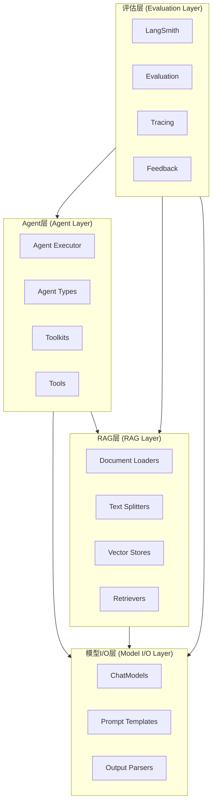
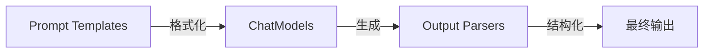
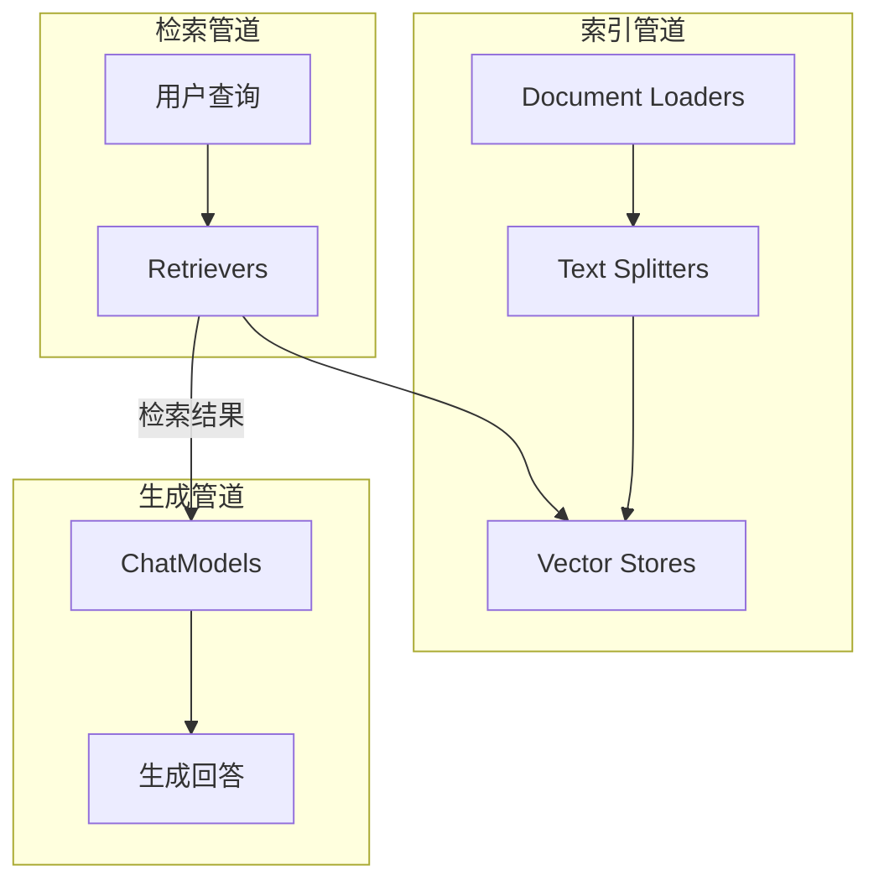
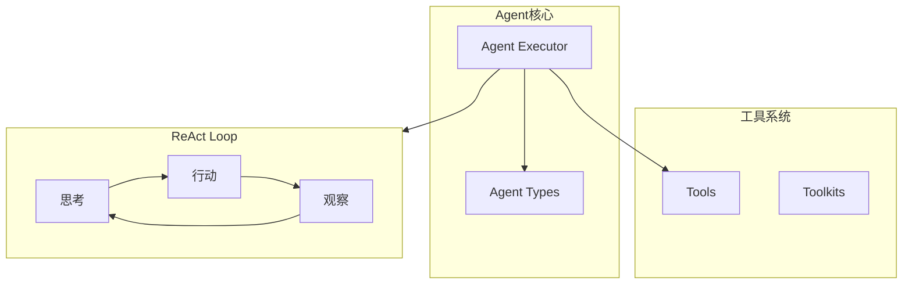
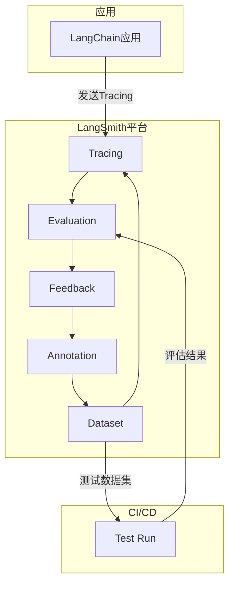
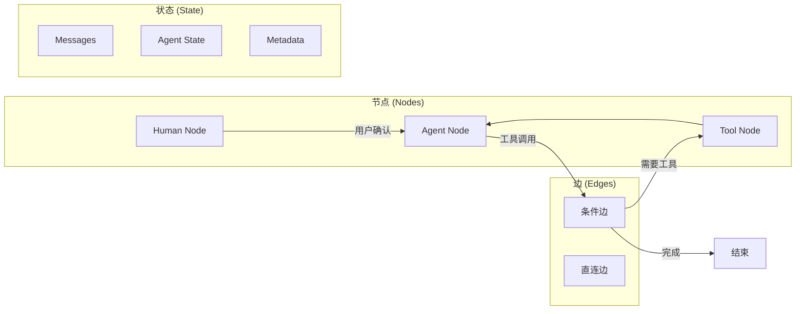
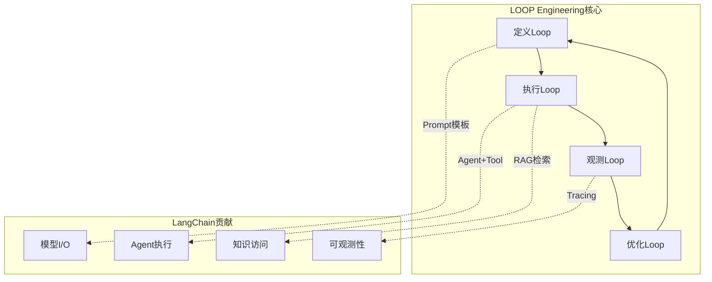

> [!abstract] 核心观点
> LangChain的核心价值不在于它是一个"万能AI框架"，而在于它提供了一套**模块化的组装流水线**，将LLM应用拆解为模型I/O、RAG、Agent和评估四个可独立演进的层次。LangChain真正的威力在LangGraph（有状态图工作流）和LangSmith（可观测性平台）的协同下得以释放。理解这四层架构，是掌握LangChain在LOOP Engineering中正确位置的关键——**LangChain不是框架，是流水线**。

---

## 一、LangChain架构总览

### 1.1 四层架构全景



### 1.2 各层核心职责

| 层次 | 核心问题 | 关键组件 | 在Loop中的角色 |
|------|---------|---------|---------------|
| **模型I/O层** | 如何与LLM通信 | ChatModels, Prompt Templates, Output Parsers | Loop的"口"——输入输出通道 |
| **RAG层** | 如何让LLM访问外部知识 | Document Loaders, Text Splitters, Vector Stores, Retrievers | Loop的"记忆"——外部知识检索 |
| **Agent层** | 如何让LLM使用工具 | Tools, Toolkits, Agent Executor, Agent Types | Loop的"手"——行动执行器 |
| **评估层** | 如何确保LLM输出质量 | LangSmith, Tracing, Evaluation, Feedback | Loop的"眼"——质量监控 |

### 1.3 LangChain的架构哲学

LangChain的设计遵循三个核心原则：

1. **组合优于继承**：通过 `|` 管道符将组件串联，形成可组合的流水线（LCEL - LangChain Expression Language）。
2. **抽象分层**：每一层只解决一个维度的问题，层与层之间通过标准接口通信。
3. **可观测性内建**：从第一层开始就支持Tracing，每一层都可被LangSmith监控。

---

## 二、模型I/O层

### 2.1 架构定位

模型I/O层是LangChain最基础的层次，解决了"如何与LLM对话"这个核心问题。它包含三个核心组件：



### 2.2 核心组件详解

#### ChatModels

ChatModels是LangChain对LLM的统一抽象接口。无论底层是OpenAI、Anthropic还是开源模型，都通过同一接口调用。

```python
from langchain.chat_models import ChatOpenAI
from langchain_anthropic import ChatAnthropic
from langchain_community.chat_models import ChatOllama

# 统一接口，不同后端
gpt4 = ChatOpenAI(model="gpt-4o", temperature=0)
claude = ChatAnthropic(model="claude-3-5-sonnet-20241022")
local = ChatOllama(model="llama-3.1-70b")

# 绑定工具（Tool Calling）
gpt4_with_tools = gpt4.bind_tools([search_tool, calculator_tool])
```

**关键特性：**

| 特性 | 说明 | 在Loop中的意义 |
|------|------|---------------|
| 模型统一接口 | 同一套代码切换不同LLM | 支持多模型路由和fallback |
| 工具绑定 | `bind_tools()` 将Tool定义传给LLM | Loop的"思考-行动"循环的基础 |
| 流式支持 | `stream()` 方法返回Token流 | 实现低延迟用户体验 |
| 结构化输出 | `with_structured_output()` 强制输出JSON | 保证Agent输出可解析 |

#### Prompt Templates

```python
from langchain_core.prompts import ChatPromptTemplate, MessagesPlaceholder

# ReAct Loop的典型Prompt结构
react_prompt = ChatPromptTemplate.from_messages([
    ("system", "你是一个{role}。请使用可用工具逐步解决问题。"),
    MessagesPlaceholder(variable_name="chat_history"),
    ("human", "{input}"),
    MessagesPlaceholder(variable_name="agent_scratchpad"),
])
```

**Prompt模板类型对比：**

| 模板类型 | 用途 | 示例 |
|---------|------|------|
| `ChatPromptTemplate` | 多轮对话模板 | System + Human + AI消息序列 |
| `MessagesPlaceholder` | 动态消息占位 | 聊天历史、Agent草稿板 |
| `HumanMessagePromptTemplate` | 用户消息模板 | 带变量的用户输入 |
| `SystemMessagePromptTemplate` | 系统消息模板 | 角色设定、规则定义 |

#### Output Parsers

```python
from langchain_core.output_parsers import StrOutputParser, JsonOutputParser
from langchain_core.output_parsers.openai_tools import JsonOutputToolsParser

# 字符串解析器 - 最简单的输出解析
str_parser = StrOutputParser()

# JSON解析器 - 结构化输出
json_parser = JsonOutputParser()

# 工具调用解析器 - 解析Agent的Tool Call
tool_parser = JsonOutputToolsParser()
```

---

## 三、RAG层

### 3.1 RAG架构



### 3.2 核心组件

| 组件 | 代表实现 | 功能 | 在Loop中的角色 |
|------|---------|------|---------------|
| **Document Loaders** | `PyPDFLoader`, `TextLoader`, `WebBaseLoader` | 从不同来源加载文档 | 知识注入入口 |
| **Text Splitters** | `RecursiveCharacterTextSplitter` | 将文档切分为块 | 保证检索粒度和上下文窗口 |
| **Vector Stores** | `Chroma`, `Pinecone`, `Weaviate`, `PGVector` | 存储向量和元数据 | 知识存储 |
| **Retrievers** | `VectorStoreRetriever`, `EnsembleRetriever` | 根据查询检索相关文档 | 知识获取 |

### 3.3 高级检索策略

```python
from langchain.retrievers import (
    EnsembleRetriever,  # 多路召回
    ContextualCompressionRetriever,  # 上下文压缩
    MultiQueryRetriever,  # 多查询扩展
)
from langchain_community.retrievers import BM25Retriever

# 多路召回：结合向量检索和关键词检索
ensemble_retriever = EnsembleRetriever(
    retrievers=[
        vector_store.as_retriever(search_kwargs={"k": 5}),
        BM25Retriever.from_documents(documents),
    ],
    weights=[0.6, 0.4]
)

# 上下文压缩：精简检索结果，只保留关键信息
compression_retriever = ContextualCompressionRetriever(
    base_compressor=LLMChainExtractor.from_llm(llm),
    base_retriever=ensemble_retriever
)
```

---

## 四、Agent层

### 4.1 Agent架构



### 4.2 核心组件详解

#### Tools - 工具定义

```python
from langchain_core.tools import tool
from langchain.tools import BaseTool

# 方式一：@tool装饰器（推荐）
@tool
def search_web(query: str) -> str:
    """搜索网络获取最新信息。输入：搜索查询。输出：搜索结果摘要。"""
    # 实现搜索逻辑
    return search_results

# 方式二：BaseTool子类
class DatabaseQueryTool(BaseTool):
    name: str = "database_query"
    description: str = "查询数据库获取结构化数据"
    
    def _run(self, query: str) -> str:
        return db.execute(query)
```

#### Toolkits - 工具包

```python
from langchain_community.agent_toolkits import (
    SQLDatabaseToolkit,
    FileManagementToolkit,
    GithubToolkit,
)

# 预构建的工具包，一次集成一组相关工具
sql_toolkit = SQLDatabaseToolkit(db=db, llm=llm)
file_toolkit = FileManagementToolkit(root_dir="./workspace")
```

#### Agent Types - Agent类型对比

| Agent类型 | 工作原理 | 适用场景 | 优势 | 劣势 |
|-----------|---------|---------|------|------|
| **OpenAI Tools Agent** | 使用OpenAI原生Tool Calling | 通用场景 | 稳定、准确、支持并行工具调用 | 仅限OpenAI模型 |
| **ReAct Agent** | 思考-行动-观察循环 | 需要推理过程的场景 | 模型无关、可解释性强 | Token消耗较高 |
| **Structured Chat Agent** | 结构化对话+工具调用 | 对话式交互 | 记忆管理好 | 复杂度过高 |
| **XML Agent** | 基于XML格式的工具调用 | 需要结构化输出的场景 | 格式清晰 | Anthropic专用 |
| **Self-ask with Search** | 自问自答式搜索 | 需要多步推理的搜索 | 搜索路径清晰 | 仅限于搜索场景 |

#### Agent Executor - 执行引擎

```python
from langchain.agents import AgentExecutor, create_openai_tools_agent
from langchain_core.prompts import ChatPromptTemplate

# 创建Agent
agent = create_openai_tools_agent(
    llm=llm,
    tools=[search_tool, calculator_tool, database_tool],
    prompt=agent_prompt
)

# 配置Executor
agent_executor = AgentExecutor(
    agent=agent,
    tools=[search_tool, calculator_tool, database_tool],
    max_iterations=10,          # 最大Loop次数
    max_execution_time=60,       # 最大执行时间（秒）
    early_stopping_method="generate",  # 提前停止策略
    handle_parsing_errors=True,  # 解析错误处理
    return_intermediate_steps=True,  # 返回中间步骤
    verbose=True,                # 详细日志
)
```

---

## 五、评估层

### 5.1 LangSmith生态



### 5.2 Tracing - 链路追踪

```python
import os
from langsmith import Client

os.environ["LANGSMITH_TRACING"] = "true"
os.environ["LANGSMITH_API_KEY"] = "your-api-key"
os.environ["LANGSMITH_PROJECT"] = "loop-engineering"

# 自动追踪所有LangChain调用
# 每个Agent Loop步骤都会被记录：
# - LLM调用（输入/输出/Token消耗）
# - 工具调用（输入/输出/延迟）
# - 检索调用（查询/结果/相关性）
```

### 5.3 Evaluation - 质量评估

```python
from langsmith.evaluation import evaluate
from langsmith.schemas import Example, Run

# 定义评估函数
def correct_answer(run: Run, example: Example) -> dict:
    """评估回答是否包含正确答案中的关键信息"""
    output = run.outputs.get("output", "")
    expected = example.outputs.get("answer", "")
    key_points = extract_key_points(expected)
    matched = sum(1 for kp in key_points if kp in output)
    return {
        "key": "answer_coverage",
        "score": matched / len(key_points),
    }

# 运行评估
evaluate(
    target=agent_executor,
    data="test_dataset",  # LangSmith中的测试数据集
    evaluators=[correct_answer],
    experiment_prefix="loop-agent-v1",
)
```

---

## 六、LangGraph：有状态图工作流

### 6.1 为什么需要LangGraph

LangChain的Agent Executor只能处理**线性**的ReAct Loop，但在复杂场景中，我们需要：

- 有状态的多节点图工作流
- 条件分支和循环控制
- 多Agent协同
- 人机交互（Human-in-the-Loop）

### 6.2 LangGraph核心概念



### 6.3 LangGraph代码示例

```python
from typing import TypedDict, Annotated, Sequence
from langgraph.graph import StateGraph, END
from langgraph.prebuilt import ToolExecutor
from langchain_core.messages import BaseMessage

# 1. 定义状态
class AgentState(TypedDict):
    messages: Annotated[Sequence[BaseMessage], "对话历史"]
    next_action: str
    tool_calls: int

# 2. 定义节点
def agent_node(state: AgentState) -> AgentState:
    """Agent思考节点"""
    response = llm.invoke(state["messages"])
    state["messages"].append(response)
    state["tool_calls"] += 1
    return state

def tool_node(state: AgentState) -> AgentState:
    """工具执行节点"""
    last_message = state["messages"][-1]
    for tool_call in last_message.tool_calls:
        result = tool_executor.execute(tool_call)
        state["messages"].append(result)
    return state

# 3. 定义条件路由
def should_continue(state: AgentState) -> str:
    """决定是否继续Loop"""
    if state["tool_calls"] >= 10:
        return "end"  # 达到最大工具调用次数
    last_message = state["messages"][-1]
    if last_message.tool_calls:
        return "continue"  # 需要继续调用工具
    return "end"  # 任务完成

# 4. 构建图
workflow = StateGraph(AgentState)
workflow.add_node("agent", agent_node)
workflow.add_node("tools", tool_node)
workflow.set_entry_point("agent")
workflow.add_conditional_edges(
    "agent",
    should_continue,
    {"continue": "tools", "end": END}
)
workflow.add_edge("tools", "agent")

# 5. 编译和运行
app = workflow.compile()
result = app.invoke({
    "messages": [HumanMessage(content="分析这份财报数据并生成报告")],
    "next_action": "",
    "tool_calls": 0,
})
```

---

## 七、LangChain在Loop Engineering中的定位

### 7.1 不是万能框架，是组装流水线

LangChain最常见的误用是把它当作"万能AI框架"，试图用它解决所有问题。正确的定位是：

| 认知误区 | 正确理解 |
|---------|---------|
| LangChain是AI框架 | LangChain是LLM应用的组装流水线 |
| LangChain包揽一切 | LangChain只负责"连接"，不负责"执行" |
| LangChain的抽象必须用 | LangChain的抽象是可选的，按需取用 |
| LangChain绑定生态 | LangChain组件可单独使用，不强制全栈 |

### 7.2 在LOOP Engineering中的角色



### 7.3 使用原则

1. **按需取用**：不需要用LangChain的所有组件，只用你需要的部分。
2. **抽象泄漏是常态**：理解底层LLM的行为，不要完全依赖LangChain的抽象。
3. **LCEL是核心**：LangChain Expression Language (`|`) 是最值得学习的部分。
4. **LangGraph是未来**：对于复杂Loop，LangGraph是比Agent Executor更好的选择。

---

## 八、代码示例：完整的ReAct Loop实现

### 8.1 YAML配置

```yaml
# loop_config.yaml
loop:
  name: "research_analyst"
  description: "研究分析助手，搜索信息并生成分析报告"
  
  model:
    provider: openai
    name: gpt-4o
    temperature: 0.0
    max_tokens: 4096
  
  prompt:
    system: |
      你是一个研究分析助手。你拥有以下工具：
      {tools}
      
      请按照以下步骤工作：
      1. 分析用户需求，确定需要哪些信息
      2. 使用工具搜索相关信息
      3. 综合分析所有信息，生成结构化报告
      4. 如果信息不足，继续搜索
      
      每次工具调用后，请总结你获取到的信息。
    human: "{input}"
  
  agent:
    type: openai_tools
    max_iterations: 15
    max_execution_time: 120
    return_intermediate_steps: true
  
  tools:
    - name: web_search
      description: 搜索网络信息
      max_results: 5
    - name: web_fetch
      description: 获取网页内容
    - name: calculator
      description: 执行数学计算
  
  observability:
    tracing: true
    project: "loop-research"
    metrics:
      - token_usage
      - tool_call_count
      - latency
```

### 8.2 Python代码实现

```python
import yaml
from langchain.chat_models import ChatOpenAI
from langchain.agents import AgentExecutor, create_openai_tools_agent
from langchain_core.prompts import ChatPromptTemplate, MessagesPlaceholder
from langchain.tools import tool
from langsmith import Client

# 1. 加载配置
with open("loop_config.yaml", "r") as f:
    config = yaml.safe_load(f)

# 2. 初始化模型
llm = ChatOpenAI(
    model=config["loop"]["model"]["name"],
    temperature=config["loop"]["model"]["temperature"],
    max_tokens=config["loop"]["model"]["max_tokens"],
)

# 3. 定义工具
@tool
def web_search(query: str) -> str:
    """搜索网络获取最新信息"""
    # 实现搜索逻辑
    return f"搜索结果: {query}"

@tool
def web_fetch(url: str) -> str:
    """获取网页内容"""
    # 实现抓取逻辑
    return f"网页内容: {url}"

@tool
def calculator(expression: str) -> str:
    """执行数学计算"""
    return str(eval(expression))

tools = [web_search, web_fetch, calculator]

# 4. 构建Prompt
prompt = ChatPromptTemplate.from_messages([
    ("system", config["loop"]["prompt"]["system"]),
    MessagesPlaceholder(variable_name="chat_history"),
    ("human", "{input}"),
    MessagesPlaceholder(variable_name="agent_scratchpad"),
])

# 5. 创建Agent
agent = create_openai_tools_agent(llm, tools, prompt)

# 6. 配置Agent Executor
agent_executor = AgentExecutor(
    agent=agent,
    tools=tools,
    max_iterations=config["loop"]["agent"]["max_iterations"],
    max_execution_time=config["loop"]["agent"]["max_execution_time"],
    return_intermediate_steps=config["loop"]["agent"]["return_intermediate_steps"],
    verbose=True,
    handle_parsing_errors=True,
)

# 7. 执行Loop
result = agent_executor.invoke({
    "input": "分析2026年AI Agent工具市场趋势，生成一份简短的报告",
    "chat_history": [],
})

# 8. 输出结果
print(f"最终输出: {result['output']}")
print(f"中间步骤: {len(result['intermediate_steps'])}步")
print(f"工具调用: {[step[0].tool for step in result['intermediate_steps']]}")
```

---

## 总结

LangChain的四层架构为LOOP Engineering提供了模块化的构建基础。理解这四层，就理解了如何将LLM应用拆解为可管理、可观测、可优化的工作单元。但关键在于：**LangChain不是目的，是手段**。真正的价值在于理解每一层的核心抽象，并能在需要时跳出LangChain的框架，直接使用底层API。

> **核心原则**：先理解LLM的工作原理，再学习LangChain的抽象。当抽象成为障碍时，果断放弃它。

---

## 参考资料

- [[01-AI技术/LOOP Engineering/05-工具篇/01_工具全景图]] - LangChain在工具生态中的位置
- [[01-AI技术/LOOP Engineering/05-工具篇/03_Claude Code与Agent运行时]] - 与其他Agent运行时的对比
- [[01-AI技术/LOOP Engineering/05-工具篇/04_可观测性工具]] - LangSmith的深度使用
- [[01-AI技术/LOOP Engineering/00_MOC_LOOP_Engineering中枢]] - LOOP Engineering知识库入口