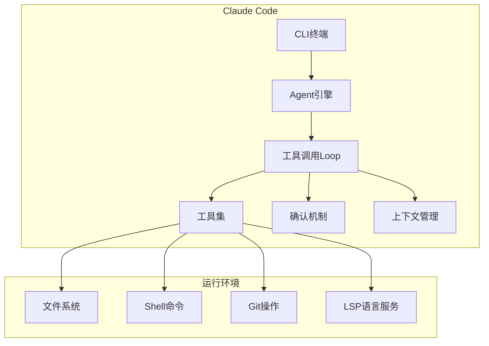
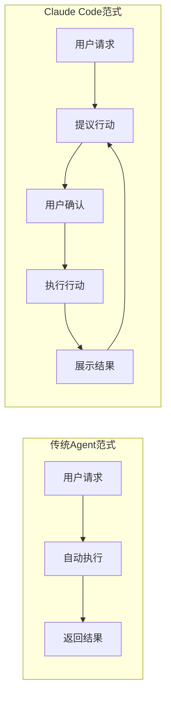
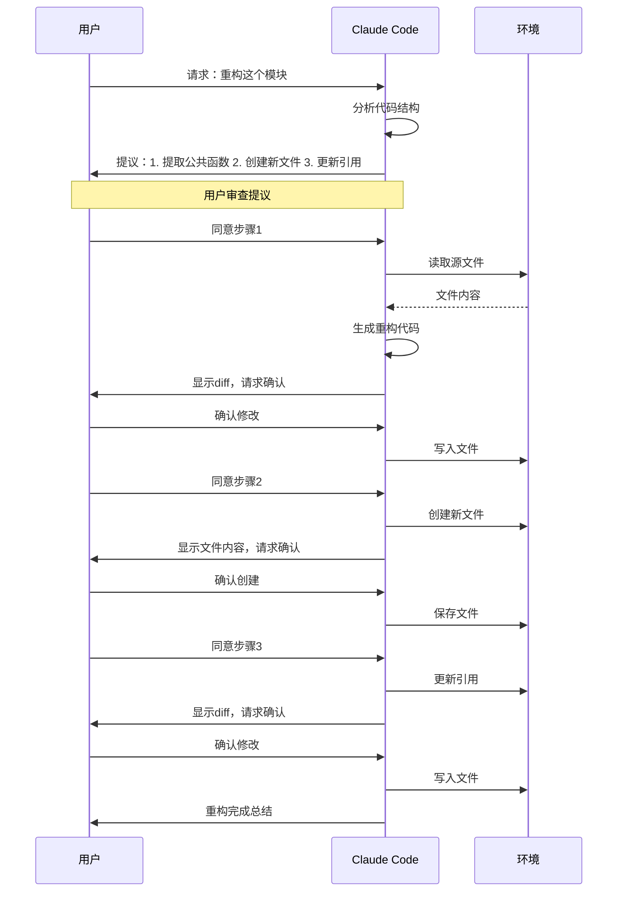
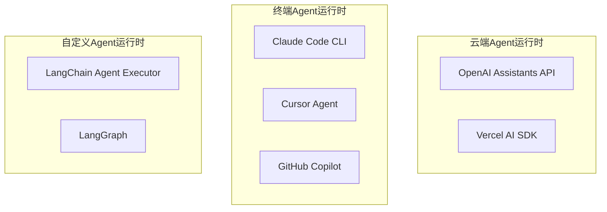
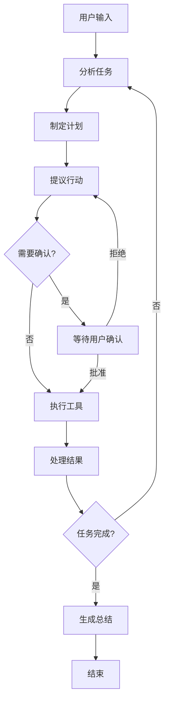
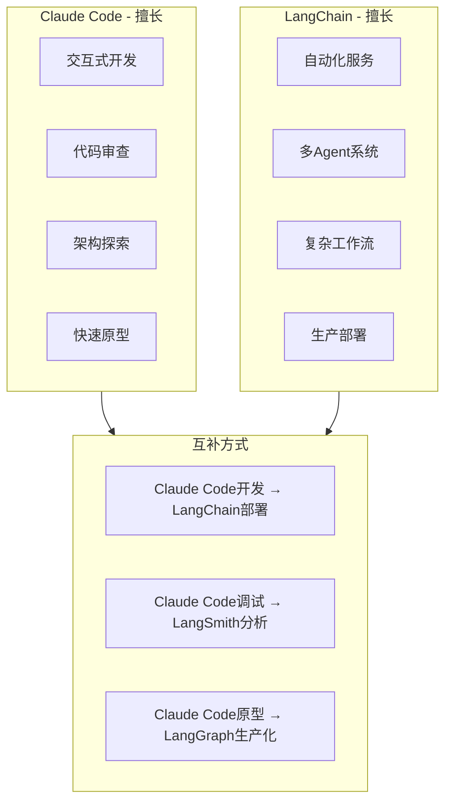
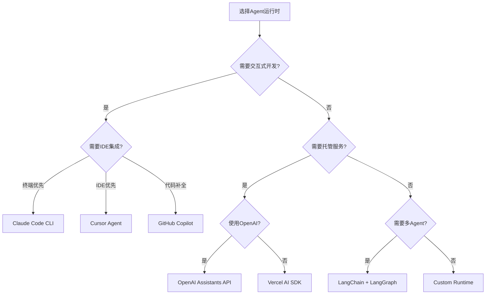

> [!abstract] 核心观点
> Claude Code代表了Agent运行时的另一种范式——**终端原生、人机协作的交互式Agent**。与LangChain的"自动化框架"路径不同，Claude Code走的是"增强人类能力"的路径：它不试图替代开发者，而是通过Loop模式、工具调用和确认机制，成为开发者的"AI副驾驶"。理解Claude Code的定位，对于在LOOP Engineering中做出正确的工具选型至关重要——**它不是LangChain的替代品，而是互补品**。

---

## 一、Claude Code是什么

### 1.1 定义与定位

Claude Code是由Anthropic推出的终端原生AI编程助手，它不仅仅是一个"聊天机器人"，而是一个完整的**Agent运行时**——能够在终端环境中自主执行工具调用循环（Loop），完成代码编写、文件操作、命令执行等复杂任务。



### 1.2 核心能力矩阵

| 能力类别 | 具体能力 | 在Loop中的角色 |
|---------|---------|---------------|
| **文件操作** | 读写文件、创建目录、编辑代码 | Loop的"手"——执行代码修改 |
| **命令执行** | 运行Shell命令、启动服务、执行测试 | Loop的"腿"——与环境交互 |
| **Git操作** | 查看diff、创建commit、管理分支 | Loop的"记忆"——版本管理 |
| **LSP集成** | 代码跳转、类型检查、自动补全 | Loop的"眼"——代码理解 |
| **搜索能力** | 文件搜索、代码搜索、Grep | Loop的"望远镜"——信息获取 |
| **确认机制** | 用户确认、权限控制、安全审查 | Loop的"门卫"——安全控制 |

### 1.3 与"传统"Agent的区别



---

## 二、Claude Code的工作模式

### 2.1 三种工作模式

Claude Code支持三种运行模式，适用于不同的使用场景：

| 模式 | 确认要求 | 适用场景 | 自动化程度 | 安全性 |
|------|---------|---------|-----------|-------|
| **Permission模式（默认）** | 每次工具调用需确认 | 日常开发、探索性任务 | 低 | 高 |
| **自动模式** | 仅高风险操作需确认 | 批量任务、自动化脚本 | 高 | 中 |
| **Loop模式** | 按策略确认 | 复杂多步骤任务 | 中 | 高 |

### 2.2 Permission模式详解

Permission模式是Claude Code的默认工作模式，也是最能体现其"人机协作"理念的模式。



### 2.3 自动模式

```bash
# 启动自动模式（YOLO模式）
claude --mode auto

# 或在会话中切换
/auto

# 自动模式下，Claude Code会：
# - 自动执行低风险的文件读写操作
# - 高风险操作（如删除文件、安装依赖）仍需确认
# - 适合批量处理和自动化脚本
```

### 2.4 Loop模式的工作机制

Loop模式是Claude Code最核心的能力，它允许Agent在多步骤任务中保持上下文，持续迭代执行。

```python
# Claude Code的Loop执行伪代码
class ClaudeCodeLoop:
    def __init__(self):
        self.context = Context()
        self.tools = ToolRegistry()
        self.confirm = ConfirmStrategy()
    
    def execute_loop(self, task: str) -> Result:
        """Claude Code的核心Loop执行逻辑"""
        while not self.is_complete():
            # 1. 思考：分析当前状态和下一步行动
            thought = self.think(self.context)
            
            # 2. 提议：生成具体的工具调用计划
            proposal = self.propose_action(thought)
            
            # 3. 确认：根据策略决定是否需要用户确认
            if self.confirm.requires_approval(proposal):
                approved = self.wait_for_user_approval(proposal)
                if not approved:
                    self.handle_rejection(proposal)
                    continue
            
            # 4. 执行：调用工具
            result = self.execute_tool(proposal.tool, proposal.args)
            
            # 5. 观察：处理执行结果
            observation = self.observe(result)
            
            # 6. 更新上下文
            self.context.add_step(thought, proposal, observation)
        
        return self.context.final_result()
```

---

## 三、Agent运行时对比

### 3.1 三大Agent运行时



### 3.2 功能对比矩阵

| 维度 | Claude Code CLI | Cursor Agent | GitHub Copilot | Vercel AI SDK | OpenAI Assistants |
|------|----------------|-------------|---------------|---------------|-------------------|
| **运行环境** | 终端 | IDE | IDE | API服务 | API服务 |
| **交互方式** | 命令行 | UI面板 | 内联/聊天 | API调用 | API调用 |
| **工具调用** | 内置工具集 | 内置+自定义 | 有限 | 自定义 | 内置+自定义 |
| **Loop能力** | 强（原生） | 中 | 弱 | 无（需自建） | 中（Thread） |
| **上下文管理** | 自动 | 自动 | 文件级 | 手动 | 自动（Thread） |
| **确认机制** | 原生 | 有限 | 有限 | 无 | 无 |
| **多步骤规划** | 强 | 中 | 弱 | 无 | 中 |
| **扩展性** | 低（固定工具） | 中（MCP） | 低 | 高（开放） | 高（Function） |
| **适用场景** | 开发辅助 | 代码编写 | 代码补全 | API服务 | 对话Agent |
| **是否开源** | 否 | 部分 | 否 | 是 | 否 |

### 3.3 深度对比分析

#### 场景一：代码重构

```bash
# Claude Code - 最自然的体验
# 自动分析代码结构，提议重构方案，逐步骤确认
claude "重构这个模块，提取公共逻辑到共享库"

# Cursor Agent - 次优
# 在IDE中操作，但需要手动指定重构范围
# 在Chat面板中使用Agent模式

# GitHub Copilot - 较弱
# 主要是代码补全，复杂重构需要手动引导
```

#### 场景二：多步骤研究任务

```python
# Vercel AI SDK - 需要手动编排
import { streamText, tool } from 'ai';

const result = streamText({
    model: openai('gpt-4o'),
    tools: {
        search: tool({ ... }),
        analyze: tool({ ... }),
    },
    // 需要自己实现循环逻辑
});

# OpenAI Assistants - 内置Thread管理
# 使用Run对象管理多步骤执行
# 但工具调用逻辑需要自己处理
```

#### 场景三：自动化Pipeline

| 运行时 | 适合性 | 原因 |
|-------|-------|------|
| Claude Code | 中等 | 需要人工确认，不适合完全自动化 |
| LangChain | 高 | 完全自动化的Agent执行 |
| Vercel AI SDK | 高 | 无状态的API调用，适合自动化 |

---

## 四、Claude Code的Loop特性

### 4.1 工具调用循环

Claude Code的工具调用循环是其核心能力，以下是其工作流程：



### 4.2 内置工具集

Claude Code内置了一套丰富的工具集，覆盖了开发过程中的主要场景：

| 工具类别 | 具体工具 | 功能描述 |
|---------|---------|---------|
| **文件工具** | `Read` | 读取文件内容，支持按行读取 |
| | `Write` | 创建或覆盖文件 |
| | `Edit` | 搜索并替换文件内容 |
| | `Glob` | 文件匹配模式搜索 |
| **搜索工具** | `Grep` | 内容搜索（支持正则） |
| | `FileSearch` | 文件名搜索 |
| **执行工具** | `Bash` | 执行Shell命令 |
| | `Python` | 执行Python代码 |
| **Git工具** | `GitStatus` | 查看仓库状态 |
| | `GitDiff` | 查看文件变更 |
| | `GitCommit` | 提交代码变更 |
| **信息工具** | `WebSearch` | 网络搜索 |
| | `WebFetch` | 获取网页内容 |

### 4.3 上下文管理机制

Claude Code的上下文管理是其能在长Loop中保持连贯性的关键：

1. **自动上下文窗口管理**：当上下文接近限制时，自动进行摘要压缩，保留关键信息。
2. **会话持久化**：支持保存和恢复会话状态，允许长时间运行的任务分段执行。
3. **文件级上下文**：自动读取项目中的关键文件（如README、配置文件）来理解项目结构。

```bash
# 查看当前会话状态
/claude status

# 保存会话状态
/claude save research_session

# 恢复会话状态
/claude load research_session

# 清除上下文
/claude clear
```

### 4.4 确认机制

Claude Code的确认机制是其安全性的核心保障：

| 确认级别 | 触发条件 | 确认方式 | 用户响应 |
|---------|---------|---------|---------|
| **自动确认** | 低风险操作（读文件、搜索） | 无需确认 | 自动执行 |
| **标准确认** | 中风险操作（写文件、运行命令） | 显示diff/命令详情 | `y`/`n` 或编辑后确认 |
| **高风险确认** | 高风险操作（删除文件、安装依赖、git push） | 红色警告+确认 | 必须显式确认 |
| **批量确认** | 多步骤操作 | 逐步骤确认或批量确认 | 支持`/auto`临时切换 |

---

## 五、Claude Code的局限性

### 5.1 不适合的场景

| 场景 | 不适合的原因 | 推荐替代方案 |
|------|-------------|-------------|
| **高并发API服务** | 终端交互式，不是服务架构 | Vercel AI SDK / LangChain |
| **多Agent协作系统** | 无多Agent支持 | AutoGen / CrewAI |
| **复杂状态工作流** | 上下文窗口有限，无法管理复杂状态 | LangGraph |
| **完全自动化流水线** | 需要人类确认，不适合无人值守 | LangChain Agent Executor |
| **大规模代码分析** | 上下文窗口限制，无法处理超大项目 | 自定义批处理工具 |
| **实时流式应用** | 不是为实时通信设计 | WebSocket + Vercel AI SDK |

### 5.2 已知限制

1. **上下文窗口瓶颈**：虽然Claude Code自动管理上下文，但在处理超大型项目时，仍然会受到上下文窗口的限制。
2. **工具集固定**：无法像LangChain那样轻松添加自定义工具，只能使用Claude Code内置的工具。
3. **无状态持久化**：每次会话是独立的，无法跨会话共享状态（除非手动保存/恢复）。
4. **单线程模型**：一次只能处理一个任务，无法并行执行多个工具调用。
5. **依赖网络**：需要稳定的网络连接来调用Anthropic的API，离线无法使用。

### 5.3 与LangChain的互补关系



**最佳互补策略：**

1. **开发阶段使用Claude Code**：利用其交互式特性快速迭代原型、调试代码。
2. **生产阶段使用LangChain**：将经过验证的逻辑迁移到LangChain的自动化流水线中。
3. **调试协作**：使用Claude Code进行探索性调试，将发现的问题记录到LangSmith中。
4. **原型到生产**：Claude Code生成的代码原型，经过验证后使用LangGraph重构为生产级工作流。

---

## 六、其他Agent运行时

### 6.1 Vercel AI SDK

Vercel AI SDK是一个轻量级的AI应用开发工具包，专注于在前端应用中集成AI能力。

```javascript
import { streamText, tool } from 'ai';
import { z } from 'zod';

// 定义工具
const weatherTool = tool({
    description: '获取指定城市的天气信息',
    parameters: z.object({
        city: z.string().describe('城市名称'),
    }),
    execute: async ({ city }) => {
        const weather = await getWeather(city);
        return `当前${city}的天气：${weather}`;
    },
});

// 流式响应
const { textStream, toolResults } = streamText({
    model: openai('gpt-4o'),
    tools: { weather: weatherTool },
    messages: [
        { role: 'user', content: '北京今天天气怎么样？' }
    ],
});
```

**优势：**
- 极简API设计，学习成本低
- 原生支持流式响应
- 框架无关（支持Next.js、Nuxt、SvelteKit等）
- 部署成本极低（Vercel Edge Functions）

**劣势：**
- 不提供Agent抽象（没有ReAct Loop）
- 无状态管理
- 多Agent需要手动实现

### 6.2 OpenAI Assistants API

OpenAI的托管Agent运行时，提供完整的对话管理和工具调用能力。

```python
from openai import OpenAI

client = OpenAI()

# 创建Assistant
assistant = client.beta.assistants.create(
    name="Research Assistant",
    instructions="你是一个研究助手",
    model="gpt-4o",
    tools=[{
        "type": "function",
        "function": {
            "name": "search_web",
            "description": "搜索网络信息",
            "parameters": {...}
        }
    }]
)

# 创建Thread并运行
thread = client.beta.threads.create()
run = client.beta.runs.create(
    thread_id=thread.id,
    assistant_id=assistant.id,
)
```

**优势：**
- 完全托管，无需自建基础设施
- 内置Thread管理（会话持久化）
- 自动处理工具调用循环
- 支持文件上传和代码解释器

**劣势：**
- 供应商锁定（只支持OpenAI模型）
- 自定义能力有限
- 无法控制底层Loop逻辑
- 成本较高（按Token计费+API调用费）

### 6.3 Custom Runtime

对于需要完全控制权的场景，可以构建自定义Agent运行时。

```python
class CustomAgentRuntime:
    """自定义Agent运行时示例"""
    
    def __init__(self, llm, tools, max_iterations=10):
        self.llm = llm
        self.tools = {t.name: t for t in tools}
        self.max_iterations = max_iterations
        self.history = []
    
    async def run(self, task: str) -> str:
        """执行Agent任务"""
        messages = [{"role": "user", "content": task}]
        
        for i in range(self.max_iterations):
            # 1. 调用LLM
            response = await self.llm.invoke(messages)
            messages.append(response)
            
            # 2. 检查是否需要工具调用
            if not response.tool_calls:
                return response.content
            
            # 3. 执行工具调用
            for tool_call in response.tool_calls:
                tool = self.tools[tool_call.name]
                result = await tool.execute(**tool_call.args)
                messages.append({
                    "role": "tool",
                    "content": result,
                    "tool_call_id": tool_call.id,
                })
        
        return "达到最大迭代次数"
    
    def get_stats(self) -> dict:
        """获取运行时统计信息"""
        return {
            "total_calls": len(self.history),
            "tool_usage": self._aggregate_tool_usage(),
            "total_tokens": sum(h["tokens"] for h in self.history),
        }
```

### 6.4 运行时选型决策



---

## 总结

Claude Code代表了Agent运行时的一个重要方向——**以人为中心、以协作为核心**的交互式Agent。它不试图自动化所有事情，而是通过精心设计的确认机制和工具调用循环，增强开发者的能力而非替代开发者。

在LOOP Engineering的框架下，Claude Code的最佳定位是：
- **开发辅助工具**：用于代码编写、审查、重构和探索性编程
- **原型验证工具**：快速验证Agent Loop的可行性
- **调试工具**：辅助分析和定位Agent行为问题

对于需要完全自动化、高并发、多Agent协作的生产场景，LangChain/LangGraph是更合适的选择。两者不是竞争关系，而是互补关系。

> **关键原则**：选择Agent运行时不是选择"最好的"，而是选择"最合适的"。理解每种运行时的设计哲学和适用边界，才能做出正确的技术决策。

---

## 参考资料

- [[01-AI技术/LOOP Engineering/05-工具篇/01_工具全景图]] - Claude Code在工具生态中的位置
- [[01-AI技术/LOOP Engineering/05-工具篇/02_LangChain四层架构]] - 与LangChain的互补关系
- [[01-AI技术/LOOP Engineering/05-工具篇/04_可观测性工具]] - Agent运行时的监控
- [[01-AI技术/LOOP Engineering/00_MOC_LOOP_Engineering中枢]] - LOOP Engineering知识库入口