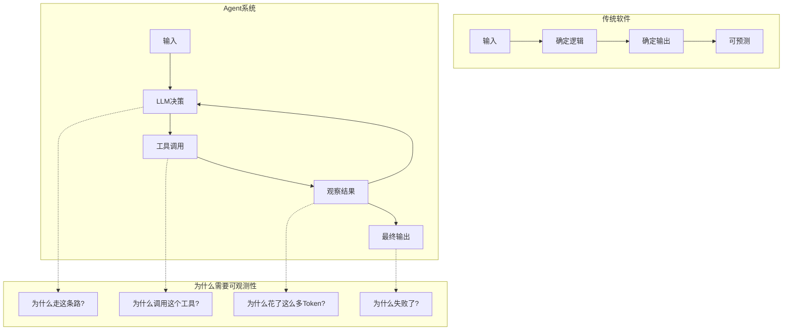
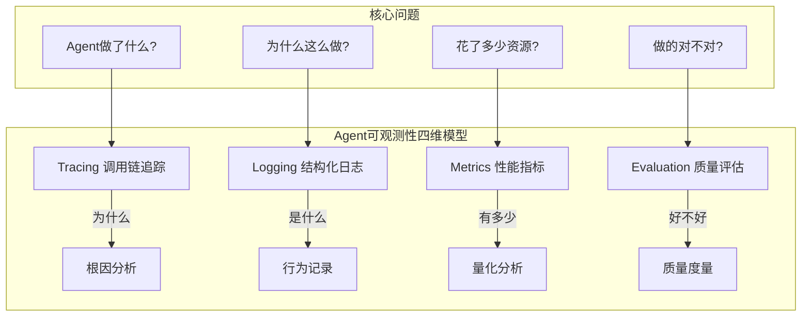
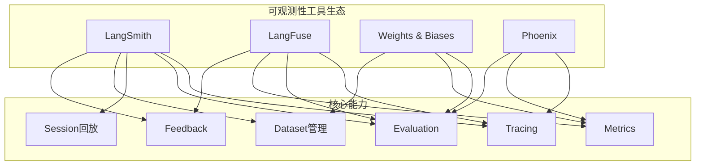
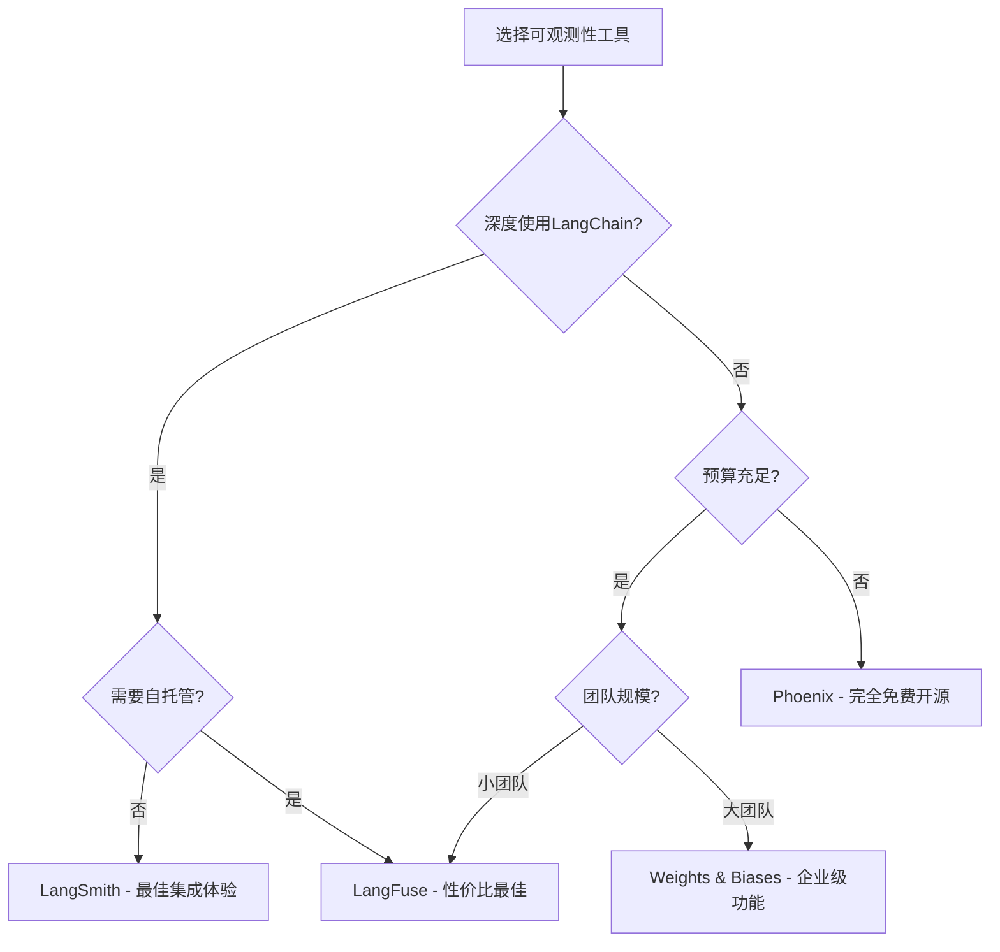
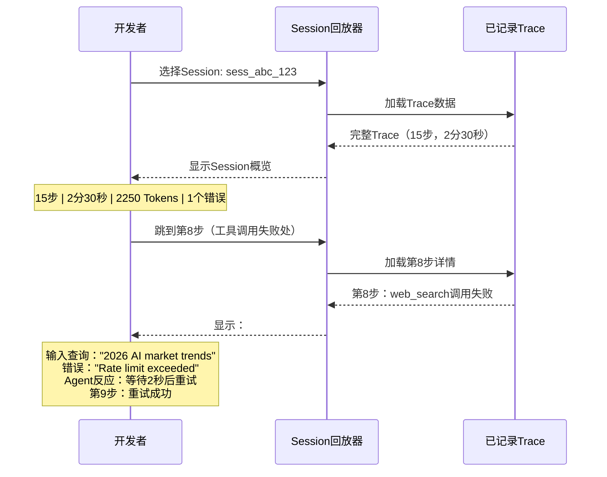
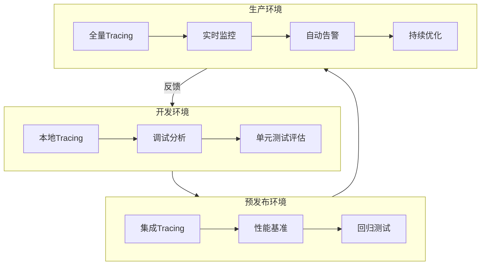

> [!abstract] 核心观点
> 可观测性是LOOP Engineering的基石——**没有可观测性，就无法调试Agent的异常行为，无法优化Loop的效率，无法评估输出的质量，更无法建立对Agent系统的信任**。与传统软件不同，LLM应用的不可预测性使得可观测性从"可选项"变成了"必选项"。本文系统梳理Agent可观测性的四个核心维度（Tracing、Logging、Metrics、Evaluation），对比主流工具（LangSmith、LangFuse、W&B、Phoenix），并提供从开发到生产的完整可观测性实施框架。

---

## 一、可观测性是Loop工程的基石

### 1.1 为什么Agent系统需要可观测性

传统软件的行为是**确定性的**——给定相同的输入，总是产生相同的输出。但LLM驱动的Agent系统是**概率性的**——同样的输入可能产生不同的输出路径，同一个Agent可能在不同时间做出不同的工具调用决策。



**Agent系统特有的可观测性挑战：**

| 挑战 | 说明 | 影响 |
|------|------|------|
| **非确定性输出** | 同输入不同输出 | 难以复现和调试 |
| **多步推理链** | 需要追踪整个推理路径 | 单点监控不够 |
| **工具调用开销** | 每次工具调用都有成本和延迟 | 需要细粒度成本分析 |
| **质量问题** | 输出"看起来对但实际错" | 需要自动化评估 |
| **安全风险** | Prompt注入、数据泄露 | 需要审计追踪 |

### 1.2 可观测性成熟度模型

| 级别 | 名称 | 特征 | 典型做法 |
|------|------|------|---------|
| **Level 0** | 无监控 | 完全黑盒，出问题后才排查 | 无任何日志 |
| **Level 1** | 基础日志 | 记录LLM调用和工具调用 | 简单的print/log |
| **Level 2** | 链路追踪 | 完整追踪每次Loop的调用链 | LangSmith/LangFuse Tracing |
| **Level 3** | 量化评估 | 自动评估输出质量、性能指标 | Evaluation + Metrics |
| **Level 4** | 主动优化 | 基于可观测性数据自动优化 | 反馈驱动优化、A/B测试 |

---

## 二、核心可观测性维度

### 2.1 四维可观测性模型



### 2.2 Tracing（调用链追踪）

Tracing是可观测性的核心，它记录了Agent每次Loop的完整调用链。

```python
# 一个典型的Agent Tracing数据结构
{
    "run_id": "run_abc123",
    "session_id": "session_xyz789",
    "start_time": "2026-08-03T10:00:00Z",
    "end_time": "2026-08-03T10:02:30Z",
    "duration_ms": 150000,
    "steps": [
        {
            "step": 1,
            "type": "llm_call",
            "model": "gpt-4o",
            "input_tokens": 520,
            "output_tokens": 180,
            "latency_ms": 1200,
            "content": "我需要搜索最新的AI市场数据..."
        },
        {
            "step": 2,
            "type": "tool_call",
            "tool": "web_search",
            "input": "2026 AI agent market trends",
            "output": "搜索结果摘要...",
            "latency_ms": 800,
            "status": "success"
        },
        {
            "step": 3,
            "type": "llm_call",
            "model": "gpt-4o",
            "input_tokens": 1200,
            "output_tokens": 350,
            "latency_ms": 2500,
            "content": "基于搜索结果，我分析如下..."
        }
    ],
    "total_tokens": {
        "input": 1720,
        "output": 530,
        "total": 2250
    },
    "tool_calls": 1,
    "errors": []
}
```

**Tracing的关键维度：**

| 维度 | 说明 | 监控指标 |
|------|------|---------|
| **调用链** | 完整的LLM + Tool调用序列 | 步骤数、调用顺序 |
| **延迟** | 每一步的耗时 | P50/P95/P99延迟 |
| **Token消耗** | 输入/输出Token数 | 每次Loop的Token成本 |
| **错误** | 调用失败、解析错误 | 错误类型、频率 |
| **状态** | 每一步的中间状态 | 状态快照、变更 |

### 2.3 Logging（结构化日志）

结构化日志提供了Agent行为的详细记录，是调试和审计的基础。

```json
// 结构化日志格式示例
{
    "timestamp": "2026-08-03T10:00:01.000Z",
    "level": "INFO",
    "event": "agent_step",
    "session_id": "sess_001",
    "agent_id": "research_agent_v1",
    "data": {
        "step_type": "tool_call",
        "tool_name": "web_search",
        "query": "2026 AI market trends",
        "result_length": 1024,
        "latency_ms": 800
    },
    "metadata": {
        "environment": "production",
        "version": "1.2.0",
        "user_id": "user_001"
    }
}
```

**日志最佳实践：**

| 实践 | 说明 | 示例 |
|------|------|------|
| **结构化格式** | 使用JSON格式，便于解析和分析 | `{"event": "tool_call", "tool": "search", ...}` |
| **统一Schema** | 定义统一的日志字段标准 | 所有事件包含session_id、timestamp、agent_id |
| **分级记录** | 按重要性分级（DEBUG/INFO/WARN/ERROR） | ERROR级别自动告警 |
| **上下文关联** | 通过session_id关联所有日志 | 单次会话的所有日志可追溯 |

### 2.4 Metrics（性能指标）

Metrics提供了Agent系统运行状况的量化视图。

```python
# 关键指标收集示例
from prometheus_client import Counter, Histogram, Gauge

# 计数器
tool_calls_total = Counter(
    'agent_tool_calls_total', 
    'Total tool calls',
    ['tool_name', 'status']
)

# 直方图
loop_duration = Histogram(
    'agent_loop_duration_seconds',
    'Duration of agent loops',
    buckets=[1, 5, 10, 30, 60, 120, 300]
)

# 仪表盘
active_sessions = Gauge(
    'agent_active_sessions',
    'Number of active agent sessions'
)

# 在Loop中记录指标
def track_loop_step(step):
    tool_calls_total.labels(
        tool_name=step.tool_name,
        status=step.status
    ).inc()
    loop_duration.observe(step.duration_seconds)
```

### 2.5 Evaluation（质量评估）

Evaluation是Agent可观测性中最具挑战性但也最重要的维度。

```python
from langsmith.evaluation import evaluate
from langsmith.schemas import Run, Example

# 定义多个评估维度
def evaluate_agent_output(run: Run, example: Example) -> dict:
    """综合评估Agent输出质量"""
    output = run.outputs.get("output", "")
    expected = example.outputs.get("expected", "")
    
    results = {}
    
    # 1. 正确性评估
    results["correctness"] = evaluate_correctness(output, expected)
    
    # 2. 完整性评估
    results["completeness"] = evaluate_completeness(output, expected)
    
    # 3. 效率评估
    results["efficiency"] = evaluate_efficiency(run)
    
    # 4. 安全性评估
    results["safety"] = evaluate_safety(output)
    
    return results
```

---

## 三、工具对比

### 3.1 四大可观测性平台



### 3.2 功能对比矩阵

| 维度 | LangSmith | LangFuse | Weights & Biases | Phoenix |
|------|-----------|---------|-----------------|---------|
| **发布年份** | 2023 | 2023 | 2017 | 2023 |
| **开源** | 否 | 部分(开源版) | 否 | 是 |
| **自托管** | 否 | 是 | 否 | 是 |
| **Tracing** | 深度LangChain集成 | 框架无关 | 有限 | 通用 |
| **Evaluation** | 原生支持(丰富) | 支持(基础) | 支持(实验管理) | 支持(LLM评估) |
| **Session回放** | 支持 | 支持 | 有限 | 有限 |
| **Dataset管理** | 原生 | 支持 | 原生 | 有限 |
| **Feedback收集** | 原生 | 原生 | 需自建 | 需自建 |
| **Prompt管理** | 原生(Prompt Hub) | 原生 | 有限 | 有限 |
| **成本分析** | 支持 | 支持 | 支持 | 有限 |
| **告警** | 支持 | 支持 | 支持 | 有限 |
| **Python SDK** | 完善 | 完善 | 完善 | 完善 |
| **JS/TS SDK** | 完善 | 完善 | 有限 | 有限 |
| **免费额度** | 有限(Trace) | 有限 | 有限 | 无限(自托管) |

### 3.3 深度对比

#### LangSmith

LangSmith是LangChain生态的核心可观测性平台，专为LLM应用设计。

**优势：**
- 与LangChain/LangGraph深度集成，开箱即用
- 完整的Evaluation框架（内置评估器+自定义评估器）
- 强大的Dataset管理和测试能力
- Session回放功能成熟

**劣势：**
- 闭源，无法自托管
- 深度绑定LangChain生态
- 成本较高（大规模使用时）

**典型使用场景：**
```python
import os
from langsmith import Client
from langsmith.evaluation import evaluate

# 配置LangSmith
os.environ["LANGSMITH_TRACING"] = "true"
os.environ["LANGSMITH_API_KEY"] = "your-key"
os.environ["LANGSMITH_PROJECT"] = "loop-engineering"

# 创建测试数据集
client = Client()
dataset = client.create_dataset(
    dataset_name="agent_qa_test",
    description="Agent问答测试集"
)
client.create_example(
    inputs={"input": "分析2026年Q2财报"},
    outputs={"expected": "应包含营收、利润、增长率等关键指标"},
    dataset_id=dataset.id
)

# 运行评估
evaluate(
    target=agent_executor,
    data=dataset.name,
    evaluators=[correctness_evaluator, safety_evaluator],
    experiment_prefix="agent-v2",
    max_concurrency=5,
)
```

#### LangFuse

LangFuse是一个开源友好的LLM可观测性平台，框架无关。

**优势：**
- 开源，支持自托管
- 框架无关，支持任何LLM框架
- 内置Prompt管理
- 成本分析功能完善

**劣势：**
- Evaluation能力不如LangSmith
- 社区规模较小
- 自托管需要运维成本

**典型使用场景：**
```python
from langfuse import LangFuse
from langfuse.decorators import observe, langfuse_context

# 初始化LangFuse
langfuse = LangFuse(
    secret_key="your-secret",
    public_key="your-public",
    host="https://your-instance.langfuse.com"
)

# 使用装饰器自动追踪
@observe()
def agent_loop(user_input: str) -> str:
    # 这个函数的所有LLM调用和工具调用都会被自动追踪
    langfuse_context.update_current_trace(
        name="agent_loop",
        session_id="session_001",
        user_id="user_001",
        metadata={"agent_version": "1.2.0"}
    )
    
    result = execute_agent(user_input)
    return result

# 记录评估分数
@observe()
def evaluate_result(trace_id: str, score: float):
    langfuse.score(
        trace_id=trace_id,
        name="correctness",
        value=score
    )
```

#### Weights & Biases

W&B是一个成熟的ML实验管理平台，近年来扩展了LLM可观测性能力。

**优势：**
- 成熟的实验管理能力
- 强大的可视化仪表盘
- 丰富的集成生态

**劣势：**
- 不是专门为LLM设计
- Tracing能力有限
- Session回放功能弱

#### Phoenix

Phoenix是一个开源的AI可观测性平台，由Arize AI开发。

**优势：**
- 完全开源，可自托管
- 支持OpenTelemetry标准
- LLM评估框架完善

**劣势：**
- 社区相对较小
- 文档和教程不够丰富
- 企业级功能有限

### 3.4 工具选型决策



---

## 四、关键指标

### 4.1 核心指标定义

| 指标类别 | 指标名称 | 定义 | 告警阈值 | 优化目标 |
|---------|---------|------|---------|---------|
| **Token消耗** | 每次Loop总Token数 | 输入+输出Token总和 | > 10,000 | 减少冗余调用 |
| | 每次Loop成本 | Token数 * 模型单价 | > $0.05 | 优化Prompt长度 |
| | 工具调用Token占比 | 工具调用产生的Token/总Token | > 60% | 优化工具返回值 |
| **工具调用** | 每次Loop工具调用次数 | Loop中工具调用的总数 | > 15 | 减少不必要调用 |
| | 工具成功率 | 成功调用/总调用 | < 90% | 检查工具稳定性 |
| | 工具延迟 | 从调用到返回的耗时 | P95 > 5s | 优化工具性能 |
| **成功率** | Loop完成率 | 成功完成/Loop总数 | < 95% | 检查错误模式 |
| | 答案采纳率 | 用户采纳的答案/总答案 | < 80% | 提升输出质量 |
| **延迟** | Loop总耗时 | 从输入到输出的总时间 | > 30s | 减少Loop迭代 |
| | LLM调用延迟 | 单次LLM调用的耗时 | P95 > 5s | 模型优化/缓存 |
| **错误** | 解析错误率 | 解析失败的LLM输出/总输出 | > 5% | 优化Output Parser |
| | 超时率 | 超时的Loop/总Loop | > 1% | 调整超时策略 |

### 4.2 指标收集与可视化

```python
# 综合指标收集示例
from dataclasses import dataclass
from datetime import datetime
from typing import List, Optional

@dataclass
class LoopMetrics:
    """单次Loop的完整指标"""
    session_id: str
    start_time: datetime
    end_time: datetime
    total_tokens: int
    input_tokens: int
    output_tokens: int
    tool_call_count: int
    tool_success_count: int
    total_latency_ms: float
    llm_latency_ms: List[float]
    tool_latency_ms: List[float]
    errors: List[str]
    status: str  # success / failed / timeout
    
    @property
    def cost(self) -> float:
        """估算成本"""
        # GPT-4o定价示例
        input_cost = self.input_tokens * 2.5 / 1_000_000
        output_cost = self.output_tokens * 10 / 1_000_000
        return input_cost + output_cost
    
    @property
    def tool_success_rate(self) -> float:
        """工具调用成功率"""
        if self.tool_call_count == 0:
            return 1.0
        return self.tool_success_count / self.tool_call_count
    
    @property
    def avg_llm_latency(self) -> float:
        """平均LLM延迟"""
        if not self.llm_latency_ms:
            return 0
        return sum(self.llm_latency_ms) / len(self.llm_latency_ms)

# 聚合指标
class LoopMetricsAggregator:
    """聚合多次Loop的指标"""
    
    def __init__(self, metrics: List[LoopMetrics]):
        self.metrics = metrics
    
    def percentile(self, values: List[float], p: float) -> float:
        """计算百分位值"""
        sorted_vals = sorted(values)
        idx = int(len(sorted_vals) * p / 100)
        return sorted_vals[min(idx, len(sorted_vals) - 1)]
    
    def summary(self) -> dict:
        """生成指标摘要"""
        latencies = [m.total_latency_ms for m in self.metrics]
        tokens = [m.total_tokens for m in self.metrics]
        costs = [m.cost for m in self.metrics]
        success = sum(1 for m in self.metrics if m.status == "success")
        
        return {
            "total_loops": len(self.metrics),
            "success_rate": success / len(self.metrics) * 100,
            "avg_tokens": sum(tokens) / len(tokens),
            "p50_latency_ms": self.percentile(latencies, 50),
            "p95_latency_ms": self.percentile(latencies, 95),
            "p99_latency_ms": self.percentile(latencies, 99),
            "avg_cost": sum(costs) / len(costs),
            "total_cost": sum(costs),
            "avg_tool_calls": sum(m.tool_call_count for m in self.metrics) / len(self.metrics),
            "avg_tool_success_rate": sum(m.tool_success_rate for m in self.metrics) / len(self.metrics) * 100,
        }
```

---

## 五、Session回放

### 5.1 什么是Session回放

Session回放是可观测性中最具调试价值的功能。它允许开发者像"回放视频"一样，重新审视Agent的每一次决策过程。



### 5.2 回放的关键信息

| 信息类型 | 内容 | 调试价值 |
|---------|------|---------|
| **状态快照** | 当前步骤的完整状态 | 了解Agent的"思维"状态 |
| **决策轨迹** | 为什么选择这个工具/动作 | 理解Agent的推理过程 |
| **中间结果** | 每次工具调用的输入输出 | 验证工具调用是否正确 |
| **错误堆栈** | 异常发生的完整上下文 | 快速定位问题根因 |
| **时间线** | 每一步的时间戳和耗时 | 发现性能瓶颈 |

### 5.3 回放实现示例

```python
class SessionReplay:
    """Session回放器"""
    
    def __init__(self, trace_data: dict):
        self.trace = trace_data
        self.current_step = 0
    
    def get_step(self, step_index: int) -> dict:
        """获取指定步骤的详细信息"""
        if step_index < 0 or step_index >= len(self.trace["steps"]):
            raise IndexError("步骤索引超出范围")
        
        step = self.trace["steps"][step_index]
        return {
            "step_number": step_index + 1,
            "total_steps": len(self.trace["steps"]),
            "type": step["type"],
            "timestamp": step["timestamp"],
            "duration_ms": step["latency_ms"],
            "input": step.get("input", step.get("content", "")),
            "output": step.get("output", step.get("response", "")),
            "status": step.get("status", "unknown"),
            "error": step.get("error", None),
            "tokens": step.get("tokens", {}),
            "state_snapshot": self._get_state_snapshot(step_index),
        }
    
    def get_state_snapshot(self, step_index: int) -> dict:
        """获取指定步骤的状态快照"""
        # 合并截至该步骤的所有状态变更
        state = {}
        for i in range(step_index + 1):
            step = self.trace["steps"][i]
            if "state_change" in step:
                state.update(step["state_change"])
        return state
    
    def get_summary(self) -> dict:
        """获取Session回放摘要"""
        errors = [s for s in self.trace["steps"] if s.get("error")]
        return {
            "session_id": self.trace["session_id"],
            "total_steps": len(self.trace["steps"]),
            "total_duration_ms": self.trace["duration_ms"],
            "total_tokens": self.trace["total_tokens"],
            "error_count": len(errors),
            "error_steps": [e["step"] for e in errors],
            "tool_call_count": sum(
                1 for s in self.trace["steps"] if s["type"] == "tool_call"
            ),
            "llm_call_count": sum(
                1 for s in self.trace["steps"] if s["type"] == "llm_call"
            ),
        }
```

---

## 六、可观测性实施最佳实践

### 6.1 从开发到生产的监控体系



### 6.2 各阶段实施要点

#### 开发阶段
- **尽早接入Tracing**：从第一个Agent Loop开始就接入Tracing，不要等到出问题再补
- **本地调试**：使用LangSmith/LangFuse的本地开发模式，不影响开发效率
- **评估先行**：在开发阶段就建立评估数据集，每次代码变更都运行评估

```python
# 开发环境配置
import os

# 开发环境：使用本地模式
os.environ["LANGSMITH_TRACING"] = "true"
os.environ["LANGSMITH_PROJECT"] = "loop-dev"
os.environ["LANGSMITH_SAMPLING_RATE"] = "1.0"  # 开发环境100%采样
```

#### 预发布阶段
- **性能基准测试**：建立性能基线（P50/P95/P99延迟）
- **回归测试**：每次变更自动运行评估数据集
- **压力测试**：模拟生产负载，测试系统稳定性

```python
# 预发布环境配置
os.environ["LANGSMITH_TRACING"] = "true"
os.environ["LANGSMITH_PROJECT"] = "loop-staging"
os.environ["LANGSMITH_SAMPLING_RATE"] = "0.5"  # 预发布50%采样

# 自动运行评估
evaluate(
    target=agent_executor,
    data="regression_test_set",
    evaluators=[correctness, safety, efficiency],
    experiment_prefix="staging-v1.2.0",
)
```

#### 生产阶段
- **分层采样**：根据重要性设置不同的采样率
- **实时告警**：关键指标超出阈值时自动告警
- **成本监控**：实时追踪Token消耗和API调用成本

```python
# 生产环境配置
os.environ["LANGSMITH_TRACING"] = "true"
os.environ["LANGSMITH_PROJECT"] = "loop-production"
os.environ["LANGSMITH_SAMPLING_RATE"] = "0.1"  # 生产环境10%采样

# 配置告警规则
alerts = {
    "error_rate_high": {
        "metric": "error_rate",
        "threshold": 0.05,  # 5%错误率
        "window": "5m",      # 5分钟窗口
        "action": "pagerduty",
    },
    "latency_high": {
        "metric": "p95_latency",
        "threshold": 30000,  # 30秒
        "window": "10m",
        "action": "slack",
    },
    "cost_spike": {
        "metric": "cost_per_minute",
        "threshold": 1.0,  # $1/分钟
        "window": "5m",
        "action": "email",
    },
}
```

### 6.3 实施检查清单

| 阶段 | 检查项 | 完成标准 | 优先级 |
|------|--------|---------|-------|
| **开发** | 接入Tracing | 所有LLM调用和工具调用被记录 | P0 |
| | 建立评估数据集 | 至少50个测试用例 | P0 |
| | 实现核心评估器 | 正确性+安全性评估 | P0 |
| **预发布** | 性能基线 | P50/P95/P99延迟基线 | P1 |
| | 回归测试自动化 | CI/CD集成评估流程 | P1 |
| | 压力测试报告 | 并发10+用户下的性能报告 | P2 |
| **生产** | 分层采样 | 按环境配置采样率 | P0 |
| | 实时告警 | 关键指标告警配置 | P0 |
| | 成本监控 | 每日成本报告 | P1 |
| | Session回放 | 异常Session可回放 | P1 |
| | A/B测试 | 支持策略对比 | P2 |

### 6.4 常见陷阱与规避

| 陷阱 | 表现 | 规避策略 |
|------|------|---------|
| **过度采集** | 生产环境100%采样，导致成本飙升 | 按环境分层采样，生产环境10%足够 |
| **评估滞后** | 问题上线后才被发现 | 评估流程集成到CI/CD中 |
| **告警疲劳** | 误报太多，忽略真正的问题 | 合理设置告警阈值，区分P0/P1/P2 |
| **监控盲区** | 只监控LLM调用，忽略业务指标 | 建立业务指标与可观测性指标的关联 |
| **数据孤岛** | Tracing/Logging/Metrics使用不同工具 | 统一使用一个可观测性平台 |

---

## 总结

可观测性是LOOP Engineering的基石，没有可观测性，Agent系统就是一个黑盒。本文的核心建议：

1. **尽早接入**：从第一个Agent Loop开始就接入Tracing，不要等到出问题再补
2. **四维覆盖**：同时覆盖Tracing、Logging、Metrics、Evaluation四个维度
3. **工具选型**：深度使用LangChain选LangSmith，需要自托管选LangFuse，预算有限选Phoenix
4. **分层实施**：开发环境100%采样，预发布50%采样，生产环境10%采样
5. **评估自动化**：将评估流程集成到CI/CD中，确保每次变更都经过质量验证

> **关键原则**：可观测性不是为了"看"，而是为了"行动"。每一个指标都应该对应一个可执行的优化动作。

---

## 参考资料

- [[01-AI技术/LOOP Engineering/05-工具篇/01_工具全景图]] - 可观测性工具在整体工具生态中的定位
- [[01-AI技术/LOOP Engineering/05-工具篇/02_LangChain四层架构]] - LangChain评估层（LangSmith）详解
- [[01-AI技术/LOOP Engineering/05-工具篇/03_Claude Code与Agent运行时]] - Agent运行时的可观测性需求
- [[01-AI技术/LOOP Engineering/00_MOC_LOOP_Engineering中枢]] - LOOP Engineering知识库入口