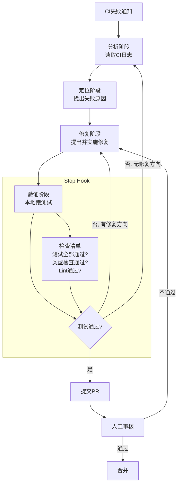

# CI失败自动修复 — 测试驱动循环的经典落地

> [!abstract] 核心观点
> CI失败自动修复是LOOP Engineering最经典的入门场景——有测试、有日志、有明确的停止条件，天然适合Agent循环。Anthropic的实践表明，三Agent架构（Planner→Generator→Evaluator）可以自动修复大部分CI失败，但需要人工处理最后的边界情况 [$TRAE_REF](https://cloud.tencent.com/developer/article/2711282)。

---

## 一、场景描述

### 1.1 痛点

CI（持续集成）流水线失败是开发团队的日常痛点：

| 问题 | 影响 |
|------|------|
| 开发者需要中断当前工作去修CI | 上下文切换成本高 |
| CI失败原因分析耗时 | 简单问题也可能花10-30分钟 |
| 修复后还要等CI重新跑 | 验证反馈周期长 |
| 同样的错误反复出现 | 缺乏系统性的错误预防 |

### 1.2 目标

让Agent自动完成：**分析CI失败 → 定位问题 → 提出修复 → 验证修复 → 提交PR** 的完整流程。

---

## 二、循环设计

### 2.1 架构：Reflection Loop + Ralph Loop混合模式



### 2.2 循环模式选择

| 阶段 | 循环模式 | 理由 |
|------|---------|------|
| 分析→定位→修复 | Reflection Loop | 需要生成+审阅+修订的迭代 |
| 验证→重试 | Ralph Loop（Stop Hook） | 需要外部验证器确保修复质量 |
| 整体流程 | Plan-Execute | 步骤清晰，可规划 |

---

## 三、Anthropic三Agent架构案例

### 3.1 架构设计

2026年3月，Anthropic工程师设计了一个受GAN启发的三Agent架构 [$TRAE_REF](https://cloud.tencent.com/developer/article/2711282)：

| Agent | 角色 | 职责 |
|-------|------|------|
| **Planner（规划者）** | 展开规格 | 分析CI失败，制定修复方案 |
| **Generator（生成者）** | 逐个实现修复 | 按规划执行代码修改 |
| **Evaluator（评估者）** | 用Playwright测试评分 | 真正点击运行应用验证修复 |

### 3.2 效果对比

| 版本 | 耗时 | 成本 | 功能实现数 | 说明 |
|------|------|------|-----------|------|
| 单Agent | 20分钟 | $9 | 核心功能无法运行 | 单Agent缺乏验证机制 |
| 三Agent | 6小时 | $200 | 16个功能全部实现 | 多Agent协作+验证 |

### 3.3 关键启示

- **单Agent的"完成"不可信**：单Agent觉得自己完成了，但实际功能无法运行
- **验证需要独立Agent**：让生成者自己去验证自己的输出，相当于"自己批改自己作业"
- **成本是投资的**：$200比$9贵了22倍，但16个功能全部实现 vs 0个功能可用，ROI完全值得

---

## 四、实现流程

### 4.1 完整流程

```
1. CI失败检测
   ├── 监听CI webhook或定时检查
   └── 获取失败日志和上下文

2. 问题分析（Reflection Loop）
   ├── 读取CI日志，定位失败步骤
   ├── 分析失败原因（编译错误/测试失败/lint报错）
   └── 生成问题分析报告

3. 修复方案设计（Reflection Loop）
   ├── 基于分析报告设计修复方案
   ├── 审阅模型检查方案合理性
   └── 输出具体修复步骤

4. 实施修复（Reflection Loop）
   ├── 按步骤执行代码修改
   ├── 每次修改后自我审阅
   └── 记录所有变更

5. 验证修复（Ralph Loop - Stop Hook）
   ├── 运行完整的测试套件
   ├── 运行类型检查
   ├── 运行Lint
   └── Stop Hook 检查是否全部通过

6. 提交PR
   ├── 生成PR描述（含问题分析、修复方案、验证结果）
   └── 提交PR，等待人工审核
```

### 4.2 关键设计决策

| 决策 | 选项 | 推荐 |
|------|------|------|
| 触发方式 | 自动触发 / 人工触发 | 先人工触发，稳定后切自动 |
| 修复范围 | 单次CI失败 / 批量处理 | 先单次，稳定后扩展 |
| 提交方式 | 直接提交 / PR | 始终PR，人工合并 |
| 失败处理 | 重试 / 上报 / 跳过 | 重试3次后上报人工 |

---

## 五、安全护栏配置

### 5.1 Hook配置

| Hook类型 | 配置 | 说明 |
|---------|------|------|
| Before Tool Hook | 拦截危险操作（rm -rf、DROP TABLE等） | 防止Agent误操作 |
| After Tool Hook | 检查文件变更范围 | 确保Agent只修改应该修改的文件 |
| Commit Hook | 运行Lint + 类型检查 + 测试 | 提交前必须通过所有检查 |
| Stop Hook | 验证所有测试通过 | 确保修复质量 |

### 5.2 终止条件配置

```
最大迭代次数：10轮（修复+验证循环）
连续无变化：3轮（如果连续3轮修复没进展，停止）
Token预算：50K/任务
目标达成：所有测试通过 + 类型检查通过 + Lint通过
人工干预：Agent无法修复时，开放PR让别人修
```

---

## 六、常见陷阱与应对

| 陷阱 | 表现 | 应对 |
|------|------|------|
| **过度修复** | Agent修复了CI失败，但改了很多不该改的代码 | 限定修改范围，只修"失败相关"的代码 |
| **测试不稳定** | 测试本身有flaky，Agent反复修复不存在的Bug | 先确认测试稳定性，flaky测试跳过 |
| **依赖问题** | CI失败是因为外部依赖，不是代码问题 | Agent先分析根因，依赖问题自动跳过 |
| **修复引入新问题** | 修好了A，但破坏了B | 测试覆盖率要足够，Commit Hook要跑完整测试 |

---

## 七、落地步骤

### 7.1 最小可行实现

```
第一步：选择一个简单的CI失败场景
  ├── 比如：Lint失败（最容易修复，风险最低）
  └── 手工触发，观察Agent行为

第二步：实现核心循环
  ├── 分析CI日志 → 定位问题 → 修复 → 验证
  └── 使用Reflection Loop + Stop Hook

第三步：HITL模式运行2周
  ├── Agent自动修复，但PR需要人工审核合并
  └── 收集Agent的修复质量数据

第四步：逐步扩展
  ├── 扩展到更多CI失败场景（测试失败、编译错误等）
  └── 根据数据调整策略
```

### 7.2 效果评估指标

| 指标 | 说明 | 目标值 |
|------|------|--------|
| 修复成功率 | Agent成功修复的比例 | >80% |
| 修复质量 | 修复后是否引入新问题 | <5% |
| 平均修复时间 | 从CI失败到提交PR | <10分钟 |
| 人工介入率 | 需要人工干预的比例 | <20% |

---

## 关联笔记

- [[01-AI技术/LOOP Engineering/06-实战篇/05_最小可行Loop落地法]] — 从最小可用Loop开始
- [[01-AI技术/LOOP Engineering/04-方法篇/01_循环设计八步法]] — 循环设计的完整流程
- [[01-AI技术/LOOP Engineering/04-方法篇/02_验证机制设计]] — 验证机制的详细设计
- [[01-AI技术/LOOP Engineering/04-方法篇/03_安全护栏体系]] — Hook配置指南
- [[01-AI技术/LOOP Engineering/00_MOC_LOOP_Engineering中枢]] — 返回中枢索引