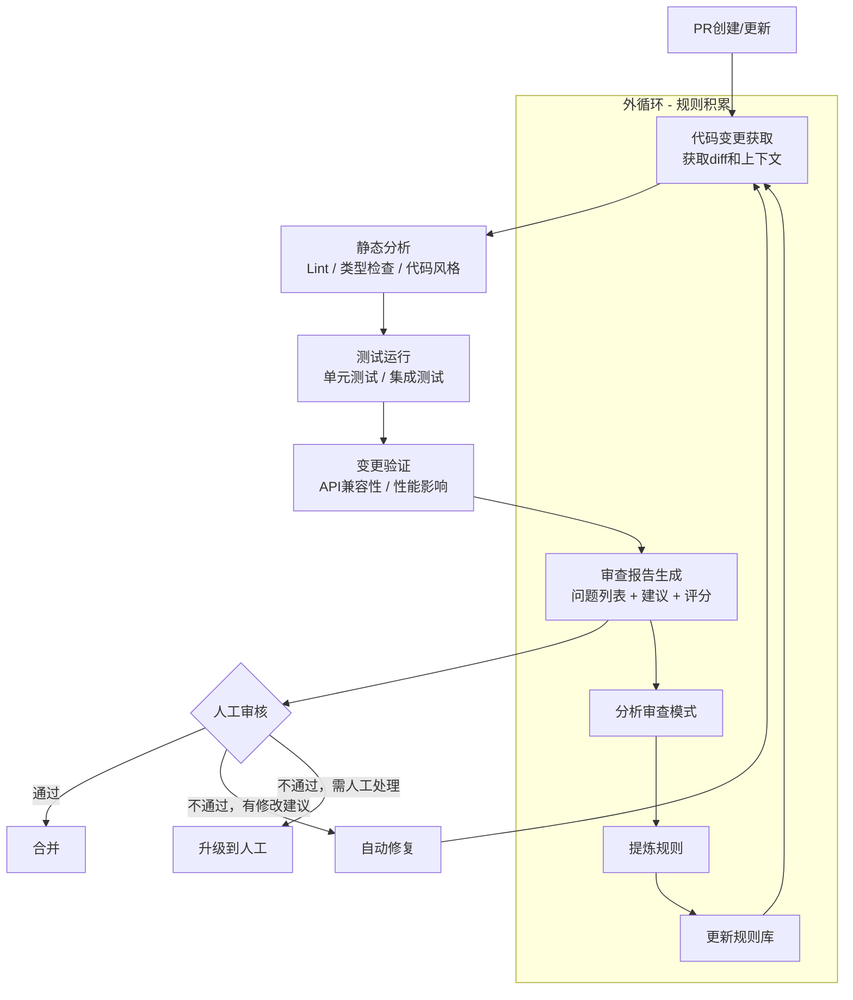
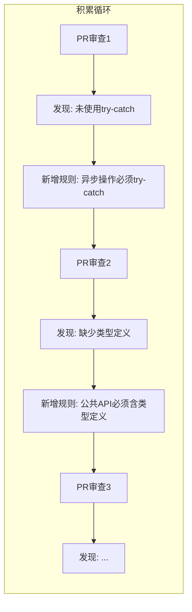

# PR Babysitter — PR审查Agent的Loop设计

> [!abstract] 核心观点
> PR审查是LOOP Engineering的经典场景——有明确的输入（代码变更）、可用的验证工具（Lint、测试、安全扫描）、清晰的终止条件（所有检查通过或关键问题上报）。PR Babysitter通过Inner Loop实现单次PR审查的自动化，通过Outer Loop积累审查规则，形成"每次审查都比上次更好"的棘轮效应。

---

## 一、场景描述

### 1.1 PR审查Agent的痛点

传统的PR审查流程存在以下问题：

| 痛点 | 影响 | 频率 |
|------|------|------|
| **审查者疲劳** | 长时间审查导致漏检率上升 | 每天 |
| **标准不一致** | 不同审查者标准不同，开发者困惑 | 每次PR |
| **重复审查** | 同类错误反复出现，没有积累 | 持续 |
| **上下文切换** | 审查者需要中断当前工作去审查PR | 每次PR |
| **反馈周期长** | PR等待审查时间过长，阻塞开发流程 | 每天 |

### 1.2 PR Babysitter的目标

```
核心目标:
  自动化PR审查流程，让Agent完成代码变更分析、静态检查、运行测试、
  生成审查报告的全流程，人工审查者只需确认最终结果。

关键指标:
  - 审查时间: 从小时级缩短到分钟级
  - 漏检率: 低于人工审查的漏检率
  - 规则积累: 每次审查后自动积累规则
  - 人工介入: 仅处理Agent无法判断的复杂情况
```

---

## 二、Loop设计

### 2.1 PR审查的完整循环



### 2.2 循环阶段详解

| 阶段 | 输入 | 输出 | 工具/方法 |
|------|------|------|----------|
| 代码变更获取 | PR事件 | diff + 变更文件列表 | Git API, GitHub/ GitLab API |
| 静态分析 | diff + 代码文件 | Lint报告 + 类型错误 | ESLint, Prettier, TypeScript |
| 测试运行 | 完整代码库 | 测试结果 | Jest, Mocha, pytest |
| 变更验证 | diff + 测试结果 | 兼容性报告 | API diff工具, 性能分析 |
| 审查报告生成 | 所有分析结果 | 结构化审查报告 | LLM分析 + 聚合 |

---

## 三、Inner Loop设计

### 3.1 单次PR审查的自动化流程

Inner Loop负责单次PR的完整审查流程：

```yaml
# Inner Loop 配置示例
inner_loop:
  name: "PR审查内循环"
  max_iterations: 3           # 最多3轮修复-审查循环
  steps:
    - step: 获取变更
      action: fetch_diff
      params:
        base: main
        head: feature-branch

    - step: 静态分析
      action: run_lint
      tools: [eslint, prettier, tsc]
      fail_on: error            # 只有error级别才阻断

    - step: 运行测试
      action: run_tests
      command: npm test
      timeout: 300s

    - step: 变更验证
      action: verify_changes
      checks:
        - api_compatibility
        - breaking_changes
        - security_scan

    - step: 生成报告
      action: generate_report
      format: markdown
      sections:
        - 概述
        - 发现的问题
        - 建议的修改
        - 风险评估
```

### 3.2 修复流程

当审查发现问题时，Agent可以尝试自动修复：

```
修复流程:
  1. 分析Lint/测试错误
  2. 定位到具体的代码行
  3. 生成修复方案
  4. 应用修复
  5. 重新运行检查
  6. 如果修复失败，回滚并上报

修复范围限制:
  - 只修改与发现问题相关的代码
  - 不改变原有逻辑结构
  - 不引入新的依赖
  - 保持代码风格一致性
```

---

## 四、Outer Loop设计

### 4.1 基于审查反馈的规则积累

Outer Loop的核心是"棘轮机制"——每次审查都在积累规则：



### 4.2 规则库结构

```yaml
# 规则库示例
rules:
  - id: R001
    category: 错误处理
    description: 异步操作必须使用try-catch
    severity: error
    pattern: "async function.*\\{\\n(?!.*try)"
    auto_fix: true
    created: 2026-08-01
    source: "PR #1234 - 未捕获的Promise异常"

  - id: R002
    category: 类型安全
    description: 公共API必须包含TypeScript类型定义
    severity: warning
    pattern: "export function.*\\(.*\\)"
    auto_fix: false
    created: 2026-08-02
    source: "PR #1235 - 缺少类型定义"

  - id: R003
    category: 安全
    description: 禁止硬编码密钥
    severity: error
    pattern: "(API_KEY|SECRET|PASSWORD)\\s*=\\s*['\"][^'\"]+['\"]"
    auto_fix: true
    fix: "替换为环境变量引用"
    created: 2026-08-03
    source: "PR #1236 - 硬编码API密钥"
```

### 4.3 棘轮机制的触发条件

```
触发外循环的条件:
  - 人工审查者标记了"这是一个值得记录的反馈"
  - 同一类错误在3次PR中重复出现
  - 安全扫描发现新的风险模式
  - 审查报告显示准确率低于阈值（如 < 90%）

规则更新流程:
  1. 收集近期审查记录
  2. 聚类分析失败模式
  3. 提炼可执行的规则
  4. 生成PR更新规则库
  5. 人工审核规则变更
  6. 合并后自动生效
```

---

## 五、验证机制

### 5.1 代码风格检查

| 检查项 | 工具 | 阻断级别 | 自动修复 |
|--------|------|---------|---------|
| 代码格式 | Prettier, ESLint | warning | 是 |
| 命名规范 | ESLint naming convention | error | 部分 |
| 导入顺序 | import/order | warning | 是 |
| 代码复杂度 | complexity | error | 否 |
| 文件大小 | max-lines | warning | 否 |

### 5.2 安全扫描

| 扫描项 | 工具 | 说明 |
|--------|------|------|
| 依赖漏洞 | npm audit / Snyk | 检查已知CVE |
| 密钥泄露 | GitLeaks / TruffleHog | 检测硬编码密钥 |
| 注入风险 | ESLint security plugin | SQL注入、XSS等 |
| 权限检查 | 自定义规则 | 确保最小权限原则 |

### 5.3 兼容性验证

```
兼容性检查清单:
  - API签名是否变更
  - 数据库Schema是否兼容
  - 配置格式是否向后兼容
  - 依赖版本是否满足约束
  - 浏览器兼容性（前端项目）
  - 移动端兼容性（跨平台项目）
```

---

## 六、安全护栏

### 6.1 权限控制

```yaml
# 安全护栏配置
security:
  permissions:
    # 文件操作权限
    file_access:
      allow_read: ["src/**", "test/**", "config/**"]
      allow_write: ["src/**", "test/**"]
      deny_write: ["node_modules/**", ".env", "secrets/**"]

    # 命令执行权限
    command_execution:
      allow: ["npm test", "npx eslint", "npx tsc --noEmit"]
      deny: ["rm -rf", "drop table", "sudo"]

    # 网络访问权限
    network:
      allow: ["registry.npmjs.org", "api.github.com"]
      deny: ["*"]
```

### 6.2 敏感信息过滤

```
自动过滤的内容:
  - API密钥和Token（模式匹配）
  - 数据库连接字符串
  - 内部IP地址和域名
  - 个人身份信息（PII）
  - 内部系统路径

过滤策略:
  - 检测到敏感信息 → 自动替换为占位符
  - 记录敏感信息位置（不记录内容）
  - 通知人工审查者处理
```

### 6.3 代码注入防护

| 防护措施 | 说明 | 优先级 |
|---------|------|--------|
| 沙箱执行 | 所有代码在沙箱中运行 | 必须 |
| 命令白名单 | 只允许预定义的命令列表 | 必须 |
| 输入验证 | 所有外部输入需要验证 | 必须 |
| 输出编码 | 防止XSS等注入攻击 | 建议 |
| 资源限制 | CPU/内存/网络使用限制 | 必须 |

---

## 七、终止条件

### 7.1 审查完成

```
正常终止条件:
  1. 所有检查项通过 ✅
     - Lint通过（无error级别问题）
     - 测试全部通过
     - 安全扫描无高风险问题
     - 兼容性验证通过

  2. 审查报告已生成 ✅
     - 包含所有发现的问题
     - 对每个问题分类和评级
     - 提供修改建议

  3. 已通知相关人员 ✅
     - PR作者收到审查结果
     - 指定审查者收到通知
```

### 7.2 关键问题发现

```
提前终止条件（发现关键问题，立即上报）:
  1. 安全漏洞: 发现SQL注入、XSS、认证绕过等
  2. 数据泄露: 发现硬编码密钥、敏感信息等
  3. 破坏性变更: 发现不兼容的API变更
  4. 严重错误: 发现可能导致生产事故的逻辑错误

提前终止后的处理:
  - 立即生成关键问题报告
  - 通知PR作者和安全团队
  - 阻止PR合并（通过GitHub branch protection）
  - 记录审计日志
```

### 7.3 超时降级

```yaml
# 超时配置
timeout:
  total: 600s          # 总审查时间上限
  per_step: 120s       # 单步骤时间上限
  per_iteration: 300s  # 单次迭代时间上限

degradation:
  # 超时后的降级策略
  strategy: partial_result
  fallback:
    - 已完成的分析结果保留
    - 未完成的分析标记为"跳过"
    - 生成部分审查报告
    - 通知人工审查者
```

---

## 八、配置示例

### 8.1 YAML配置

```yaml
# 完整的PR Babysitter配置
version: "1.0"
name: "PR Babysitter"

triggers:
  events:
    - pull_request.opened
    - pull_request.synchronize
  branches:
    - main
    - develop
  paths:
    include: ["src/**", "test/**"]
    exclude: ["docs/**", "*.md"]

inner_loop:
  max_iterations: 3
  steps:
    - name: fetch_diff
      type: git
      action: diff

    - name: lint
      type: tool
      tool: eslint
      args: ["--format", "json"]

    - name: type_check
      type: tool
      tool: typescript
      args: ["--noEmit"]

    - name: test
      type: tool
      tool: jest
      args: ["--ci", "--coverage"]

    - name: security_scan
      type: tool
      tool: gitleaks
      args: ["--verbose"]

    - name: generate_report
      type: llm
      model: claude-4
      prompt_template: "pr_review_template.j2"

outer_loop:
  interval: "daily"
  max_rules_per_update: 5
  rule_source: "rules/**/*.yaml"
  review_required: true

security:
  permissions:
    file_access: { allow_write: ["src/**", "test/**"] }
    commands: { allow: ["npm test", "npx eslint", "npx tsc"] }
  sensitive_info:
    patterns:
      - "AKIA[0-9A-Z]{16}"
      - "sk-[a-zA-Z0-9]{32,}"
    action: redact

termination:
  max_iterations: 3
  timeout: 600s
  no_progress_count: 2
  degradation: partial_report
```

### 8.2 Prompt示例

```markdown
# PR审查Prompt

## 角色
你是一个资深的代码审查专家，负责审查PR中的代码变更。

## 你需要审查的内容
- 变更文件列表：{{files}}
- 代码变更diff：{{diff}}
- 静态分析结果：{{lint_results}}
- 测试结果：{{test_results}}
- 安全扫描结果：{{security_results}}

## 审查要求
1. 检查代码逻辑是否正确
2. 检查代码风格是否符合项目规范
3. 检查是否有潜在的bug或性能问题
4. 检查是否有安全隐患
5. 检查是否有兼容性问题

## 输出格式
请按以下格式输出审查报告：

### 概述
- 变更摘要
- 文件数量
- 整体评分（1-5分）

### 发现的问题
| 严重程度 | 文件 | 问题描述 | 建议修复 |
|---------|------|---------|---------|
| error | xxx.ts | 问题描述 | 修复建议 |

### 改进建议
- 建议1
- 建议2

### 总结
整体评价和建议的下一步行动。
```

---

## 关联笔记

- [[01-AI技术/LOOP Engineering/06-实战篇/01_CI失败自动修复]] — 类似的测试驱动循环模式
- [[01-AI技术/LOOP Engineering/06-实战篇/05_最小可行Loop落地法]] — 从最小可用Loop开始
- [[01-AI技术/LOOP Engineering/04-方法篇/01_循环设计八步法]] — 循环设计的完整流程
- [[01-AI技术/LOOP Engineering/04-方法篇/02_验证机制设计]] — 验证机制的详细设计
- [[01-AI技术/LOOP Engineering/04-方法篇/03_安全护栏体系]] — Hook配置指南
- [[01-AI技术/LOOP Engineering/00_MOC_LOOP_Engineering中枢]] — 返回中枢索引