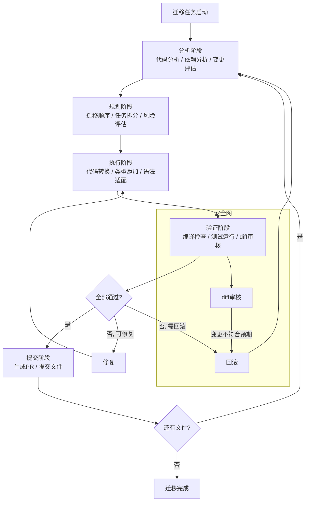
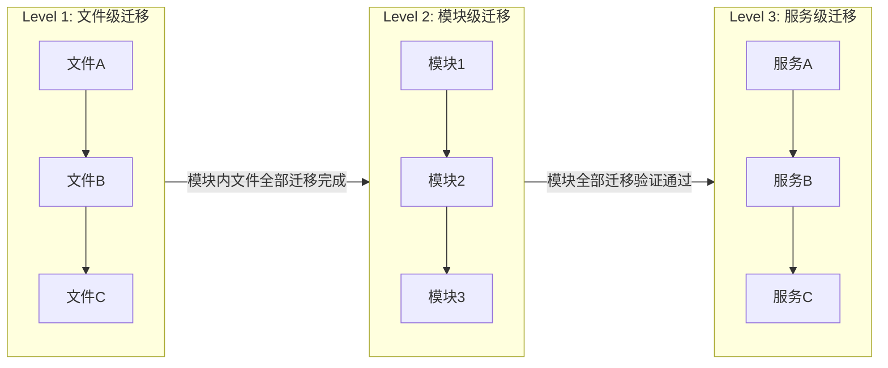
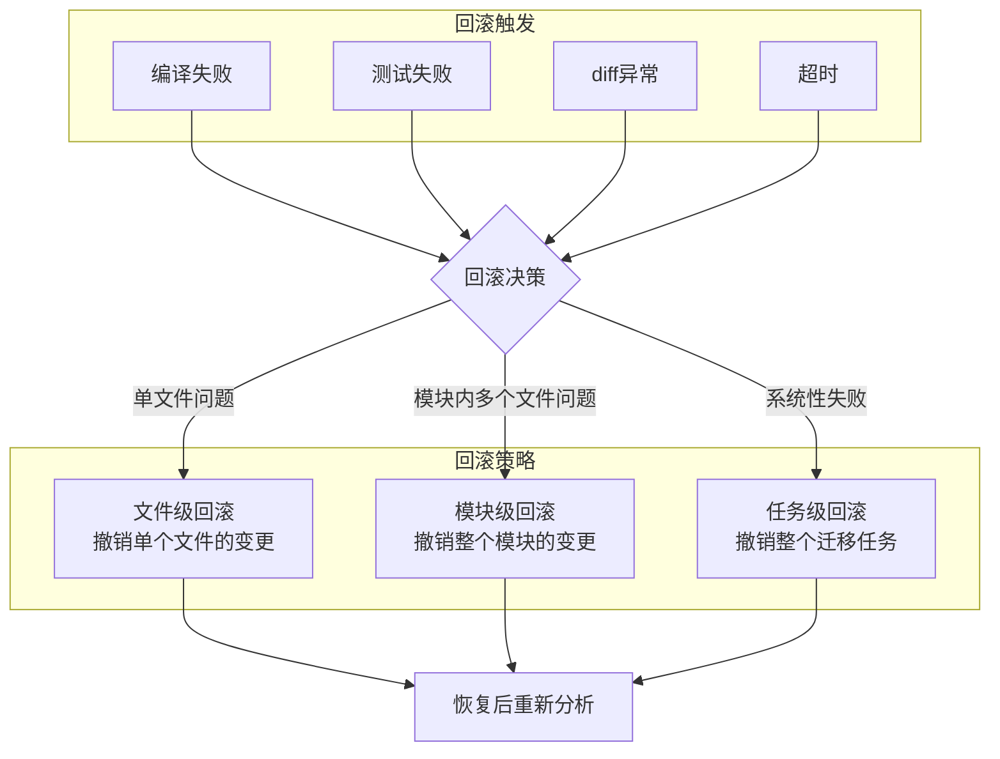

# 代码库迁移 — 大规模迁移的Loop设计

> [!abstract] 核心观点
> 大规模代码库迁移是LOOP Engineering最高难度的实战场景之一——涉及数千个文件、复杂的依赖关系、严格的功能一致性要求。核心挑战不是"能不能迁移"，而是"如何保证迁移后功能不变"。通过"分析→规划→执行→验证→提交"的完整循环，以及"文件级→模块级→服务级"的分步策略，Agent可以高效且安全地完成大规模迁移，同时通过棘轮机制不断积累迁移经验。

---

## 一、场景描述

### 1.1 大规模代码库迁移的挑战

| 挑战 | 描述 | 影响程度 |
|------|------|---------|
| **规模庞大** | 数千个文件、数十万行代码需要迁移 | 高 |
| **依赖复杂** | 模块之间相互依赖，牵一发而动全身 | 高 |
| **功能一致性** | 迁移后必须保证功能完全不变 | 极高 |
| **类型兼容** | 类型系统变化可能导致大量编译错误 | 高 |
| **第三方库** | 依赖库版本变更可能引入breaking change | 中 |
| **团队协作** | 多人同时在迁移中工作，冲突管理 | 中 |

### 1.2 适用场景

| 迁移类型 | 典型场景 | 难度 |
|---------|---------|------|
| **语言升级** | JavaScript → TypeScript | 中 |
| **框架升级** | Vue 2 → Vue 3, React Class → Hooks | 中高 |
| **架构重构** | MVC → 微服务, 单体 → 模块化 | 高 |
| **构建工具** | Webpack → Vite, Babel → SWC | 低中 |
| **包管理器** | npm → pnpm, yarn → npm | 低 |
| **数据库迁移** | SQL → NoSQL, 关系型迁移 | 极高 |

---

## 二、Loop设计

### 2.1 迁移的完整循环



### 2.2 各阶段详解

| 阶段 | 核心任务 | 输入 | 输出 | 关键工具 |
|------|---------|------|------|---------|
| **分析** | 理解当前代码结构和依赖 | 源代码 | 依赖图、变更清单 | jscodeshift, ts-morph |
| **规划** | 制定迁移顺序和策略 | 依赖图 | 迁移计划、任务列表 | 自定义规划器 |
| **执行** | 实际代码转换 | 迁移计划 | 转换后的代码 | codemod, AST转换 |
| **验证** | 确保转换后功能不变 | 转换后代码 | 验证报告 | 编译器、测试框架 |
| **提交** | 将变更提交到版本控制 | 验证通过的代码 | PR/Commit | Git |

---

## 三、分步迁移策略

### 3.1 文件级→模块级→服务级



### 3.2 各层级迁移策略

| 层级 | 范围 | 验证标准 | 回滚粒度 | 并行度 |
|------|------|---------|---------|--------|
| **文件级** | 单个文件 | 文件编译通过 | 按文件回滚 | 高（文件间独立） |
| **模块级** | 模块内所有文件 | 模块测试通过 | 按模块回滚 | 中（模块内依赖） |
| **服务级** | 整个服务 | 服务测试通过 + E2E | 按服务回滚 | 低（服务间依赖） |

### 3.3 迁移顺序决策

```
迁移顺序决策算法:

1. 构建依赖图（从文件依赖到服务依赖）
2. 拓扑排序（被依赖最少的优先迁移）
3. 识别"阻塞节点"（被大量依赖的文件/模块）
4. 分阶段执行迁移

决策规则:
  - 叶子节点优先（被依赖最多 → 最后迁移）
  - 工具类/基础设施优先（上层依赖 → 先迁移）
  - 高风险文件单独处理（变更量大的文件）
  - 无依赖文件可以并行处理
```

---

## 四、Inner Loop

### 4.1 单次迁移任务的自动化

```yaml
# 单次迁移任务的内循环配置
migration_task:
  name: "文件级迁移"
  max_iterations: 5

  steps:
    - step: analyze
      action: parse_ast
      tool: ts-morph
      output: ast.json

    - step: transform
      action: apply_codemod
      tool: jscodeshift
      transforms:
        - import_path_converter
        - type_annotation_adder
        - syntax_upgrader

    - step: compile
      action: type_check
      tool: tsc
      args: ["--noEmit", "--strict"]

    - step: test
      action: run_tests
      tool: jest
      args: ["--related", "--passWithNoTests"]

    - step: diff_review
      action: analyze_diff
      tool: custom
      checks:
        - 文件结构是否合理
        - 是否有不必要的变更
        - 是否符合迁移规范
```

### 4.2 迁移模式示例

```
JavaScript → TypeScript 迁移模式:
  1. 将 .js 重命名为 .ts
  2. 添加类型注解（根据使用推断）
  3. 修复类型错误
  4. 添加接口/类型定义

Vue 2 → Vue 3 迁移模式:
  1. 将 Options API 改为 Composition API
  2. 替换生命周期钩子
  3. 更新模板语法
  4. 迁移 Vuex 到 Pinia
```

---

## 五、验证机制

### 5.1 编译检查

| 检查项 | 命令 | 通过标准 |
|--------|------|---------|
| TypeScript编译 | `tsc --noEmit --strict` | 零错误 |
| Lint检查 | `eslint --max-warnings 0` | 零错误 |
| 类型兼容性 | 自定义类型检查 | 无类型丢失 |
| 导入路径 | 导入路径验证 | 所有路径有效 |

### 5.2 测试运行

```
测试运行策略:
  1. 关联测试（仅跑受变更影响的测试）
     - 变更文件 → 直接依赖这些文件的测试
     - 变更模块 → 整个模块的测试
  2. 全量测试（最后验证）
     - 模块级迁移完成 → 跑模块全量测试
     - 服务级迁移完成 → 跑服务全量测试

测试通过标准:
  - 单元测试: 100%通过
  - 集成测试: 100%通过
  - 覆盖率: 不低于迁移前
```

### 5.3 diff审核

```yaml
# diff审核规则
diff_review:
  checks:
    - name: 结构差异
      rule: "迁移后的文件结构应与迁移前一致"
      severity: error

    - name: 逻辑变更
      rule: "不允许引入逻辑变更（仅语法转换）"
      severity: error

    - name: 非必要变更
      rule: "不允许修改与迁移无关的代码"
      severity: warning

    - name: 注释保留
      rule: "现有注释应保留"
      severity: warning

    - name: 命名一致性
      rule: "变量命名风格应与项目一致"
      severity: warning
```

### 5.4 功能验证

```
功能验证清单:
  ✓ 编译通过（零错误）
  ✓ 所有测试通过
  ✓ diff不包含逻辑变更
  ✓ 导入路径正确
  ✓ 类型定义完整
  ✓ 无性能退化
  ✓ 迁移前后输出一致（针对纯函数）
```

---

## 六、回滚策略

### 6.1 安全网设计



### 6.2 回滚配置

```yaml
# 回滚策略配置
rollback:
  # 自动回滚条件
  auto_rollback:
    - condition: "编译错误 > 10个"
      action: "模块级回滚"
    - condition: "测试失败率 > 20%"
      action: "任务级回滚"
    - condition: "diff包含非预期变更 > 50行"
      action: "文件级回滚"
    - condition: "单次迁移超时 > 10分钟"
      action: "文件级回滚"

  # 回滚执行
  execution:
    type: "git revert"
    options:
      - "--no-commit"     # 回滚但不自动提交
      - "--strategy=recursive"
      - "--strategy-option=ours"

  # 回滚后处理
  post_rollback:
    - 记录失败原因到迁移日志
    - 标记文件为"需要人工审核"
    - 调整迁移策略（降低复杂度）
    - 通知迁移负责人
```

### 6.3 安全网的关键指标

| 指标 | 阈值 | 触发动作 |
|------|------|---------|
| 编译错误数 | > 5 | 停止当前迁移，启动回滚 |
| 测试失败率 | > 10% | 回滚到上一个稳定状态 |
| 非预期变更 | > 20行 | 标记为需要人工审核 |
| 连续失败次数 | 3次 | 暂停迁移，人工介入 |
| 单次迁移时间 | > 10分钟 | 拆分任务，缩小范围 |

---

## 七、实践案例

### 7.1 JavaScript → TypeScript迁移

**场景**：将一个中型JavaScript项目（约500个文件）迁移到TypeScript。

```
迁移步骤:
  1. 分析阶段
     - 扫描所有 .js 文件
     - 分析依赖关系
     - 识别无依赖的叶子文件

  2. 规划阶段
     - 确定迁移顺序（叶子文件优先）
     - 分批大小：每次20个文件
     - 预估总工作量：约25批次

  3. 执行阶段 - 每批次的Inner Loop:
     a. 将 .js 重命名为 .ts
     b. 运行 tsc 获取类型错误列表
     c. 根据使用推断添加类型注解
     d. 修复类型错误
     e. 验证编译通过

  4. 验证阶段
     - 编译检查（零错误）
     - 测试运行（100%通过）
     - diff审核（仅添加类型，无逻辑变更）

  5. Outer Loop积累的经验:
     - 常用类型推断模式
     - 第三方库的类型定义映射
     - 常见类型错误的修复模板
```

**迁移效果**：

| 指标 | 迁移前 | 迁移后 | 改善 |
|------|--------|--------|------|
| 编译错误 | 不适用（JS无编译） | 零错误 | — |
| 运行时错误 | 月均15起 | 月均3起 | -80% |
| 开发效率 | 代码提示弱 | 完整类型提示 | +30% |
| 代码可维护性 | 低 | 高 | 显著提升 |
| 迁移耗时 | — | 3天（Agent） | 若人工需2-3周 |

### 7.2 Vue 2 → Vue 3迁移

**场景**：将一个使用Vue 2 + Vuex的项目迁移到Vue 3 + Pinia。

```
迁移挑战:
  - Options API → Composition API 的重写
  - Vuex → Pinia 的状态管理迁移
  - 生命周期钩子名称变更
  - 模板语法差异
  - 第三方Vue 2插件不兼容

迁移模式:
  1. Options API转Composition API:
     data() → ref() / reactive()
     computed → computed()
     methods → 普通函数
     watch → watch() / watchEffect()
    生命周期钩子名映射

  2. Vuex转Pinia:
     state → 直接定义
     mutations → actions（Pinia无mutations）
     getters → getters
     模块 → defineStore

  3. 模板语法迁移:
     v-bind="$attrs" → $attrs
     插槽语法更新
     v-model 更新

迁移验证:
  - 编译通过（Vue 3编译器）
  - 组件渲染测试通过
  - 状态管理功能正常
  - 路由功能正常
  - 无性能退化
```

### 7.3 迁移经验总结

| 经验 | 说明 |
|------|------|
| **小批量、高频次** | 每次迁移20-30个文件，比一次性迁移数百个文件更可控 |
| **先叶子节点** | 被依赖最少的文件优先迁移，减少阻塞 |
| **强验证** | 每次迁移后必须编译+测试+diff审核三通过 |
| **自动回滚** | 设置明确的回滚条件，不要犹豫 |
| **规则积累** | 每次迁移遇到的问题都转化为规则，下次避免 |
| **人工抽检** | 即使自动验证通过，也建议人工抽检10%的迁移结果 |

---

## 关联笔记

- [[01-AI技术/LOOP Engineering/06-实战篇/01_CI失败自动修复]] — 测试驱动循环模式
- [[01-AI技术/LOOP Engineering/06-实战篇/02_PR Babysitter]] — PR审查Agent，与迁移配合使用
- [[01-AI技术/LOOP Engineering/04-方法篇/01_循环设计八步法]] — 循环设计的完整流程
- [[01-AI技术/LOOP Engineering/04-方法篇/02_验证机制设计]] — 验证机制的详细设计
- [[01-AI技术/LOOP Engineering/04-方法篇/04_终止条件设计]] — 循环终止条件
- [[01-AI技术/LOOP Engineering/00_MOC_LOOP_Engineering中枢]] — 返回中枢索引