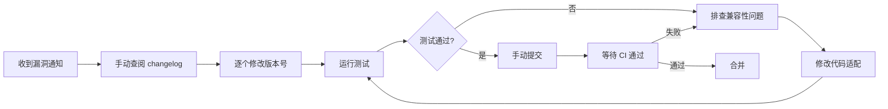
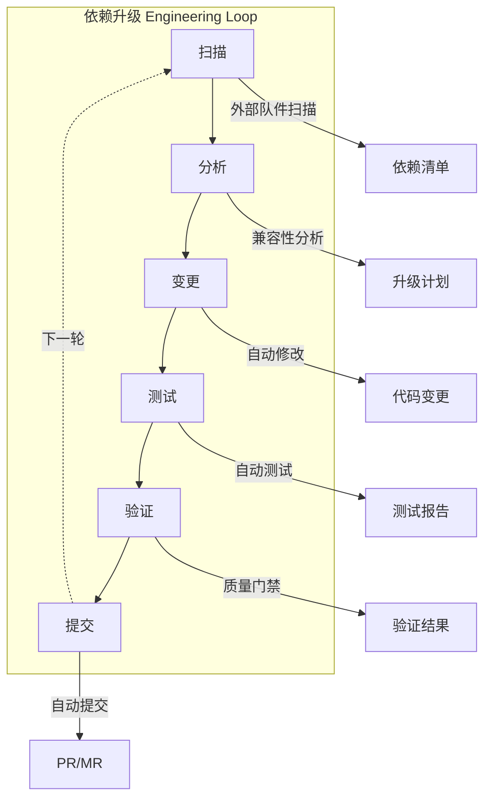
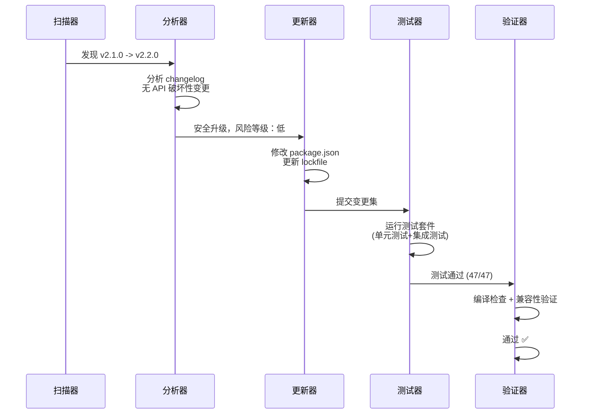
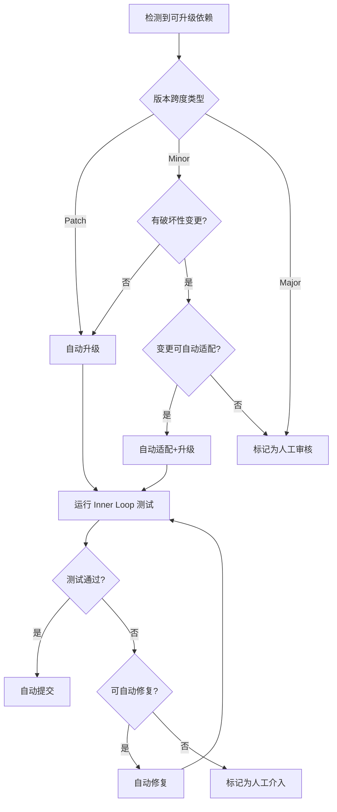
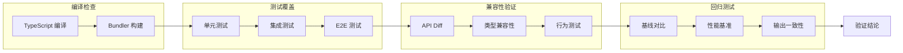
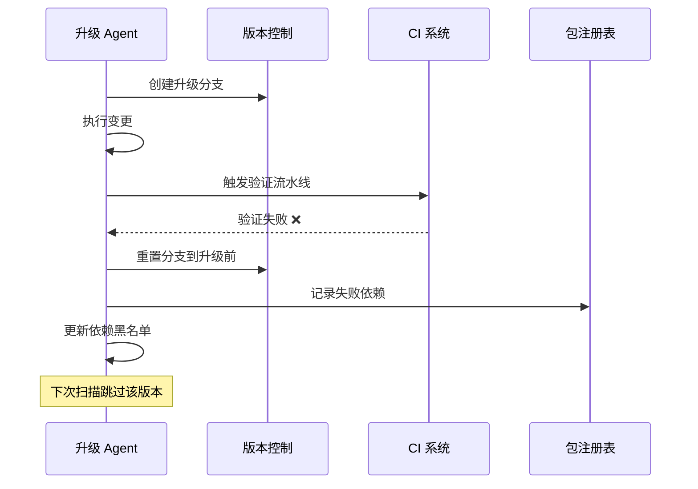
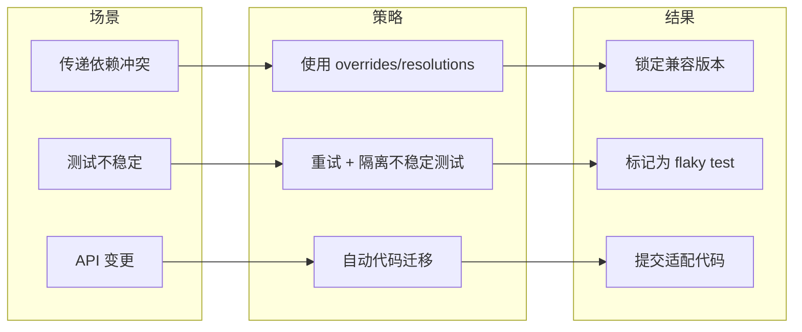

> [!abstract] 核心观点
> 依赖版本升级是软件开发中最频繁也最危险的操作之一。LOOP Engineering 将依赖升级纳入完整的 Engineering Loop，通过扫描、分析、变更、测试、验证、提交六个阶段的自动化闭环，在保证安全性的前提下大幅降低依赖维护的人力成本，让团队从繁琐的版本追踪中解放出来。

## 一、场景描述：依赖升级的挑战

### 1.1 依赖管理的复杂性

现代软件项目通常依赖数十甚至数百个第三方包。以典型的 Node.js 项目为例，`package.json` 中可能直接声明 30-50 个依赖，而间接依赖（transitive dependencies）可达上千个。每一项依赖都在持续演进，版本升级带来新功能的同时也引入风险。

| 挑战维度 | 具体表现 | 影响程度 |
|---------|---------|---------|
| 兼容性风险 | API 签名变更、行为语义变化、废弃特性移除 | 高 |
| 传递依赖冲突 | 多个依赖要求不同版本的公共子依赖 | 中 |
| 测试覆盖不足 | 升级后未覆盖的代码路径可能引入线上故障 | 高 |
| 复合变更效应 | 同时升级多个依赖，问题定位困难 | 高 |
| 安全漏洞 | 已知 CVE 需紧急修复，但升级可能破坏功能 | 紧急 |

### 1.2 手动升级的痛点



传统的依赖升级流程高度依赖人工操作，每次升级平均需要 30 分钟到数小时。对于拥有 50+ 依赖的项目，即使只做季度性批量升级，也是一个沉重的维护负担。

## 二、Loop 设计：依赖升级的完整循环

LOOP Engineering 将依赖升级建模为一个六阶段 Engineering Loop，每个阶段都是可观测、可度量、可回溯的。



### 2.1 各阶段职责

| 阶段 | 输入 | 处理 | 输出 | 关键指标 |
|------|------|------|------|---------|
| 扫描 | 当前依赖锁定文件 | 比对注册表，检测可升级版本 | 可升级依赖列表 | 待升级数量、漏洞数量 |
| 分析 | 可升级列表 | 分析 changelog、API diff、兼容性 | 升级优先级排序 | 破坏性变更标记、风险等级 |
| 变更 | 升级计划 | 修改版本声明、适配 API 变更 | 代码变更集 | 变更文件数、代码行变更 |
| 测试 | 变更后的代码 | 运行单元/集成/端到端测试 | 测试结果报告 | 通过率、覆盖率变化 |
| 验证 | 测试报告 | 兼容性检查、基准对比 | 验证结论 | 合规/警告/拒绝 |
| 提交 | 验证通过的变更 | 创建 PR/MR、关联标签 | 审批请求 | PR 描述完整性 |

## 三、Inner Loop：单次依赖升级的自动化流程

### 3.1 单次升级的 Inner Loop

对于单个依赖的升级，LOOP Engineering 设计了一个快速的 Inner Loop：



### 3.2 升级决策树



### 3.3 自动化适配示例

当检测到 API 变更时，Agent 可以自动执行代码迁移：

```typescript
// 升级前：使用旧 API
import { createClient } from 'old-library';
const client = createClient({ timeout: 5000 });

// Agent 自动升级为：
import { Client } from 'new-library';
const client = new Client({ timeout: 5000, retry: 3 });
```

## 四、验证机制

### 4.1 四层验证体系

LOOP Engineering 为依赖升级设计了四层验证：

```yaml
verification:
  layers:
    - name: 编译检查
      description: 确保代码能正确编译/转译
      tools: [tsc, babel, webpack, esbuild]
      gate: 编译零错误
    
    - name: 测试覆盖
      description: 运行完整的测试套件
      scope: [unit, integration, e2e]
      gate: 通过率 >= 99%，覆盖率不下降
    
    - name: 兼容性验证
      description: 检测 API 签名和行为变化
      checks:
        - 导出接口是否一致
        - 类型定义是否兼容
        - 运行时行为是否符合预期
      gate: 无破坏性变更
    
    - name: 回归测试
      description: 与基线版本进行对比测试
      comparison: 输出一致性、性能基准
      gate: 性能退化 < 5%
```

### 4.2 验证流水线



## 五、回滚策略：安全网设计

### 5.1 分级回滚机制

```yaml
rollback:
  levels:
    - level: L0
      name: 即时回退
      trigger: 编译失败/测试大面积失败
      action: 自动恢复到上一个锁定版本
      time: < 30s
    
    - level: L1
      name: 变更撤销
      trigger: 兼容性验证失败
      action: 撤销代码变更 + 回退版本
      time: < 2min
    
    - level: L2
      name: PR 关闭
      trigger: 人工审核拒绝
      action: 关闭自动创建的 PR，保留分析记录
      time: 人工决定
    
    - level: L3
      name: 生产回滚
      trigger: 生产环境异常
      action: 回滚部署版本，锁定依赖版本
      time: < 5min
```

### 5.2 回滚流程



## 六、安全护栏

### 6.1 升级规则引擎

```yaml
safety_guards:
  version_constraints:
    - rule: 仅升级 Minor 和 Patch 版本
      scope: 所有生产依赖
      exception: 安全漏洞修复（CVE 评分 >= 7.0）
    
    - rule: Major 版本升级需人工审核
      scope: 所有生产依赖
      workflow: 创建审核任务，通知维护者
    
    - rule: 跳过已知破坏性变更版本
      source: 社区报告 + 历史升级记录
      action: 在升级计划中排除该版本

  dependency_groups:
    - group: critical
      description: 核心框架依赖
      review: 必须人工审核
      examples: [react, vue, express, spring-boot]
    
    - group: standard
      description: 常规依赖
      review: 自动升级 + 自动验证
      examples: [lodash, dayjs, axios]
    
    - group: dev
      description: 开发依赖
      review: 自动升级，宽松验证
      examples: [eslint, prettier, jest]
```

### 6.2 破坏性变更检测

```python
# 破坏性变更检测伪代码
def detect_breaking_changes(old_version, new_version):
    checks = {
        "api_signature": compare_api_signatures(old_version, new_version),
        "type_compatibility": check_type_compatibility(old_version, new_version),
        "behavioral_changes": run_behavioral_tests(old_version, new_version),
        "deprecation_check": scan_deprecated_usage(old_version, new_version),
    }
    
    risk_score = sum(check["score"] for check in checks.values())
    breaking_changes = any(check["breaking"] for check in checks.values())
    
    return {
        "risk_level": calculate_risk_level(risk_score),
        "breaking": breaking_changes,
        "details": checks,
        "recommendation": "skip" if breaking_changes and risk_score > 50 else "upgrade"
    }
```

## 七、配置示例和最佳实践

### 7.1 完整配置示例

```yaml
# .loop/dependency-upgrade.yaml
dependency_upgrade:
  schedule: "0 2 * * 1"  # 每周一凌晨2点
  scope:
    include: ["dependencies", "devDependencies"]
    exclude: ["@internal/*"]
  
  version_policy:
    max_batch_size: 5        # 每批最多升级5个依赖
    allow_major: false       # 禁止自动 Major 升级
    allow_minor: true        # 允许 Minor 升级
    allow_patch: true        # 允许 Patch 升级
    security_override: true  # 安全修复可覆盖版本约束
  
  verification:
    compile: true
    unit_tests: true
    integration_tests: true
    e2e_tests: false         # E2E 测试仅在预发布环境执行
    compatibility_check: true
    regression_benchmark: true
  
  rollback:
    auto_rollback: true
    max_retries: 2
    blacklist_duration: 7d   # 失败版本加入黑名单7天
  
  notification:
    on_success: ["slack:team-channel"]
    on_failure: ["slack:team-channel", "email:maintainer"]
    on_manual_review: ["pagerduty:on-call"]
```

### 7.2 最佳实践清单

| 实践 | 说明 | 优先级 |
|------|------|--------|
| 增量升级 | 每次只升级少量依赖，避免复合问题 | P0 |
| 锁定文件 | 始终提交 lockfile 确保可复现 | P0 |
| 变更日志 | 自动生成升级摘要，包含 changelog 链接 | P1 |
| 灰度发布 | 先升级开发依赖，再升级生产依赖 | P1 |
| 定期扫描 | 即使不升级也定期扫描漏洞 | P1 |
| 依赖最小化 | 定期清理未使用的依赖 | P2 |
| 版本固定 | 核心依赖固定 Major 版本 | P2 |

### 7.3 常见问题处理



---

> 依赖升级不是一个运维杂务，而是一个需要被认真对待的工程过程。通过 LOOP Engineering 的自动化闭环，团队可以将依赖维护从"必要之恶"转变为"可信赖的自动化流程"，让工程师专注于更有价值的创造性工作。

---

**相关文档：**
- [[01-AI技术/LOOP Engineering/00_MOC_LOOP_Engineering中枢]]
- [[01_基础概念]]
- [[02_循环结构]]
- [[03_验证机制]]