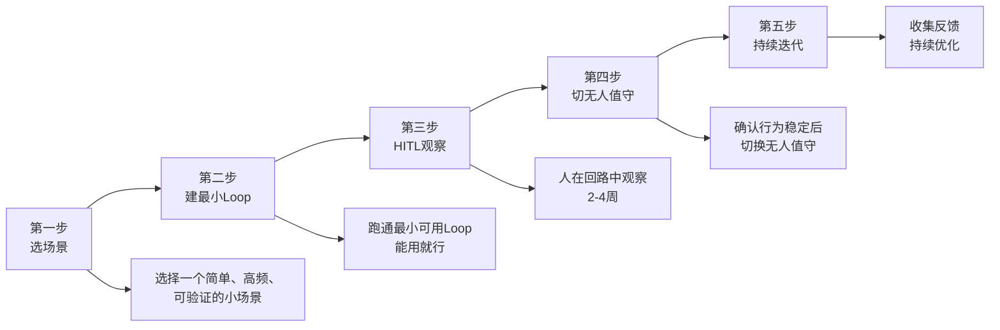

# 最小可行Loop落地五步法 — 从零开始构建第一个Agent循环

> [!abstract] 核心观点
> LOOP Engineering的落地不是"从零开始搭建一个完美的循环"，而是"从一个最小可行Loop开始，逐步迭代"。先用HITL（人在回路中）模式观察2-4周，确认Agent行为稳定后切换到无人值守 [$TRAE_REF](https://cloud.tencent.com/developer/article/2711282)。

---

## 一、核心原则

### 1.1 为什么需要"最小可行"？

| 常见错误 | 后果 | 正确做法 |
|---------|------|---------|
| 一开始就想设计完美循环 | 永远在"设计阶段"，无法落地 | 先跑通一个最小可用Loop |
| 选择太复杂的场景 | 失败率高，打击信心 | 选择简单、高频的小场景 |
| 直接上无人值守 | 出问题没人发现 | 先HITL模式观察2-4周 |
| 没有验证机制 | 循环跑偏了不知道 | 确保每一步可验证 |

### 1.2 五步法全景



---

## 二、五步详解

### 第一步：选择场景

**核心选择标准**：简单、高频、可验证

| 条件 | 说明 | 反面教材 |
|------|------|---------|
| **简单** | 任务路径清晰，不需要复杂推理 | "重构整个项目架构" |
| **高频** | 每周至少触发几次，便于快速迭代 | "每年一次的年度报告" |
| **可验证** | 有明确的成功/失败判断标准 | "写一篇有创意的文案" |

**最佳入门场景推荐**：
```
1. CI失败自动修复 ← 最推荐
   - 简单：问题明确（测试失败/lint报错）
   - 高频：每次提交都可能触发
   - 可验证：测试通过/不通过

2. 依赖版本更新PR
   - 简单：升级版本→跑测试→修兼容
   - 高频：每周都有依赖更新
   - 可验证：测试通过

3. 代码格式化/lint修复
   - 简单：自动修复格式问题
   - 高频：每次提交后
   - 可验证：lint通过/不通过
```

**场景评估表**：
```
场景名称：________________
├── 简单度：⭐⭐⭐⭐⭐（1-5）
├── 高频度：⭐⭐⭐⭐⭐（1-5）
├── 可验证性：⭐⭐⭐⭐⭐（1-5）
├── 风险评估：🟢低 / 🟡中 / 🔴高
└── 综合评分：____/15
```

---

### 第二步：建最小Loop

**目标**：用最小的成本跑通一个可用的循环，不需要考虑"完美"。

**最小实现清单**：
```
[ ] 1. 定义验收标准（1条即可）
    └── 示例："测试全部通过"

[ ] 2. 选择循环模式（最简单的就行）
    └── 推荐：ReAct Loop（最简单）或Reflection Loop（质量更好）

[ ] 3. 写一个简单的执行脚本
    └── 示例：shell脚本或Python脚本，可以不用框架

[ ] 4. 配置基本的验证机制
    └── 示例：跑一次测试检查是否通过

[ ] 5. 设置终止条件
    └── 至少配置：最大迭代次数 + 目标达成

[ ] 6. 记录日志
    └── 至少记录：每次迭代的结果和Token消耗
```

**最小实现示例（Python伪代码）**：
```python
def minimal_loop(task, max_iterations=5):
    """最小可行Loop实现"""
    for i in range(max_iterations):
        # 1. 执行
        result = agent.execute(task)
        
        # 2. 验证
        verification = verify(result)
        
        # 3. 记录
        log(i, result, verification)
        
        # 4. 判断
        if verification.passed:
            return result
        
        # 5. 更新任务（基于反馈）
        task = f"{task}\n\n上一轮结果未通过。反馈：{verification.feedback}"
    
    return None  # 超过最大迭代次数
```

---

### 第三步：HITL观察

**目标**：人在回路中观察2-4周，确认Agent行为稳定。

**HITL模式配置**：
```
Agent行为：
  ✅ 自动执行任务
  ✅ 自动验证结果
  ❌ 不自动提交/合并
  ✅ 生成PR/报告供人工审核

人做什么：
  ✅ 审核每次Agent的输出
  ✅ 标记正确/错误
  ✅ 提供反馈（为什么错了？）
  ✅ 记录模式
```

**HITL观察记录表**：
```
日期：2026-XX-XX
任务ID：TASK-001

Agent行为：
- 执行结果：成功/失败
- 迭代次数：3轮
- 耗时：2分30秒
- Token消耗：5,234

人工审核：
- 输出质量：✅好 / ⚠️一般 / ❌差
- 问题描述：________________
- 改进建议：________________

是否需要调整：
- 循环模式：是/否
- 验证标准：是/否
- 安全护栏：是/否
```

---

### 第四步：切换无人值守

**前提条件**：确认Agent行为稳定后才能切换。

**切换检查清单**：
```
[ ] HITL观察至少2周
[ ] 修复成功率 > 80%
[ ] 无严重错误（如破坏现有功能）
[ ] 所有安全护栏配置完毕
[ ] 终止条件配置完毕
[ ] 监控告警配置完毕
[ ] 人工介入通道畅通
[ ] 有回滚方案
```

**切换策略**：
```
阶段1：HITL（2-4周）
  → 人工审核每次输出
  → 收集质量数据
  → 优化循环设计

阶段2：监督式自动（2-4周）
  → Agent自动执行和验证
  → 但每次输出都通知人工检查
  → 人工可以不检查，但必须能随时介入

阶段3：无人值守（持续）
  → Agent自动执行、验证、提交
  → 只在异常时通知人工
  → 定期review Agent的表现
```

---

### 第五步：持续迭代

**目标**：根据HITL观察数据，持续优化循环。

**迭代方向**：
```
1. 扩展场景
   ├── 从简单场景扩展到中等复杂度场景
   └── 逐步增加Agent的自主权

2. 优化循环模式
   ├── 从ReAct→Reflection→Ralph
   └── 根据场景复杂度升级

3. 丰富验证机制
   ├── 从单层验证→多层验证
   └── 增加更多自动验证手段

4. 完善安全护栏
   ├── 从基本配置→完善配置
   └── 根据实际遇到的问题补充Hook
```

**每次迭代的检查要点**：
```
每次迭代后问自己：
1. 这个循环解决了核心问题吗？
2. 有没有更简单的方式？
3. 成本是否合理？
4. 安全风险是否可控？
5. 下一步该优化什么？
```

---

## 三、落地检查清单（完整版）

```
第一阶段：场景选择
[ ] 选择一个简单、高频、可验证的场景
[ ] 完成场景评估表，评分>10/15
[ ] 确认风险可控

第二阶段：最小Loop构建
[ ] 定义1条验收标准
[ ] 选择最简单的循环模式
[ ] 写一个最小实现脚本
[ ] 配基本的验证机制
[ ] 设置终止条件
[ ] 记录日志

第三阶段：HITL观察
[ ] 观察2-4周
[ ] 记录每次Agent的行为
[ ] 修复成功率>80%
[ ] 无严重错误

第四阶段：切换无人值守
[ ] 通过切换检查清单
[ ] 分阶段切换（HITL→监督→无人值守）
[ ] 监控告警到位

第五阶段：持续迭代
[ ] 定期review Agent表现
[ ] 根据数据优化循环
[ ] 逐步扩展场景
```

---

## 四、常见陷阱与应对

| 陷阱 | 表现 | 应对 |
|------|------|------|
| **场景选太大** | 第一个场景就选"重构整个项目" | 从"CI失败修复"这种小场景开始 |
| **HITL时间不够** | 观察1周就切无人值守，结果出问题 | 至少观察2周，关键场景4周 |
| **验证不充分** | Agent"看起来完成了"，但质量不达标 | 至少有一个自动验证机制 |
| **忽略安全** | 没有配置安全护栏，Agent误操作 | 必须配置Before Tool Hook |
| **过早优化** | 还没跑通就想优化循环模式 | 先跑通，再优化 |

---

## 五、一句话总结

> **先从最简单的场景开始，用最小的成本跑通一个可用Loop，HITL观察2-4周，确认稳定后再切无人值守，然后持续迭代。** 

---

## 关联笔记

- [[01-AI技术/LOOP Engineering/06-实战篇/01_CI失败自动修复]] — 最推荐的入门场景
- [[01-AI技术/LOOP Engineering/04-方法篇/01_循环设计八步法]] — 循环设计的完整流程
- [[01-AI技术/LOOP Engineering/04-方法篇/03_安全护栏体系]] — Hook配置指南
- [[01-AI技术/LOOP Engineering/04-方法篇/04_终止条件设计]] — 终止条件配置
- [[01-AI技术/LOOP Engineering/00_MOC_LOOP_Engineering中枢]] — 返回中枢索引