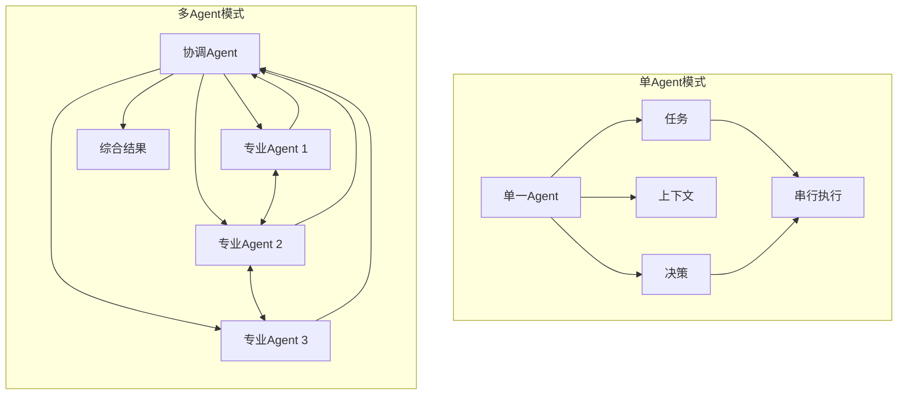
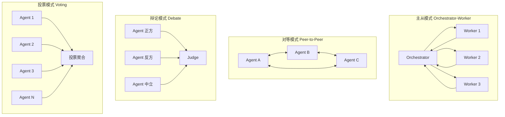
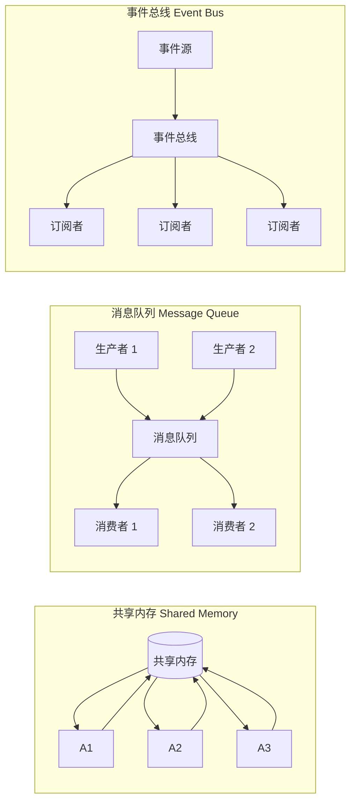
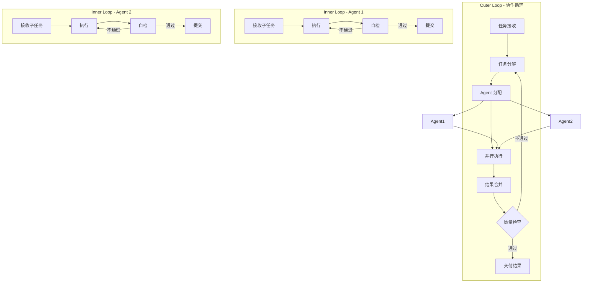
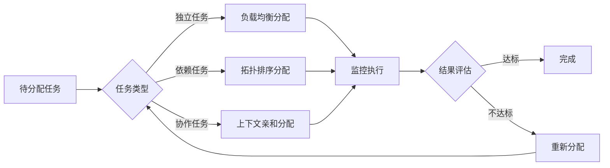
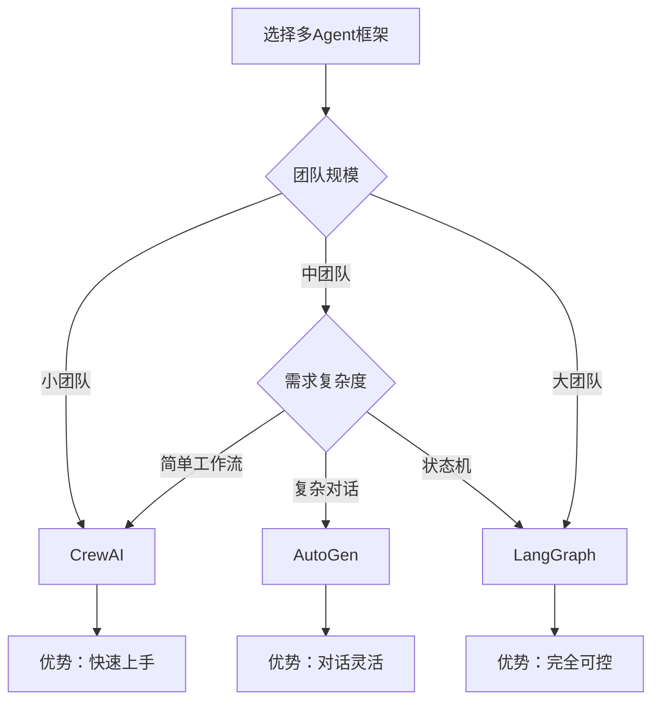
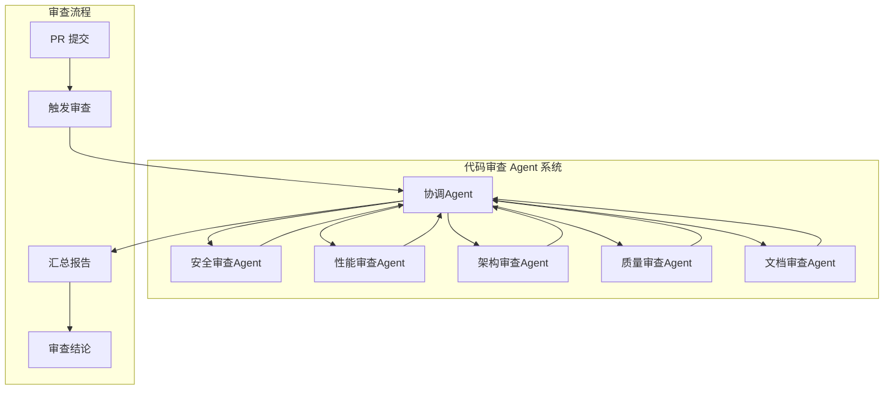

> [!abstract] 核心观点
> 单Agent的能力受限于单一视角和上下文窗口，多Agent协作通过专业化分工和结构化交互，突破了单个LLM的能力边界。LOOP Engineering 将多Agent协作视为一种高阶循环模式——每个Agent拥有自己的Inner Loop，Agent之间通过共享内存和事件总线通信，整体由Outer Loop协调，形成一个有机协作的智能系统。

## 一、从单Agent到多Agent：为什么需要多Agent协作

### 1.1 单Agent的局限性

| 局限维度 | 表现 | 根因 |
|---------|------|------|
| 上下文窗口 | 无法同时处理大量文件或长期对话历史 | LLM 上下文长度限制 |
| 专业能力 | 难以同时精通编码、测试、文档、架构 | 通用模型的专业覆盖不足 |
| 单一视角 | 缺乏批评和纠错机制，可能陷入确认偏误 | 缺乏多角度审视 |
| 串行瓶颈 | 复杂任务只能逐步执行，无法并行 | 单线程执行模型 |
| 状态管理 | 会话状态随 token 消耗而衰减 | 缺乏持久化记忆 |

### 1.2 多Agent的核心价值



多Agent协作带来的核心能力提升：

1. **专业化分工**：每个Agent专注于特定领域（代码审查、测试编写、文档生成、架构分析）
2. **并行执行**：独立任务可同时由不同Agent处理
3. **多样性**：不同Agent的配置（模型、温度、提示词）产生多元输出
4. **自我纠错**：Agent之间相互审查，减少错误累积
5. **可扩展性**：通过添加新Agent扩展系统能力

## 二、多Agent协作模式

### 2.1 四种核心协作模式



### 2.2 模式对比分析

| 维度 | 主从模式 | 对等模式 | 辩论模式 | 投票模式 |
|------|---------|---------|---------|---------|
| 适用场景 | 任务分解、代码生成 | 协同编辑、联合调试 | 代码审查、设计评审 | 质量评估、风险判断 |
| 通信复杂度 | 低（星型拓扑） | 高（网状拓扑） | 中（三方结构） | 低（汇聚结构） |
| 扩展性 | 优秀 | 一般 | 良好 | 优秀 |
| 容错性 | 依赖协调者 | 高 | 中 | 高 |
| 输出一致性 | 高 | 低 | 中 | 高 |
| 典型Token消耗 | 中 | 高 | 高 | 中 |

### 2.3 主从模式（Orchestrator-Worker）详解

这是最常用的多Agent模式，适用于任务分解场景。

```python
class OrchestratorAgent:
    """协调者Agent：负责任务分解和结果合并"""
    
    def orchestrate(self, task):
        # 1. 任务分析
        subtasks = self.analyze_and_decompose(task)
        
        # 2. 任务分配
        assignments = self.assign_to_workers(subtasks)
        
        # 3. 并行执行
        results = []
        for worker, subtask in assignments:
            result = worker.execute(subtask)
            results.append(result)
        
        # 4. 结果合并
        final_result = self.merge_results(results)
        
        # 5. 质量检查
        if self.quality_check(final_result):
            return final_result
        else:
            return self.initiate_revision(results)
```

### 2.4 辩论模式（Debate）详解

辩论模式特别适合需要多角度审视的决策场景：

```yaml
debate_protocol:
  participants:
    - role: 正方
      stance: 支持变更/方案A
      configuration:
        model: gpt-4o
        temperature: 0.7
    
    - role: 反方
      stance: 质疑变更/方案B
      configuration:
        model: gpt-4o
        temperature: 0.7
    
    - role: 中立评审
      stance: 客观分析双方论点
      configuration:
        model: gpt-4o
        temperature: 0.3
  
  rounds: 3
  format:
    - 正方陈述观点
    - 反方质疑
    - 正方回应
    - 中立评审总结
  
  output: 综合评估报告
```

## 三、Agent间通信机制

### 3.1 三种通信模式



### 3.2 通信机制对比

| 机制 | 原理 | 优点 | 缺点 | 适用场景 |
|------|------|------|------|---------|
| 共享内存 | 所有Agent读写同一存储区域 | 实现简单、数据一致 | 并发冲突、扩展性差 | 小型协作、状态共享 |
| 消息队列 | 基于队列的异步通信 | 解耦、可靠、可回溯 | 延迟、有序性保障 | 工作流、任务分发 |
| 事件总线 | 基于发布-订阅的事件驱动 | 松耦合、实时、灵活 | 调试困难、事件风暴 | 实时协作、监控 |

### 3.3 共享内存实现示例

```typescript
// 共享内存接口定义
interface SharedMemory {
  // 任务状态
  tasks: Map<string, TaskState>;
  
  // 共享上下文
  context: {
    projectRoot: string;
    branchName: string;
    currentPhase: string;
    globalConstraints: string[];
  };
  
  // Agent 通信区
  messages: Message[];
  
  // 结果汇总
  artifacts: Map<string, Artifact>;
}

// 操作接口
interface SharedMemoryOps {
  read(path: string): Promise<any>;
  write(path: string, value: any): Promise<void>;
  lock(resource: string): Promise<Release>;
  watch(pattern: string, callback: ChangeCallback): Promise<() => void>;
}
```

## 四、多Agent的Loop设计

### 4.1 双层循环架构

每个Agent拥有自己的Inner Loop，整体的协作由Outer Loop协调：



### 4.2 循环深度管理

```yaml
loop_depth_management:
  outer_loop:
    max_iterations: 5
    convergence_criteria:
      - 所有子任务完成率达到 100%
      - 质量评分 >= 90/100
      - 无未解决的冲突
    
  inner_loop:
    per_agent:
      max_iterations: 3
      stop_conditions:
        - 子任务完成
        - 达到最大迭代次数
        - 收到终止信号
```

## 五、协调与冲突解决

### 5.1 任务分配策略



### 5.2 结果合并策略

| 合并策略 | 适用场景 | 方法 | 示例 |
|---------|---------|------|------|
| 优先级合并 | 有明确优先级 | 按优先级顺序合并 | 安全修复 > 功能开发 |
| 投票合并 | 多方案选择 | 加权投票 + 理由分析 | 架构方案决策 |
| 编辑合并 | 文档/代码协作 | 三路合并 + 冲突标记 | 联合代码生成 |
| 拼接合并 | 独立模块 | 按接口定义组合 | 微服务生成 |

### 5.3 分歧仲裁机制

```python
class ConflictResolver:
    """冲突解决仲裁器"""
    
    def resolve(self, conflicts):
        resolved = []
        for conflict in conflicts:
            if conflict.type == "code_conflict":
                resolution = self.resolve_code_conflict(conflict)
            elif conflict.type == "design_conflict":
                resolution = self.resolve_design_conflict(conflict)
            elif conflict.type == "priority_conflict":
                resolution = self.resolve_priority_conflict(conflict)
            resolved.append(resolution)
        return resolved
    
    def resolve_code_conflict(self, conflict):
        # 代码冲突：运行测试确定正确版本
        test_results = self.run_tests(conflict.versions)
        return test_results.winner
    
    def resolve_design_conflict(self, conflict):
        # 设计冲突：启动辩论模式
        debate = self.start_debate(conflict.sides)
        return debate.verdict
```

## 六、CrewAI vs AutoGen vs LangGraph 方案对比

### 6.1 框架比较

| 维度 | CrewAI | AutoGen | LangGraph |
|------|--------|---------|-----------|
| 架构模式 | 角色-任务-流程 | 对话-代理 | 图-状态机 |
| 定义方式 | YAML/Python DSL | Python 装饰器 | Python 图定义 |
| 通信机制 | 任务队列 + 上下文传递 | 对话轮次 | 状态边 + 消息传递 |
| 循环控制 | 内置任务循环 | 代理间对话循环 | 图循环边 |
| 状态管理 | 上下文对象 | 对话历史 | StateGraph |
| 多模型支持 | 有限 | 优秀 | 优秀 |
| 学习曲线 | 低 | 中 | 高 |
| 灵活性 | 中 | 高 | 高 |
| 调试工具 | 内置日志 | 调试回调 | LangSmith 集成 |

### 6.2 选型建议



## 七、实践案例

### 7.1 多Agent协作的代码审查系统



**系统工作流程：**

1. 协调Agent接收PR，分解为五个审查维度
2. 各专业Agent并行执行审查：
   - 安全Agent：检查SQL注入、XSS、认证漏洞
   - 性能Agent：分析时间复杂度、N+1查询、缓存策略
   - 架构Agent：评估设计模式、模块耦合度、接口设计
   - 质量Agent：检查代码规范、测试覆盖、代码重复
   - 文档Agent：检查API文档、注释质量、更新记录
3. 协调Agent汇总所有审查结果，生成综合报告
4. 如需人工介入，标记争议点供人类评审者决策

### 7.2 多Agent协作的文档撰写系统

| Agent角色 | 职责 | 输入 | 输出 |
|-----------|------|------|------|
| 架构师Agent | 设计文档结构、确定大纲 | 需求描述 | 文档骨架 |
| 写手Agent | 填充各章节内容 | 文档骨架 + 素材 | 初稿内容 |
| 审校Agent | 检查准确性、一致性 | 初稿 | 修订建议 |
| 格式化Agent | 格式化、排版、图表 | 修订稿 | 最终文档 |
| 翻译Agent | 多语言版本 | 最终文档 | 翻译稿 |

**协作流程：**

```yaml
document_workflow:
  phase_1:
    agent: 架构师
    task: 设计文档结构
    output: 文档大纲
    
  phase_2:
    agent: 写手
    task: 并行撰写各章节
    parallel: true
    output: 初稿
    
  phase_3:
    agent: 审校
    task: 内容审查
    rounds: 3
    output: 修改建议
    
  phase_4:
    agent: 格式化
    task: 排版和图表生成
    output: 终稿
```

---

> 多Agent协作不是简单的"人多力量大"，而是通过精心设计的角色分工、通信机制和协调策略，让每个Agent的专业能力得到最大发挥。LOOP Engineering 的多Agent循环设计，本质上是将软件工程的团队协作模式映射到AI系统中，让多个智能体像一支高效的工程团队一样协同工作。

---

**相关文档：**
- [[01-AI技术/LOOP Engineering/00_MOC_LOOP_Engineering中枢]]
- [[02_循环结构]]
- [[01-AI技术/LOOP Engineering/07-进阶篇/02_自适应Loop]]
- [[01-AI技术/LOOP Engineering/07-进阶篇/03_跨会话Loop]]
- [[01-AI技术/LOOP Engineering/07-进阶篇/04_终局形态]]