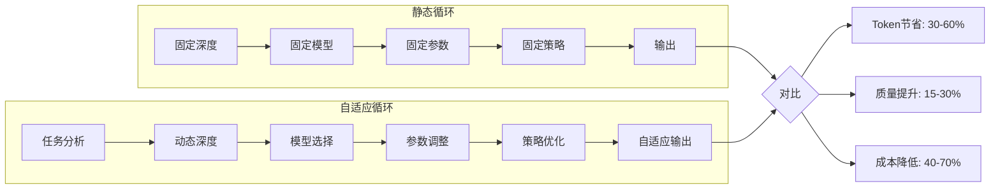
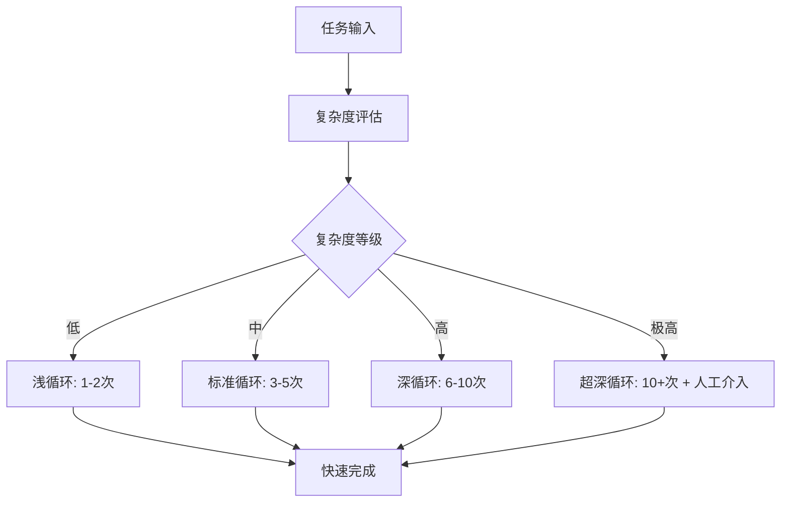
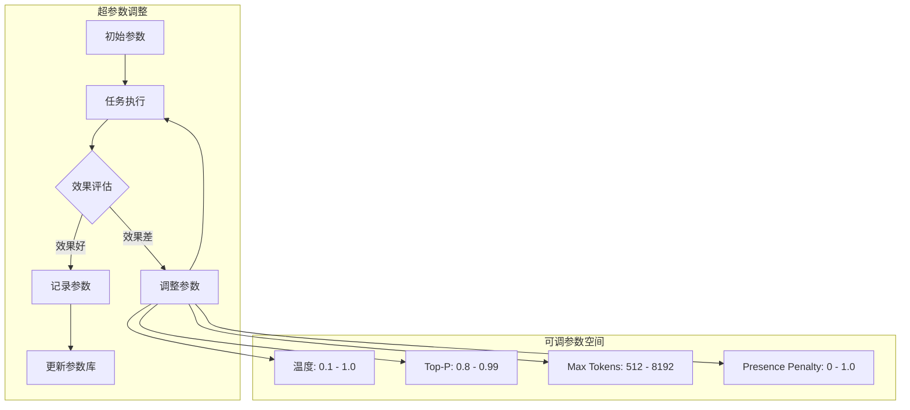
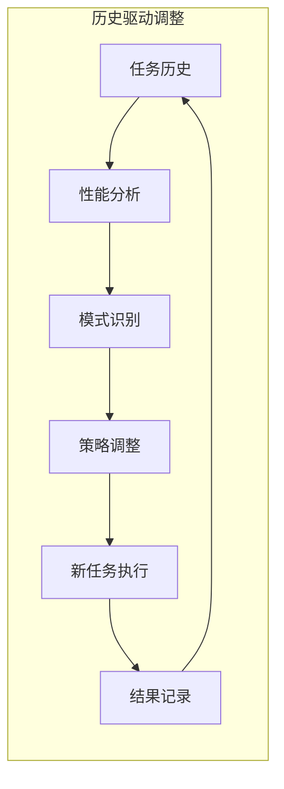
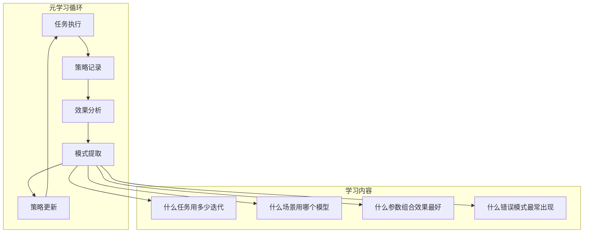
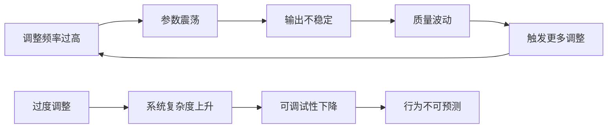
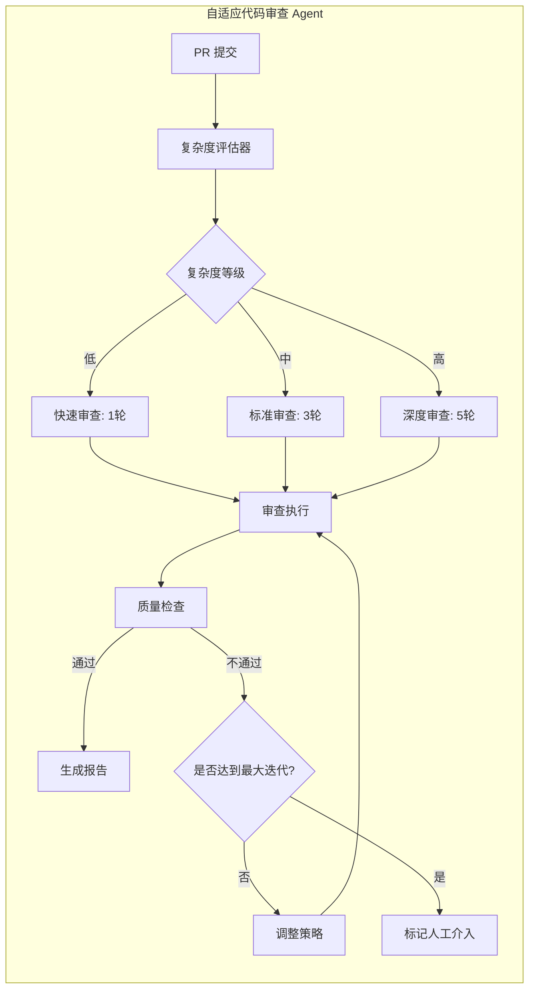

> [!abstract] 核心观点
> 静态的Loop配置无法适应动态变化的任务和环境。自适应Loop让Agent能够根据任务复杂度、执行历史和实时反馈，动态调整循环深度、模型选择和超参数配置。这不是锦上添花的功能，而是LOOP Engineering从"自动化"走向"智能化"的关键一跃——让Agent学会管理自己的执行过程。

## 一、自适应的必要性

### 1.1 静态Loop的局限性

传统的固定循环结构面临以下问题：

| 场景 | 静态配置问题 | 后果 |
|------|-------------|------|
| 简单任务（如修改变量名） | 仍执行完整的5步循环 | Token浪费、响应延迟 |
| 复杂任务（如重构模块） | 固定迭代次数不够 | 任务未完成、质量不达标 |
| 模型选择 | 始终使用最强模型 | 成本高、对小任务不经济 |
| 温度参数 | 固定temperature=0.3 | 创造性任务输出单一 |
| 循环深度 | 固定max_iterations=3 | 无法适应任务复杂度变化 |

### 1.2 自适应的收益



## 二、自适应维度

### 2.1 循环深度自适应

循环深度自适应的核心是根据任务复杂度动态决定循环次数：



**复杂度评估指标：**

```python
def assess_task_complexity(task):
    """评估任务复杂度的多维度评分"""
    scores = {
        "file_count": min(count_files(task) / 10, 1.0) * 0.15,
        "dependency_graph": analyze_dependency_depth(task) * 0.20,
        "api_changes": detect_api_changes(task) * 0.15,
        "verification_scope": estimate_verification_scope(task) * 0.15,
        "domain_novelty": assess_novelty(task) * 0.20,
        "ambiguity_level": measure_ambiguity(task) * 0.15,
    }
    
    total_score = sum(scores.values())
    
    if total_score < 0.2:
        return "simple", 2       # 简单，最多2次迭代
    elif total_score < 0.5:
        return "moderate", 4     # 中等，最多4次迭代
    elif total_score < 0.8:
        return "complex", 8      # 复杂，最多8次迭代
    else:
        return "critical", 12    # 关键，最多12次迭代
```

### 2.2 模型选择自适应

根据任务难度和类型自动选择最合适的模型：

```yaml
model_selector:
  strategy: cost_aware_performance
  
  rules:
    - condition: task_type == "code_format" && complexity == "simple"
      model: gpt-4o-mini
      rationale: "格式化任务不需要强推理能力"
    
    - condition: task_type == "refactoring" && complexity == "complex"
      model: gpt-4o
      rationale: "复杂重构需要强推理"
    
    - condition: task_type == "creative_writing"
      model: claude-3.5-sonnet
      temperature: 0.8
      rationale: "创意任务需要高温度"
    
    - condition: task_type == "code_review" && language == "python"
      model: gpt-4o
      rationale: "Python代码审查"
  
  fallback:
    primary_unavailable: gpt-4o-mini
    cost_exceeded: claude-3-haiku
```

### 2.3 超参数自适应



**自适应参数调整算法：**

```python
class AdaptiveHyperparameterTuner:
    def __init__(self):
        self.param_history = []
        self.performance_history = []
    
    def suggest_params(self, task_context):
        """根据任务上下文和历史表现推荐参数"""
        similar_tasks = self.find_similar_tasks(task_context)
        
        if not similar_tasks:
            # 无相似任务，使用默认参数
            return {
                "temperature": 0.3,
                "top_p": 0.95,
                "max_tokens": 4096,
            }
        
        # 从相似任务中取最优参数
        best_params = max(similar_tasks, 
                         key=lambda t: t["performance"])
        return best_params["params"]
    
    def update(self, task_context, params, performance):
        """更新参数-效果数据库"""
        self.param_history.append({
            "context": task_context,
            "params": params,
            "performance": performance,
            "timestamp": now()
        })
```

## 三、自适应实现

### 3.1 基于历史性能的回调调整



**实现示例：**

```typescript
interface PerformanceHistory {
  taskId: string;
  taskType: string;
  complexity: number;
  model: string;
  params: ModelParams;
  iterations: number;
  duration: number;
  tokenCost: number;
  quality: number;
  success: boolean;
}

class HistoryBasedAdjuster {
  private history: PerformanceHistory[] = [];
  
  adjustForTask(task: Task): LoopConfig {
    const similarTasks = this.findSimilar(task);
    if (similarTasks.length < 5) {
      return this.defaultConfig(task);
    }
    
    const avgQuality = average(similarTasks.map(t => t.quality));
    const avgIterations = average(similarTasks.map(t => t.iterations));
    
    return {
      maxIterations: Math.ceil(avgIterations * 1.2),
      model: this.selectModel(similarTasks),
      temperature: avgQuality > 0.8 ? 0.3 : 0.5,
      qualityThreshold: avgQuality * 0.9,
    };
  }
}
```

### 3.2 基于实时反馈的动态调整

```python
class RealTimeAdjuster:
    """实时反馈调整器"""
    
    def __init__(self, initial_config):
        self.config = initial_config
        self.feedback_buffer = []
    
    def on_step_complete(self, step_result):
        """每一步完成后调用"""
        self.feedback_buffer.append(step_result)
        
        if len(self.feedback_buffer) >= 3:
            trend = self.analyze_trend(self.feedback_buffer)
            
            if trend == "declining":
                # 质量下降：增加迭代次数或降低温度
                self.config.max_iterations += 1
                self.config.temperature = max(0.1, self.config.temperature - 0.1)
            elif trend == "stagnant":
                # 停滞不前：提高温度增加多样性
                self.config.temperature = min(0.8, self.config.temperature + 0.1)
            elif trend == "improving":
                # 持续改进：保持当前配置
                pass
            
            self.feedback_buffer = []
    
    def analyze_trend(self, buffer):
        qualities = [r["quality"] for r in buffer]
        if len(qualities) < 2:
            return "stable"
        
        if qualities[-1] < qualities[0] * 0.8:
            return "declining"
        elif abs(qualities[-1] - qualities[0]) / qualities[0] < 0.05:
            return "stagnant"
        else:
            return "improving"
```

### 3.3 基于强化学习的优化

对于高级自适应场景，可以使用强化学习来优化循环策略：

```yaml
rl_optimization:
  state_space:
    - task_complexity: [0.0, 1.0]
    - current_iteration: [0, 20]
    - quality_trend: ["improving", "stable", "declining"]
    - token_usage_ratio: [0.0, 1.0]
    - error_rate: [0.0, 1.0]
  
  action_space:
    - continue_with_current_params
    - increase_temperature
    - decrease_temperature
    - switch_to_cheaper_model
    - switch_to_better_model
    - increase_iterations
    - decrease_iterations
    - early_terminate
  
  reward_function:
    - quality_score: 1.0  # 主要奖励
    - token_efficiency: 0.5  # token 效率奖励
    - time_efficiency: 0.3  # 时间效率奖励
    - penalty_over_iteration: -0.1  # 过度迭代惩罚
```

## 四、元学习：让Agent学会"如何学习"

### 4.1 元学习框架

元学习（Meta-Learning）是自适应Loop的最高级形式，让Agent不仅执行任务，还从执行过程中学习如何改进策略：



### 4.2 元学习策略库

```python
class MetaLearningStrategy:
    """元学习策略管理器"""
    
    def __init__(self):
        self.strategies = {
            "iteration_depth": IterationDepthStrategy(),
            "model_selection": ModelSelectionStrategy(),
            "parameter_tuning": ParameterTuningStrategy(),
            "error_recovery": ErrorRecoveryStrategy(),
        }
        self.performance_db = PerformanceDatabase()
    
    def learn_from_execution(self, task, execution_record):
        """从执行记录中学习"""
        for strategy in self.strategies.values():
            strategy.learn(task, execution_record)
        
        # 提取全局模式
        patterns = self.extract_patterns(execution_record)
        self.performance_db.store(task, execution_record, patterns)
    
    def recommend_strategy(self, new_task):
        """为新任务推荐策略"""
        similar_tasks = self.performance_db.find_similar(new_task)
        if not similar_tasks:
            return self.default_strategy()
        
        # 基于相似任务的历史表现推荐
        best = max(similar_tasks, key=lambda t: t.performance)
        return best.strategy
```

## 五、自适应Loop的风险

### 5.1 过度调整导致不稳定



**缓解策略：**

| 风险 | 缓解措施 | 实现方式 |
|------|---------|---------|
| 参数震荡 | 引入阻尼系数 | 每次调整幅度递减 |
| 频繁调整 | 设置最小观察窗口 | 至少执行N次后再调整 |
| 过拟合历史 | 加入随机探索 | 部分任务使用随机参数 |
| 行为不可预测 | 安全边界约束 | 参数在安全范围内调整 |

### 5.2 陷入局部最优

```yaml
local_optima_prevention:
  strategies:
    - name: 定期探索
      description: 定期使用随机参数组合探索新策略
      frequency: 10% 的任务
      exploration_rate_decay: 0.99
    
    - name: 参数扰动
      description: 在最优参数附近加入小扰动
      perturbation_scale: 0.05
      trigger: 连续5次无改进
    
    - name: 多策略并行
      description: 同时维护多个候选策略
      candidate_count: 3
      selection: upper_confidence_bound
    
    - name: 策略回退
      description: 保留历史有效策略，新策略失败时回退
      fallback_count: 2
```

## 六、实践案例：自适应迭代次数的代码审查Agent

### 6.1 系统设计



### 6.2 自适应策略配置

```yaml
adaptive_code_review:
  complexity_factors:
    - name: file_count
      weight: 0.15
      thresholds: [5, 20, 50]
    
    - name: lines_changed
      weight: 0.20
      thresholds: [50, 200, 1000]
    
    - name: modules_affected
      weight: 0.25
      thresholds: [2, 5, 10]
    
    - name: security_sensitivity
      weight: 0.25
      thresholds: [0, 5, 8]
    
    - name: test_coverage_change
      weight: 0.15
      thresholds: [0.1, 0.3, 0.5]
  
  iteration_strategy:
    simple:
      max_iterations: 1
      models: ["gpt-4o-mini"]
      focus: ["style", "obvious_bugs"]
    
    standard:
      max_iterations: 3
      models: ["gpt-4o-mini", "gpt-4o"]
      focus: ["style", "bugs", "performance", "security"]
    
    deep:
      max_iterations: 5
      models: ["gpt-4o", "claude-3.5-sonnet"]
      focus: ["all"]
      human_escalation_threshold: 2
```

### 6.3 效果评估

```python
# 自适应策略 vs 静态策略的效果对比
evaluation_results = {
    "static_loop": {
        "avg_token_cost": 15000,
        "avg_duration": 45,
        "bug_detection_rate": 0.82,
        "false_positive_rate": 0.15,
        "human_escalation_rate": 0.25,
    },
    "adaptive_loop": {
        "avg_token_cost": 8500,      # 节省 43%
        "avg_duration": 28,           # 节省 38%
        "bug_detection_rate": 0.88,   # 提升 7%
        "false_positive_rate": 0.10,  # 降低 33%
        "human_escalation_rate": 0.18, # 降低 28%
    },
}
```

---

> 自适应Loop不是简单的"if-else"条件判断，而是让Agent具备元认知能力——能够观察自己的执行过程、评估效果、调整策略。这是LOOP Engineering从"自动化"走向"智能化"的质变。当Agent能够管理自己的循环时，它就不再是一个被动的工具，而是一个主动的协作伙伴。

---

**相关文档：**
- [[01-AI技术/LOOP Engineering/00_MOC_LOOP_Engineering中枢]]
- [[02_循环结构]]
- [[01-AI技术/LOOP Engineering/07-进阶篇/01_多Agent协作循环]]
- [[01-AI技术/LOOP Engineering/07-进阶篇/03_跨会话Loop]]
- [[01-AI技术/LOOP Engineering/07-进阶篇/04_终局形态]]