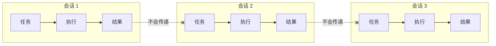
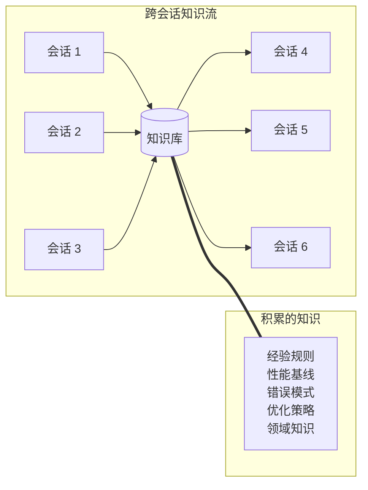
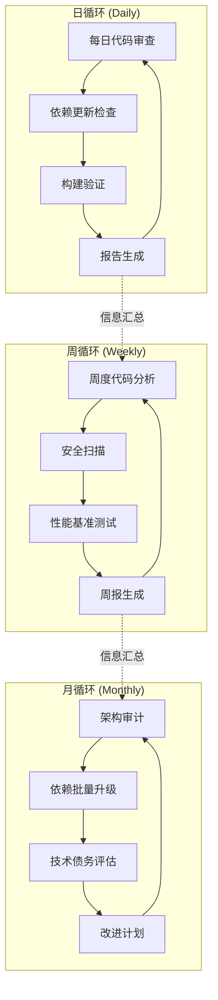
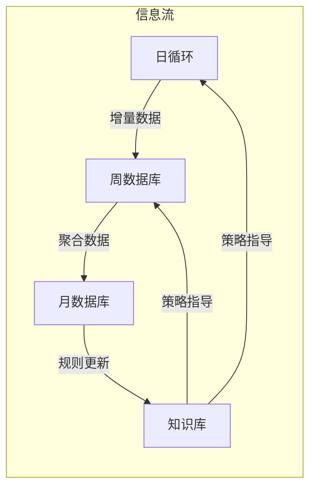
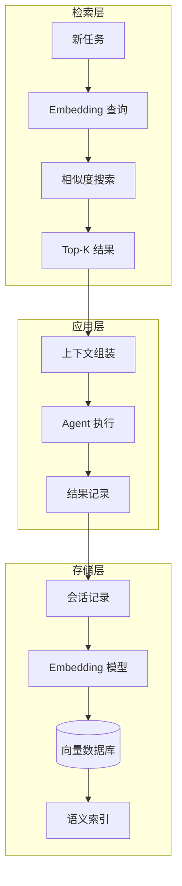
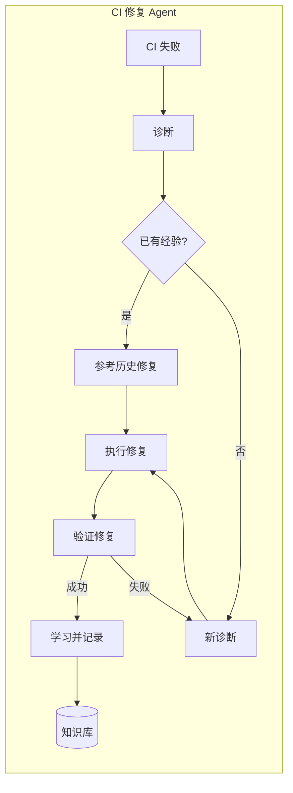
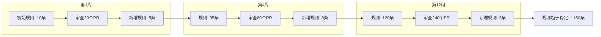

> [!abstract] 核心观点
> 单次会话的Loop受限于上下文窗口和会话生命周期，无法实现长期知识积累和持续改进。跨会话Loop通过持久化状态管理、语义化知识检索和增量式学习机制，让Agent的每次执行都成为下一次执行的起点。这是LOOP Engineering从"单次智能"迈入"持续智能"的核心基础设施。

## 一、为什么需要跨会话Loop

### 1.1 单次会话的局限性

每一次Agent会话都是独立的，如同一个没有记忆的工匠，每次都要重新学习：



| 局限 | 具体表现 | 影响 |
|------|---------|------|
| 上下文窗口限制 | 长对话历史超出 token 限制 | 早期信息丢失 |
| 无状态 | 每次会话从零开始 | 重复劳动、无法积累 |
| 学习断裂 | 经验无法跨会话迁移 | 同样错误反复犯 |
| 知识孤岛 | 每个会话独立 | 无法形成知识体系 |
| 持续改进缺失 | 无法基于历史优化策略 | 效率无法提升 |

### 1.2 跨会话的愿景



## 二、跨会话状态管理

### 2.1 三层状态模型

```yaml
state_management:
  layers:
    - layer: 会话状态
      scope: 当前会话
      lifetime: 会话结束即销毁
      content: [对话历史, 临时变量, 上下文缓存]
      storage: 内存
      size: token 限制以内
    
    - layer: 项目状态
      scope: 单个项目
      lifetime: 项目生命周期
      content: [配置, 基线, 规则, 依赖快照]
      storage: 本地文件 + 向量数据库
      size: 中等
    
    - layer: 全局状态
      scope: 所有项目
      lifetime: 永久
      content: [通用规则, 最佳实践, 经验总结]
      storage: 远程知识库
      size: 大
```

### 2.2 状态持久化策略

```python
class SessionStateManager:
    """跨会话状态管理器"""
    
    def __init__(self, project_id):
        self.project_id = project_id
        self.vector_store = VectorStore()
        self.file_store = FileStore(f".loop/state/{project_id}")
    
    def save_checkpoint(self, state):
        """保存会话检查点"""
        checkpoint = {
            "timestamp": now(),
            "session_id": state.session_id,
            "context": self.compress_context(state.context),
            "artifacts": state.artifacts,
            "metrics": state.metrics,
            "decisions": state.key_decisions,
        }
        self.file_store.save(f"checkpoint_{state.session_id}.json", checkpoint)
        
        # 更新向量索引
        self.vector_store.index({
            "id": state.session_id,
            "content": self.summarize_session(state),
            "metadata": {
                "project": self.project_id,
                "timestamp": now(),
                "task_types": state.task_types,
                "success": state.success,
            }
        })
    
    def restore_context(self, task):
        """为任务恢复相关上下文"""
        similar_sessions = self.vector_store.search(
            query=task.description,
            limit=5,
            threshold=0.7
        )
        
        context = {
            "relevant_history": [],
            "known_patterns": [],
            "common_pitfalls": [],
            "performance_baselines": {},
        }
        
        for session in similar_sessions:
            context["relevant_history"].append(session.summary)
            context["common_pitfalls"].extend(session.failures)
        
        return context
```

### 2.3 上下文压缩技术

会话状态需要压缩才能持久化存储，避免信息爆炸：

| 压缩技术 | 原理 | 压缩比 | 信息损失 |
|---------|------|--------|---------|
| 摘要提取 | LLM 生成会话摘要 | 100:1 | 中 |
| 关键决策提取 | 只保留决策点和理由 | 500:1 | 中 |
| 向量嵌入 | 语义向量化存储 | 1000:1 | 低 |
| 规则提取 | 从经验中提取规则 | 10000:1 | 高 |
| 增量记录 | 只记录变化部分 | 10:1 | 低 |

## 三、Outer Loop的时间维度

### 3.1 时间分层的循环设计



### 3.2 各循环的职责

```yaml
time_based_loops:
  daily:
    schedule: "0 2 * * 1-5"  # 工作日凌晨2点
    duration: 15min
    tasks:
      - 增量代码审查
      - 依赖安全扫描
      - 构建健康检查
    state_transfer: 汇总到周度报告
    
  weekly:
    schedule: "0 3 * * 1"  # 每周一凌晨3点
    duration: 1h
    tasks:
      - 全量代码分析
      - 性能回归测试
      - 安全漏洞扫描
      - 知识库更新
    state_transfer: 汇总到月度报告
    
  monthly:
    schedule: "0 4 1 * *"  # 每月1日凌晨4点
    duration: 4h
    tasks:
      - 架构健康检查
      - 依赖批量升级
      - 技术债务评估
      - 策略优化回顾
    state_transfer: 更新全局知识库
```

### 3.3 信息传递机制



## 四、跨会话知识传递

### 4.1 知识传递的四种形式

```yaml
knowledge_transfer:
  forms:
    - type: 经验总结
      source: 会话执行记录
      target: 规则库
      format: 条件-行动规则
      example: |
        if 依赖升级失败 due to 测试不兼容:
          建议: 先升级间接依赖，再升级直接依赖
    
    - type: 规则积累
      source: 人工反馈 + 自动归纳
      target: 项目规则库
      format: YAML 规则文件
      example: |
        coding_rules:
          - pattern: "使用any类型"
            action: "告警"
            severity: "warning"
    
    - type: 性能基线
      source: 历史执行数据
      target: 基线数据库
      format: 时间序列 + 统计指标
      example: |
        baseline:
          build_time: {avg: 120s, p95: 180s}
          test_coverage: {avg: 0.85, min: 0.80}
    
    - type: 错误模式
      source: 失败案例
      target: 反模式库
      format: 错误模式 + 解决方案
      example: |
        error_pattern:
          symptom: "测试超时"
          cause: "mock 未正确配置"
          fix: "使用 setup/teardown 模式"
```

### 4.2 知识库架构

```python
class KnowledgeBase:
    """跨会话知识库"""
    
    def __init__(self, store_path):
        self.vector_store = VectorStore(store_path)
        self.rule_store = RuleStore(store_path)
        self.baseline_store = BaselineStore(store_path)
    
    def learn(self, session_record):
        """从会话记录中学习"""
        # 1. 提取经验
        experiences = self.extract_experiences(session_record)
        
        # 2. 归纳规则
        new_rules = self.induce_rules(experiences)
        
        # 3. 更新基线
        self.baseline_store.update(session_record.metrics)
        
        # 4. 索引知识
        for exp in experiences:
            self.vector_store.index(exp)
        
        # 5. 合并规则
        for rule in new_rules:
            self.rule_store.merge(rule)
    
    def retrieve(self, query):
        """检索相关知识"""
        return {
            "similar_experiences": self.vector_store.search(query, k=5),
            "applicable_rules": self.rule_store.match(query),
            "relevant_baselines": self.baseline_store.query(query),
        }
```

## 五、技术实现

### 5.1 向量数据库存储历史



### 5.2 语义检索恢复上下文

```typescript
interface SemanticRetrieval {
  // 向量存储配置
  config: {
    embeddingModel: "text-embedding-3-small";
    vectorDB: "chromadb" | "pinecone" | "qdrant";
    dimension: 1536;
    indexType: "cosine" | "dot_product";
  };
  
  // 检索策略
  retrievalStrategy: {
    // 混合检索：语义 + 关键词
    hybrid: {
      semanticWeight: 0.7;
      keywordWeight: 0.3;
    };
    
    // 时间衰减
    timeDecay: {
      enabled: true;
      decayRate: 0.1; // 每天衰减10%
      maxAge: 90;     // 最多保留90天
    };
    
    // 多样性保证
    diversity: {
      enabled: true;
      mmrThreshold: 0.3; // 最大边际相关性
    };
  };
}

class ContextRestorer {
  async restoreContext(task: Task): Promise<Context> {
    // 1. 语义检索
    const semanticResults = await this.vectorStore.search({
      query: task.description,
      limit: 10,
      withMetadata: true,
    });
    
    // 2. 时间衰减重排序
    const decayed = this.applyTimeDecay(semanticResults);
    
    // 3. 多样性重排序
    const diverse = this.diversify(decayed);
    
    // 4. 组装上下文
    return {
      relevantHistory: diverse.slice(0, 5).map(r => r.summary),
      applicableRules: diverse.flatMap(r => r.rules),
      metrics: this.aggregateMetrics(diverse),
    };
  }
}
```

### 5.3 增量更新机制

```yaml
incremental_update:
  strategy: delta_based
  
  update_triggers:
    - event: session_completed
      action: 增量更新知识库
    
    - event: rule_violation_detected
      action: 更新规则权重
    
    - event: performance_degradation
      action: 更新性能基线
    
    - event: human_feedback_received
      action: 优先更新
  
  deduplication:
    method: semantic_similarity
    threshold: 0.95
    action: merge_with_existing
    
  compaction:
    schedule: monthly
    method: consolidation
    rules:
      - 合并相似度 > 0.8 的条目
      - 删除时间超过90天的低价值条目
      - 重新计算统计基线
```

## 六、实践案例

### 6.1 CI修复Agent的跨会话学习

**场景：** CI 流水线经常因各种原因失败，每次修复都是重复劳动。



**跨会话学习效果：**

| 指标 | 初始状态 | 1个月后 | 3个月后 |
|------|---------|---------|---------|
| 自动修复率 | 15% | 45% | 72% |
| 平均修复时间 | 25min | 12min | 5min |
| 知识库规则数 | 0 | 47 | 156 |
| 常见错误识别率 | 10% | 55% | 85% |

**知识库示例：**

```yaml
# 从 CI 修复中积累的经验
ci_fix_experiences:
  - error_pattern: "npm install 失败 - EACCES"
    diagnosis: "权限问题，cache 目录被锁定"
    fix: "删除 node_modules/.cache 并重试"
    success_rate: 0.95
    occurrences: 23
    
  - error_pattern: "测试超时 - 数据库连接"
    diagnosis: "测试数据库连接池耗尽"
    fix: "在每个测试间重置连接池"
    success_rate: 0.88
    occurrences: 17
    
  - error_pattern: "TypeScript 类型错误 - 第三方包"
    diagnosis: "依赖版本升级导致类型不兼容"
    fix: "安装 @types/package@version 匹配"
    success_rate: 0.92
    occurrences: 31
```

### 6.2 每日代码审查Agent的规则积累

**场景：** 代码审查Agent每天审查新PR，从每次审查中学习并改进审查规则。

```python
class DailyCodeReviewAgent:
    """每日代码审查 Agent，支持跨会话学习"""
    
    def __init__(self):
        self.knowledge_base = KnowledgeBase(".loop/review-knowledge")
        self.rule_engine = ReviewRuleEngine()
    
    def review_pr(self, pr):
        # 1. 检索历史相关审查
        context = self.knowledge_base.retrieve(pr.description)
        
        # 2. 加载已积累的规则
        rules = self.rule_engine.get_rules_for(pr.language)
        
        # 3. 执行审查（结合历史经验）
        findings = self.execute_review(pr, context, rules)
        
        # 4. 学习新发现
        for finding in findings:
            if finding.is_new_pattern:
                self.rule_engine.add_rule(finding.to_rule())
        
        # 5. 更新知识库
        self.knowledge_base.learn(pr.to_session_record())
        
        return findings
    
    def execute_review(self, pr, context, rules):
        findings = []
        
        # 使用历史经验指导审查重点
        if context.common_pitfalls:
            findings.extend(
                self.check_pitfalls(pr, context.common_pitfalls)
            )
        
        # 应用积累的规则
        for rule in rules:
            if rule.matches(pr):
                findings.append(rule.apply(pr))
        
        return findings
```

**规则积累过程：**



---

> 跨会话Loop是LOOP Engineering中最具"成长性"的设计。它让AI Agent不再是每次对话都从零开始的"新手"，而是能够持续积累经验、不断进化的"资深工程师"。当Agent的每次执行都在为下一次执行积累智慧时，我们就真正拥有了一个持续学习的工程系统。

---

**相关文档：**
- [[01-AI技术/LOOP Engineering/00_MOC_LOOP_Engineering中枢]]
- [[02_循环结构]]
- [[01-AI技术/LOOP Engineering/07-进阶篇/01_多Agent协作循环]]
- [[01-AI技术/LOOP Engineering/07-进阶篇/02_自适应Loop]]
- [[01-AI技术/LOOP Engineering/07-进阶篇/04_终局形态]]