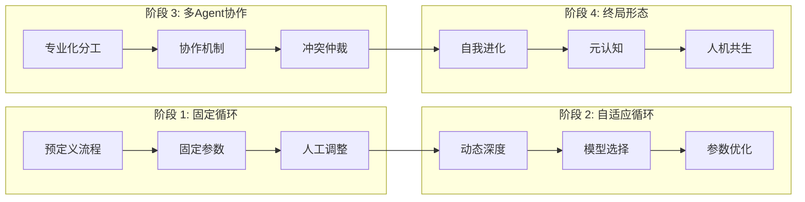
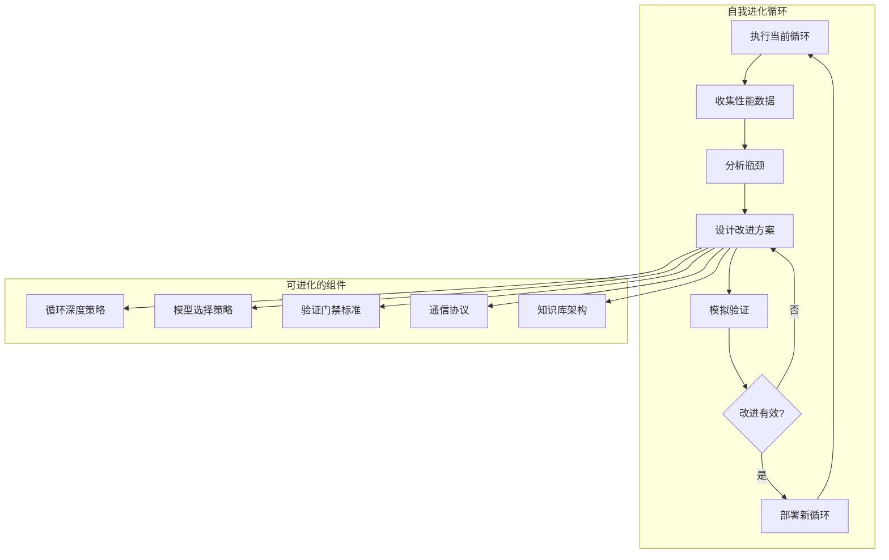
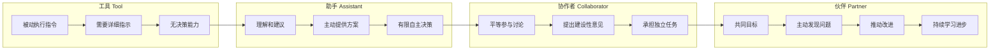
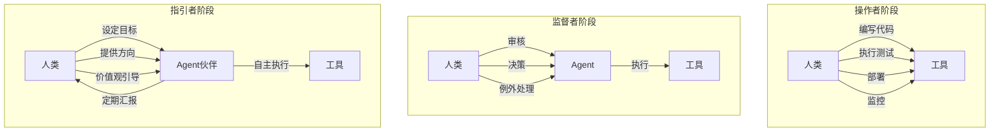
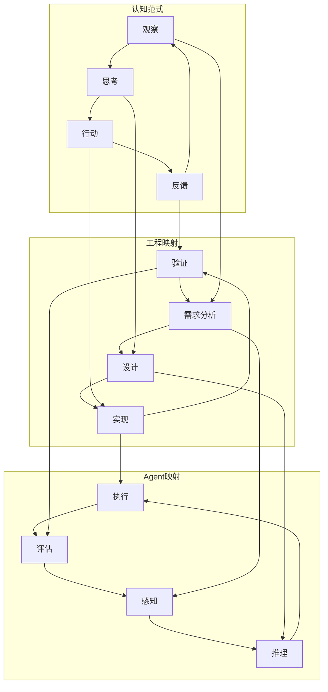
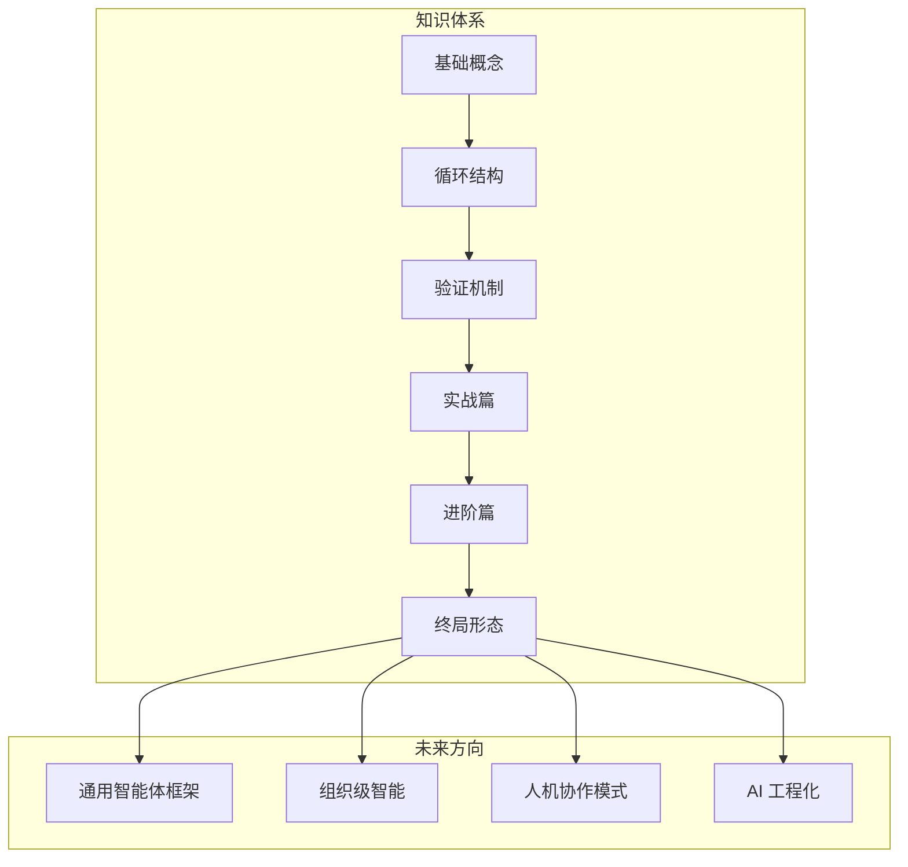

> [!abstract] 核心观点
> LOOP Engineering 的终局形态不是一个固定的技术方案，而是一个持续进化的认知范式。当多层次自适应循环、自我进化机制和人类-AI协作模式达到成熟时，Engineering Loop 将不再是工程师手中的工具，而是一个具备元认知能力的工程伙伴。循环不是技术选择，而是智能系统运作的基本法则。

## 一、LOOP Engineering 的演进方向

### 1.1 从当前模式到未来形态



| 维度 | 当前 | 演进中 | 终局形态 |
|------|------|--------|---------|
| 循环设计 | 人工设计固定循环 | 参数自适应 | 循环自我进化 |
| 任务执行 | 单Agent | 多Agent协作 | Agent生态 |
| 知识管理 | 无状态 | 跨会话积累 | 组织智能 |
| 人类角色 | 操作者 | 监督者 | 指引者 |
| 决策方式 | 规则驱动 | 数据驱动 | 元认知驱动 |
| 技术栈 | 单一模型 | 多模型路由 | 动态模型编排 |

### 1.2 演进驱动力

```yaml
evolution_drivers:
  technology:
    - 模型能力持续提升: 更强的推理、更长的上下文、更低的成本
    - Agent框架成熟: 更稳定的多Agent编排、更丰富的工具生态
    - 基础设施完善: 向量数据库、消息队列、事件总线成为标配
  
  demand:
    - 系统复杂度增长: 微服务数量、依赖数量、部署频率持续上升
    - 质量要求提高: 零故障部署、安全合规、可审计性
    - 效率压力: 更短的交付周期、更高的自动化率
  
  philosophy:
    - 从"自动化"到"智能化": 从执行固定规则到自主决策
    - 从"工具"到"伙伴": 从被动响应到主动建议
    - 从"局部优化"到"全局最优": 从单任务最优到系统级最优
```

## 二、多层次自适应循环

### 2.1 四层循环架构

```mermaid
flowchart TB
    subgraph "Meta Loop ~ 月级"
        direction TB
        M1[策略回顾] --> M2[循环设计优化]
        M2 --> M3[知识库重整]
        M3 --> M4[元规则更新]
        M4 --> M1
    end
    
    subgraph "Outer Loop ~ 天级"
        direction TB
        O1[任务接收] --> O2[规划与分配]
        O2 --> O3[多Agent协作]
        O3 --> O4[质量审核]
        O4 --> O5[结果交付]
        O5 --> O1
    end
    
    subgraph "Middle Loop ~ 分钟级"
        direction TB
        MI1[子任务执行] --> MI2[中间检查]
        MI2 --> MI3{质量达标?}
        MI3 -->|是| MI4[提交]
        MI3 -->|否| MI1
    end
    
    subgraph "Inner Loop ~ 秒级"
        direction TB
        I1[代码生成] --> I2[编译检查]
        I2 --> I3{通过?}
        I3 -->|是| I4[输出]
        I3 -->|否| I1
    end
    
    Meta Loop --> Outer Loop
    Outer Loop --> Middle Loop
    Middle Loop --> Inner Loop
```

### 2.2 各层级特征

| 层级 | 时间尺度 | 核心能力 | 决策方式 | 状态管理 |
|------|---------|---------|---------|---------|
| Inner Loop | 秒级 | 快速迭代、即时反馈 | 反应式 | 内存 |
| Middle Loop | 分钟级 | 任务分解、质量门禁 | 规则式 | 会话 |
| Outer Loop | 天级 | 规划、协作、交付 | 策略式 | 项目 |
| Meta Loop | 月级 | 自省、进化、优化 | 元认知 | 知识库 |

### 2.3 层级间信息流

```python
class MultiLevelLoopCoordinator:
    """多层次循环协调器"""
    
    def __init__(self):
        self.inner = InnerLoop(time_scale="seconds")
        self.middle = MiddleLoop(time_scale="minutes")
        self.outer = OuterLoop(time_scale="days")
        self.meta = MetaLoop(time_scale="months")
    
    def execute_task(self, task):
        # Outer Loop：整体规划
        plan = self.outer.plan(task)
        
        for milestone in plan.milestones:
            # Middle Loop：子任务执行
            result = self.middle.execute(milestone, self.inner)
            
            # 反馈到 Outer Loop
            self.outer.update_progress(milestone, result)
        
        # Meta Loop：周期性自省
        if self.meta.should_reflect():
            insights = self.meta.analyze(self.outer.history)
            self.outer.apply_insights(insights)
```

## 三、自我进化系统

### 3.1 循环自我进化

在终局形态中，Agent不仅执行任务，还改进自己的循环设计：



### 3.2 进化策略示例

```yaml
self_evolution:
  strategy: evolutionary_optimization
  
  genome:
    - gene: loop_depth
      alleles: [2, 3, 5, 8, 13]
      mutation_rate: 0.1
    
    - gene: model_selection
      alleles: ["gpt-4o-mini", "gpt-4o", "claude-3.5", "mixtral"]
      mutation_rate: 0.05
    
    - gene: temperature
      range: [0.1, 0.9]
      mutation_rate: 0.15
    
    - gene: verification_gates
      alleles: ["strict", "moderate", "lenient"]
      mutation_rate: 0.1
  
  fitness_function:
    metrics:
      - task_completion_rate: 0.30
      - avg_token_cost: 0.20
      - avg_duration: 0.15
      - quality_score: 0.25
      - human_intervention_rate: 0.10
  
  evolution_cycle: 100  # 每100次执行进化一次
  population_size: 8     # 维护8个候选策略
  selection: tournament  # 锦标赛选择
```

### 3.3 进化过程中的安全约束

```python
class EvolutionSafetyGuard:
    """进化安全护栏"""
    
    def __init__(self):
        self.safety_constraints = [
            "min_quality >= 0.7",        # 质量不下降超过30%
            "max_cost_increase <= 0.5",   # 成本增加不超过50%
            "human_intervention < 0.3",   # 人工介入率不超过30%
            "rollback_possible = True",   # 始终可回退
        ]
    
    def validate_evolution(self, new_strategy):
        """验证新策略是否满足安全约束"""
        simulation_results = self.simulate(new_strategy)
        
        for constraint in self.safety_constraints:
            if not constraint.evaluate(simulation_results):
                return False, constraint.violation_message()
        
        return True, "Evolution safe to deploy"
    
    def deploy_with_guard(self, new_strategy):
        """灰度部署新策略"""
        # 金丝雀发布：先影响10%的任务
        canary = CanaryDeployment(new_strategy, traffic=0.1)
        canary_result = canary.run(duration="7d")
        
        if canary_result.passed:
            # 逐步放量
            return GradualRollout(new_strategy, steps=[0.25, 0.5, 1.0])
        else:
            # 自动回滚
            return Rollback()
```

## 四、从工具到伙伴：AI Agent的角色演变

### 4.1 角色演变路径



### 4.2 各阶段能力对比

| 能力 | 工具 | 助手 | 协作者 | 伙伴 |
|------|------|------|--------|------|
| 任务理解 | 需精确指令 | 自然语言 | 模糊描述 | 目标导向 |
| 决策自主度 | 无 | 有限 | 较高 | 高度自主 |
| 主动性 | 无 | 按需建议 | 主动提议 | 预见性行动 |
| 学习能力 | 无 | 会话内学习 | 跨会话学习 | 自我进化 |
| 责任范围 | 单任务 | 多任务 | 项目级 | 系统级 |
| 交互方式 | 指令式 | 对话式 | 讨论式 | 默契式 |

### 4.3 伙伴级Agent的特征

```yaml
partner_level_agent:
  characteristics:
    - 主动发现: 在问题发生前识别潜在风险
    - 持续学习: 从每次交互中提取经验，改进策略
    - 上下文感知: 理解项目背景、团队习惯、业务目标
    - 创造性贡献: 提出超越当前任务范围的建设性建议
    - 责任担当: 对自己的决策和输出负责
  
  interaction_patterns:
    - type: 主动汇报
      trigger: 发现潜在问题
      format: "我发现...，建议...，需要你的确认"
    
    - type: 方案讨论
      trigger: 复杂决策
      format: "这里有三个方案...，我的推荐是...，因为..."
    
    - type: 回顾反思
      trigger: 阶段性完成
      format: "这次执行中我们...，下次可以优化..."
```

## 五、人类在循环中的终极定位

### 5.1 角色演变：从操作者到指引者



### 5.2 人类的独特价值

在终局形态中，人类的不可替代价值体现在：

| 价值维度 | 人类优势 | Agent贡献 | 协作模式 |
|---------|---------|-----------|---------|
| 愿景设定 | 定义"为什么做" | 优化"如何做" | 目标-执行 |
| 价值判断 | 权衡取舍、伦理决策 | 数据驱动分析 | 建议-决策 |
| 创造力 | 突破性创新 | 组合式创新 | 启发-扩展 |
| 同理心 | 理解用户真实需求 | 分析用户行为数据 | 洞察-验证 |
| 责任担当 | 最终决策责任 | 提供决策依据 | 授权-监督 |

### 5.3 指引者工作模式

```yaml
human_guide_workflow:
  morning_review:
    duration: 15min
    activities:
      - Agent 汇报昨日工作摘要
      - 查看关键指标仪表盘
      - 确认当日优先级
    agent_role: 准备报告、突出异常
  
  exception_handling:
    trigger: Agent 标记需人工介入
    typical_cases:
      - 架构级决策
      - 安全策略例外
      - 资源分配争议
    human_role: 做出最终判断
  
  weekly_reflection:
    duration: 30min
    activities:
      - 查看 Agent 自我进化报告
      - 评估系统改进建议
      - 调整长期目标和方向
    agent_role: 准备进化分析、提出改进方案
  
  monthly_strategy:
    duration: 1h
    activities:
      - 回顾月度目标完成情况
      - 调整下月战略方向
      - 更新价值观和优先级
    agent_role: 提供数据支持、模拟不同策略
```

## 六、LOOP Engineering 的哲学

### 6.1 循环作为认知范式

LOOP Engineering 的核心哲学是：**循环不是技术选择，而是认知范式**。



### 6.2 LOOP Engineering 的十大原则

| # | 原则 | 描述 |
|---|------|------|
| 1 | 循环是基础 | 一切智能行为都基于感知-思考-行动-反馈的循环 |
| 2 | 分层嵌套 | 大循环套小循环，不同层级有不同的时间尺度 |
| 3 | 反馈驱动 | 没有反馈的循环是盲目的，反馈质量决定进化速度 |
| 4 | 自适应优先 | 静态配置是特例，自适应是常态 |
| 5 | 从经验中学习 | 每次执行都要为下次执行积累知识 |
| 6 | 人机互补 | 人类负责愿景和价值，Agent负责执行和优化 |
| 7 | 可观测性 | 循环的每个阶段都要可观测、可度量、可回溯 |
| 8 | 安全护栏 | 自主权必须伴随安全约束，进化不能突破底线 |
| 9 | 渐进式自主 | 从工具到伙伴是一个渐进过程，不是突变 |
| 10 | 持续进化 | 终局形态不是一个固定终点，而是一个持续进化的方向 |

### 6.3 循环的普适性

```python
# LOOP Engineering 的通用循环原语
class Loop:
    """通用循环原语 - 所有智能系统的基本单元"""
    
    def __init__(self, config):
        self.sense = SenseModule(config.sense)
        self.think = ThinkModule(config.think)
        self.act = ActModule(config.act)
        self.evaluate = EvaluateModule(config.evaluate)
        self.memory = MemoryModule(config.memory)
    
    def execute(self, input):
        while not self.should_terminate():
            # 感知
            observations = self.sense.process(input)
            
            # 思考
            plan = self.think.reason(observations, self.memory.recall())
            
            # 行动
            output = self.act.execute(plan)
            
            # 评估
            feedback = self.evaluate.assess(output)
            
            # 学习
            self.memory.learn(observations, plan, feedback)
            
            # 自适应
            self.adapt(feedback)
            
            input = self.prepare_next_input(output, feedback)
        
        return output
    
    def adapt(self, feedback):
        """自适应调整循环参数"""
        if feedback.quality < self.config.quality_threshold:
            self.config.iteration_depth += 1
        elif feedback.trend == "stagnant":
            self.config.exploration_rate += 0.1
```

## 七、知识库的下一步：从LOOP到通用智能体

### 7.1 LOOP Engineering 的定位



### 7.2 从LOOP到通用智能体的关键跨越

| 跨越 | 当前状态 | 目标状态 | 关键路径 |
|------|---------|---------|---------|
| 从工程到智能 | 专注于软件工程 | 通用问题解决 | 跨领域知识迁移 |
| 从单域到泛化 | 代码领域专精 | 跨领域适用 | 抽象模式提取 |
| 从辅助到自主 | 人类主导 | Agent自主 | 安全可控的自主决策 |
| 从个体到群体 | 单Agent/小团队 | Agent组织 | 组织级智能涌现 |
| 从封闭到开放 | 固定知识库 | 持续学习 | 开放世界适应 |

### 7.3 最后的思考

LOOP Engineering 的终局形态不是一个可以"完成"的项目，而是一个持续演进的方向。就像软件工程本身一样，它永远不会到达终点，而是在不断解决问题中持续进化。

> 循环不是工具，是认知的基本法则。当 Agent 学会管理自己的循环，当人类从操作者变为指引者，当每次执行都在为下一次执行积累智慧——这就是 LOOP Engineering 的终局形态：一个永不停止的进化系统。

---

**相关文档：**
- [[01-AI技术/LOOP Engineering/00_MOC_LOOP_Engineering中枢]]
- [[02_循环结构]]
- [[01-AI技术/LOOP Engineering/07-进阶篇/01_多Agent协作循环]]
- [[01-AI技术/LOOP Engineering/07-进阶篇/02_自适应Loop]]
- [[01-AI技术/LOOP Engineering/07-进阶篇/03_跨会话Loop]]

---

*本文是 LOOP Engineering 知识库的终章。整个知识库从基础概念出发，经过循环结构设计、验证机制、实战应用，最终抵达这个关于未来的展望。循环仍在继续，进化永不停歇。*