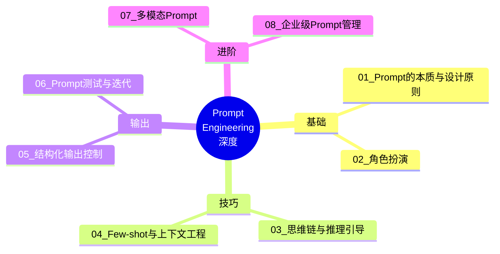
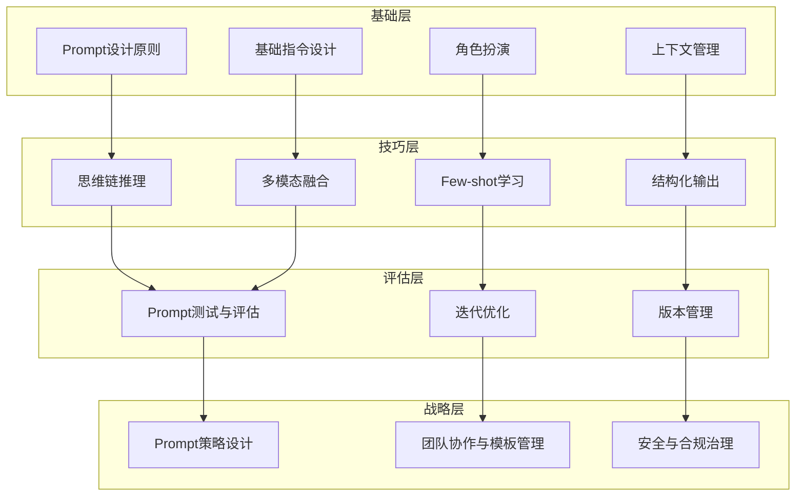

# Prompt Engineering深度中枢 — 全景导航图

> [!key] 核心命题
> Prompt Engineering正在从"艺术"走向"工程"。它不再是简单的"写提示词"，而是**一门系统化的沟通科学——如何让AI理解你的意图、按照你的逻辑推理、输出你需要的格式**。本知识库从基础原理到企业级管理，全面覆盖Prompt Engineering的深度技能。

---

## 知识库全景图

---

## 文档索引

| 编号 | 文档标题 | 核心主题 | 难度 |
|------|---------|---------|------|
| 01 | [[01-AI技术/Prompt Engineering深度/01_Prompt的本质与设计原则]] | 理论基础、设计哲学 | 入门 |
| 02 | [[01-AI技术/Prompt Engineering深度/02_角色扮演：让AI成为特定专家的艺术]] | 角色设定、人格塑造 | 进阶 |
| 03 | [[01-AI技术/Prompt Engineering深度/03_思维链与推理引导：引导AI思考的进阶技巧]] | CoT、ToT、推理框架 | 核心 |
| 04 | [[01-AI技术/Prompt Engineering深度/04_Few-shot与上下文工程：用示例教会AI]] | 示例设计、上下文管理 | 核心 |
| 05 | [[01-AI技术/Prompt Engineering深度/05_结构化输出控制：让AI按你的格式输出]] | JSON、表格、模板输出 | 进阶 |
| 06 | [[01-AI技术/Prompt Engineering深度/06_Prompt测试与迭代：从「能用」到「好用」]] | 评估、A/B测试、版本管理 | 进阶 |
| 07 | [[01-AI技术/Prompt Engineering深度/07_多模态Prompt：文本、图像、代码的融合]] | 跨模态提示 | 核心 |
| 08 | [[01-AI技术/Prompt Engineering深度/08_企业级Prompt管理：从个人到团队的规模化]] | 模板库、权限、安全 | 战略 |

---

## 核心框架：Prompt Engineering能力金字塔

---

## 跨知识库链接

本知识库与以下知识库深度关联：

- **[[03-HR人事/AI时代领导力与管理/00_MOC_AI时代领导力与管理中枢]]** — 管理者需要掌握Prompt Engineering来有效与AI协作，特别是 [[03-HR人事/AI时代领导力与管理/06_管理者AI素养：从会用到善用]]
- **[[05-产品与开发/独立开发者生存指南/00_MOC_独立开发者生存指南中枢]]** — 独立开发者使用AI加速产品开发，需要掌握 [[01-AI技术/Prompt Engineering深度/05_结构化输出控制：让AI按你的格式输出]] 等技术

---

## 使用指南

> [!tip] 阅读路径建议
> - **新手路径**: 01 → 02 → 04 → 05 → 03 → 06 → 07 → 08
> - **开发者焦点**: 05 → 03 → 04 → 07 → 06 → 08
> - **管理者视角**: 01 → 02 → 06 → 08

> [!warning] 重要提醒
> Prompt Engineering是AI领域进化最快的技能之一。随着模型能力的提升，某些技巧可能过时。建议**持续关注底层原理而非具体模板**，掌握设计原则比记住100个模板更有价值。

---

*最后更新: 2026-07-31*