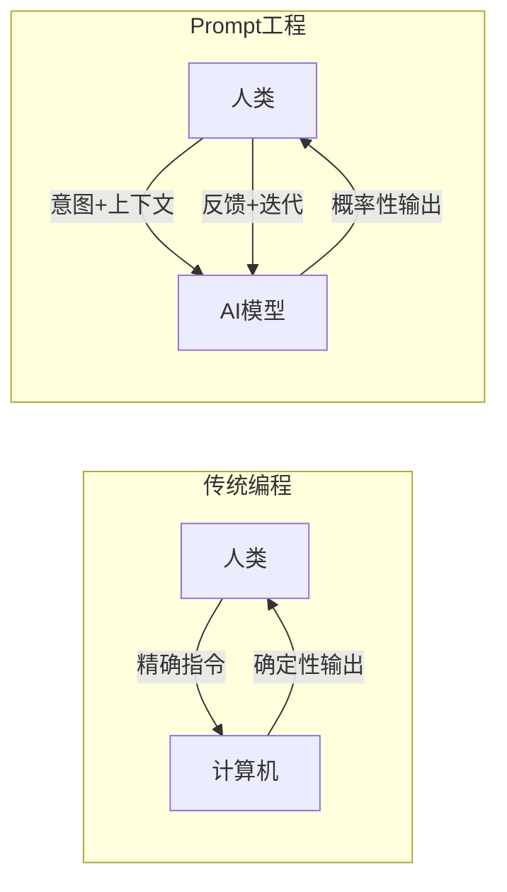
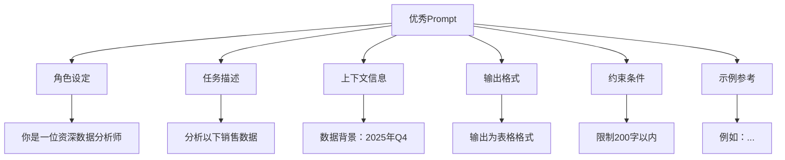
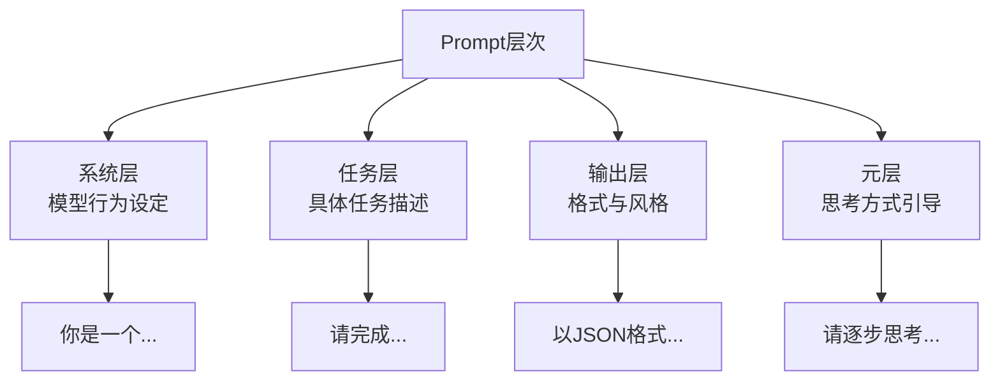

# Prompt的本质与设计原则

## Prompt是什么？——一种全新的沟通方式

> [!key] 核心洞察
> Prompt不是"命令"，而是**与AI的协作对话**。好的Prompt不是"告诉AI做什么"，而是"为AI创造一个它能够发挥最大能力的认知环境"。理解Prompt的本质，需要理解AI——特别是大语言模型——是如何"思考"的。



---

## Prompt设计的三大哲学

### 1. 意图明确性（Clarity）

AI无法读取你的想法。你的Prompt需要清晰地表达：

- **你是谁？**（角色）
- **你需要什么？**（任务）
- **你期待什么格式？**（输出）

### 2. 上下文完整性（Context）

AI的"记忆"只有一次对话的上下文窗口。你需要提供足够的背景信息。

### 3. 约束必要性（Constraint）

无约束的Prompt会产生不可预测的输出。合理的约束可以引导AI到正确的方向。

---

## Prompt的核心组成要素

一个完整的Prompt由以下要素构成：



---

## Prompt设计原则

### 原则1：从"告诉"到"引导"

**不要**：写一个文章
**要**：你是一位科技专栏作家，需要写一篇关于AI趋势的文章。你的读者是技术管理者，他们关心的是实用性而非技术细节。

### 原则2：先定义角色，再分配任务

角色设定为AI提供了"思考框架"。参考[[01-AI技术/Prompt Engineering深度/02_角色扮演：让AI成为特定专家的艺术]]中的详细讨论。

### 原则3：渐进式复杂度

从简单开始，逐步增加复杂度：

> [!example] 渐进式Prompt设计
> ```
> 第一轮：请分析这个数据
> 第二轮：请从增长和盈利两个维度分析
> 第三轮：请以表格形式呈现，并给出建议
> ```

### 原则4：具体而非抽象

| 抽象 | 具体 |
|------|------|
| 写一个吸引人的标题 | 写一个面向CTO的标题，强调ROI |
| 优化这段代码 | 这段代码在数据量大时很慢，请优化查询性能 |
| 分析市场 | 分析2025年中国SaaS市场，重点关注中小企业 |

### 原则5：预期管理

明确告诉AI你期待什么，包括：

- 输出长度（200字以内）
- 输出格式（Markdown表格）
- 输出风格（专业但不学术）
- 输出视角（中立客观）

---

## 常见Prompt设计错误

> [!warning] 六大常见错误
> 1. **模糊不清**："写点好的" → 改为"写一篇关于XX的300字简介"
> 2. **信息过载**：一次性给太多要求 → 分解为多轮对话
> 3. **缺乏约束**：没有格式要求 → 输出结构不可控
> 4. **忽略上下文**：AI不知道背景 → 提供必要的上下文
> 5. **过度引导**：暗示想要的答案 → 失去AI的客观性
> 6. **一次性期望**：期望一次完美 → 需要迭代优化

---

## Prompt设计自检清单

> [!tip] 发布Prompt前的检查
> - [ ] 角色是否明确设定？
> - [ ] 任务是否具体可执行？
> - [ ] 上下文是否完整？
> - [ ] 输出格式是否指定？
> - [ ] 约束条件是否足够？
> - [ ] 是否有示例参考？
> - [ ] 是否考虑了边界情况？

---

## Prompt的层次模型



---

## 跨知识库联动

- [[01-AI技术/Prompt Engineering深度/02_角色扮演：让AI成为特定专家的艺术]] 深入探讨了角色设定的技巧
- [[01-AI技术/Prompt Engineering深度/04_Few-shot与上下文工程：用示例教会AI]] 讨论了如何用示例补充Prompt
- [[05-产品与开发/独立开发者生存指南/01_独立开发者的心智模型：从副业到主业的转型]] 中的"成长型思维"同样适用于Prompt技能的提升

---

*最后更新: 2026-07-31*