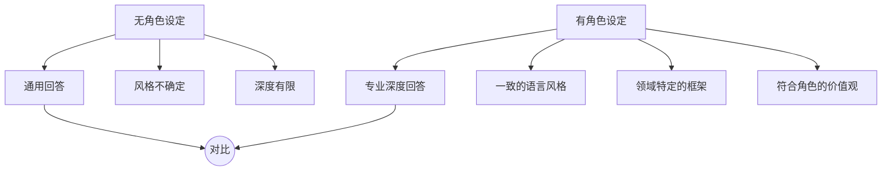
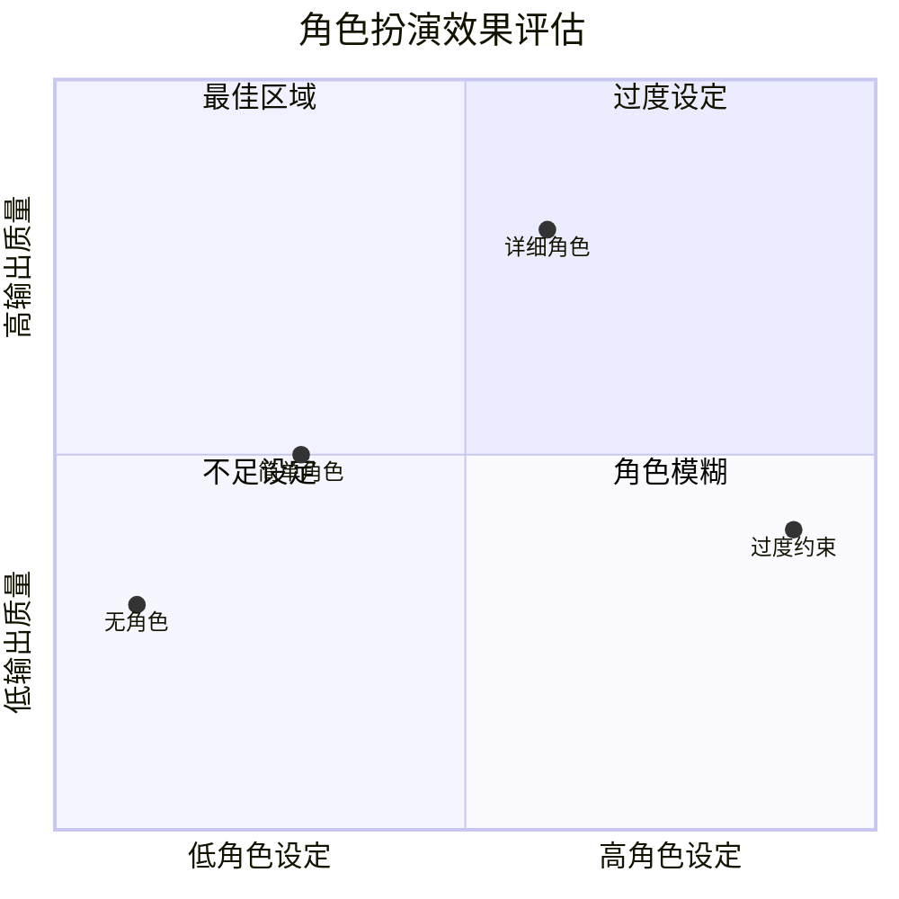

# 角色扮演：让AI成为特定专家的艺术

## 为什么角色扮演有效？

> [!key] 核心洞察
> 角色扮演是Prompt Engineering中最强大也最被低估的技巧。**当AI被赋予一个角色时，它会在该角色的"认知框架"内生成内容**——包括该角色的专业知识、语言风格、思维方式和价值判断。一个好的角色设定，相当于为AI安装了一个"专家大脑"。



---

## 角色设定的核心要素

### 1. 专业领域（Domain）

明确告诉AI它是什么领域的专家：

> [!example] 角色设定示例
> ```
> 你是一位有15年经验的数据科学家，擅长统计建模和机器学习。
> 你曾在FAANG公司担任技术负责人。
> 你的回答应该既专业又易于理解。
> ```

### 2. 经验水平（Experience）

| 角色类型 | 特点 | 适合场景 |
|---------|------|---------|
| 入门级 | 基础但可能不准确 | 初学者指南 |
| 中级 | 平衡的专业性 | 日常咨询 |
| 专家级 | 深入、专业判断 | 复杂问题 |
| 大师级 | 战略性、前瞻性 | 战略咨询 |

### 3. 沟通风格（Style）

- 学术风格：严谨、引用来源
- 商业风格：简洁、注重ROI
- 技术风格：精确、代码示例
- 教学风格：耐心、分步解释

### 4. 视角与价值观（Perspective）

更高的角色设定包含价值观约束：

```
你是一位注重数据隐私的AI伦理专家。
在回答任何数据相关问题时，请优先考虑隐私保护。
```

---

## 高级角色扮演技巧

### 1. 多角色对话

让AI扮演多个角色并相互对话：

> [!tip] 多角色提示
> ```
> 请扮演三位专家：
> 1. 产品经理（关注用户需求）
> 2. 工程师（关注技术可行性）
> 3. 设计师（关注用户体验）
> 
> 针对"开发一个AI写作助手"这个想法，请三位专家轮流发言，
> 从各自角度分析这个项目的可行性。
> ```

### 2. 角色+思维链组合

将角色扮演与[[01-AI技术/Prompt Engineering深度/03_思维链与推理引导：引导AI思考的进阶技巧]]结合：

```
你是一位资深律师。在回答法律问题时，请：
1. 首先分析案件事实
2. 引用相关法律条文
3. 考虑类似判例
4. 最终给出法律建议

请逐步展示你的思考过程。
```

### 3. 角色约束

为角色设定明确的"边界"：

| 约束类型 | 示例 |
|---------|------|
| 知识边界 | "如果你不确定，请明确说不知道" |
| 道德边界 | "不要给出有害的建议" |
| 风格边界 | "保持简洁，不超过3个要点" |
| 角色边界 | "不要给出超出财务顾问角色范围的建议" |

---

## 角色扮演的应用场景

### 场景1：用户研究

使用[[05-产品与开发/独立开发者生存指南/02_Idea筛选与验证：做什么比怎么做更重要]]中的方法，让AI扮演目标用户：

```
你是一位小型企业主，年营收500万，团队10人。
你对AI工具感兴趣但担心成本和学习曲线。
请以这个身份回答我的产品调研问题。
```

### 场景2：代码审查

```
你是一位资深后端工程师，擅长性能优化和安全审计。
请审查以下代码，重点关注：
1. 性能瓶颈
2. 安全漏洞
3. 可维护性
```

### 场景3：策略咨询

```
你是一位麦肯锡级别的战略顾问。
请分析[公司]的市场定位，使用SWOT框架，
并给出3个可执行的战略建议。
```

---

## 角色扮演的效果评估



---

> [!warning] 角色扮演的陷阱
> - **过度设定**：过多的限制会扼杀AI的创造力
> - **角色冲突**：给AI矛盾的角色设定
> - **虚假专业感**：AI可能用专业术语掩盖不确定性
> - **角色僵化**：同一个角色不适用于所有问题

---

## 跨知识库联动

- [[01-AI技术/Prompt Engineering深度/01_Prompt的本质与设计原则]] 提供了角色设定的理论基础
- [[01-AI技术/Prompt Engineering深度/03_思维链与推理引导：引导AI思考的进阶技巧]] 可以与角色扮演组合使用
- [[03-HR人事/AI时代领导力与管理/03_混合团队管理：如何带领人+AI的团队]] 中的AI成员设定与本篇的角色设计理念一致

---

*最后更新: 2026-07-31*