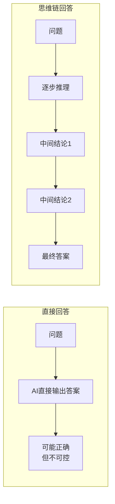
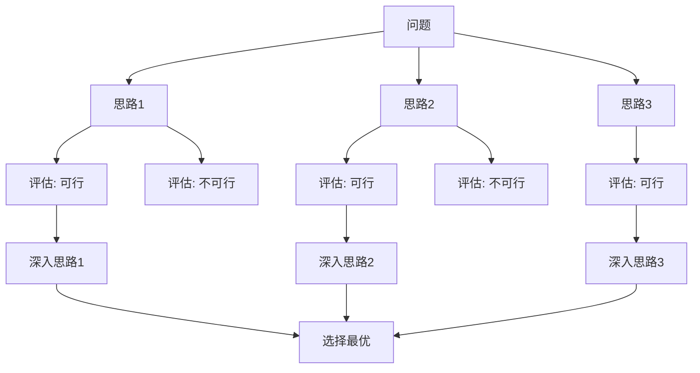

# 思维链与推理引导：引导AI思考的进阶技巧

## 让AI"思考"——其实是在引导它展示推理过程

> [!key] 核心洞察
> 大语言模型本质上是一个"下一个词预测器"。直接让它回答问题，它可能跳过推理步骤直接给出答案。**思维链（Chain-of-Thought, CoT）的核心价值不是让AI"思考"——而是让AI展示推理过程，从而显著提高复杂问题的回答质量。**



---

## 思维链的核心方法

### 1. 零样本思维链（Zero-shot CoT）

最简单的CoT方法——只需要在Prompt末尾加上"请逐步思考"：

> [!example] 零样本CoT
> ```
> 问题：一个苹果3元，买了5个苹果和2个橙子，
> 橙子每个4元，总共花了多少钱？请逐步思考。
> 
> AI回答：
> 第一步：5个苹果 × 3元 = 15元
> 第二步：2个橙子 × 4元 = 8元
> 第三步：15元 + 8元 = 23元
> 答案：总共花了23元。
> ```

### 2. 少样本思维链（Few-shot CoT）

提供示例，让AI学习推理模式。参考[[01-AI技术/Prompt Engineering深度/04_Few-shot与上下文工程：用示例教会AI]]。

### 3. 结构化思维链

为推理过程设计结构化框架：

```
请按照以下步骤分析：
1. 问题定义：准确理解问题是什么
2. 信息提取：列出所有已知信息
3. 假设分析：列出需要假设的部分
4. 推理过程：逐步推导
5. 结论：给出最终答案
6. 验证：检查答案是否合理
```

---

## 进阶推理框架

### 思维树（Tree of Thoughts, ToT）

让AI探索多个推理路径，选择最优解：



### 思维链的变体

| 变体 | 方法 | 适用场景 |
|------|------|---------|
| Self-Consistency | 多次CoT，投票选最优 | 需要高准确率 |
| Least-to-Most | 从简单到复杂逐步推理 | 复杂问题分解 |
| Step-Back | 先抽象后具体 | 需要宏观视角 |
| Self-Ask | AI自己提问并回答 | 需要多步推理 |

---

## 引导推理的技巧

### 1. 分解复杂问题

将大问题拆解为小问题：

```
不直接问："如何开拓海外市场？"
而是：
1. 首先，我们需要评估哪些市场最有潜力？
2. 然后，针对选定的市场，进入策略是什么？
3. 最后，执行路线图怎么设计？
```

### 2. 反向推理

有时从结论反推更有效：

```
假设我们已经成功进入了东南亚市场。
请反向推导，我们在过去12个月中做了什么？
关键决策节点是什么？
```

### 3. 多视角推理

结合[[01-AI技术/Prompt Engineering深度/02_角色扮演：让AI成为特定专家的艺术]]中的多角色技巧：

```
请从三个角度分析这个决策：
1. 乐观角度：如果一切顺利，会怎样？
2. 悲观角度：如果最坏情况发生，会怎样？
3. 现实角度：最可能的结果是什么？
```

---

## 推理质量的评估维度

| 维度 | 评估标准 | 改进方法 |
|------|---------|---------|
| 逻辑性 | 推理步骤是否连贯 | 使用结构化框架 |
| 完整性 | 是否有遗漏的关键步骤 | 增加检查步骤 |
| 准确性 | 中间结论是否正确 | 增加验证环节 |
| 可解释性 | 推理过程是否清晰 | 要求AI解释每个步骤 |
| 鲁棒性 | 输入变化时是否稳定 | 测试多组输入 |

---

## 实战案例：用CoT分析商业决策

> [!example] 应用场景
> 结合[[03-HR人事/AI时代领导力与管理/02_决策模式变革：数据驱动与人性判断的平衡]]中的决策框架：

```
你是一位商业分析师。请分析是否应该进入东南亚市场。

请按照以下步骤：
1. 列出需要的关键数据（市场规模、增长率、竞争格局）
2. 分析每个数据点的置信度
3. 基于数据，给出3种可能的进入策略
4. 评估每种策略的风险和收益
5. 给出最终建议

在每个步骤中，请说明你的推理依据。
```

> [!warning] 思维链的局限
> - CoT会增加token消耗和响应时间
> - 对于简单问题，CoT可能是过度设计
> - CoT不能保证推理正确——只是展示推理过程
> - 某些模型对CoT的响应不一致

---

## 跨知识库联动

- [[01-AI技术/Prompt Engineering深度/02_角色扮演：让AI成为特定专家的艺术]] 可与CoT组合使用
- [[01-AI技术/Prompt Engineering深度/04_Few-shot与上下文工程：用示例教会AI]] 中的示例设计可增强CoT效果
- [[03-HR人事/AI时代领导力与管理/02_决策模式变革：数据驱动与人性判断的平衡]] 中的决策框架可为CoT提供结构化模板

---

*最后更新: 2026-07-31*