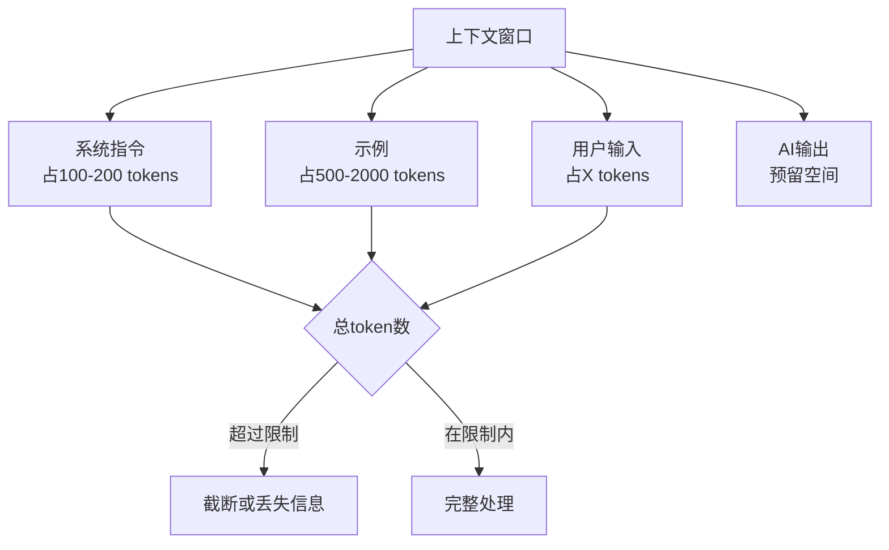
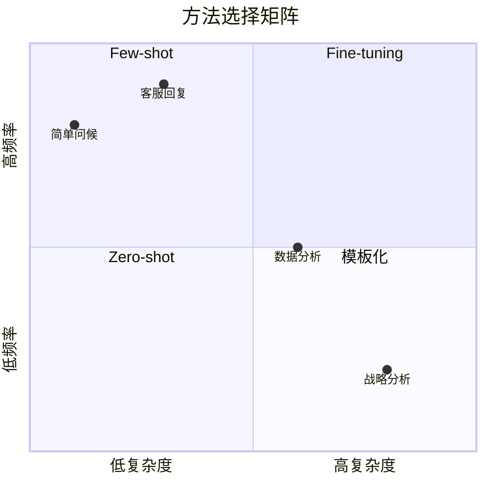

# Few-shot与上下文工程：用示例教会AI

## 示例是最好的"训练数据"

> [!key] 核心洞察
> 在Prompt中提供示例（Few-shot learning）是让AI快速理解你需求的最有效方式。**一个精心设计的示例，胜过1000字的指令描述**。示例不仅告诉AI"做什么"，更重要的是展示了"怎么做"和"做成什么样"。

```mermaid
graph LR
    subgraph Zero-shot（无示例）
        A1[指令] --> A2[AI自由发挥]
        A2 --> A3[结果不可控]
    end

    subgraph Few-shot（有示例）
        B1[指令] --> B2[示例1]
        B1 --> B3[示例2]
        B1 --> B4[示例3]
        B2 --> B5[AI学习模式]
        B3 --> B5
        B4 --> B5
        B5 --> B6[结果可控]
    end
```

---

## Few-shot的核心原则

### 1. 示例的质量 > 数量

3个精心设计的示例，通常优于10个随意选择的示例。

### 2. 示例的多样性

示例需要覆盖不同的输入情况，而不是所有示例都类似。

### 3. 示例的边界

包含边界情况的示例（如"当输入为空时"），帮助AI处理异常。

### 4. 示例的一致性

所有示例的格式和风格必须一致，否则AI会混淆。

---

## 示例设计框架

### 示例的组成

一个完整的示例包含：

```
输入：[用户的问题/数据]
输出：[期望的AI回答]
推理：[如果适用，展示推理过程]
```

### 示例数量选择

| 场景 | 推荐示例数 | 原因 |
|------|-----------|------|
| 简单格式转换 | 1-2个 | 模式简单 |
| 复杂分析任务 | 3-5个 | 需要覆盖多种情况 |
| 创意生成 | 2-3个 | 提供风格参考 |
| 结构化输出 | 2-4个 | 展示格式规范 |

---

## 上下文工程：管理AI的"工作记忆"

### 上下文窗口的概念

AI的上下文窗口是它一次能"记住"的信息量。管理好上下文窗口是高效使用AI的关键。



### 上下文管理策略

| 策略 | 方法 | 适用场景 |
|------|------|---------|
| 精简优先 | 只保留最关键的信息 | 上下文接近限制时 |
| 分层结构 | 重要信息在前，次要在后 | 长文档处理 |
| 刷新机制 | 定期重置上下文 | 长时间对话 |
| 摘要压缩 | 用摘要替代长文本 | 历史信息保留 |

---

## 高级Few-shot技巧

### 1. 动态示例选择

根据用户输入，选择最相关的示例：

```
用户输入：分析2025年Q4的销售数据

示例1（相关）：
输入：分析2025年Q3的销售数据
输出：[展示分析格式]

示例2（不相关，省略）：
输入：写一封邮件
输出：[省略]
```

### 2. 示例+思维链组合

结合[[01-AI技术/Prompt Engineering深度/03_思维链与推理引导：引导AI思考的进阶技巧]]：

```
示例：
输入：小明有5个苹果，小红给了3个，小明吃了2个，还剩几个？
输出：
推理：5 + 3 = 8（小红给了之后）
8 - 2 = 6（吃了之后）
答案：6个

现在回答：
输入：一箱有12瓶水，喝了4瓶，又买了6瓶，还剩几瓶？
```

### 3. 负例示例（Negative Examples）

告诉AI"不要做什么"：

```
示例1（正确）：
输入：写一个友好的问候
输出：你好！很高兴见到你。

示例2（错误）：
输入：写一个友好的问候
输出：嘿，最近怎么样？
原因：过于随意，不符合"友好但专业"的要求
```

---

## Few-shot vs Zero-shot vs Fine-tuning



---

> [!tip] Few-shot设计检查清单
> - [ ] 示例是否覆盖了主要场景？
> - [ ] 示例是否包含边界情况？
> - [ ] 示例的格式是否一致？
> - [ ] 示例是否在上下文窗口限制内？
> - [ ] 示例是否按相关性排序？
> - [ ] 是否有负例示例？

> [!warning] 常见陷阱
> - 示例过多导致上下文窗口溢出
> - 示例之间的不一致性导致AI混淆
> - 示例中的隐性偏见传递给AI
> - 示例过于特殊，限制了AI的泛化能力

---

## 跨知识库联动

- [[01-AI技术/Prompt Engineering深度/03_思维链与推理引导：引导AI思考的进阶技巧]] 提供了Few-shot+CoT的组合方法
- [[01-AI技术/Prompt Engineering深度/05_结构化输出控制：让AI按你的格式输出]] 中的格式控制可以与示例结合
- [[05-产品与开发/独立开发者生存指南/02_Idea筛选与验证：做什么比怎么做更重要]] 中的验证方法可以用于测试Few-shot效果

---

*最后更新: 2026-07-31*