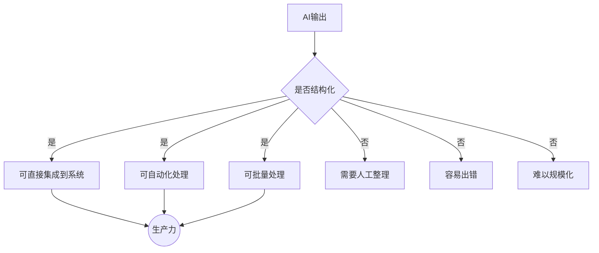
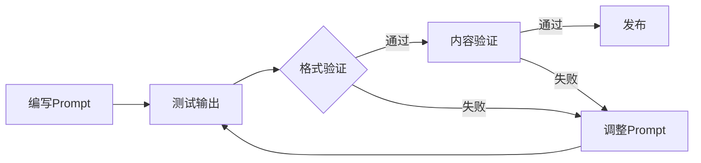

# 结构化输出控制：让AI按你的格式输出

## 为什么结构化输出是关键能力？

> [!key] 核心洞察
> 在AI被集成到产品和工作流中的今天，**非结构化的文本输出已经没有价值**。结构化输出是AI从"聊天工具"变成"生产力工具"的分水岭。无论是JSON数据、Markdown表格、还是XML格式，掌握结构化输出控制是Prompt Engineering最实用的技能之一。



---

## 结构化输出方法

### 方法1：JSON输出

最常用的结构化输出格式，适用于数据集成：

> [!example] JSON输出提示
> ```
> 分析以下销售数据，以JSON格式输出：
> {
>   "summary": {
>     "total_revenue": "总销售额",
>     "growth_rate": "增长率",
>     "top_product": "最畅销产品"
>   },
>   "insights": [
>     {"dimension": "维度", "finding": "发现", "confidence": "置信度"}
>   ]
> }
> ```

### 方法2：Markdown表格

适用于报告和文档：

```
请将以下分析结果以Markdown表格格式输出：

| 指标 | 2025 Q3 | 2025 Q4 | 环比变化 |
|------|---------|---------|---------|
| 收入 | 100万 | 120万 | +20% |
| 用户 | 1000 | 1500 | +50% |
```

### 方法3：模板填充

使用预定义的模板，让AI填充内容：

```
请按照以下模板生成产品描述：

---
产品名称：[填写]
目标用户：[填写]
核心功能：[列出3个]
定价：[填写]
独特卖点：[填写]
---

请基于以上模板，描述"AI会议助手"这个产品。
```

---

## 结构化输出的控制技巧

### 1. 精确指定格式

| 控制维度 | 方法 | 示例 |
|---------|------|------|
| 数据类型 | 指定JSON/YAML/XML | "请以JSON格式输出" |
| 字段名 | 指定字段名称 | "包含name, price, description字段" |
| 数据类型 | 指定字段类型 | "price字段为数字类型" |
| 约束条件 | 指定取值范围 | "confidence字段在0-1之间" |
| 嵌套结构 | 指定层级关系 | "insights字段下包含items数组" |

### 2. 格式验证

让AI在输出后自我验证：

```
请以JSON格式输出分析结果。
输出后，请验证以下内容：
1. JSON格式是否有效
2. 所有必填字段是否存在
3. 数据类型是否正确
```

### 3. 错误处理

指定当AI无法生成结构化输出时的行为：

```
如果无法确定某个字段的值，请使用null。
如果数据不足以支持分析，请在"error"字段中说明原因。
```

---

## 高级结构化输出：JSON Schema

对于复杂的结构化输出，可以使用JSON Schema：

```json
{
  "type": "object",
  "properties": {
    "product_analysis": {
      "type": "object",
      "properties": {
        "name": {"type": "string"},
        "market_size": {"type": "number"},
        "competitors": {
          "type": "array",
          "items": {"type": "string"}
        },
        "recommendation": {
          "type": "string",
          "enum": ["进入", "观望", "放弃"]
        }
      },
      "required": ["name", "market_size", "recommendation"]
    }
  }
}
```

---

## 结构化输出测试



> [!tip] 结构化输出测试清单
> - [ ] 输出格式是否严格符合要求？
> - [ ] 所有字段是否正确填充？
> - [ ] 数据类型是否正确（数字、字符串、数组）？
> - [ ] 边界情况（空值、异常值）是否处理？
> - [ ] 输出是否符合JSON/YAML规范？
> - [ ] 是否包含意外的额外字段？

---

## 常见结构化输出问题

> [!warning] 常见问题及解决方案
> - **格式不一致**：有时输出JSON，有时输出文本 → 增加严格性约束
> - **字段遗漏**：缺少某些字段 → 使用JSON Schema
> - **类型错误**：数字字段输出字符串 → 指定数据类型
> - **额外字段**：输出未指定的字段 → 要求严格遵循格式
> - **格式错误**：JSON格式无效 → 要求AI在输出后验证

---

## 实战：将AI输出集成到产品中

参考[[05-产品与开发/独立开发者生存指南/03_MVP开发策略：最小可行产品的最优路径]]中的MVP开发理念，将AI结构化输出直接集成到产品中：

```
# 产品集成示例
用户请求 → AI结构化输出 → 直接渲染到UI

用户输入："推荐3个适合新手的编程语言"
AI输出：
{
  "recommendations": [
    {"name": "Python", "difficulty": "低", "use_cases": ["数据科学", "Web开发"]},
    {"name": "JavaScript", "difficulty": "中", "use_cases": ["Web开发", "移动端"]},
    {"name": "Go", "difficulty": "中", "use_cases": ["后端开发", "云服务"]}
  ],
  "summary": "Python是最适合新手的语言"
}
```

---

## 跨知识库联动

- [[01-AI技术/Prompt Engineering深度/04_Few-shot与上下文工程：用示例教会AI]] 中的示例设计可以增强结构化输出
- [[01-AI技术/Prompt Engineering深度/06_Prompt测试与迭代：从「能用」到「好用」]] 提供了测试结构化输出的方法
- [[05-产品与开发/独立开发者生存指南/03_MVP开发策略：最小可行产品的最优路径]] 中的MVP开发理念适用于AI集成

---

*最后更新: 2026-07-31*