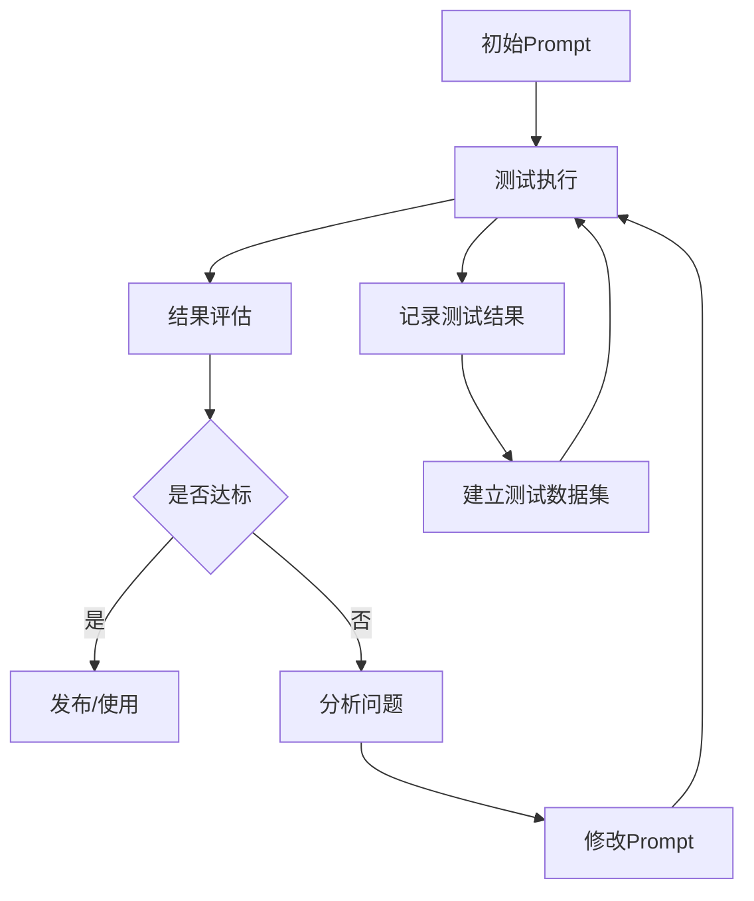
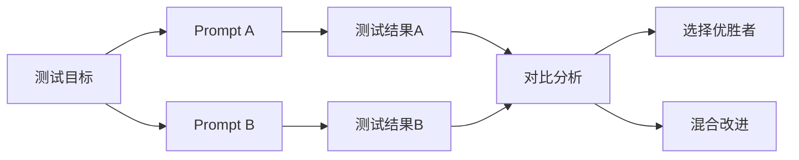

# Prompt测试与迭代：从「能用」到「好用」

## Prompt不是一次写成的，而是迭代出来的

> [!key] 核心洞察
> 就像代码需要调试一样，Prompt也需要测试和迭代。**一个「好用」的Prompt背后，通常经历了5-10轮的修改和优化。** 建立系统化的Prompt测试流程，是Prompt Engineering从「玄学」走向「工程」的关键一步。

## Prompt评估框架

### 评估维度

| 维度 | 评估标准 | 测量方法 |
|------|---------|---------|
| 准确性 | 输出是否正确 | 人工审核 |
| 一致性 | 相同输入是否得到相同输出 | 多次测试 |
| 稳定性 | 输入变化时输出是否合理 | 边缘测试 |
| 格式性 | 输出格式是否符合要求 | 自动验证 |
| 效率性 | Token消耗是否合理 | 计数分析 |
| 安全性 | 输出是否包含有害内容 | 安全扫描 |

## 测试方法

### 1. 回归测试集

> [!example] 测试数据集
> 测试用例1: 简单输入 → 期望输出
> 测试用例2: 复杂输入 → 期望输出
> 测试用例3: 边界输入 → 期望输出
> 测试用例4: 异常输入 → 期望输出
> 测试用例5: 空输入 → 期望输出

### 2. A/B测试

## Prompt迭代流程

### 步骤1：定义成功标准

在开始迭代前，明确「什么是好的Prompt」：
- 准确率 > 90%
- 格式符合率 > 95%
- 响应时间 < 3秒
- Token消耗 < 500

### 步骤2：基线测试

用初始版本跑一次完整测试，建立基线指标。

### 步骤3：迭代循环

每次迭代修改不超过3个要素：
1. 角色设定（如需要）
2. 指令措辞
3. 示例修改
4. 约束条件
5. 格式要求

### 步骤4：变更记录

参考 [[01-AI技术/Prompt Engineering深度/08_企业级Prompt管理：从个人到团队的规模化]] 中的版本管理。

## 快速迭代技巧

> [!tip] 实用技巧
> 1. **一次只改一个变量**：同时修改多个要素，无法确定是哪个改有效
> 2. **使用结构化输出测试**：参考 [[01-AI技术/Prompt Engineering深度/05_结构化输出控制：让AI按你的格式输出]]
> 3. **建立「失败案例库」**：记录所有失败的测试，用于后续改进
> 4. **自动验证**：对结构化输出进行自动格式验证
> 5. **用户反馈**：收集真实用户的使用反馈

## 常见优化方向

| 问题 | 表现 | 优化方向 |
|------|------|---------|
| 输出太泛 | 缺乏深度 | 增加角色设定+约束 |
| 输出太具体 | 缺乏灵活性 | 减少约束，增加示例多样性 |
| 格式不稳定 | 时对时错 | 增加格式验证步骤 |
| 内容错误 | 事实错误 | 增加知识库参考 |
| 回答过长 | token消耗大 | 增加长度限制 |

> [!warning] 迭代陷阱
> - **过度优化**：为了一个边缘案例牺牲了主要场景的性能
> - **确认偏差**：只关注符合预期的输出，忽略错误
> - **测试集过小**：3-5个测试用例不足以代表真实场景
> - **忽略成本**：优化Prompt可能增加token消耗

## 跨知识库联动

- [[01-AI技术/Prompt Engineering深度/05_结构化输出控制：让AI按你的格式输出]] 提供了格式验证的方法
- [[01-AI技术/Prompt Engineering深度/08_企业级Prompt管理：从个人到团队的规模化]] 讨论了版本管理和团队协作
- [[03-HR人事/AI时代领导力与管理/06_管理者AI素养：从会用到善用]] 中的评估框架适用于Prompt评估

*最后更新: 2026-07-31*
