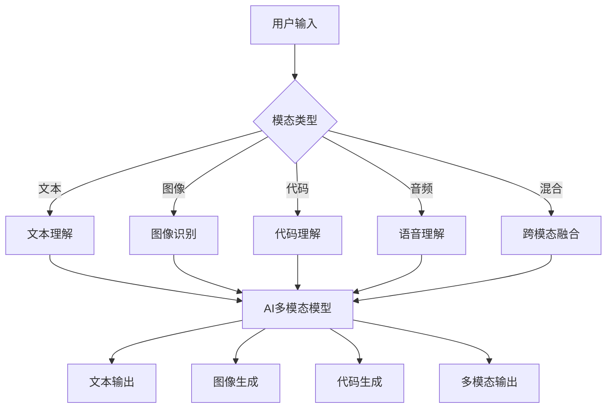
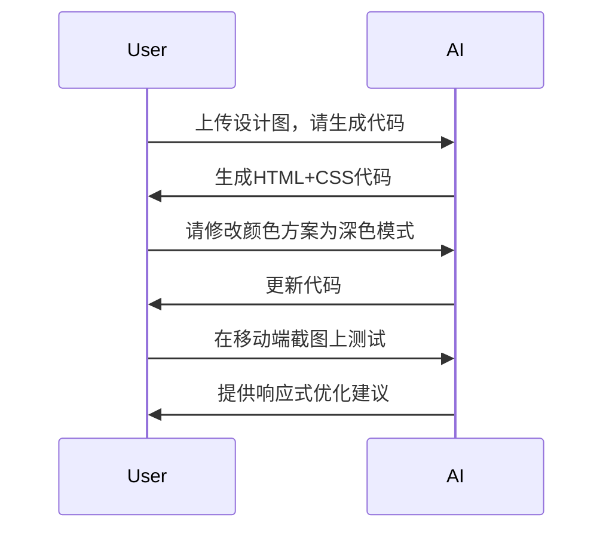

# 多模态Prompt：文本、图像、代码的融合

## AI已经"看"得见了——Prompt也需要升级

> [!key] 核心洞察
> 2026年，主流AI模型已经支持文本、图像、代码、音频等多种模态的输入和输出。**多模态Prompt不是简单地给AI一张图片，而是设计一种跨模态的协作方式**——让AI在不同信息形态之间建立联系，产生单一模态无法达到的效果。



---

## 多模态Prompt的类型

### 1. 文本+图像：图像分析

**场景**：让AI分析一张图片并生成文本描述

```
请分析这张图片：
1. 图片中有哪些物体？
2. 场景的情绪或氛围是什么？
3. 这张图片可能用于什么用途？
请以结构化格式输出。
```

### 2. 文本+代码：代码理解与生成

**场景**：让AI基于代码生成文档或分析

```
请分析这段代码：
1. 这段代码的功能是什么？
2. 存在哪些潜在问题？
3. 如何优化性能？
请以JSON格式输出分析结果。
```

### 3. 文本+图像+代码：全栈分析

**场景**：让AI分析UI设计图并生成代码

```
这是一张网页设计图。
请：
1. 分析设计中的组件和布局
2. 生成对应的HTML+CSS代码
3. 标注响应式设计的断点
```

---

## 多模态Prompt的设计原则

### 原则1：明确模态间的关系

| 关系类型 | 说明 | 示例 |
|---------|------|------|
| 分析 | 基于图像/代码生成文本 | "分析这张图" |
| 生成 | 基于文本生成图像/代码 | "生成一张..." |
| 转换 | 从一种模态转换为另一种 | "把这张图变为代码" |
| 增强 | 用多种模态增强理解 | "结合文字和图片分析" |

### 原则2：指定模态的优先级

```
请优先分析图像中的视觉元素，
然后结合文本描述进行综合判断。
如果两者冲突，以图像为准。
```

### 原则3：处理模态缺失

```
输出格式要求：
- 如果提供图像，包含"visual_analysis"字段
- 如果没有提供图像，包含"text_only_analysis"字段
```

---

## 多模态Prompt的实战技巧

### 技巧1：引导视觉注意力

```
请特别关注图像的以下区域：
1. 左上角的Logo
2. 中间的CTA按钮
3. 底部的数据图表
```

### 技巧2：代码上下文化

结合[[01-AI技术/Prompt Engineering深度/05_结构化输出控制：让AI按你的格式输出]]：

```
请分析这段代码，并以JSON格式输出：
{
  "language": "代码语言",
  "purpose": "代码目的",
  "complexity": "1-5",
  "issues": [
    {"line": 行号, "severity": "high/medium/low", "description": "问题描述"}
  ],
  "suggestions": ["优化建议1", "优化建议2"]
}
```

### 技巧3：多轮多模态对话



---

## 多模态应用场景

### 场景1：产品设计

结合[[05-产品与开发/独立开发者生存指南/03_MVP开发策略：最小可行产品的最优路径]]：

```
用户上传：一张手绘的UI草图
AI Prompt：请将这张手绘图转化为：
1. 一个Figma风格的UI设计描述
2. 对应的HTML/CSS代码
3. 交互流程的文字说明
```

### 场景2：数据分析

```
用户上传：一张数据图表截图
AI Prompt：请分析这张图表：
1. 读取图表中的关键数据
2. 识别趋势和异常
3. 生成一个数据摘要报告
4. 建议下一步应该分析什么
```

### 场景3：教学辅助

```
用户上传：一张包含数学公式的图片
AI Prompt：请：
1. 识别图片中的公式
2. 用LaTeX格式重现
3. 解释公式的含义
4. 给出一个简单的例子
```

---

## 多模态Prompt的挑战

> [!warning] 主要挑战
> 1. **模态对齐**：不同模态的信息可能不一致，需要AI判断优先级
> 2. **上下文管理**：图像和代码占用大量token，需要优化上下文
> 3. **质量差异**：低质量图像或代码会影响AI的理解
> 4. **安全风险**：恶意图像可能被注入到Prompt中
> 5. **成本控制**：多模态处理的token消耗远高于纯文本

---

## 多模态Prompt评估框架

| 维度 | 评估标准 | 测试方法 |
|------|---------|---------|
| 理解准确性 | AI是否正确理解多模态信息 | 交叉验证 |
| 模态融合度 | 不同模态信息是否被有效整合 | 对比测试 |
| 输出质量 | 生成结果的质量 | 人工评估 |
| 效率 | Token消耗和处理时间 | 指标监控 |
| 鲁棒性 | 输入质量变化时的稳定性 | 压力测试 |

---

## 跨知识库联动

- [[01-AI技术/Prompt Engineering深度/01_Prompt的本质与设计原则]] 提供了Prompt设计的基础框架
- [[01-AI技术/Prompt Engineering深度/05_结构化输出控制：让AI按你的格式输出]] 可用于多模态输出的格式控制
- [[05-产品与开发/独立开发者生存指南/03_MVP开发策略：最小可行产品的最优路径]] 中的快速迭代理念适用于多模态应用开发

---

*最后更新: 2026-07-31*